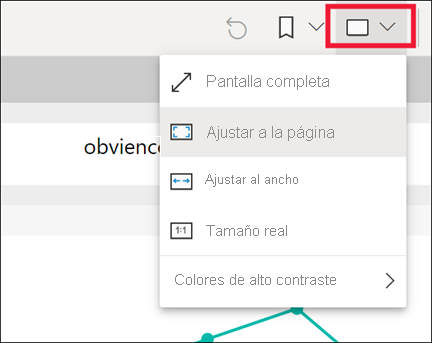
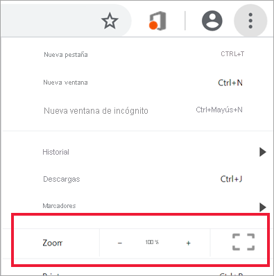
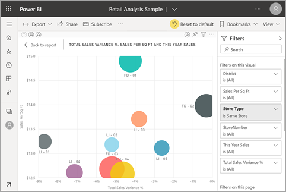

# Cambio de la pantalla de una página del informe

[!INCLUDE[consumer-appliesto-yyny](../includes/consumer-appliesto-yyny.md)]

Las personas ven los informes en muchos dispositivos diferentes, con distintos tamaños de pantalla y relaciones de aspecto. Cambie la forma en que se muestra una página del informe para satisfacer sus necesidades.

## Exploración del menú Vista

Las opciones del menú **Vista** le proporcionan flexibilidad para mostrar las páginas del informe en el tamaño y el ancho que elija:

- Imagine que está viendo un informe en un dispositivo pequeño y le resulta difícil ver los títulos y las leyendas.  Seleccione **Vista** > **Tamaño real** para aumentar el tamaño de la página del informe. Use las barras de desplazamiento para moverse por el informe.

    

- Otra opción consiste en ajustar el informe al ancho de la pantalla; para ello, seleccione **Ajustar al ancho**. Puesto que solo se trata del ancho y no del alto, es posible que aún tenga que usar la barra de desplazamiento vertical.

  

- Si no quiere ninguna barra de desplazamiento, pero quiere usar el tamaño de la pantalla de la forma más eficaz, seleccione **Ajustar a la página**.

   

- También puede elegir entre cuatro **Colores de alto contraste**: Alto contraste 1, Alto contraste 2, Negro de alto contraste y Blanco de alto contraste. Es una característica de accesibilidad que puede usar para que las personas que tengan problemas de visión puedan ver mejor los informes. El ejemplo siguiente es de contraste alto 1. 

    

- La última opción, **Pantalla completa**, muestra la página del informe sin barras de menús ni encabezados. La pantalla completa puede ser una buena elección para pantallas pequeñas, donde es difícil ver los detalles.  La pantalla completa también puede ser una buena opción al proyectar páginas del informe en pantallas grandes para que las personas las vean, pero no interactúen con ellas.  

    

Cuando sale del informe, la configuración de **Vista** no se guarda, sino que vuelve al valor predeterminado. Si le parece importante guardar esta configuración, use [marcadores](end-user-bookmarks.md).

## Uso del explorador para cambiar la presentación de la página

Los controles de zoom del explorador aumentan y disminuyen el área de lienzo disponible. Al disminuir el zoom, se expande el área de lienzo disponible y viceversa. 

El cambio de tamaño de todo el explorador es otra manera de cambiar el tamaño de presentación del informe. 

## Acercamiento de un objeto visual
En ocasiones es difícil ver los detalles de un objeto visual. Puede hacer que ese objeto visual se muestre más grande y por sí mismo. Para obtener más información, vea [Modo de enfoque y Modo de pantalla completa](end-user-focus.md)

### Un objeto visual en modo de *enfoque*

### Un objeto visual en modo de *pantalla completa*

## Pasos siguientes

* [Ver el panel Filtros del informe](end-user-report-filter.md)