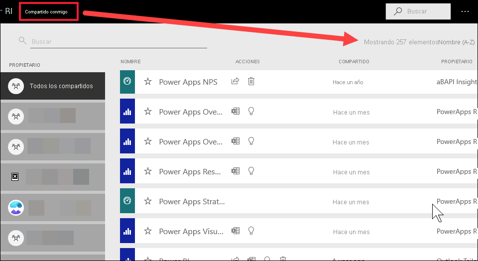
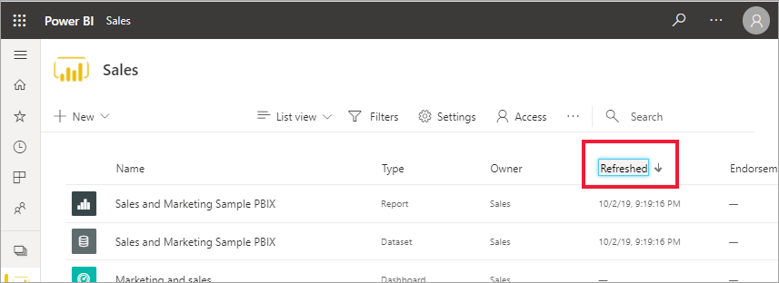

# Navegación para consumidores de Power BI: búsqueda global

[!INCLUDE[consumer-appliesto-yyny](../includes/consumer-appliesto-yyny.md)]

[!INCLUDE [power-bi-service-new-look-include](../includes/power-bi-service-new-look-include.md)]

Cuando comience a trabajar en el servicio Power BI, solo tendrá unos cuantos elementos de contenido (paneles, informes, aplicaciones). Sin embargo, a medida que los compañeros comiencen a compartir contenido con usted y empiece a descargar aplicaciones, puede acabar con largas listas de contenido. En este momento encontrará las funciones de búsqueda y ordenación muy útiles.

## Búsqueda de contenido
 La búsqueda está disponible en casi todas las partes del servicio Power BI. Solo tiene que encontrar el cuadro de búsqueda o el icono de búsqueda. .

 En el campo Búsqueda, escriba el nombre completo (o una parte) de un panel, un informe, un libro, un área de trabajo, una aplicación o un propietario. Power BI realizará una búsqueda en todo el contenido. 

  

 En algunas áreas de Power BI, como las áreas de trabajo, encontrará dos campos de búsqueda diferentes. El campo de búsqueda de la barra de menús busca en todo el contenido, mientras que el campo de búsqueda del lienzo del área de trabajo busca solo en esa área de trabajo.

  

## Ordenación de las listas de contenido

Si solo tiene algunas partes de contenido, es posible que no sea necesario ordenarlo.  Sin embargo, cuando tenga listas largas de paneles e informes, la ordenación le ayudará a encontrar lo que necesita. Por ejemplo, esta lista de **Compartidos conmigo** tiene 257 elementos. 

Actualmente, esta lista de contenido está ordenada alfabéticamente por nombre, de la A a la Z. Para cambiar los criterios de ordenación, seleccione la flecha que se encuentra a la derecha de **Nombre (A-Z)** .

La ordenación también está disponible en las áreas de trabajo. En este ejemplo, el contenido se ordena por fecha de **actualización**. Para establecer criterios de ordenación para las áreas de trabajo, seleccione los encabezados de columna y seleccione una vez para seleccionar ese encabezado y otra para cambiar la dirección de ordenación. 

No todas las columnas se pueden ordenar. Mantenga el puntero sobre los encabezados de columna para detectar aquellas que pueden ordenarse.

## Consideraciones y solución de problemas
* En los conjuntos de datos, **Ordenar por** no está disponible por propietario.

## Pasos siguientes
[Ordenación de objetos visuales en informes](end-user-change-sort.md)

[Ordenación de datos en objetos visuales](end-user-change-sort.md)

¿Tiene más preguntas? [Pruebe la comunidad de Power BI](https://community.powerbi.com/)
