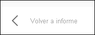

# Visualización de los datos con los informes de Power BI

[!INCLUDE[consumer-appliesto-yyny](../includes/consumer-appliesto-yyny.md)]

[!INCLUDE [power-bi-service-new-look-include](../includes/power-bi-service-new-look-include.md)]

Un objeto visual de Power BI se crea con datos provenientes de conjuntos de datos subyacentes. Si quiere ver lo que sucede en segundo plano, el servicio Power BI permite *mostrar* los datos que se usan para crear un objeto visual en un informe. Cuando se selecciona **Mostrar como tabla**, Power BI muestra los datos que están situados debajo del objeto visual o junto a este.

En un panel, si quiere ver los datos subyacentes, use [Exportar a Excel](end-user-export.md).

## Visualización de los datos que se usan para crear un objeto visual del informe
1. En el servicio Power BI, [abra un informe](end-user-report-open.md) y seleccione un objeto visual.  
2. Para que se muestren los datos que hay detrás del objeto visual, seleccione **Más opciones (…)** y elija **Mostrar como tabla**.
   
   
3. De manera predeterminada, los datos aparecen debajo del objeto visual.
   
   

4. Para cambiar la orientación, seleccione el diseño vertical  en la esquina superior derecha de la visualización.
   
   

Para volver al informe, seleccione **Volver al informe** en la esquina superior izquierda. 

   

## Pasos siguientes
[Objetos visuales en informes de Power BI](../visuals/power-bi-report-visualizations.md)    
[Informes de Power BI](end-user-reports.md)    
