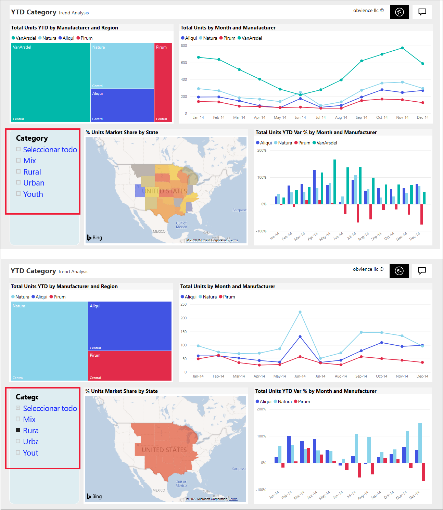
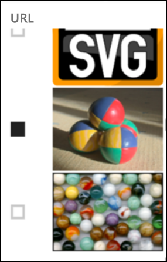
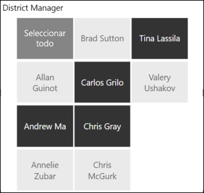
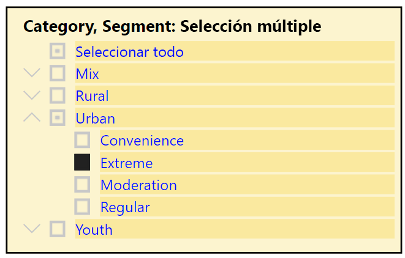
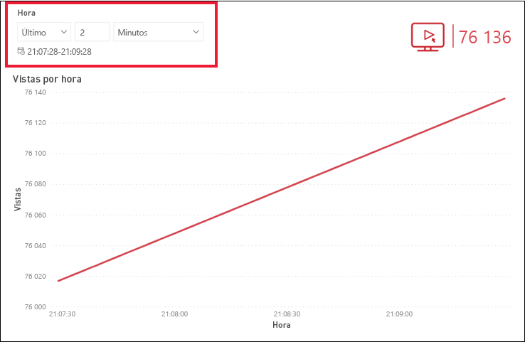
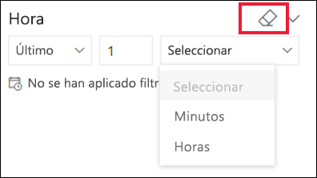

# Segmentaciones en el servicio Power BI

[!INCLUDE[consumer-appliesto-ynnn](../includes/consumer-appliesto-yynn.md)]

Una segmentación es un tipo de objeto visual que filtra los demás objetos visuales de una página de informe. Al usar informes de Power BI, descubrirá muchos tipos de segmentaciones. En la imagen anterior se muestra la misma segmentación, pero con otras selecciones. Observe cómo cada selección filtra los demás objetos visuales de la página.  

## Procedimiento para usar segmentaciones
Al crear informes, los *diseñadores* agregan segmentaciones de datos para ayudar a contar una historia y proporcionarle herramientas para explorar los datos.

### Segmentación de rango numérico
 La segmentación de rango numérico anterior le ayuda a explorar las ventas totales por geografía, unidades en existencias y fecha de pedido. Use los controladores para seleccionar un rango. 

### Segmentación de casilla vertical básica

En una segmentación de casilla básica, puede activar una o varias casillas para ver el impacto en los demás objetos visuales de la página. Para activar más de una, presione CTRL y seleccione. A veces, el diseñador de *informes* establecerá la segmentación de forma que solo permita seleccionar un valor cada vez. 

### Segmentaciones de imagen y forma
Cuando las opciones de segmentación son imágenes o formas, las selecciones se realizan de forma similar a cuando se usan las casillas. Puede elegir una o varias imágenes o formas para aplicar la segmentación a los demás objetos visuales de la página. 

    

    

### Segmentación de jerarquía

En una segmentación con una jerarquía, use las comillas angulares para expandir y contraer la jerarquía. El encabezado se actualiza para mostrar las selecciones.

### Segmentación de tiempo relativa
Con los escenarios de actualización rápida emergentes, la capacidad de filtrar por un período de tiempo más pequeño puede resultar muy útil.
Mediante la segmentación de tiempo relativa, puede aplicar filtros basados en el tiempo a cualquier dato de fecha u hora del informe. Por ejemplo, puede usar la segmentación de tiempo relativa para mostrar solo las vistas de vídeo de los dos últimos días, horas o incluso minutos. 

## Desactivación de una segmentación
Para desactivar una segmentación, seleccione el icono de borrador.

## Pasos siguientes
Para obtener más información, consulte los artículos siguientes:

[Tipos de visualización en Power BI](end-user-visualizations.md)

