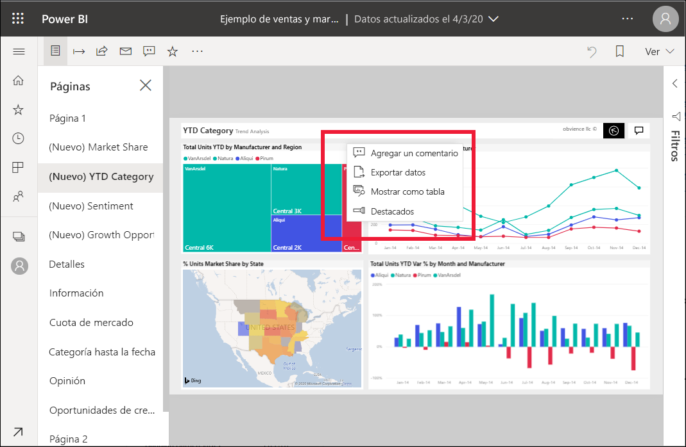

# Cómo destacar informes en Power BI

[!INCLUDE[consumer-appliesto-yyny](../includes/consumer-appliesto-yyny.md)]

La opción Destacados permite atraer la atención a un determinado objeto visual en una página de un informe.  Si está seleccionado el modo Destacados cuando agrega un marcador, se mantiene ese modo en el marcador.

## Agregar una indicación de "destacado"

1. [Abra un informe](end-user-report-open.md) en el servicio Power BI.

2. Decida qué objeto visual desea resaltar en la página del informe. Seleccione la lista desplegable **Más acciones (...)** .  

    

3. Elija la opción **Destacados**. El objeto visual seleccionado se resalta, lo que hace que todos los demás objetos visuales de la página se atenúen hasta quedar casi transparentes. 

    

## Pasos siguientes

* [Representación de un icono de panel o un objeto visual de informe en modo de enfoque](end-user-focus.md)

