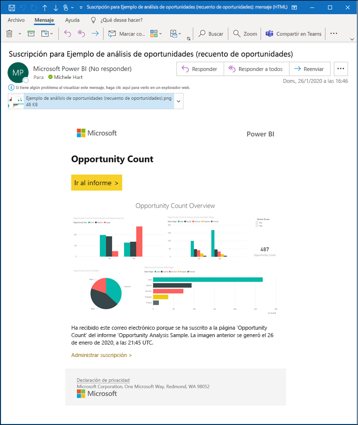
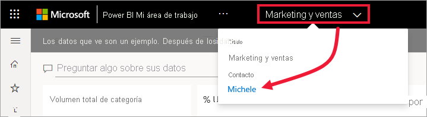
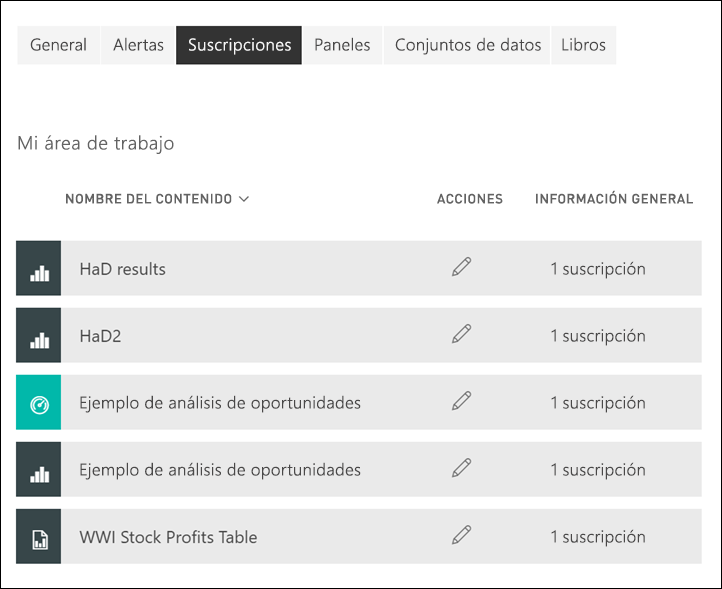

# Suscripción a un informe o panel en el servicio Power BI 

[!INCLUDE[consumer-appliesto-ynny](../includes/consumer-appliesto-ynny.md)]

[!INCLUDE [power-bi-service-new-look-include](../includes/power-bi-service-new-look-include.md)]

Nunca antes ha sido tan fácil mantenerse al día de los paneles e informes más importantes. Suscríbase a las páginas de informes y paneles que más le interesen y Power BI le enviará por correo electrónico una instantánea a la bandeja de entrada. Puede indicarle a Power BI la frecuencia con la que quiere recibir los mensajes de correo electrónico: una vez al día, una vez por semana o cuando se actualicen los datos. Incluso puede establecer una hora concreta a la que Power BI envíe los mensajes de correo electrónico o hacer que se ejecute al instante.  En resumen, puede configurar hasta 24 suscripciones distintas por informe o panel.

El correo electrónico y la instantánea usarán el idioma establecido en la configuración de Power BI (consulte [Idiomas y países o regiones admitidos para Power BI](../supported-languages-countries-regions.md)). Si no se ha definido ningún idioma, Power BI usa el idioma de acuerdo con la configuración regional del explorador actual. Para ver o establecer las preferencias de idioma, seleccione el icono de engranaje  > **Configuración > General > Idioma**. 

Cuando reciba el correo electrónico, incluye un vínculo para "ir al informe o panel". En los dispositivos móviles con aplicaciones de Power BI instaladas, al seleccionar este vínculo, se inicia la aplicación (en lugar de la acción predeterminada de abrir el informe o el panel en el sitio web de Power BI).

## Requisitos
Para **crear** una suscripción para uno mismo se necesita un tipo determinado de [licencia](end-user-license.md). Si no puede crear una suscripción, póngase en contacto con el administrador de Power BI. La **suscripción de otros usuarios** solo está disponible para el propietario del informe. La suscripción a informes paginados varía un poco. Para obtener más información, consulte [Suscripción personal y de otros usuarios a un informe paginado en el servicio Power BI](paginated-reports-subscriptions.md). 

## Suscribirse a un panel o una página de informe
El proceso para suscribirse a un panel y a un informe es similar. El mismo botón permite suscribirse a los paneles e informes del servicio Power BI.
 
.

1. Abra el panel o el informe.
2. En la barra de menús superior, haga clic en **Suscribirse** o en el icono de sobre .
   

   
    
    La pantalla de la izquierda aparece cuando esté en un panel y haga clic en **Suscribirse**. La pantalla de la derecha aparece cuando esté en una página de informe y haga clic en **Suscribirse**. 
    
    a. Para suscribirse a más de una página de un informe, seleccione **Agregar otra suscripción** y seleccione una página diferente en la lista desplegable situada cerca de la parte superior.

    b. Use el control deslizante amarillo para activar y desactivar la suscripción.  Aunque el control deslizante se establezca en desactivado, la suscripción no se elimina. Para eliminarla, seleccione el icono de papelera.

    c. Opcionalmente, agregue un asunto y los detalles del mensaje de correo electrónico. 

    d. Seleccione una **Frecuencia** para la suscripción.  Puede elegir Diaria, Semanal o Tras la actualización de los datos (una vez al día).  Para recibir el correo electrónico de suscripción solo en días concretos, seleccione **Semanal** y elija los días en los que quiera recibirlo.  Por ejemplo, si le gustaría recibir el correo electrónico de suscripción solo los días laborables, seleccione **Semanal** para la frecuencia y desactive las casillas para Sáb. y Dom. Si selecciona **Mensual**, escriba los días del mes en los que quiere recibir el correo de suscripción.   

    e. Si elige Diaria, Horaria, Mensual o Semanal, también puede elegir una Hora programada para la suscripción. Puede hacer que se ejecute a la hora, o bien pasados 15, 30 o 45 minutos. Seleccione por la mañana (a. m.) o por la tarde/noche (p. m.). También puede especificar la zona horaria. Si elige Horaria, seleccione la Hora programada a la que quiera que se inicie la suscripción, y se ejecutará cada hora a partir de entonces.  

    f. Para programar la fecha de inicio y la fecha de finalización, escríbalas en los campos de fecha. De forma predeterminada, la hora de inicio para la suscripción será la fecha en la que la haya creado y la fecha de finalización será un año más tarde. Puede cambiarla a cualquier fecha en el futuro (hasta el año 9999) en cualquier momento antes de que finalice la suscripción. Cuando una suscripción alcanza una fecha de finalización, se detiene hasta que vuelva a habilitarla.  Recibirá notificaciones antes de la fecha de finalización programada para preguntarle si quiere ampliarla.     

    ejemplo, Para revisar la suscripción y probarla, haga clic en **Ejecutar ahora**.  Esto envía el correo electrónico de inmediato. 

3. Si todo es correcto, haga clic en **Guardar y cerrar** para guardar la suscripción. Recibirá un correo electrónico y la instantánea del panel o informe en la programación que haya establecido. Todas las suscripciones en las que la frecuencia se ha establecido en **Tras la actualización de los datos** solo enviarán un correo electrónico después de la primera actualización programada de ese día.
   
   
   
    La actualización de la página del informe no actualiza el conjunto de datos. El propietario del conjunto de datos es el único que puede actualizar manualmente un conjunto de datos. Para buscar el nombre del propietario de los conjuntos de datos subyacentes, seleccione la lista desplegable de la barra de menús o busque el correo electrónico original de la suscripción.
   
    

## Administrar sus suscripciones
Solo puede administrar las suscripciones que cree. Vuelva a hacer clic en **Suscribirse** y haga clic en **Administrar todas las suscripciones** en la esquina inferior izquierda (vea las capturas de pantalla anteriores). Las suscripciones concretas que se muestran dependen del área de trabajo que está activa en ese momento. Para ver a la vez todas las suscripciones de todas las áreas de trabajo, asegúrese de que **Mi área de trabajo** está activa. Para entender las áreas de trabajo, consulte [Áreas de trabajo de Power BI](end-user-workspaces.md). 

Una suscripción finalizará si expira la licencia de Pro, el propietario elimina el panel o el informe o se elimina la cuenta de usuario utilizada para crear la suscripción.

## Consideraciones y solución de problemas
* Para evitar que los correos electrónicos de las suscripciones vayan a la carpeta de correo no deseado, agregue el alias de correo electrónico de Power BI (no-reply-powerbi@microsoft.com) a sus contactos. Si usa Microsoft Outlook, haga clic con el botón derecho en el alias y seleccione **Agregar a contactos de Outlook**. 
* Es posible que los paneles con más de 25 iconos anclados, o bien con 4 páginas de informes activos ancladas, no se representen totalmente en los correos electrónicos de la suscripción enviados a los usuarios. Se recomienda contactar con el diseñador del panel y pedirle que reduzca los iconos anclados a menos de 25 y los informes activos anclados a menos de 4 para asegurarse de que el correo electrónico se representa de forma correcta.  
* En las suscripciones de correo electrónico de panel, si se ha aplicado la seguridad de nivel de fila (RLS) a algún icono, dicho icono no se mostrará.  
* Si los vínculos del correo electrónico (al contenido) dejan de funcionar, es posible que el contenido se haya eliminado. En el correo electrónico, debajo de la captura de pantalla, puede ver si se ha suscrito personalmente o si alguien lo ha hecho por usted. Si lo ha hecho otra persona, pídale que cancele los mensajes de correo electrónico o que vuelva a suscribirle.
* Para las suscripciones de paneles en concreto, todavía no se admiten ciertos tipos de iconos. Entre estos se incluyen: transmisión en secuencias de mosaicos, iconos de vídeo, iconos de contenido web personalizado. 
* Las suscripciones a una página del informe están asociadas con el nombre de la página del informe. Si se suscribe a una página del informe y cambia de nombre, tendrá que volver a crear la suscripción.
* Si no puede usar la característica de suscripción, póngase en contacto con el administrador del sistema. Es posible que su organización haya deshabilitado esta característica.  
* Las suscripciones de correo electrónico no admiten la mayoría de los [objetos visuales personalizados](../developer/visuals/power-bi-custom-visuals.md).  La excepción son los objetos visuales de Power BI que se han [certificado](../developer/visuals/power-bi-custom-visuals-certified.md).    
* Las suscripciones de correo electrónico se envían con los estados de segmentación y filtros predeterminados del informe. En el correo electrónico no se muestran los cambios en los valores predeterminados que realice tras suscribirse. Los informes paginados admiten esta función y le permiten establecer valores de parámetros específicos por suscripción.  
* En la actualidad, las suscripciones de correo electrónico no admiten objetos visuales de Power BI con la tecnología de R.  
* Para las suscripciones de unos paneles en concreto, no se admiten aún ciertos tipos de iconos.  Entre estos se incluyen: transmisión en secuencias de mosaicos, iconos de vídeo, iconos de contenido web personalizado.     
* Las suscripciones pueden provocar errores en paneles o informes con imágenes muy grandes debido a las limitaciones de tamaño del correo electrónico.    
* Power BI detiene de forma automática la actualización en los conjuntos de datos asociados con los paneles e informes que no se han visitado en más de dos meses.  Pero si agrega una suscripción a un panel o informe, no se detendrá aunque no reciba visitas.
* En raras ocasiones, las suscripciones de correo electrónico pueden tardar más de 15 minutos en entregarse a los destinatarios.  Si esto ocurre, se recomienda ejecutar la actualización de datos y la suscripción de correo electrónico a otras horas para garantizar la entrega puntual.  Si la incidencia persiste, póngase en contacto con el soporte técnico de Power BI.

## Pasos siguientes

[Búsqueda y ordenación de contenido](end-user-search-sort.md)
