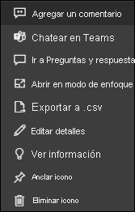

# Iconos de paneles en Power BI

[!INCLUDE[consumer-appliesto-yyny](../includes/consumer-appliesto-ynny.md)]

[!INCLUDE [power-bi-service-new-look-include](../includes/power-bi-service-new-look-include.md)]

Un icono es una instantánea de los datos, anclada a un panel mediante un *diseñador* . Los *diseñadores* pueden crear iconos desde un informe, un conjunto de datos, un panel, el cuadro de pregunta de Preguntas y respuestas, Excel, SQL Server Reporting Services (SSRS), etc.  Esta captura de pantalla muestra muchos iconos diferentes anclados a un panel.

Además de los iconos anclados de los informes, los *diseñadores* puede agregar iconos independientes directamente en el panel mediante **Agregar icono** . Los iconos independientes incluyen: cuadros de texto, imágenes, vídeos, datos de transmisión y contenido web.

¿Necesita ayuda para comprender los bloques de creación que conforman Power BI?  Vea [Power BI: Conceptos básicos](end-user-basic-concepts.md).

## Interactuar con los iconos en un panel

1. Mantenga el puntero sobre el icono para que se muestren los puntos suspensivos.
   
    
2. Seleccione los puntos suspensivos (...) para abrir el menú de acciones del icono. Las opciones disponibles varían según los permisos, el tipo de objeto visual y el método utilizado para crear el icono. Por ejemplo, los elementos de menú disponibles para los iconos anclados desde Preguntas y respuestas son diferentes de los anclados desde un informe. Este es un menú de acción de un icono creado con Preguntas y respuestas.

   
    

   
    Algunas de las acciones disponibles en estos menús son:
   
   * [Abrir el informe que se ha usado para crear el icono ](end-user-reports.md)   
   
   * [Abrir la pregunta de Preguntas y respuestas que se ha usado para crear el icono ](end-user-reports.md)   
   

   * [Abrir el libro que se usó para crear este icono ](end-user-reports.md)   
   * [Ver el icono en modo de enfoque ](end-user-focus.md)   
   * [Ver conclusiones ](end-user-insights.md) 
   * [Agregar un comentario e iniciar una discusión](end-user-comment.md) 
   * [Administrar las alertas establecidas en un icono del panel](end-user-alerts.md) 
   * [Abrir los datos en Excel](end-user-export.md) 

3. Para cerrar el menú Acción, seleccione un área en blanco en el lienzo.

### Seleccionar (hacer clic en) un icono
Al seleccionar un icono, lo que sucede después depende de cómo se creó el icono y de si tiene un [vínculo personalizado](../create-reports/service-dashboard-edit-tile.md). Si tiene un vínculo personalizado, al seleccionar el icono se le lleva a ese vínculo. En caso contrario, al seleccionar el icono se le dirigirá al informe, al libro de Excel Online, al informe de SSRS local o a la pregunta de Preguntas y respuestas que se usó para crear el icono.

> [!NOTE]
> La excepción a esto son los iconos de vídeo agregados a los paneles por los *diseñadores* . Al seleccionar un icono de vídeo (que se creó de este modo), el vídeo se reproduce directamente en el panel.   
> 
> 

## Consideraciones y solución de problemas
* Si no ocurre nada al seleccionar (hacer clic en) un icono o recibe un mensaje de error, estas son algunas razones posibles:
  - El informe que se usó para crear la visualización no se guardó o se ha eliminado.
  - El icono se creó a partir de un libro de Excel Online, y no tiene al menos permisos de lectura para ese libro.
  - El icono se creó a partir de SSRS y no tiene permiso para el informe de SSRS, o no tiene acceso a la red en la que se encuentra el servidor de SSRS.
* En el caso de los iconos creados directamente en el panel con **Agregar icono** , si se estableció un hipervínculo personalizado, al seleccionar el título, el subtítulo o el icono se abrirá esa dirección URL.  De lo contrario, y de manera predeterminada, seleccionar uno de estos iconos creados directamente en el panel para una imagen, un código web o un cuadro de texto no generará ninguna acción.
* Si la visualización original usada para crear el icono cambia, no se produce ningún cambio en el icono.  Por ejemplo, si el *diseñador* ha anclado un gráfico de líneas desde un informe y posteriormente ha cambiado el gráfico de líneas a un gráfico de barras, el icono del panel seguirá mostrando un gráfico de líneas. Los datos se actualizan, pero no el tipo de visualización.

## Pasos siguientes
[Actualización de datos](../connect-data/refresh-data.md)

[Power BI: Conceptos básicos](end-user-basic-concepts.md)

