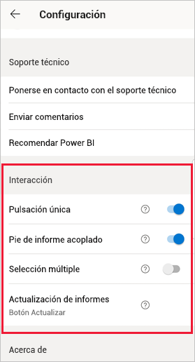
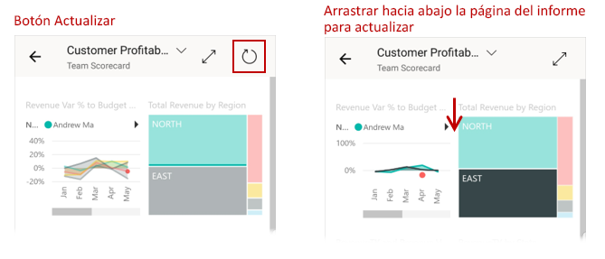
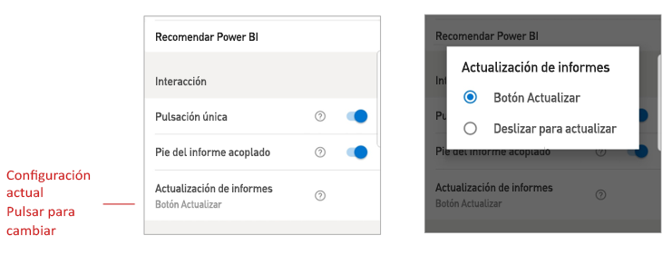

# Configuración de las opciones de interacción de los informes

## Información general

La aplicación móvil de Power BI tiene una serie de opciones de "interacción" configurables que permiten controlar cómo se interactúa con los datos y cómo se comportan algunos de los elementos de la aplicación móvil de Power BI. En la tabla siguiente se muestra la configuración de interacción que está disponible actualmente y los dispositivos que la tienen.

|| Teléfono Android | iPhone | Tableta Android  | iPad |
|-|:-:|:-:|:-:|:-:|
| [Diferencias entre la interacción de pulsación única y doble en objetos visuales de los informes](#single-tap) |✔|✔|||
| [Selección múltiple frente a selección única de puntos de datos en objetos visuales de un informe](#multi-select) |✔|✔|✔|✔|
| [Pie de página de informe acoplado frente a dinámico](#docked-report-footer) |✔|✔|||
| [Actualización de un informe iniciada con un botón frente a deslizar para actualizar](#report-refresh) |✔||||
|

Para ir a la configuración de la interacción, pulse en la imagen del perfil para abrir el [panel lateral](./mobile-apps-home-page.md#header), elija **Configuración** y busque la sección **Interacción**.

La configuración de interacción se describe en las secciones siguientes.

## Configuración de la interacción

### Pulsación única
Al descargar la aplicación móvil de Power BI, está establecida para la interacción de pulsación única. Esto significa que, al pulsar un objeto visual para realizar una acción, como seleccionar un elemento de segmentación, resaltado cruzado, hacer clic en un vínculo o botón, etc., la pulsación selecciona el objeto visual y realiza la acción deseada.

Si lo prefiere, puede desactivar la interacción de pulsación única. Después, también tiene la interacción de pulsar dos veces. Con la interacción de pulsar dos veces, primero debe pulsar un objeto visual para seleccionarlo y, después, volver a pulsarlo para realizar la acción deseada.

### Selección múltiple

La opción de selección múltiple permite seleccionar varios puntos de datos en una página de un informe. Cuando se activa la selección múltiple, cada punto de datos que se pulsa se agrega a los otros puntos de datos seleccionados, y los resultados combinados se resaltan automáticamente en todos los objetos visuales de la página. Cuando la selección múltiple está desactivada, al pulsar para seleccionar un punto de datos, la nueva selección reemplaza a la selección actual.

Para anular la selección de un punto de datos, púlselo de nuevo.

>[!NOTE]
>La selección múltiple no se admite en los objetos visuales de Power BI.
>
>El modo de selección múltiple se incluirá en la próxima versión de Power BI Report Server.

### Pie de informe acoplado

La configuración de pie de página de informe acoplado determina si el pie de página del informe permanece acoplado (es decir, fijo y siempre visible) en la parte inferior del informe, o bien si se oculta y vuelve a aparecer en función de las acciones que realice en el informe, como el desplazamiento.

En los teléfonos Android, la configuración de pie de página de informe acoplado está **activada** de forma predeterminada, lo que significa que el pie de página del informe está acoplado y siempre visible en la parte inferior del informe. Si prefiere un pie de página de informe dinámico que aparezca y desaparezca, en función de las acciones que realice en el informe, **desactívela**.

### Actualización de informes

La configuración de actualización de los informes define cómo se inician las actualizaciones de estos. Puede elegir entre tener un botón de actualización en todos los encabezados de informe, o bien usar la acción de deslizar para actualizar (y deslizar suavemente de arriba abajo) en la página del informe para actualizarlo. En la figura siguiente se muestran las dos alternativas. 

En los teléfonos Android, se agrega un botón de actualización de forma predeterminada.

Para cambiar la configuración de actualización de un informe, vaya al elemento Actualizar informe de la configuración de interacción. Se mostrará la configuración actual. Pulse el valor para abrir una ventana emergente en la que puede elegir un valor nuevo.

## Configuración remota

Un administrador también puede configurar de forma remota las interacciones mediante una herramienta de MDM con un archivo de configuración de la aplicación. De este modo, se puede estandarizar la experiencia de interacción de los informes en toda la organización o en grupos específicos de usuarios de la organización. Para obtener más información, vea [Configuración de la interacción con la administración de dispositivos móviles](./mobile-app-configuration.md).

## Pasos siguientes
* [Interacción con los informes](./mobile-reports-in-the-mobile-apps.md#interact-with-reports)
* [Configuración de la interacción con la administración de dispositivos móviles](./mobile-app-configuration.md)
