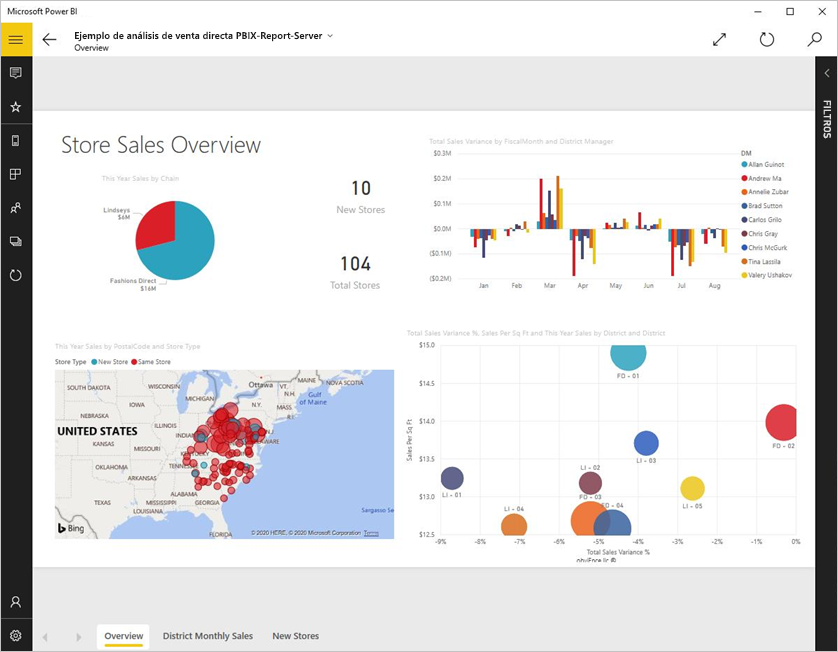
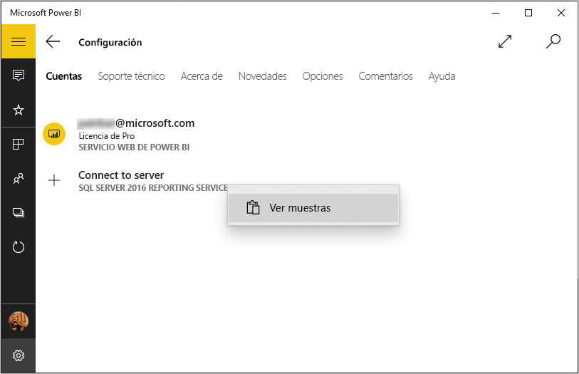
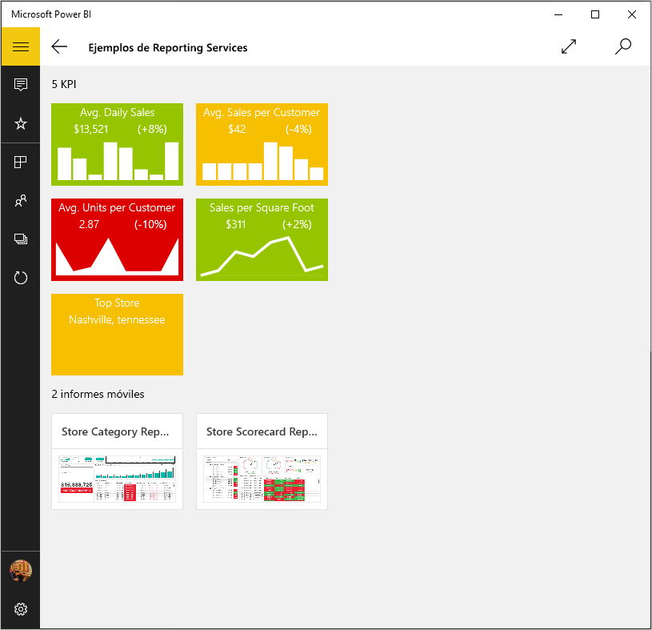
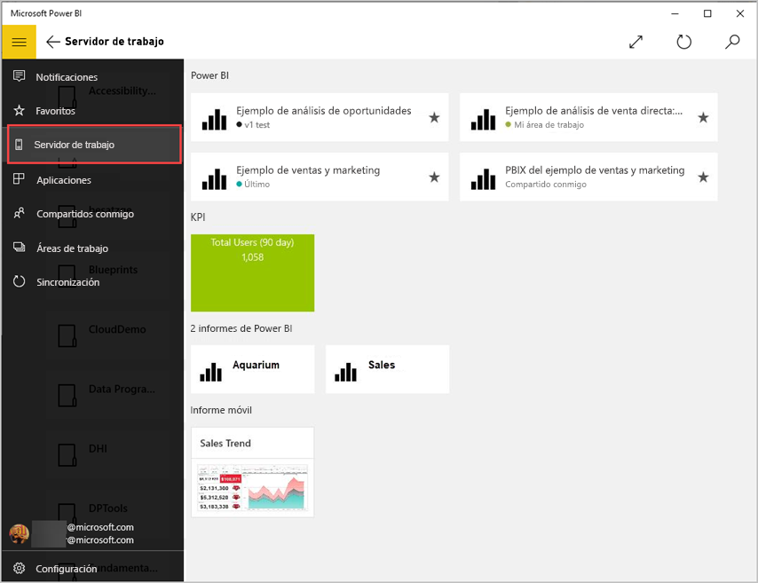
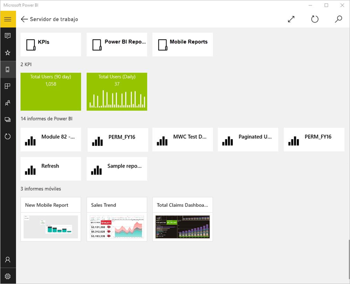
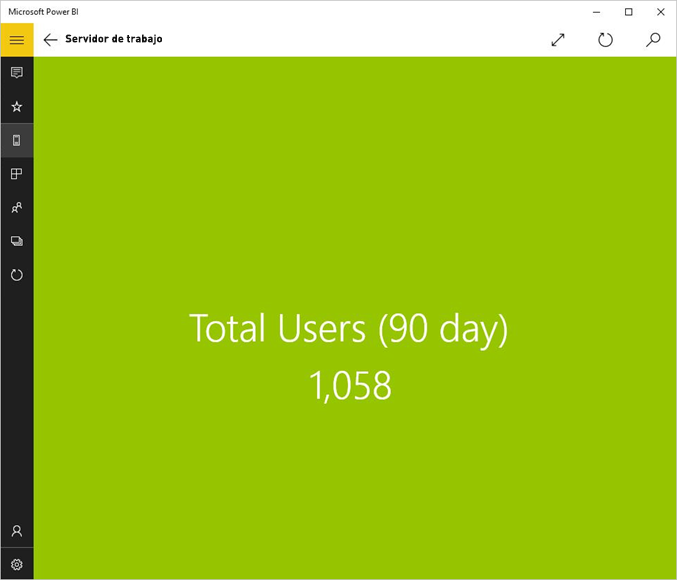
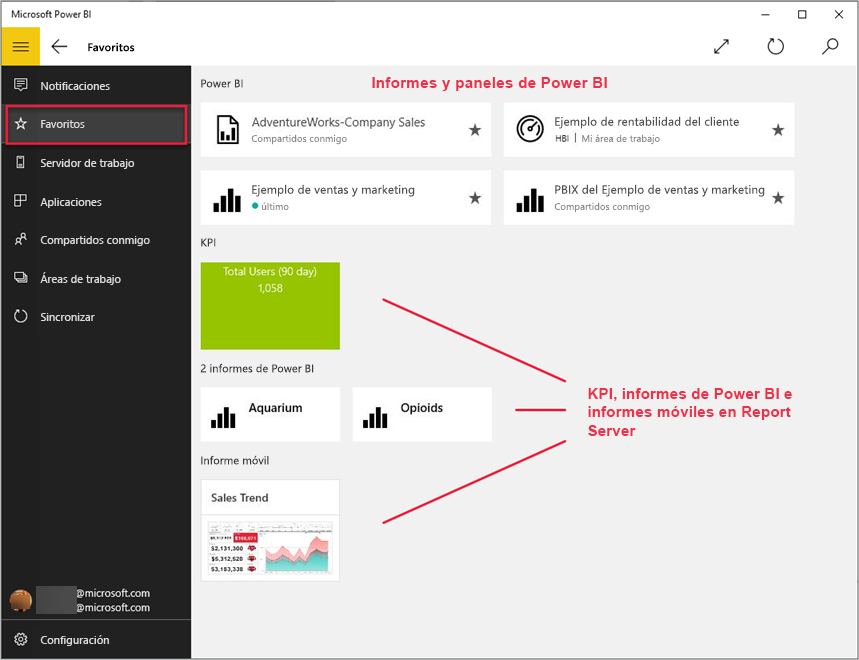
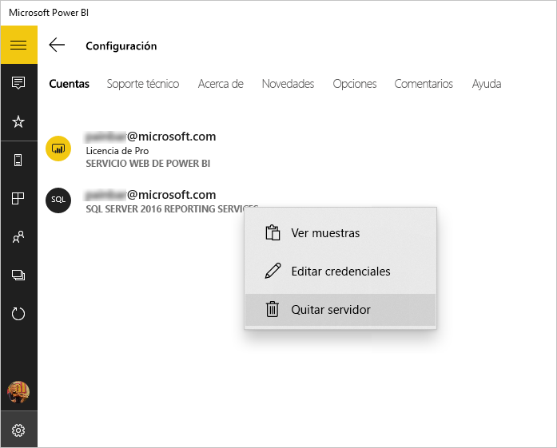

# Visualización de informes y KPI del entorno local en la aplicación Power BI para Windows
La aplicación móvil Power BI para Windows 10 proporciona acceso móvil táctil en directo a la información local más importante de su empresa en SQL Server 2016 Reporting Services. 

## Lo primero es lo primero
[Cree informes móviles de Reporting Services](/sql/reporting-services/mobile-reports/create-mobile-reports-with-sql-server-mobile-report-publisher) con el Publicador de informes móviles de SQL Server 2016 Enterprise Edition y publíquelos en el [portal web de Reporting Services](/sql/reporting-services/web-portal-ssrs-native-mode). Cree KPI justo en el portal web. Organícelos en carpetas y marque sus favoritos, así podrá encontrarlos fácilmente. 

Después, en la aplicación Power BI para Windows 10, podrá ver los KPI, los informes móviles y los informes de Power BI organizados en carpetas o como favoritos. 

> [!NOTE]
> El dispositivo debe ejecutar Windows 10. La aplicación funciona mejor en dispositivos con al menos 1 GB de RAM y 8 GB de almacenamiento interno.

>[!NOTE]
>El soporte técnico de la aplicación móvil de Power BI con **teléfonos con Windows 10 Mobile** finalizará el 16 de marzo de 2021. [Más información](/legal/powerbi/powerbi-mobile/power-bi-mobile-app-end-of-support-for-windows-phones)

## Explorar ejemplos sin un servidor SQL Server 2016 Reporting Services
Aunque no tenga acceso a un portal web de Reporting Services, puede explorar las características de los informes móviles de Reporting Services.

1. En el dispositivo Windows 10, abra la aplicación Power BI.
2. Pulse el botón de navegación global  en la esquina superior izquierda.
3. Pulse el icono **Configuración**, haga clic con el botón derecho o pulse y mantenga pulsado **Conectarse al servidor** y luego **Ver ejemplos**.
   
   
4. Abra la carpeta Informes de venta directa o Informes de ventas para explorar los KPI e informes móviles.
   
   

Examine los ejemplos para interactuar con informes móviles y KPI.

## Conexión a un servidor de informes de Reporting Services
1. En la parte inferior del panel de navegación, pulse **Configuración** .
2. Pulse **Conectarse al servidor**.
3. Rellene la dirección del servidor y su nombre de usuario y contraseña. Use este formato para la dirección del servidor:
   
     `https://<servername>/reports` OR   `https://<servername>/reports`
   
   > [!NOTE]
   > Incluya **http** o **https** al principio de la cadena de conexión.
   > 
   > 
   
    Si lo prefiere, pulse **Opción avanzada** para asignar al servidor un nombre.
4. Pulse la marca de verificación para conectarse. 
   
   Ahora verá el servidor en el panel de navegación.
   
   
   
   >[!TIP]
   >Pulse el botón de navegación global  en cualquier momento para desplazarse entre los informes móviles de Reporting Services y los paneles del servicio Power BI. 
   > 

   >[!NOTE]
   >No se admiten los servidores de informes configurados con puertos personalizados y no se puede acceder a ellos desde la aplicación de Windows para Power BI. 

## Visualización de informes móviles y KPI de Reporting Services en la aplicación de Power BI
Los KPI y los informes móviles de Reporting Services y los informes de Power BI (versión preliminar) se muestran en las mismas carpetas en las que se encuentran en el portal web de Reporting Services.

* Puntee un KPI para verlo en el modo de enfoque.
  
    
* Puntee un informe móvil para abrirlo e interactuar con él en la aplicación de Power BI.
  
    

## Ver los informes y KPI favoritos
Puede marcar los KPI, informes móviles e informes de Power BI como favoritos en el portal web de Reporting Services y después verlos en una carpeta adecuada en el dispositivo con Windows 10, junto con sus informes y paneles favoritos de Power BI.

* Pulse **Favoritos**.
  
   
  
   Todos los favoritos del portal web se encuentran en esta página.
  
Obtenga más información sobre los [favoritos en las aplicaciones móviles Power BI](mobile-apps-favorites.md).

## Quitar una conexión a un servidor de informes
Solo puede conectarse a un servidor de informes a la vez desde su aplicación móvil de Power BI. Si quiere conectarse a otro servidor, antes deberá desconectarse del actual.

1. En la parte inferior del panel de navegación, pulse **Configuración** .
2. Mantenga pulsado el nombre del servidor al que no quiere estar conectado.
3. Pulse **Quitar servidor**.
   
    

## Crear informes móviles y KPI de Reporting Services
Los informes móviles y KPI de Reporting Services no se crean en la aplicación móvil Power BI. Se crean en el Publicador de informes móviles de SQL Server y un portal web de SQL Server 2016 Reporting Services.

* [Cree sus propios informes móviles de Reporting Services](/sql/reporting-services/mobile-reports/create-mobile-reports-with-sql-server-mobile-report-publisher) y publíquelos en un portal web de Reporting Services.
* Crear [KPI en un portal web de Reporting Services](/sql/reporting-services/working-with-kpis-in-reporting-services)

## Pasos siguientes
* [Introducción a la aplicación móvil de Power BI para Windows 10](mobile-windows-10-phone-app-get-started.md)  
* [¿Qué es Power BI?](../../fundamentals/power-bi-overview.md)  
* ¿Tiene alguna pregunta? [Pruebe a preguntar a la comunidad de Power BI](https://community.powerbi.com/)