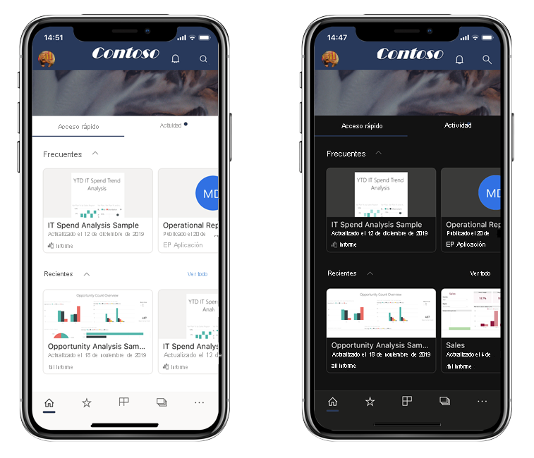
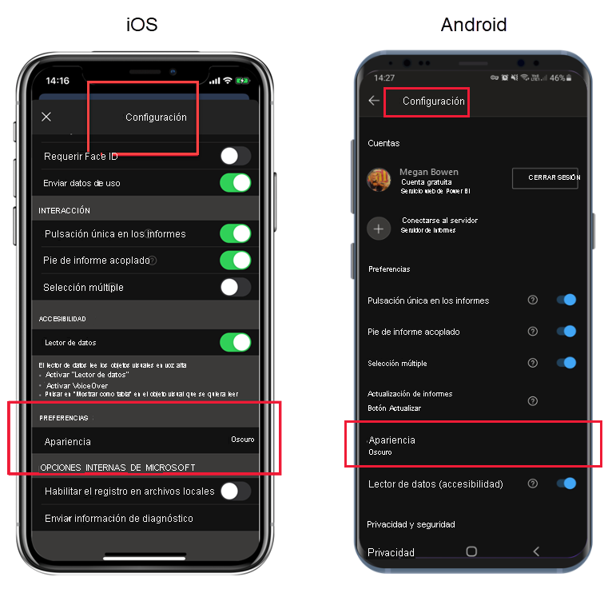

# Modo oscuro

Para adaptarse a las preferencias de visualización individuales, las aplicaciones móviles de Power BI para iOS y Android admiten los modos de pantalla claro y oscuro. El modo oscuro reduce el brillo de la pantalla, lo que facilita la visualización del contenido.

 En el modo oscuro, todas las experiencias de las aplicaciones aparecen con un fondo oscuro. Sin embargo, el contenido de Power BI no se ve afectado. Los informes, paneles y aplicaciones se muestran siempre tal y como las concibieron los diseñadores.
 
 De forma predeterminada, la aplicación móvil de Power BI usa la configuración del dispositivo para determinar la apariencia de la pantalla que se va a mostrar. Si el dispositivo está configurado para el modo oscuro, la aplicación aparecerá en modo oscuro.

>[!NOTE]
>La compatibilidad de nivel de dispositivo para el modo oscuro en dispositivos Android está oficialmente disponible desde Android 10. En los dispositivos que ejecutan versiones anteriores de Android, el modo oscuro en la aplicación Power BI Mobile se puede controlar mediante la configuración de la apariencia de la aplicación.

Para cambiar entre el modo claro y el oscuro, o bien para permitir que la configuración del dispositivo determine el modo, vaya a la página **Configuración**, desplácese hasta **Apariencia**, pulse y seleccione el modo deseado.

