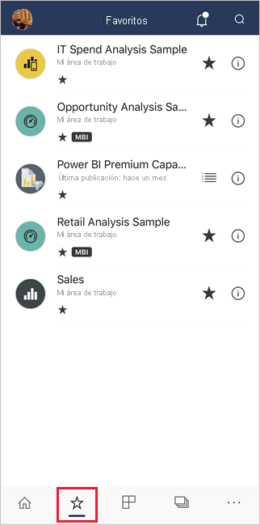
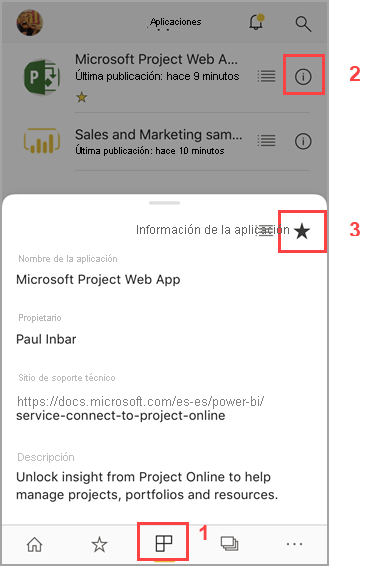
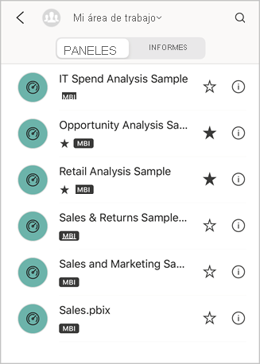
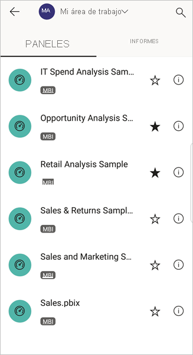
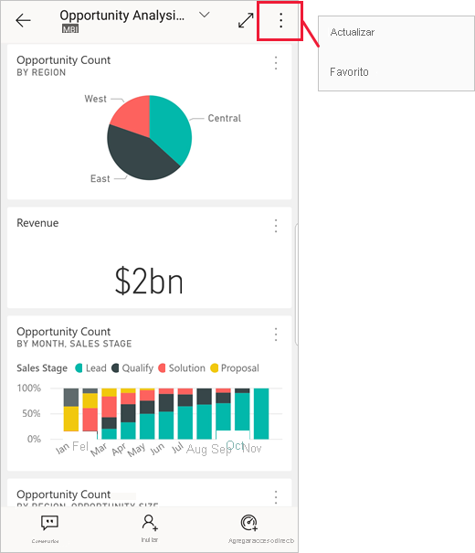

# Creación y visualización de elementos favoritos en las aplicaciones móviles de Power BI
Se aplica a:

|  |  |  |  |  |
|:--- |:--- |:--- |:--- |:--- |
| iPhone |iPad |Teléfonos Android |Tabletas Android |Dispositivos de Windows 10 |

>[!NOTE]
>El soporte técnico de la aplicación móvil de Power BI con **teléfonos con Windows 10 Mobile** finalizará el 16 de marzo de 2021. [Más información](/legal/powerbi/powerbi-mobile/power-bi-mobile-app-end-of-support-for-windows-phones)

Lea información sobre cómo definir y ver sus paneles, informes y aplicaciones de Power BI favoritos, junto con los informes y KPI favoritos locales de Power BI Report Server y de Reporting Services, en las aplicaciones móviles.

Cuando define un favorito en las aplicaciones móviles de Power BI, puede verlo en la página Favoritos del [servicio Power BI](https://powerbi.com) y en todos los dispositivos móviles.

Para ver la página Favoritos, pulse el icono Favoritos en la barra de navegación:

También puede [definir paneles y aplicaciones de Power BI como favoritos en el servicio Power BI](../end-user-favorite.md). Después, los verá en la página Favoritos de la aplicación móvil.

Puede marcar KPI e informes como favoritos en el portal web del servidor de informes de Power BI o Reporting Services y verlos después en práctica carpeta en su dispositivo móvil, junto con sus paneles favoritos de Power BI.

## Agregar a Favoritos una aplicación
1. Pulse el icono Aplicaciones de la barra de navegación inferior para mostrar la página de aplicaciones.

2. En un dispositivo iOS, pulse el botón Información situado a la derecha del nombre de la aplicación que quiera convertir en favorita. En dispositivos Android, aparece Más opciones (...) en lugar del botón Información. 

3. En la sección Información de la aplicación que se abre, pulse la estrella.
   
    
   
    Ahora la aplicación se mostrará en la página Favoritos, junto con los demás paneles, informes y aplicaciones favoritos.
   
## Adición de un panel o informe como favorito en las aplicaciones móviles para iOS y Windows 10
Puede definir un panel o informe de Power BI como favorito desde la lista de paneles o informes o desde el propio panel o informe.

* En la lista de paneles o informes de la aplicación móvil, pulse la estrella vacía junto al nombre . La estrella se vuelve negra .
  
    
* Si se encuentra en un panel o informe, pulse **Más opciones** (...) en el encabezado y, a continuación, pulse en la estrella vacía  en el menú que se muestra. La estrella se pondrá en negro .
  
    

## Adición de un panel o informe como favorito en las aplicaciones móviles para Android
Puede definir un panel o informe como favorito desde la lista de paneles o informes o desde el propio panel o informe.

* En la lista de paneles o informes de la aplicación móvil, pulse la estrella situada junto al nombre del informe o el panel para que sea favorito o no favorito.
  
    

* Cuando esté en un panel o informe, pulse **Más opciones (...)** y, después, seleccione **Favorito**.
  
    

## Agregar a Favoritos informes y KPI del servidor de informes de Power BI y Reporting Services
En las aplicaciones móviles de Power BI puede ver los informes y KPI del servidor de informes de Power BI y Reporting Services, pero no puede agregarlos a Favoritos. Se [etiquetan como favoritos en el portal web](../../report-server/tutorial-explore-report-server-web-portal.md#tag-your-favorites). 

## Pasos siguientes
* [Paneles favoritos en el servicio Power BI](../end-user-favorite.md) 
* ¿Tiene alguna pregunta? [Pruebe a preguntar a la comunidad de Power BI](https://community.powerbi.com/)