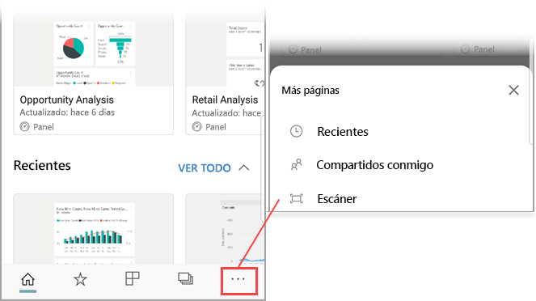

# Detección de un código QR de Power BI desde un dispositivo móvil
Se aplica a:

|  |  |  |  |
|:--- |:--- |:--- |:--- |
|iPhone |iPad |Teléfonos Android |Tabletas Android |

Los códigos QR de Power BI pueden conectar  cualquier elemento del mundo real directamente con información de BI relacionada &#151; no es necesario realizar ninguna exploración o búsqueda.

Suponga que un compañero ha [creado un código QR en el servicio Power BI](../../create-reports/service-create-qr-code-for-tile.md) para un informe o para un icono en un panel, ha compartido el panel o el informe con usted y ha colocado dicho código en una ubicación clave, por ejemplo, en un mensaje de correo o en un elemento concreto. 

Puede escanear el código QR para obtener acceso de forma inmediata al icono o informe correspondiente, directamente desde su teléfono, mediante el escáner de la aplicación Power BI o cualquier otro escáner instalado en el teléfono. 

Si su compañero no ha compartido el panel o informe con usted, puede solicitar acceso directamente desde la aplicación móvil. 

> [!NOTE]
> También puede [escanear un código QR de informe con la aplicación Power BI for Mixed Reality](mobile-mixed-reality-app.md#scan-a-report-qr-code-in-holographic-view).

## Detección de un código QR de Power BI en el iPhone con el escáner de Power BI

1. En la barra de navegación, pulse **Más opciones** (...) y después **Escáner**.

    

2. Si la cámara no está habilitada, debe permitir que la aplicación Power BI use la cámara. Se trata de una aprobación única. 
 
3. Seleccione el escáner en el código QR de Power BI. 
   
    
4. El icono o el informe aparece al mantener el mouse sobre el fondo en realidad aumentada.
   
    

5. Pulse el informe o el icono para abrirlo en modo de enfoque, o regresar al escáner.

### Escanear un código QR desde un escáner externo a su iPhone
1. Desde cualquier escáner instalado en el teléfono, apunte el escáner al código QR de Power BI pertinente para acceder de inmediato al icono o informe. 
2. Si no tiene instalada la aplicación Power BI, se le redirigirá a [App Store de Apple para descargarla](https://go.microsoft.com/fwlink/?LinkId=522062) en el iPhone.

## Detección de un código QR de Power BI en un dispositivo Android con el escáner de Power BI

1. En la barra de navegación, pulse **Más opciones** (...) y después **Escáner**.

    

2. Si la cámara no está habilitada, debe permitir que la aplicación Power BI use la cámara. Se trata de una aprobación única. 

3. Seleccione el escáner en el código QR de Power BI. 
   
    
4. El icono o informe se abre automáticamente en Power BI.
   
    

### Detectar un código QR con un escáner externo en un dispositivo Android
1. Desde cualquier escáner instalado en un dispositivo Android, apunte el escáner al código QR de Power BI pertinente para obtener acceso de forma inmediata al icono o informe. 
2. Si no tiene instalada la aplicación Power BI, se le redirigirá a [Google Play para descargarla](https://go.microsoft.com/fwlink/?LinkID=544867). 

## Pasos siguientes
* [Get Power BI data from the real world with the mobile apps](mobile-apps-data-in-real-world-context.md) (Obtener datos de Power BI del mundo real con las aplicaciones móviles)
* [Crear un código QR para un icono en el servicio Power BI](../../create-reports/service-create-qr-code-for-tile.md)
* [Crear un código QR para un informe en el servicio Power BI](../../create-reports/service-create-qr-code-for-report.md)
* También puede [escanear un código QR con la aplicación Power BI for Mixed Reality](mobile-mixed-reality-app.md)
* ¿Tiene alguna pregunta? [Pruebe a preguntar a la comunidad de Power BI](https://community.powerbi.com/)
