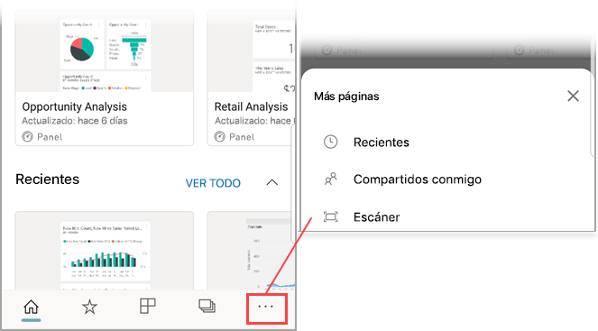

# Digitalización de códigos de barras mediante la aplicación móvil para obtener datos filtrados 
Digitalice códigos de barras del mundo real para acceder directamente a información filtrada de BI en la aplicación móvil de Power BI.

Se aplica a:

|  |  |  |  |
|:--- |:--- |:--- |:--- |
|iPhone |iPad |Teléfonos Android |Tabletas Android |

Supongamos que su organización tiene informes que contienen datos [etiquetados como datos de código de barras en Power BI Desktop](../../transform-model/desktop-mobile-barcodes.md). Al digitalizar el código de barras de un producto con el escáner en la aplicación Power BI de su dispositivo, obtendrá una lista de los informes que tienen los datos de ese código de barras. Puede abrir el informe que está buscando, filtrado automáticamente con la información que necesita.

A continuación se muestran ejemplos de dos escenarios en los que resulta útil la digitalización de códigos de barras:
* Imagine que está comprobando el inventario de un gran supermercado y, mientras está en los pasillos, necesita obtener información sobre unos productos concretos; por ejemplo, quiere saber cuántos hay disponibles, en qué departamentos están almacenados los artículos, etc. Solo tendría que abrir el escáner de Power BI en su dispositivo móvil y digitalizar el código de barras de un elemento. Obtendrá una lista de informes que tienen datos del código de barras. Elija el informe pertinente y este se abrirá, filtrado con los datos correspondientes.
* Supongamos que las máquinas de una planta de producción están identificadas con códigos de barras, y que la telemetría de esas máquina se procesa y envía a Power BI. Cuando los ingenieros se encuentran en la planta comprobando el estado de las máquinas, pueden digitalizar fácilmente el código de barras de una máquina y obtener un informe de KPI sobre su rendimiento y estado.

## Escanear un código de barras con el escáner de Power BI
1. En la barra de navegación, pulse **Más opciones** (...) y después **Escáner**.

    

1. Si la cámara no está habilitada, debe permitir que la aplicación Power BI use la cámara. Se trata de una aprobación única. 
1. Apunte el escáner hacia el código de barras del elemento que le interese. Verá una lista de informes que tienen campos del código de barras.
1. Busque el informe que quiera y toque para abrirlo en su dispositivo, filtrado automáticamente de acuerdo con el código de barras que haya digitalizado. Si el informe no contiene el código de barras, se le mostrará el mensaje "No se ha podido filtrar el informe". En ese caso, puede volver a la lista y probar con otro informe.
    
>[!NOTE]
>Si solo hay un informe con un campo de código de barras, no obtendrá ninguna lista de informes, sino que el informe se abrirá directamente, filtrado según el código de barras que haya digitalizado. Si el informe no contiene el código de barras que ha digitalizado, también se le mostrará el mensaje "No se ha podido filtrar el informe".

## Filtrar por otros códigos de barras en un informe
Mientras mira un informe filtrado por un código de barras en el dispositivo, puede querer filtrar el mismo informe por otro código de barras.

En la barra de acciones del informe, toque **Más opciones (...)** y busque el icono de código de barras.

* Si el icono de código de barras está rellenado, , el filtro está activo y el informe ya está filtrado por un código de barras. 
* Si el icono está borrado , el filtro no está activo y el informe no está filtrado por un código de barras. 

En cualquier caso, pulse el icono para abrir un pequeño menú con un escáner flotante.

* Centre el escáner sobre el nuevo elemento para cambiar el filtro del informe por un valor de código de barras diferente. 
* Seleccione **Borrar filtro de código de barras** para volver al informe sin filtrar.
* Seleccione **Filtrar por códigos de barras reciente** para cambiar el filtro de informe a uno de los códigos de barras que ha escaneado en la sesión actual.

## Borrado de un filtro de código de barras
Para borrar el filtrado de códigos de barras desde un informe filtrado:
1. En la barra de acciones del informe, toque **Más opciones (...)** y busque el icono del escáner de códigos de barras rellenado, , que indica que hay un filtro activo; después, tóquelo para abrir el escáner.
1. Seleccione **Borrar filtro de código de barras** para volver al informe sin filtrar.

## Limitaciones

* El panel Filtros no da ninguna indicación de filtrado de códigos de barras. Para saber si un informe está filtrado por un código de barras, fíjese en el icono que hay en el elemento de menú Escáner de código de barras:

     Indica que el informe está filtrado por un código de barras.
    
     Indica que el informe no está filtrado por un código de barras. 
* Las aplicaciones móviles solo admiten el filtrado de códigos de barras en informes que únicamente tienen una columna de código de barras en todas las tablas de datos del informe. Si digitaliza un código de barras para un informe que tiene más de una columna de código de barras, no se realiza ningún filtrado.

## Problemas con el escaneo de código de barras
A continuación le indicamos una serie de problemas con los que se podría encontrar al digitalizar un código de barras de un artículo.

* Se le muestra el mensaje **No se pudo filtrar el informe: parece que este código de barras no existe en los datos del informe**: Esto significa que el valor del código de barras que ha digitalizado no aparece en el modelo de datos del informe que ha elegido filtrar. Por ejemplo, esto podría pasar si el producto cuyo código de barras ha digitalizado no está incluido en el informe. Puede escanear un producto diferente, elegir otro informe (si hay más de uno disponible) o ver el informe sin filtrar.

* Se le muestra el mensaje **Parece que no tiene informes que se pueden filtrar por códigos de barras**: Esto significa que no tiene ningún informe habilitado para códigos de barras. El escáner de código de barras solo puede filtrar los informes que tienen una columna marcada como **Código de barras**. Asegúrese de que usted o el propietario del informe han etiquetado una columna como **Código de barras** en Power BI Desktop. Obtenga más información sobre el [etiquetado de un campo de código de barras en Power BI Desktop](../../transform-model/desktop-mobile-barcodes.md)

* El filtrado devuelve un estado vacío. Esto podría significar que el valor de código de barras que ha digitalizado existe en su modelo, pero todos o algunos de los objetos visuales del informe no contienen este valor. En este caso, pruebe a buscar en otras páginas del informe o editar los informes en Power BI Desktop para que contengan este valor. 

## Pasos siguientes
* [Tag a barcode field in Power BI Desktop (Etiquetar un campo de código de barras en Power BI Desktop)](../../transform-model/desktop-mobile-barcodes.md)
* [Iconos de paneles en Power BI](../end-user-tiles.md)
* [Paneles en Power BI](../end-user-dashboards.md)