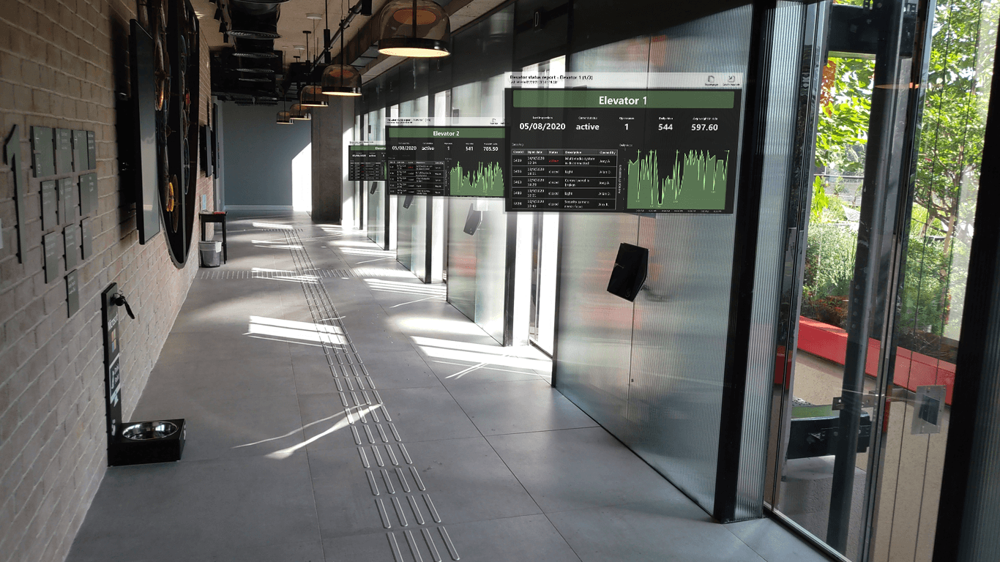

# Power BI para HoloLens 2 (versión preliminar)
La aplicación Power BI para HoloLens 2 combina los informes y paneles de Power BI con su entorno físico para crear una experiencia 3D, envolvente y manos libres en la que puede desplazarse por el mundo físico y obtener los datos pertinentes cuando y donde los necesite.

## Obtención de la aplicación Power BI para HoloLens 2 

La aplicación Power BI para HoloLens 2 está disponible en [Microsoft Store](https://go.microsoft.com/fwlink/?linkid=526478).

La aplicación funciona con el inicio de sesión único, lo que significa que la aplicación usa la identidad del usuario que ha iniciado sesión actualmente en el dispositivo HoloLens 2 para autenticarse en el servicio Power BI.

[Obtenga más información](/hololens/holographic-store-apps) sobre la instalación de aplicaciones en el dispositivo HoloLens 2.

## Apertura de la aplicación Power BI en su HoloLens 2

Abra el menú **Inicio** y seleccione la aplicación Power BI. La aplicación se abrirá con todos los informes y paneles favoritos cargados en el conjunto de herramientas virtual, donde puede seleccionarlos para verlos.

## Uso de la aplicación Power BI para HoloLens 2

Use los gestos manuales y el seguimiento de los ojos de HoloLens 2 para cambiar el tamaño del contenido de Power BI, así como colocarlo e interactuar con él. [Más información](/hololens/hololens2-basic-usage) sobre cómo interactuar con objetos en el mundo de HoloLens 2.

### Acceso a informes y paneles

Para tener acceso a un informe o un panel, sáquelo del conjunto de herramientas virtual y colóquelo donde quiera. [Más información](/hololens/hololens2-basic-usage#moving-holograms) sobre cómo tomar y colocar ventanas de aplicaciones.

Para estar en el conjunto de herramientas virtual, un informe o un panel debe estar marcado como favorito. Si no tiene ningún informe o panel en el conjunto de herramientas, o si desea agregar informes y paneles adicionales, simplemente marque esos elementos como favoritos en el [servicio Power BI](../end-user-favorite.md) o las [aplicaciones móviles de Power BI](mobile-apps-favorites.md). A continuación, estarán disponibles en el conjunto de herramientas virtual de Power BI en HoloLens 2.

### Cambio del tamaño de informes y paneles

Para cambiar el tamaño de un informe o un panel, tómelo por los controladores de tamaño que aparecen en las esquinas de la ventana de la aplicación y ajuste el tamaño según sea necesario. [Más información](/hololens/hololens2-basic-usage#resizing-holograms) sobre cómo cambiar el tamaño de las ventanas de la aplicación.

### Colocación de informes y paneles en el espacio

Para colocar el informe o el panel en el espacio, tómelo acercando los dedos índice y pulgar por su barra de títulos y luego, sin soltarlo, mueva la mano a la posición deseada. Suelte los dedos cuando haya llegado al lugar deseado. [Más información](/hololens/hololens2-basic-usage#moving-holograms) sobre cómo mover ventanas de aplicaciones.

Una vez que haya colocado el informe o el panel donde quiera, el dispositivo HoloLens 2 recuerda su ubicación en el entorno. La próxima vez que visite el mismo lugar, encontrará el elemento que colocó exactamente en la misma ubicación.

### Examen de páginas de informes

Cada informe tiene un índice de página que puede mostrar para ir de una página a otra. Seleccione el botón **Índice de la página** en la esquina superior derecha de la ventana de informe para mostrar u ocultar el índice de la página.

### Apertura de informes con códigos QR

Si se ha creado un código QR para un informe y se ha adjuntado a un elemento, como un fragmento de equipo cuyos datos se encuentran en el informe, puede abrir el informe simplemente examinando el código QR del elemento.

[Más información](../../create-reports/service-create-qr-code-for-report.md) sobre la creación de códigos QR para informes.

### Actualización de datos

Los informes y los paneles se actualizan mientras usa la aplicación, por lo que si los datos cambian en Power BI en este tiempo, verá los cambios reflejados en los informes y paneles que está viendo.

## Pasos siguientes

* [Familiarización con HoloLens 2](/hololens/hololens2-basic-usage)