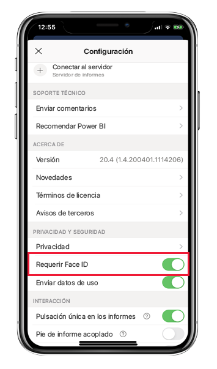
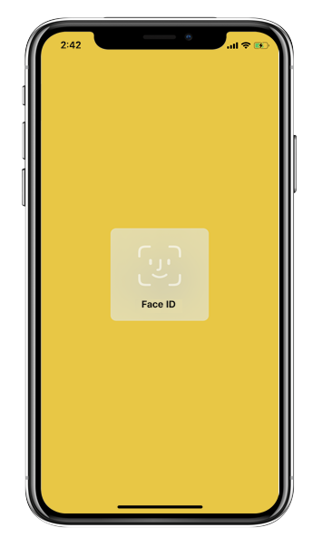
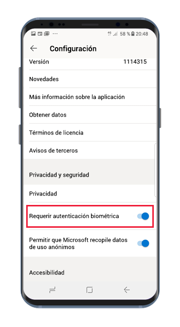
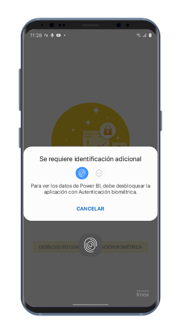

# Protección de la aplicación Power BI con Face ID, Touch ID, código de acceso o datos biométricos 

En muchos casos, los datos administrados en Power BI son confidenciales y deben protegerse para que solo los usuarios autorizados puedan tener acceso. 

Las aplicaciones Power BI para iOS y Android permiten proteger los datos mediante la configuración de la identificación adicional. Después, cada vez que se inicie la aplicación o se ponga en primer plano, se requerirá la identificación. En iOS, esto significa proporcionar Face ID, Touch ID o un código de acceso. En Android, significa proporcionar datos biométricos (Fingerprint ID).

Se aplica a:

|  |  |  |  |
|:--- |:--- |:--- |:--- |
|iPhones |iPad |Teléfonos Android |Tabletas Android |

## Activación de Face ID, Touch ID o un código de acceso en iOS

Para usar la identificación adicional en la aplicación móvil Power BI para iOS, vaya a la configuración de la aplicación en **Privacidad y seguridad**. Verá la opción para activar Face ID, Touch ID o un código de acceso. Las opciones que se ven dependen de las capacidades del dispositivo.

Una vez que esta opción está activada, cada vez que inicie la aplicación o la ponga en primer plano, se le pedirá que proporcione la id. antes de que pueda acceder a la aplicación.

El tipo de id. que se le pide que proporcione dependerá de las capacidades del dispositivo. Si el dispositivo admite Face ID, deberá usarlo. Si el dispositivo admite Touch ID, deberá usarlo. Si no admite ninguno de los dos, deberá proporcionar un código de acceso. En la imagen siguiente se muestra la pantalla de autenticación de Face ID.

## Activación de los datos biométricos (Fingerprint ID) en Android

Para usar la identificación adicional en la aplicación móvil Power BI para Android, vaya a la configuración de la aplicación en **Privacidad y seguridad**. Verá la opción para activar los datos biométricos.

Una vez que esta opción está activada, cada vez que inicie la aplicación o la ponga en primer plano, se le pedirá que proporcione los datos biométricos (Fingerprint ID) antes de que pueda acceder a la aplicación.

En la imagen siguiente se muestra la pantalla de autenticación de huella digital.

>[!NOTE]
>Para poder usar la configuración de Autenticación biométrica necesaria de la aplicación móvil, en primer lugar se debe configurar la biometría en el dispositivo Android. Si el dispositivo no es compatible con la biometría, no podrá proteger el acceso a los datos de Power BI con esta configuración de la aplicación móvil.
>
>Si el administrador tiene [activado el acceso seguro de forma remota](#mdm-enforcement-of-secure-access-to-your-power-bi-mobile-app) para la aplicación móvil, se debe configurar la biometría en el dispositivo para poder acceder a la aplicación, si aún no se ha hecho. Si el dispositivo no es compatible con la biometría, la configuración remota no le afectará. El acceso a la aplicación móvil permanecerá sin protección.

## Aplicación de MDM de acceso seguro a la aplicación móvil de Power BI.

Algunas organizaciones tienen directivas de seguridad y cumplimiento normativo que requieren la identificación adicional antes de tener acceso a los datos confidenciales del negocio.

Para hacerlo posible, la aplicación móvil de Power BI permite a los administradores controlar la configuración de acceso seguro de la aplicación móvil mediante la inserción de los valores de configuración de la aplicación de Microsoft Intune y otras soluciones de administración de dispositivos móviles (MDM). Los administradores pueden usar la directiva de protección de aplicaciones para activar esta configuración para todos los usuarios o para un grupo de usuarios. Para obtener más detalles, vea [Uso de MDM para configurar la aplicación móvil de Power BI de forma remota](mobile-app-configuration.md#data-protection-settings-ios-and-android).

## Pasos siguientes
* [Uso de MDM para configurar la aplicación de Power BI de forma remota](mobile-app-configuration.md)
