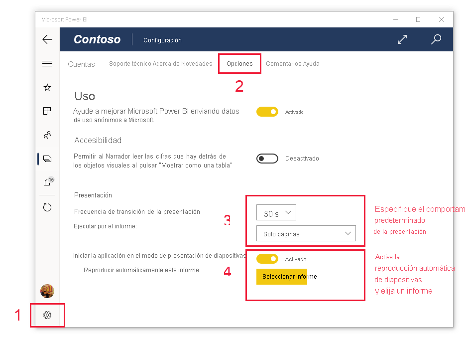

# Visualización de informes y paneles en modo de presentación en Surface Hub y dispositivos Windows 10
Use el modo de presentación para mostrar los informes y paneles en pantalla completa en dispositivos Windows 10 y Surface Hub. El modo de presentación es útil para mostrar Power BI en reuniones o conferencias, para visualizarlo en un proyector dedicado en la oficina o incluso para aprovechar al máximo el espacio de una pantalla pequeña.

En modo de presentación:
* Todo el "cromo" desaparece (por ejemplo, las barras de navegación y de menús), lo que facilita centrarse en los datos del informe.
* Aparece disponible una barra de herramientas de acciones para permitirle interactuar con los datos y controlar la presentación.
* Puede reproducir una presentación de diapositivas que recorra automáticamente páginas, marcadores o ambos elementos a la vez.

>[!NOTE]
>El soporte técnico de la aplicación móvil de Power BI con **teléfonos con Windows 10 Mobile** finalizará el 16 de marzo de 2021. [Más información](https://go.microsoft.com/fwlink/?linkid=2121400)

## Usar el modo de presentación
En la aplicación de Power BI para móviles, pulse el icono **Pantalla completa** para pasar a ese modo.
 El cromo de la aplicación desaparece y aparece la barra de herramientas de acciones en la parte inferior o a ambos lados de la pantalla (según el tamaño de la pantalla).

En la barra de herramientas puede pulsar para realizar las acciones siguientes:

|||
|-|-|
||**Volver** a la página anterior. Si pulsa de forma prolongada el icono, aparecen las ventanas de ruta de navegación, lo que le permitirá ir a la carpeta que contiene su informe o panel.|
||**Cambiar de una página** a otra del informe en la presentación.|
||**Aplicar un marcador** para presentar la vista determinada de los datos que captura el marcador. Puede aplicar marcadores personales y de informe.|
||**Elegir un color de lápiz** cuando use el lápiz de Surface para dibujar y realizar anotaciones en la página del informe.|
||**Borrar las marcas de lápiz** que haya realizado con el lápiz de Surface al dibujar y realizar anotaciones en la página del informe.          |
||**Restablecer la vista predeterminada** y borrar los filtros, las segmentaciones de datos o cualquier otro cambio que haya realizado en la vista de datos durante la presentación.|
||**Compartir** una imagen de la vista de presentación con sus compañeros. La imagen incluirá las anotaciones que haya realizado con el lápiz de Surface durante la presentación.|
||**Actualizar** el informe.|
||**Reproducir la presentación de diapositivas**, lo que oculta la barra de acciones e inicia la presentación de diapositivas. Un selector le permitirá elegir rotar automáticamente por las páginas, los marcadores o tanto las páginas como los marcadores. De forma predeterminada, la presentación de diapositivas rota automáticamente entre las páginas una vez cada 30 segundos. Puede cambiar esta configuración en [**Configuración > Opciones**](#slideshow-settings). Consulte [información más detallada](#slideshows) sobre las presentaciones|
||**Salir** del modo de presentación.|
||**Buscar** otros artefactos en Power BI.|

Puede desacoplar la barra de herramientas y arrastrarla para colocarla en cualquier lugar de la pantalla. Esto es útil en el caso de pantallas grandes en las que quiera centrarse en un área específica del informe y desee tener cerca las herramientas. Basta con colocar el dedo sobre la barra de herramientas y deslizarlo hacia el lienzo del informe.

## Presentaciones

Puede reproducir una presentación para recorrer automáticamente la presentación. Puede establecer que la presentación recorra las páginas, los marcadores o ambos elementos.

Cuando selecciona el botón **Reproducir** en la barra de herramientas de acciones, la presentación se inicia. Aparece un controlador que le permite pausar la presentación de diapositivas o cambiar lo que se está reproduciendo: páginas, marcadores, o bien páginas y marcadores.

 El controlador muestra el nombre de la vista que se muestra actualmente (página o marcador y página). En la imagen anterior, vemos que en el informe denominado **Sales** (Ventas), actualmente se muestra el marcador **Asia Pacific** (Asia Pacífico) en la página **Sales Performance** (Rendimiento de ventas).

### Configuración de la presentación

De forma predeterminada, una presentación de diapositivas recorre las páginas, a una velocidad de una cada 30 segundos. Puede cambiar estos valores predeterminados en **Configuración > Opciones**, como se muestra a continuación.

## Pasos siguientes
* [Mostrar paneles e informes en el modo de pantalla completa desde el servicio Power BI](../end-user-focus.md)
* ¿Tiene alguna pregunta? [Pruebe a preguntar a la comunidad de Power BI](https://community.powerbi.com/)
