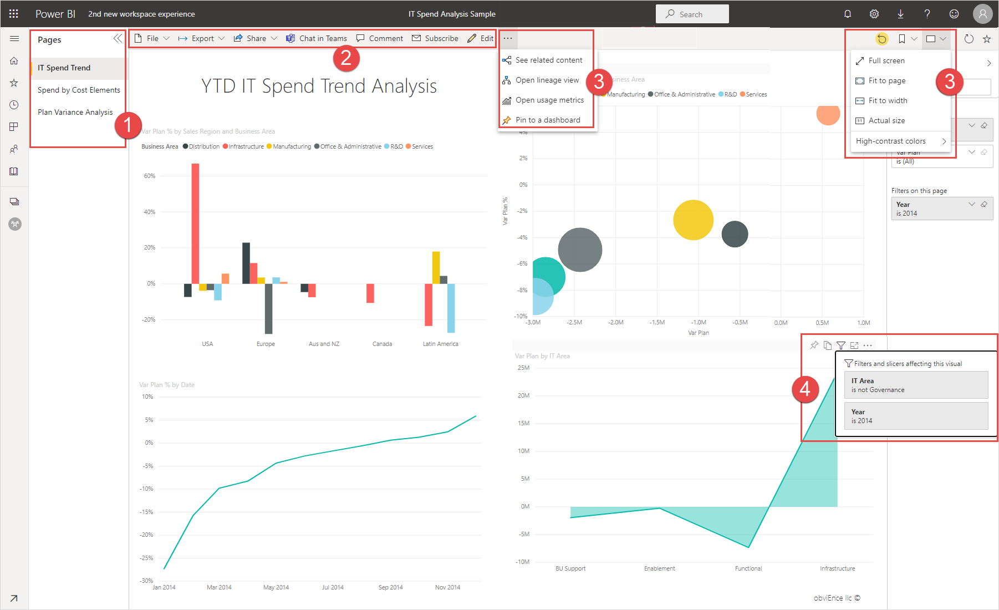
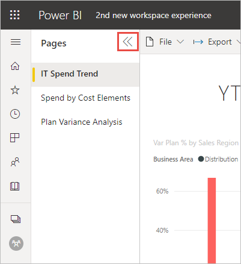
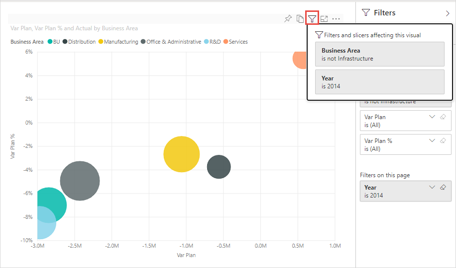
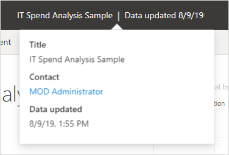

# Nuevo aspecto del servicio Power BI

El servicio Power BI (app.powerbi.com) tiene un nuevo aspecto que facilita la visualización de los informes y la interacción con ellos. El nuevo aspecto es más sencillo y se basa en su familiaridad con otros productos de Microsoft. En el servicio Power BI, hemos convertido el contenido del informe en el principal punto de atención al cambiar a un tema de color más claro y actualizar los iconos. 

¿Busca información sobre el nuevo aspecto de **Power BI Desktop**? Consulte [Uso de la cinta actualizada en Power BI Desktop](../create-reports/desktop-ribbon.md).

Este es un resumen de lo que ha cambiado en el nuevo aspecto. Consulte las secciones numeradas para obtener más información:

¿Busca una acción específica? Vea [El nuevo aspecto: ¿Dónde están ahora las acciones?](service-new-look-where-actions.md)

## 1. Lista vertical de páginas 
En la vista de lectura, los nombres de páginas del informe se encuentran en una lista en un panel vertical. Son destacados, difíciles de pasar por alto y similares a la navegación en Word y PowerPoint. Puede aumentar o disminuir el resto del área de informe: cambie el tamaño del panel vertical o seleccione las flechas dobles para cerrarlo por completo.

Si tiene permiso de edición para un informe, puede establecerlo de modo que los nombres de páginas estén en la parte inferior, tal como están en la vista de edición del informe. Vea [Establecimiento del panel Páginas](../create-reports/power-bi-report-settings.md#set-the-pages-pane) del artículo "Cambio de la configuración de los informes de Power BI" para obtener información detallada.

## 2. Barra de acciones simplificada 

La barra de acciones mejorada de la parte superior incluye los comandos más relevantes, estratégicos para los consumidores de informes. Es más fácil exportar, compartir, chatear en Teams y suscribirse. 

## 3. ¿Dónde están los comandos de informe?

No se ha quitado ninguna de las funciones del aspecto anterior. Seleccione **Más opciones (...)** para ver otros comandos más avanzados. Vea [El nuevo aspecto: ¿Dónde están ahora las acciones?](service-new-look-where-actions.md) para obtener más información.

## 4. Nueva experiencia de filtro

De forma predeterminada, verá el nuevo panel Filtros para el informe con el nuevo aspecto. Y al mantener el puntero sobre el icono de filtro de un objeto visual, verá todos los filtros y segmentaciones que le afectan.

## Visualización de detalles del informe 

Vea rápidamente detalles tales como la fecha de última actualización y la información de contacto, directamente en el banner superior.  Abra el menú para ver otros detalles sobre el informe. Incluso puede enviar un correo electrónico al propietario del informe.

## Sin cambios en el modo de edición del informe 

Hemos mantenido la experiencia de creación similar a la experiencia de Desktop. Los cambios del nuevo aspecto solo se aplican a la vista de lectura.

## Experiencia "nuevo aspecto" del panel 

Los paneles también tienen una barra de acciones simplificada. Es igual que los informes y las aplicaciones, para obtener una experiencia coherente, pero conserva las diferencias funcionales. Este es un tutorial de las acciones en un panel.
 

## Pasos siguientes

- [Uso de la cinta actualizada en Power BI Desktop](../create-reports/desktop-ribbon.md)
- [Power BI para consumidores](end-user-consumer.md)
