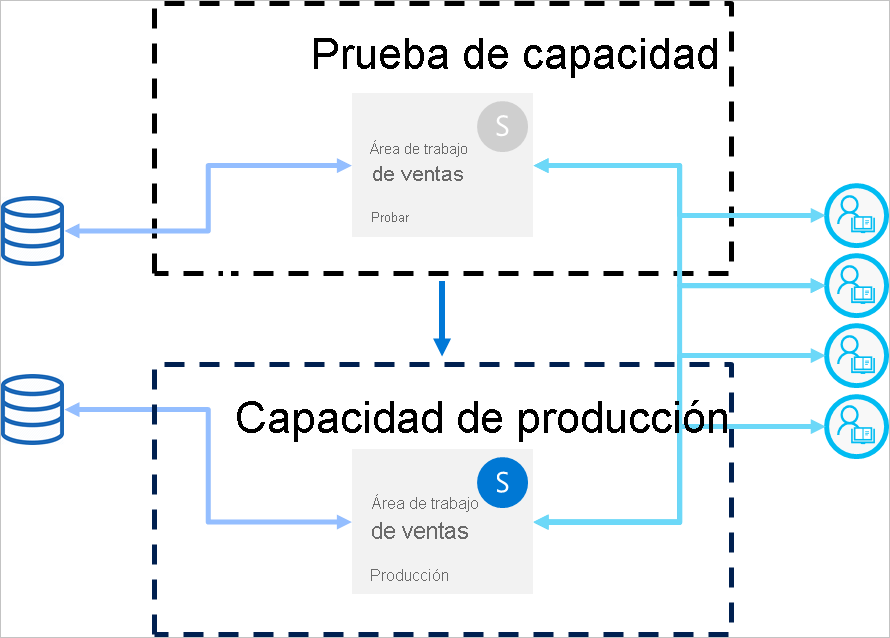

# Procedimientos recomendados para las canalizaciones de implementación (versión preliminar)

En este artículo se proporcionan instrucciones para los creadores de BI que están administrando su contenido a lo largo del ciclo de vida. Se centra en aprovechar las canalizaciones de implementación como una herramienta de administración del ciclo de vida de contenido de BI.

El artículo se divide en cuatro secciones:

* **Preparación del contenido**: prepare el contenido de la administración del ciclo de vida.

* **Desarrollo**: obtenga información sobre las mejores formas de crear contenido en la fase de desarrollo de canalizaciones de implementación.

* **Prueba**: aprenda a usar la fase de prueba de canalizaciones de implementación para probar el entorno.

* **Producción**: use la fase de producción de las canalizaciones de implementación cuando el contenido esté disponible para su consumo.

## Preparación del contenido

Prepare el contenido para la administración continua a lo largo de su ciclo de vida. Asegúrese de revisar la información de esta sección antes de realizar cualquiera de las siguientes acciones:

* Publicar el contenido en producción

* Empezar a usar una canalización de implementación para un área de trabajo específica

* Publicar el trabajo

### Tratamiento de cada área de trabajo como un paquete completo de análisis

Idealmente, un área de trabajo debe contener una vista completa de un aspecto (como departamento, unidad de negocio, proyecto o vertical) en la organización. Esto facilita la administración de permisos para distintos usuarios y permite controlar las versiones de contenido de todo el área de trabajo según una programación planeada.  

Si usa [conjuntos de datos centralizados](../connect-data/service-datasets-across-workspaces.md) que se usan en la organización, se recomienda crear dos tipos de áreas de trabajo:

* **Áreas de trabajo de datos y modelado**: estas áreas de trabajo contendrán todos los conjuntos de datos centralizados.

* **Áreas de trabajo de informes**: estas áreas de trabajo contendrán todos los informes y paneles dependientes.

### Planeamiento del modelo de permiso

Una canalización de implementación es un objeto de Power BI, con sus propios [permisos](deployment-pipelines-process.md#permissions). Además, la canalización contiene áreas de trabajo que tienen sus propios permisos.

Para implementar un flujo de trabajo seguro y sencillo, planee quién va a acceder a cada parte de la canalización. Algunas consideraciones a tener en cuenta son las siguientes:

* ¿Quién debe tener acceso a la canalización?

* ¿Qué operaciones deben realizar los usuarios con acceso de canalización en cada fase?

* ¿Quién está revisando el contenido en la fase de prueba?

* ¿Tienen acceso los revisores de la fase de pruebas a la canalización?

* ¿Quién supervisará la implementación en la fase de producción?

* ¿Qué área de trabajo está asignando?

* ¿En qué fase está asignando el área de trabajo?

* ¿Necesita realizar cambios en los permisos del área de trabajo que está asignando?

### Conexión de distintas fases a diferentes bases de datos

Una base de datos de producción siempre debe ser estable y estar disponible. Es mejor no sobrecargarlo con las consultas generadas por los creadores de BI para sus conjuntos de datos de desarrollo o prueba. Cree bases de datos independientes para desarrollo y pruebas. Esto ayuda a proteger los datos de producción y no a sobrecargar la base de datos de desarrollo con todo el volumen de datos de producción, lo que puede ralentizar las cosas.

>[!NOTE]
>Si la organización usa [conjunto de datos centralizados compartidos](../connect-data/service-datasets-share.md), puede omitir esta recomendación.

### Uso de parámetros en el modelo

Como no se pueden editar los orígenes de datos de los conjuntos de datos en servicio Power BI, se recomienda usar los [parámetros](https://docs.microsoft.com/power-query/power-query-query-parameters) para almacenar los detalles de conexión, como los nombres de instancia y los nombres de base de datos, en lugar de usar una cadena de conexión estática. Esto le permite administrar las conexiones a través del portal web del servicio Power BI o [mediante las API](https://docs.microsoft.com/rest/api/power-bi/datasets/updateparametersingroup), en una etapa posterior.

En las canalizaciones de implementación, puede configurar reglas de parámetros para establecer valores específicos para las fases de desarrollo, prueba y producción.

Si no usa parámetros para la cadena de conexión, puede definir reglas de origen de datos para especificar una cadena de conexión para un conjunto de datos determinado. Sin embargo, en las canalizaciones de implementación, esto no se admite para todos los orígenes de datos. Para comprobar que puede configurar las reglas para el origen de datos, consulte las [limitaciones de las reglas de conjunto de datos](deployment-pipelines-get-started.md#dataset-rule-limitations).

Los parámetros tienen usos adicionales, como la realización de cambios en las consultas, los filtros y el texto que se muestra en el informe.

## Desarrollo

En esta sección se proporcionan instrucciones para trabajar con la fase de desarrollo de canalizaciones de implementación.

### Uso de Power BI Desktop para editar los informes y conjuntos de datos

Considere la posibilidad de Power BI Desktop como su entorno de desarrollo local. Power BI Desktop permite probar, explorar y revisar las actualizaciones de los informes y conjuntos de datos. Una vez realizado el trabajo, puede cargar la nueva versión en la fase de desarrollo. Debido a las siguientes razones, se recomienda editar los archivos .pbix en el escritorio (y no en servicio Power BI):

* Es más fácil colaborar con otros creadores en el mismo archivo .pbix, si todos los cambios se realizan en la misma herramienta.

 * Al realizar cambios en línea, descargar el archivo .pbix y, a continuación, volver a cargarlo, se crea la duplicación de los informes y los conjuntos de datos.

* Puede usar el control de versiones para mantener actualizados los archivos .pbix.

### Control de versiones de los archivos .pbix

Si desea administrar el historial de versiones de los informes y conjuntos de datos, use la [sincronización de Power BI con OneDrive](../connect-data/service-connect-to-files-in-app-workspace-onedrive-for-business.md). Esto mantendrá los archivos actualizados con la versión más reciente. También le permitirá recuperar versiones anteriores si es necesario.

>[!NOTE]
>Use la sincronización automática con OneDrive (o cualquier otro repositorio) solo con los archivos .pbix en la fase de desarrollo de canalizaciones de implementación. No sincronice los archivos .pbix en las fases de prueba y producción de las canalizaciones de implementación. Esto causará problemas con la implementación de contenido en toda la canalización.

### Separación del desarrollo de modelos del desarrollo de informes y paneles

En el caso de las implementaciones a escala empresarial, se recomienda separar el desarrollo de conjuntos de datos y el desarrollo de informes y paneles. Para promover los cambios a un solo informe o un conjunto de datos, use la opción de implementación selectiva de canalizaciones de implementación.  

Este enfoque debe comenzar desde Power BI Desktop, mediante la creación de un archivo .pbix independiente para los conjuntos de datos e informes. Por ejemplo, puede crear un archivo .pbix del conjunto de datos y cargarlo en la fase de desarrollo. Más adelante, los autores de informes pueden crear un nuevo archivo .pbix solo para el informe y [conectarlo al conjunto de datos publicado](../connect-data/service-datasets-discover-across-workspaces.md) mediante una conexión dinámica. Esta técnica permite que distintos creadores trabajen por separado en el modelado y las visualizaciones, y los implementen en producción de forma independiente.

Con los [conjuntos de datos compartidos](../connect-data/service-datasets-share.md), también puede usar este método en áreas de trabajo.

### Administración de los modelos mediante funcionalidades de lectura y escritura de XMLA

La separación del desarrollo de modelos del desarrollo de informes y paneles le permite usar funcionalidades avanzadas, como el control de código fuente, la combinación de cambios de diferencias y procesos automatizados. Estos cambios deben realizarse en la fase de desarrollo, de modo que el contenido finalizado pueda implementarse en las fases de prueba y producción. Esto permite que los cambios pasen por un proceso unificado con otros elementos dependientes antes de que se implementen en la fase de producción.

Puede separar el desarrollo de modelos de las visualizaciones, mediante la administración de un [conjunto de datos compartido](../connect-data/service-datasets-share.md) en un área de trabajo externa, mediante las funcionalidades de lectura y escritura de XMLA. El conjunto de datos compartidos puede conectarse a varios informes en varias áreas de trabajo que se administran en varias canalizaciones.

## Probar

En esta sección se proporcionan instrucciones para trabajar con la fase de prueba de canalizaciones de implementación.

### Simulación del entorno de producción

Además de comprobar que los nuevos informes o paneles se ven bien, también es importante ver cómo funcionan desde la perspectiva del usuario final. La fase de prueba de canalizaciones de implementación le permite simular un entorno de producción real con fines de prueba.

Asegúrese de que estos tres factores se aborden en el entorno de prueba:

* Volumen de datos

* Volumen de uso

* Una capacidad similar a la de producción

Al realizar pruebas, puede usar la misma capacidad que la fase de producción. Sin embargo, esto puede hacer que la producción sea inestable durante las pruebas de carga. Para evitar la producción inestable, use otra capacidad similar en recursos a la capacidad de producción para realizar pruebas. Para evitar costos adicionales, puede usar [las funcionalidades de Azure](../developer/embedded/azure-pbie-create-capacity.md) para pagar solo por el tiempo de prueba.

### Uso de reglas de conjunto de datos con un origen de datos real

Si usa la fase de prueba para simular el uso de datos de la vida real, se recomienda separar los orígenes de datos de desarrollo y pruebas. La base de datos de desarrollo debe ser relativamente pequeña y la base de datos de prueba debe ser lo más parecida posible a la base de datos de producción. Use las [reglas del origen de datos](deployment-pipelines-get-started.md#step-4---create-dataset-rules) para cambiar los orígenes de datos en la fase de prueba.

Controlar la cantidad de datos que se importan desde el origen de datos es útil si está utilizando un origen de datos de producción en la fase de prueba. Para ello, agregue un parámetro a la consulta del origen de datos en Power BI Desktop. Use las reglas de parámetros para controlar la cantidad de datos importados o edite el valor del parámetro.
También puede usar este enfoque si no desea sobrecargar la capacidad.

### Medir el rendimiento

Al simular una fase de producción, [compruebe la carga del informe y las interacciones](../guidance/monitor-report-performance.md), y averigüe si los cambios que ha realizado les afectan.

También debe [supervisar la carga en la capacidad](../admin/service-admin-premium-monitor-capacity.md), para que pueda detectar cargas extremas antes de que lleguen a producción.  

>[!NOTE]
>Se recomienda supervisar de nuevo las cargas de capacidad después de implementar las actualizaciones en la fase de producción.

### Comprobación de elementos relacionados

Las horas relacionadas pueden verse afectadas por los cambios en los conjuntos de datos o los informes. Durante las pruebas, compruebe que los cambios no afecten o interrumpan el rendimiento de los elementos existentes, que pueden depender de los actualizados.

Puede buscar fácilmente los elementos relacionados mediante la [vista de linaje](../collaborate-share/service-data-lineage.md) del área de trabajo.

### Prueba de la aplicación

Si va a distribuir contenido a los usuarios finales a través de una aplicación, revise la nueva versión de la aplicación antes de que se encuentre en producción. Como cada fase de canalización de implementación tiene su propia área de trabajo, puede publicar y actualizar fácilmente las aplicaciones para las fases de desarrollo y pruebas. Esto le permitirá probar la aplicación desde el punto de vista del usuario final.

>[!IMPORTANT]
>El proceso de implementación no incluye la actualización del contenido o la configuración de la aplicación. Para aplicar cambios al contenido o la configuración, debe actualizar manualmente la aplicación en la fase de canalización requerida.

## Producción

En esta sección se proporcionan instrucciones para la fase de producción de canalizaciones de implementación.

### Administración de quién puede realizar la implementación en producción

Como la implementación en producción debe controlarse con cuidado, se recomienda que solo personas específicas administren esta operación sensible. Sin embargo, es probable que quiera que todos los creadores de BI de un área de trabajo específica tengan acceso a la canalización. Esto puede administrarse mediante los [permisos de área de trabajo ](deployment-pipelines-process.md#permissions) de producción.  

Para implementar el contenido entre fases, los usuarios deben tener permisos de miembro o de administrador en ambas fases. Asegúrese de que solo las personas que desee implementar en producción tengan permisos de área de trabajo de producción. Otros usuarios pueden tener roles de colaborador o visor del área de trabajo de producción. Podrán ver el contenido dentro de la canalización, pero no se podrán implementar.

Además, debe limitar el acceso a la canalización habilitando solo los permisos de canalización a los usuarios que forman parte del proceso de creación de contenido.

### Establecimiento de reglas para garantizar la disponibilidad de la fase de producción

Las [reglas de conjunto de datos](deployment-pipelines-get-started.md#step-4---create-dataset-rules) son una manera eficaz de garantizar que los datos de producción estén siempre conectados y disponibles para los usuarios. Cuando se aplican las reglas de conjunto de datos, las implementaciones se pueden ejecutar mientras tenga la seguridad de que los usuarios finales verán la información pertinente sin perturbaciones.

Asegúrese de establecer las reglas de conjunto de datos de producción para los orígenes de datos y los parámetros definidos en el conjunto de datos.

### Actualización de la aplicación de producción

La implementación en una canalización actualiza el contenido del área de trabajo, pero no actualiza automáticamente la aplicación asociada. Si usa una aplicación para la distribución de contenido, no se olvide de actualizar la aplicación después de implementarla en producción, para que los usuarios finales puedan usar inmediatamente la versión más reciente.  

### Correcciones rápidas del contenido

En caso de que haya errores en la producción que requieran una solución rápida, no se sienta tentado a cargar una nueva versión de .pbix directamente a la etapa de producción, o a hacer un cambio en línea en el servicio de Power BI. No es posible volver a fases anteriores de desarrollo y pruebas cuando ya hay contenido en esas fases. Además, la implementación de una corrección sin probarla primero es una práctica incorrecta. Por lo tanto, la manera correcta de tratar este problema es implementar la corrección en la fase de desarrollo e insertarla en el resto de las fases de canalización de implementación. Esto permite comprobar que la corrección funciona, antes de implementarla en producción. La implementación a través de la canalización y solo tarda unos minutos.

## Pasos siguientes

>[!div class="nextstepaction"]
>[Introducción a las canalizaciones de implementación](deployment-pipelines-overview.md)

>[!div class="nextstepaction"]
>[Primeros pasos con las canalizaciones de implementación](deployment-pipelines-get-started.md)

>[!div class="nextstepaction"]
>[Descripción del proceso de las canalizaciones de implementación](deployment-pipelines-process.md)

>[!div class="nextstepaction"]
>[Solución de problemas de las canalizaciones de implementación](deployment-pipelines-troubleshooting.md)
