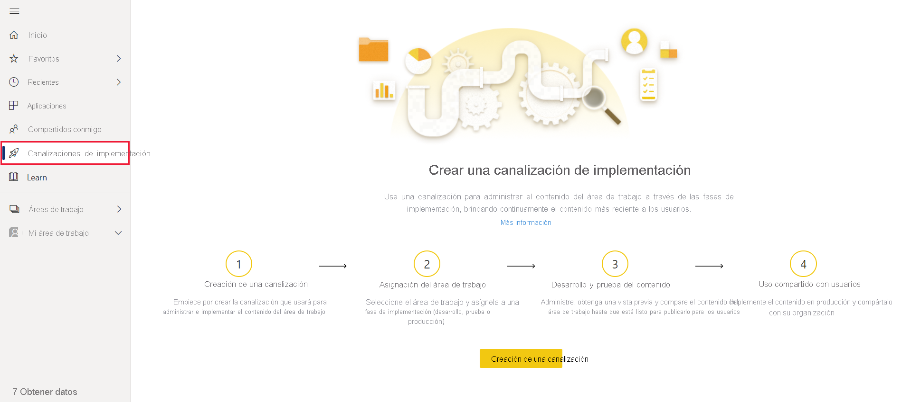
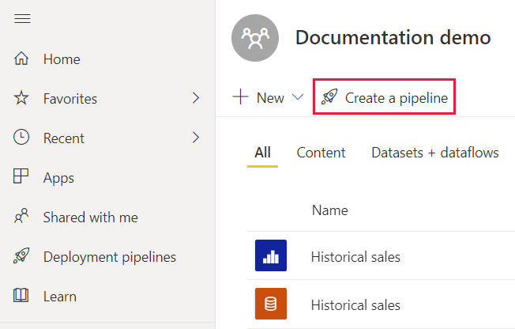
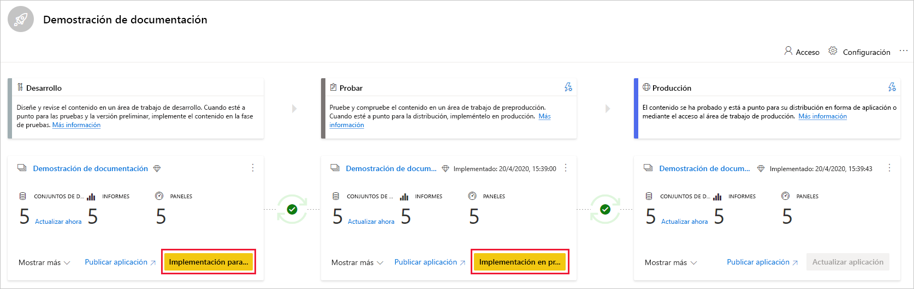
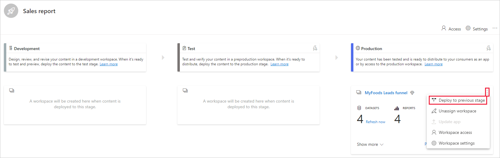
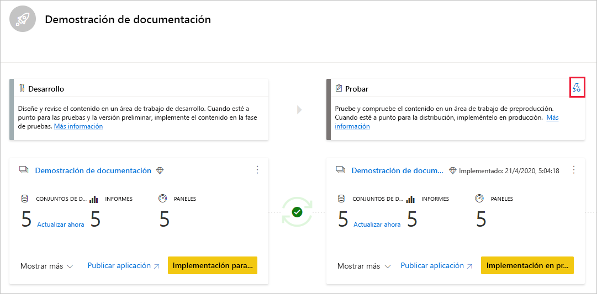
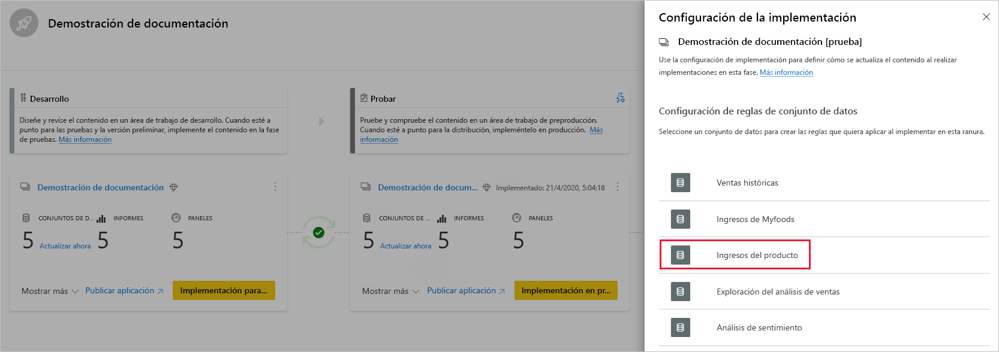
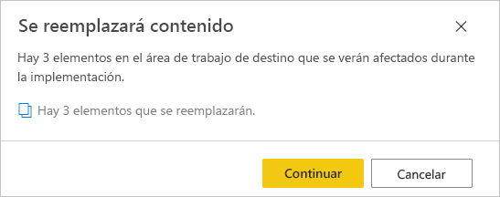

# Introducción a las canalizaciones de implementación

Este artículo le guía a través de la configuración básica necesaria para usar las canalizaciones de implementación.

## Acceso a las canalizaciones de implementación

Podrá acceder a la característica de canalizaciones de implementación si se cumplen las condiciones siguientes:

* Tiene una de las siguientes licencias Premium:

    * Es un usuario de Power BI [Pro](../admin/service-admin-purchasing-power-bi-pro.md) y pertenece a una organización que tiene capacidad Premium.

    * [Premium por usuario (PPU)](../admin/service-premium-per-user-faq.md).

* Es un administrador de una [nueva experiencia de áreas de trabajo](../collaborate-share/service-create-the-new-workspaces.md).

>[!NOTE]
> También podrá ver el botón de canalizaciones de implementación, si anteriormente creó una canalización o si se compartió una canalización con usted.

## Paso1 : Crear una canalización de implementación

Puede crear una canalización desde la pestaña de canalizaciones de implementación o desde un área de trabajo.

Una vez creada la canalización, puede compartirla con otros usuarios o eliminarla. Cuando comparte una canalización con otras personas, los usuarios con los que la comparte tendrán [acceso a ella](deployment-pipelines-process.md#user-with-pipeline-access). El acceso a la canalización permite a los usuarios verla, compartirla, editarla y eliminarla.

### Creación de una canalización desde la pestaña de canalizaciones de implementación

Para crear una canalización desde la pestaña de canalizaciones de implementación, haga lo siguiente:

1. En el servicio Power BI, en el panel de navegación, seleccione **Canalizaciones de implementación** y luego seleccione **Crear canalización**.

2. En el cuadro de diálogo *Crear una canalización de implementación*, escriba un nombre y una descripción para la canalización y seleccione **Crear**.

### Creación de una canalización desde un área de trabajo

Puede crear una canalización desde un área de trabajo existente, siempre que sea el administrador de una [nueva experiencia de área de trabajo](../collaborate-share/service-create-the-new-workspaces.md).

1. En el área de trabajo, seleccione **Crear una canalización**.

    > [!div class="mx-imgBorder"]
    > 

2. En el cuadro de diálogo *Crear una canalización de implementación*, escriba un nombre y una descripción para la canalización y seleccione **Crear**.

>[!NOTE]
>Si el área de trabajo no está asignada a la capacidad Premium de su organización o a su capacidad PPU, recibirá una notificación para [asignarla a una capacidad](../admin/service-admin-premium-manage.md#assign-a-workspace-to-a-capacity).  

## Paso 2: Asignar un área de trabajo a una canalización de implementación

Después de crear una canalización, debe agregar el contenido que desea administrar a la canalización. La incorporación de contenido a la canalización se realiza mediante la asignación de un área de trabajo a la fase de canalización. Puede asignar un área de trabajo a cualquier fase. 

Puede asignar un área de trabajo a una canalización de implementación. Las canalizaciones de implementación crearán clones del contenido del área de trabajo, que se usarán en distintas fases de la canalización.

Siga estos pasos para asignar un área de trabajo en una canalización de implementación:

1. En la canalización de implementación que acaba de crear, seleccione **Asignar un área de trabajo**.

2. En el menú desplegable *Elegir el área de trabajo*, seleccione el área de trabajo que desea asignar a la canalización.

    >[!NOTE]
    >Si va a crear una canalización desde un área de trabajo, puede omitir esta fase porque el área de trabajo ya está seleccionada.

3. Seleccione la fase a la que desea asignar el área de trabajo.

### Limitaciones de asignación de áreas de trabajo

* El área de trabajo debe ser una [nueva experiencia de áreas de trabajo](../collaborate-share/service-create-the-new-workspaces.md).

* Debe ser administrador del área de trabajo.

* El área de trabajo no está asignada a ninguna otra canalización.

* El área de trabajo debe residir en una  [capacidad Premium](../admin/service-premium-what-is.md).

* No se puede asignar un área de trabajo con [ejemplos de Power BI](../create-reports/sample-datasets.md) a una fase de canalización.

>[!NOTE]
>Solo las áreas de trabajo que se pueden usar con canalizaciones de implementación se mostrarán en la lista de áreas de trabajo que puede seleccionar.

## Paso 3: Implementar en una fase vacía

Cualquier de [usuario de Pro](../admin/service-admin-purchasing-power-bi-pro.md) que sea miembro o administrador del área de trabajo de origen, puede implementar contenido en una fase vacía (una fase en la que no hay contenido). El área de trabajo debe residir en una capacidad para que se complete la implementación.

Al implementar contenido en una fase vacía, se conservan las relaciones entre los elementos. Por ejemplo, un informe enlazado a un conjunto de datos en la fase de origen se clonará junto con su conjunto de datos y los clones se enlazarán de forma similar en el área de trabajo de destino.

Una vez finalizada la implementación, actualice el conjunto de datos. Para más información, vea [Implementación de contenido en una fase vacía](deployment-pipelines-process.md#deploying-content-to-an-empty-stage).

### Implementación de todo el contenido

Seleccione la fase desde la que desea realizar la implementación y seleccione el botón de implementación. El proceso de implementación crea un área de trabajo duplicada en la fase de destino. Esta área de trabajo incluye todo el contenido existente en la fase actual.

### Implementación selectiva

Para implementar solo elementos específicos, seleccione el vínculo **Mostrar más** y luego los elementos que desea implementar. Al hacer clic en el botón de implementación, solo se implementan los elementos seleccionados en la siguiente fase.

Dado que los paneles, informes y conjuntos de datos están relacionados y tienen dependencias, puede usar el botón de selección de relacionados para comprobar todos los elementos de los que dependen esos elementos. Por ejemplo, si desea implementar un informe en la siguiente fase, al hacer clic en el botón de selección de relacionados, se marcará el conjunto de datos al que está conectado el informe, de modo que ambos se implementarán a la vez y el informe no se interrumpirá.

>[!NOTE]
> * No se puede implementar un informe o un panel en la siguiente fase si los elementos de los que depende no existen en la fase en la que se está realizando la implementación.
> * Podría obtener resultados inesperados si decide implementar un informe o un panel sin su conjunto de sus. Esto puede ocurrir cuando el conjunto de datos en la fase de destino ha cambiado y ya no es idéntico al que se encuentra en la fase desde la que está realizando la implementación.

### Implementación hacia atrás

Puede optar por implementar en una fase anterior, por ejemplo, en un escenario en el que asigna un área de trabajo existente a una fase de producción y luego la implementa hacia atrás, primero en la fase de prueba y después en la de desarrollo.

La implementación en una fase anterior solo funciona si dicha fase está vacía. Cuando se implementa en una fase anterior, no se pueden seleccionar elementos específicos. Se implementará todo el contenido de la fase.

## Paso 4: Crear reglas de conjunto de datos

Cuando se trabaja en una canalización de implementación, las distintas fases pueden tener distintas configuraciones. Por ejemplo, cada fase puede tener bases de datos diferentes o parámetros de consulta distintos. La fase de desarrollo puede consultar datos de ejemplo de la base de datos, mientras que las fases de prueba y producción consultan toda la base de datos.

Cuando se implementa contenido entre fases de canalización, la configuración de las reglas de conjunto de datos permite cambios en el contenido, manteniendo al mismo tiempo algunas configuraciones intactas.

Las reglas de conjunto de datos se definen en orígenes de datos y parámetros, en cada conjunto de datos. Determinan los valores de los orígenes de datos o de los parámetros de un conjunto de datos concreto. Por ejemplo, si desea que un conjunto de datos de una fase de producción señale a una base de datos de producción, puede definir una regla para ello. La regla se define en la fase de producción, en el conjunto de datos adecuado. Una vez definida la regla, el contenido implementado desde la fase de pruebas hasta producción heredará el valor tal y como se define en las reglas del conjunto de datos, y siempre se aplicará mientras la regla no cambie y sea válida.

>[!NOTE]
> Las reglas de conjunto de datos solo funcionan cuando el origen de datos de origen y de destino son del mismo tipo.

### Creación de una regla de conjunto de datos

1. En la fase de canalización para la que desea crear una regla de conjunto de datos, seleccione **Configuración de la implementación**.

    

2. En el panel Configuración de la implementación, seleccione el conjunto de datos para el que desea crear una regla.

    

3. Seleccione el tipo de regla que desea crear, expanda la lista y luego seleccione **Agregar regla**.

     

### Tipos de reglas de conjunto de datos

Hay dos tipos de reglas que puede crear:

* **Reglas de origen de datos** La lista de orígenes de datos se toma del conjunto de datos de la fase de canalización de origen. En la lista de orígenes de datos, seleccione un origen de datos que desee reemplazar. Use uno de los métodos siguientes para seleccionar un valor para reemplazar el de la fase de origen:

    1. Seleccionar en una lista.

    2. Seleccione **Otro** y agregue manualmente el nuevo origen de datos. Solo puede cambiar a un origen de datos del mismo tipo.

* **Reglas de parámetros** Seleccione un parámetro de la lista de parámetros; se muestra el valor actual. Edite el valor y escriba el valor que desea aplicar después de cada implementación.

### Limitaciones de las reglas de conjunto de datos

* Debe ser el propietario del conjunto de datos para crear una regla de conjunto de datos.

* No se pueden crear reglas de conjunto de datos en la fase de desarrollo.

* Cuando se quita o elimina un elemento, también se eliminan sus reglas. Estas reglas no se pueden restaurar.

* Si el origen de datos o los parámetros definidos en una regla se cambian o se quitan del conjunto de datos de origen, la regla no será válida y se producirá un error en la implementación.

* Las reglas de parámetros no se pueden definir para los parámetros que son de tipo *Cualquiera* o *Binario*. Para obtener más información, vea las [restricciones de los parámetros de actualización en conjuntos de datos](/rest/api/power-bi/datasets/updateparameters).

* Las reglas de origen de datos solo se pueden definir para los siguientes orígenes de datos:
    * Azure Analysis Services
    * SQL Server Analysis Services (SSAS)
    * Azure SQL Server
    * Servidor SQL
    * Fuente de OData
    * Oracle
    * SapHana (solo compatible con el modo de importación; no con el modo de consulta directa)
    * SharePoint
    * Teradatos

    En el caso de otros orígenes de datos, se recomienda [usar parámetros para configurar el origen de datos](deployment-pipelines-best-practices.md#use-parameters-in-your-model).

## Paso 5: Implementar contenido de una fase a otra

Una vez que tenga contenido en una fase de canalización, puede implementarlo en la fase siguiente. Normalmente, la implementación de contenido en otra fase se realiza después de haber realizado algunas acciones en la canalización. Por ejemplo, realizó cambios de desarrollo en el contenido de la fase de desarrollo o probó el contenido en la fase de prueba. Un flujo de trabajo típico para mover contenido de una fase a otra, es de la fase de desarrollo a la de prueba y luego de la fase de prueba a la de producción. Puede obtener más información sobre este proceso en la sección [Implementación del contenido en un área de trabajo existente](deployment-pipelines-process.md#deploy-content-to-an-existing-workspace).

Para implementar contenido en la siguiente fase de la canalización de implementación, seleccione el botón de implementación situado en la parte inferior de la fase.

Al revisar las tarjetas de las fases de prueba y producción, puede ver la hora de la última implementación. Indica la última vez que se implementó el contenido en la fase.

El tiempo de implementación es útil para establecer cuándo se actualizó por última vez una fase. También puede ser útil si desea realizar un seguimiento del tiempo entre las implementaciones de prueba y producción.

## Comparación de fases

Cuando dos fases secuenciales tienen contenido, este se compara en función de los metadatos de los elementos de contenido. Esta comparación no incluye la comparación de datos o el tiempo de actualización entre fases.

 

Para permitir una conclusión visual rápida de las diferencias entre dos fases secuenciales, aparece un indicador de icono de comparación entre ellas. El indicador de comparación tiene dos estados:

* **Indicador verde**: los metadatos de cada elemento de contenido en ambas fases son los mismos.

* **Indicador naranja**: aparece si se cumple una de estas condiciones:
    * Algunos de los elementos de contenido de cada fase se cambiaron o actualizaron (tienen metadatos diferentes).
    * Existe una diferencia en el número de elementos entre las fases.

Cuando dos fases secuenciales no son iguales, aparece un vínculo **Comparar** debajo del icono de comparación naranja. Al hacer clic en el vínculo, se abre la lista de elementos de contenido en ambas fases en la vista de comparación. La vista de comparación ayuda a realizar un seguimiento de los cambios o diferencias entre los elementos, en cada fase de la canalización. Los elementos modificados obtienen una de las siguientes etiquetas:

* **Nuevo**: un elemento nuevo en la fase de origen. Se trata de un elemento que no existe en la fase de destino. Después de la implementación, este elemento se clonará en la fase de destino.

* **Diferente**: un elemento que existe tanto en la fase de origen como en la de destino, era una de las versiones que se cambió después de la última implementación. Después de la implementación, el elemento de la fase de origen sobrescribirá el elemento de la fase de destino, independientemente de dónde se haya realizado el cambio.

* **Falta en**: esta etiqueta indica que un elemento aparece en la fase de destino, pero no en la fase de origen.

    >[!NOTE]
    >La implementación no afectará a los elementos con la etiqueta *Falta en*.

 

## Invalidación de contenido

Cuando se implementa después de realizar cambios en el contenido de la fase de origen, el contenido cambiado en la fase de destino se sobrescribe. Después de hacer clic en *Implementar*, aparecerá una advertencia con el número de elementos que se sobrescribirán.

Puede obtener más información sobre [qué elementos se copian a la siguiente fase](deployment-pipelines-process.md#deployed-items) y [qué elementos no se copian](deployment-pipelines-process.md#unsupported-items), en [Descripción del proceso de implementación](deployment-pipelines-process.md).

## Pasos siguientes

>[!div class="nextstepaction"]
>[Introducción a las canalizaciones de implementación](deployment-pipelines-overview.md)

>[!div class="nextstepaction"]
>[Descripción del proceso de las canalizaciones de implementación](deployment-pipelines-process.md)

>[!div class="nextstepaction"]
>[Solución de problemas de las canalizaciones de implementación](deployment-pipelines-troubleshooting.md)

>[!div class="nextstepaction"]
>[Procedimientos recomendados de las canalizaciones de implementación](deployment-pipelines-best-practices.md)