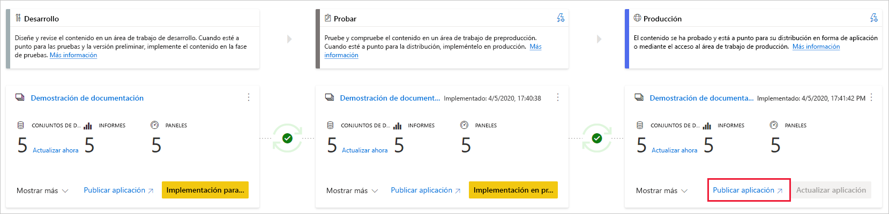
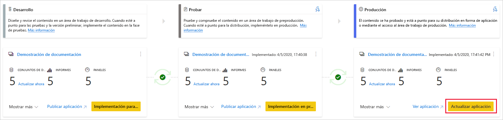

# comprender el proceso de implementación

El proceso de implementación permite clonar el contenido de una fase de la canalización a otra, normalmente del desarrollo a la prueba y de la prueba a la producción.

Durante la implementación, Power BI copia el contenido de la fase actual en el destino. Las conexiones entre los elementos copiados se conservan durante el proceso de copia. Power BI también aplica las reglas de conjunto de datos configuradas al contenido actualizado en la fase de destino. La implementación de contenido puede tardar unos minutos, en función del número de elementos que se implementan. Durante este tiempo, puede ir a otras páginas del portal de Power BI, pero no puede usar el contenido en la fase de destino.

## Implementación de contenido en una fase vacía

Al implementar contenido en una fase vacía, los metadatos de los informes, paneles y conjuntos de datos del área de trabajo desde la que se va a realizar la implementación se copian en la fase en la que se va a realizar la implementación. Se crea una nueva área de trabajo para la fase en la que se realizó la implementación en una capacidad Premium.

Hay dos maneras de implementar el contenido de una fase a la siguiente. Puede implementar todo el contenido o [seleccionar los elementos de contenido que desea implementar](deployment-pipelines-get-started.md#selective-deployment).

También puede implementar el contenido hacia atrás, desde una fase posterior de la canalización de implementación a una anterior.

Una vez completada la implementación, actualice los conjuntos de datos para poder usar el contenido recién copiado. La actualización del conjunto de datos es necesaria porque los datos no se copian de una fase a otra. Para comprender qué propiedades de elemento se copian durante el proceso de implementación y cuáles no, revise la sección [Propiedades de elemento copiadas durante la implementación](#item-properties-copied-during-deployment).

### Creación de un área de trabajo con capacidad Premium

Durante la primera implementación, las canalizaciones de implementación comprueban si tiene permisos de capacidad Premium.  

Si tiene permisos de capacidad, el contenido del área de trabajo se copia en la fase en la que se realiza la implementación y se crea una nueva área de trabajo para esa fase en la capacidad Premium.

Si no tiene permisos de capacidad, el área de trabajo se crea, pero el contenido no se copia. Puede pedir a un administrador de capacidad que agregue el área de trabajo a una capacidad o solicitar permisos de asignación para la capacidad. Más adelante, cuando el área de trabajo esté asignada a una capacidad, puede implementar contenido en esta área de trabajo.

Si usa [Premium por usuario (PPU)](../admin/service-premium-per-user-faq.md), el área de trabajo se crea automáticamente en la capacidad asociada a su licencia PPU. En tales casos, no se requieren permisos de capacidad. Sin embargo, a las áreas de trabajo creadas por un usuario con una licencia PPU solo podrán acceder otros usuarios que tengan esta misma licencia. Además, el contenido creado en tales áreas de trabajo solo podrán usarlo los usuarios que tengan licencias PPU.

### Propiedad del área de trabajo y del contenido

El usuario que realiza la implementación se convierte automáticamente en el propietario del conjunto de datos de los conjuntos de datos clonados y en el único administrador del área de trabajo nueva.

## Implementación del contenido en un área de trabajo existente

La implementación de contenido en una canalización de producción de trabajo, en una fase que tiene un área de trabajo existente, incluye lo siguiente:

* Implementar contenido nuevo como una adición, en una fase que ya dispone de contenido.

* Nuevo contenido implementado para reemplazar el contenido anterior, en una fase de trabajo actual.

### Proceso de implementación

El contenido de la fase actual se copia en la fase de destino. Power BI identifica el contenido existente en la fase de destino y lo sobrescribe. Para identificar qué elemento de contenido debe sobrescribirse, las canalizaciones de implementación usan la conexión entre el elemento primario y sus clones. Esta conexión se mantiene cuando se crea contenido nuevo. La operación de sobrescritura solo sobrescribe el contenido del elemento. El identificador, la dirección URL y los permisos del elemento permanecen inalterados.

En la fase de destino, las [propiedades de elemento que no se copian](deployment-pipelines-process.md#item-properties-that-are-not-copied), permanecen como estaban antes de la implementación. El nuevo contenido y los nuevos elementos se copian de la fase actual a la fase de destino.

### Actualización del conjunto de datos

Los datos del conjunto de datos de destino se mantienen siempre que sea posible. Si no hay ningún cambio en un conjunto de datos, los datos se conservan tal como estaban antes de la implementación.

Con pequeños cambios, como agregar una tabla o medidas, Power BI mantiene los datos originales y la actualización se optimiza para actualizar solo lo que es necesario. Para interrumpir los cambios de esquema o los cambios en la conexión del origen de datos, se requiere una actualización completa.

### Requisitos para la implementación en una fase con un área de trabajo existente

Siempre que el contenido implementado se encuentre en una [capacidad Premium](../admin/service-premium-what-is.md), un usuario que cumpla las condiciones siguientes podrá implementarlo en una fase con un área de trabajo existente:

* Un usuario con una licencia [Pro](../admin/service-admin-purchasing-power-bi-pro.md) o [PPU](../admin/service-premium-per-user-faq.md) que sea miembro de ambas áreas de trabajo en las fases de implementación de origen y destino.

* Un propietario de todos los conjuntos de datos del área de trabajo de destino que se van a implementar.

Para más información, revise la sección [Permisos](#permissions).

## Elementos implementados

Al implementar contenido de una fase de canalización en otra, el contenido copiado contiene los siguientes elementos de Power BI:

* Conjuntos de datos

* Informes

* Paneles

### Elementos no admitidos

Las canalizaciones de implementación no admiten los siguientes elementos:

* Conjuntos de datos que no se originan a partir de un archivo PBIX

* Informes basados en conjuntos de datos no admitidos

* [Áreas de trabajo de aplicación de plantilla](../connect-data/service-template-apps-create.md#create-the-template-workspace)

* Informes paginados

* Flujos de datos

* Conjuntos de datos de INSERCIÓN

* Libros

## Propiedades de elemento copiadas durante la implementación

Durante la implementación, las siguientes propiedades de elemento se copian y se sobrescriben las propiedades de elemento en la fase de destino:

* Orígenes de datos (las [reglas de conjunto de datos](deployment-pipelines-get-started.md#step-4---create-dataset-rules) se admiten)

* Parámetros (las [reglas de conjunto de datos](deployment-pipelines-get-started.md#step-4---create-dataset-rules) se admiten)

* Objetos visuales de informes

* Páginas del informe

* Los iconos de panel

* Metadatos del modelo

* Relaciones de elemento

### Propiedades de elemento que no se copian

Las siguientes propiedades de elemento no se copian durante la implementación:

* Datos: los datos no se copian, solo se copian los metadatos

* URL

* Id.

* Permisos: para un área de trabajo o un elemento específico

* Configuración del área de trabajo: cada fase tiene su propia área de trabajo

* Configuración y contenido de la aplicación: para implementar las aplicaciones, consulte la sección [Implementación de aplicaciones de Power BI](#deploying-power-bi-apps)

Las siguientes propiedades de conjunto de datos tampoco se copian durante la implementación:

* Asignación de roles

* Programación de la actualización

* Credenciales del origen de datos

* Configuración del almacenamiento en caché de consultas (se puede heredar de la capacidad)

* Configuración de aprobación

## Actualización incremental

Las canalizaciones de implementación admiten la [actualización incremental](../admin/service-premium-incremental-refresh.md), una característica que permite actualizaciones más rápidas y confiables de grandes conjuntos de datos con un menor consumo.

Con las canalizaciones de implementación, puede realizar actualizaciones en un conjunto de datos con una actualización incremental mientras conserva tanto los datos como las particiones. Al implementar el conjunto de datos, se copia la directiva.

### Activación de la actualización incremental en una canalización

Para habilitar la actualización incremental, [actívela en Power BI Desktop](../admin/service-premium-incremental-refresh.md#configure-incremental-refresh) y, a continuación, publique el conjunto de datos. Después de publicar, la directiva de actualización incremental es similar en toda la canalización y solo se puede crear en Power BI Desktop.

Una vez configurada la canalización con una actualización incremental, se recomienda usar el siguiente flujo:

1. Realice cambios en el archivo PBIX en Power BI Desktop. Para evitar tiempos de espera largos, puede realizar cambios mediante una muestra de los datos.

2. Cargue el archivo PBIX en la fase de *desarrollo*.

3. Implemente el contenido en la fase de *pruebas*. Después de la implementación, los cambios realizados se aplicarán a todo el conjunto de datos que esté usando.

4. Revise los cambios realizados en la fase de *pruebas* y, después de comprobarlos, impleméntelos en la fase de *producción*.

### Ejemplos de uso

A continuación se muestran algunos ejemplos de cómo puede integrar la actualización incremental con canalizaciones de implementación.

* [Cree una nueva canalización](deployment-pipelines-get-started.md#step-1---create-a-deployment-pipeline) y conéctese a un área de trabajo con un conjunto de datos que tenga habilitada la actualización incremental.

* Habilite la actualización incremental en un conjunto de datos que ya esté en un área de trabajo de *desarrollo*.  

* Cree una canalización desde un área de trabajo de producción que tenga un conjunto de datos que use la actualización incremental. Para ello, asigne el área de trabajo a una nueva fase de *producción* de la canalización y use la [implementación hacia atrás](deployment-pipelines-get-started.md#backwards-deployment) para implementar en la fase de *pruebas* y, a continuación, en la fase de *desarrollo*.

* Publique un conjunto de datos que use la actualización incremental en un área de trabajo que forme parte de una canalización existente.

### Limitaciones y consideraciones

Para la actualización incremental, las canalizaciones de implementación solo admiten conjuntos de datos que usan [metadatos de un conjunto de datos mejorado](../connect-data/desktop-enhanced-dataset-metadata.md). A partir de la versión de septiembre de 2020 de Power BI Desktop, todos los conjuntos de datos creados o modificados con Power BI Desktop implementan automáticamente metadatos de un conjunto de datos mejorado.

Al volver a publicar un conjunto de datos en una canalización activa con la actualización incremental habilitada, los siguientes cambios provocarán un error de implementación debido a la pérdida de datos potencial:

* Volver a publicar un conjunto de datos que no usa la actualización incremental para reemplazar un conjunto de un conjunto que tiene habilitada la actualización incremental.

* Cambiar el nombre de una tabla que tiene habilitada la actualización incremental.

* Cambiar el nombre de las columnas no calculadas de una tabla con la actualización incremental habilitada.

Se permiten otros cambios, como agregar una columna, quitar una columna y cambiar el nombre de una columna calculada. Sin embargo, si los cambios afectan a la pantalla, deberá actualizar antes de que el cambio sea visible.

## Implementación de aplicaciones de Power BI

Las [aplicaciones de Power BI](../consumer/end-user-apps.md) son la manera recomendada de distribuir contenido a los consumidores de Power BI gratuitos. Con las canalizaciones de implementación puede administrar las aplicaciones de Power BI en una canalización de implementación; de esta forma tiene más control y flexibilidad cuando llegue al ciclo de vida de la aplicación.

Cree una aplicación para cada fase de canalización de implementación; de esta forma puede probar cada actualización de la aplicación desde el punto de vista de un usuario final. Una canalización de implementación le permite administrar este proceso fácilmente. Use el botón Publicar o Ver de la tarjeta del área de trabajo para publicar o ver la aplicación en una fase de canalización específica.

En la fase de producción, el botón de acción principal situado en la esquina inferior derecha abre la página de actualización de la aplicación en Power BI, de modo que las actualizaciones de contenido pasan a estar disponibles para los usuarios de la aplicación.

>[!IMPORTANT]
>El proceso de implementación no incluye la actualización del contenido o la configuración de la aplicación. Para aplicar cambios al contenido o la configuración, debe actualizar manualmente la aplicación en la fase de canalización requerida.

## Permisos

Los permisos de canalización y los permisos del área de trabajo se conceden y administran por separado. Por ejemplo, un usuario con acceso de canalización que no tenga permisos de área de trabajo, podrá ver la canalización y compartirla con otros usuarios. Sin embargo, este usuario no podrá ver el contenido del área de trabajo en la canalización, o en la página del área de trabajo, y no podrá realizar implementaciones.

### Usuario con acceso de canalización

Los usuarios con acceso de canalización tienen los permisos siguientes:

* Ver la canalización

* Compartir la canalización con otros usuarios

* Editar y eliminar la canalización

>[!NOTE]
>El acceso a la canalización no concede permisos para ver o realizar acciones en el contenido del área de trabajo.

### Visor del área de trabajo

Los visores del área de trabajo que tienen *acceso de canalización* también pueden hacer lo siguiente:

* Consumir contenido

>[!NOTE]
>Los visores de área de trabajo no pueden acceder al conjunto de datos ni editar el contenido del área de trabajo.

### Colaborador del área de trabajo

Los colaboradores del área de trabajo que tienen *acceso de canalización* también pueden hacer lo siguiente:

* Consumir contenido

* Comparar fases

* Ver conjuntos de datos

### Miembro del área de trabajo

Los miembros del área de trabajo que tienen *acceso de canalización* también pueden hacer lo siguiente:

* Ver el contenido del área de trabajo

* Comparar fases

* Implementar informes y paneles

* Quitar áreas de trabajo

### Administrador del área de trabajo

Los administradores del área de trabajo que tienen *acceso de canalización*, pueden realizar las acciones de los *miembros del área de trabajo* y, además, hacer lo siguiente:

* Asignar áreas de trabajo

* Quitar áreas de trabajo

### Propietario del conjunto de datos

Los propietarios del conjunto de datos que son miembros o administradores del área de trabajo también pueden hacer lo siguiente:

* Actualizar conjuntos de datos

* Configuración de reglas

>[!NOTE]
>En esta sección se describen los permisos de usuario en las canalizaciones de implementación. Los permisos que se enumeran en esta sección pueden tener aplicaciones diferentes en otras características de Power BI.

## Limitaciones

En esta sección se enumeran la mayoría de las limitaciones de las canalizaciones de implementación.

* El área de trabajo debe residir en una  [capacidad Premium](../admin/service-premium-what-is.md).

* Los elementos de Power BI, tales como los informes y paneles que tienen [etiquetas de confidencialidad](../admin/service-security-sensitivity-label-overview.md) de Power BI, no se pueden implementar.

* El número máximo de elementos de Power BI que se pueden implementar en una sola implementación es 300.

* Para una lista de las limitaciones del área de trabajo, vea [Limitaciones de asignación del área de trabajo](deployment-pipelines-get-started.md#workspace-assignment-limitations).

* Para una lista de elementos no admitidos, vea [Elementos no admitidos](#unsupported-items).

### Limitaciones de un conjunto de datos

* No se pueden implementar los conjuntos de datos que usan la conectividad de datos en tiempo real.

* Durante la implementación, si el conjunto de datos de destino usa una [conexión dinámica](../connect-data/desktop-report-lifecycle-datasets.md), el conjunto de datos de origen también debe usar este modo de conexión.

* Después de la implementación, no se admite la descarga de un conjunto de datos (desde la fase en la que se ha implementado).

* Para una lista de las limitaciones de las reglas del conjunto de datos, consulte [Limitaciones de las reglas de conjunto de datos](deployment-pipelines-get-started.md#dataset-rule-limitations).

## Pasos siguientes

>[!div class="nextstepaction"]
>[Introducción a las canalizaciones de implementación](deployment-pipelines-overview.md)

>[!div class="nextstepaction"]
>[Procedimientos recomendados de las canalizaciones de implementación](deployment-pipelines-best-practices.md)

>[!div class="nextstepaction"]
>[Introducción a las canalizaciones de implementación](deployment-pipelines-get-started.md)

>[!div class="nextstepaction"]
>[Solución de problemas de las canalizaciones de implementación](deployment-pipelines-troubleshooting.md)
