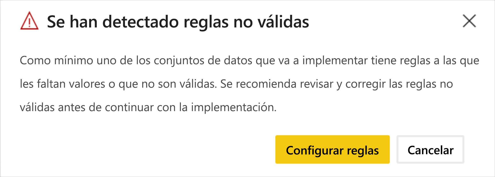

# Solución de problemas de las canalizaciones de implementación (versión preliminar)

Use este artículo para solucionar los problemas de las canalizaciones de implementación.

## General

### Qué son las canalizaciones de implementación de Power BI

Para comprender qué son las canalizaciones de implementación de Power BI, consulte la [información general sobre las canalizaciones de implementación](deployment-pipelines-overview.md).

### ¿Cómo se empieza con las canalizaciones de implementación?

Para comenzar a usarlas, siga las [instrucciones de inicio](deployment-pipelines-get-started.md).

### ¿Por qué no aparece el botón de canalizaciones de implementación?

A no ser que se cumplan las siguientes condiciones, no podrá ver el botón de canalizaciones de implementación.

* Es un usuario de Power BI [Pro](../admin/service-admin-purchasing-power-bi-pro.md)

* Pertenece a una organización que tiene capacidad Premium.

* A un área de trabajo solo se le puede asignar una canalización.

* Es un administrador de una nueva área de trabajo.

## Licencias

### ¿Qué licencias se necesitan para trabajar con canalizaciones de implementación?

Para usar canalizaciones de implementación, debe ser un [usuario Pro](../admin/service-admin-purchasing-power-bi-pro.md) con [capacidad Premium](../admin/service-premium-what-is.md). Para más información, consulte [Acceso a las canalizaciones de implementación](deployment-pipelines-get-started.md#accessing-deployment-pipelines).

### ¿Qué tipo de capacidad puedo asignar a un área de trabajo en una canalización?

Todas las áreas de trabajo de una canalización de implementación deben residir en una capacidad dedicada para que la canalización sea funcional. Sin embargo, puede usar diferentes capacidades para diferentes áreas de trabajo de una canalización. También puede usar diferentes tipos de capacidad para diferentes áreas de trabajo de la misma canalización.

Con fines de desarrollo y prueba, puede usar una capacidad A o EM junto con una cuenta de Power BI Pro para cada usuario.

Para las áreas de trabajo de producción, necesitará una capacidad P. Si es un ISV que distribuye contenido a través de aplicaciones insertadas, también puede usar capacidades A o EM para producción.

## Preguntas técnicas

### ¿Por qué no aparecen todas las áreas de trabajo cuando intento asignar una a una canalización?

Para asignar un área de trabajo a una canalización, deben cumplirse las siguientes condiciones:

* El área de trabajo es una [nueva experiencia de área de trabajo](../collaborate-share/service-create-the-new-workspaces.md).

* El usuario es el administrador del área de trabajo.

* El área de trabajo no está asignada a ninguna otra canalización.

* El área de trabajo reside en una [capacidad Premium](../admin/service-premium-what-is.md).

Las áreas de trabajo que no cumplen estas condiciones no se muestran en la lista de áreas de trabajo que se pueden seleccionar.

### ¿Cómo se asignan las áreas de trabajo a todas las fases de una canalización?

Puede asignar un área de trabajo por canalización. Una vez que se asigna un área de trabajo a una canalización, puede implementarla en las siguientes fases de canalización. Durante la primera implementación, se crea un área de trabajo con copias de los elementos de la fase de origen. Las relaciones de los elementos copiados se conservan. Para más información, consulte cómo [asignar un área de trabajo a una canalización de implementación](deployment-pipelines-get-started.md#step-2---assign-a-workspace-to-a-deployment-pipeline).

### ¿Por qué se produjo un error en la primera implementación?

Es posible que la primera implementación no saliera bien por varias razones. En la tabla siguiente se enumeran algunas de ellas.

|Error  |Acción  |
|---------|---------|
|No tiene [permisos de capacidad Premium](deployment-pipelines-process.md#creating-a-premium-capacity-workspace).     |Para obtener permisos de capacidad Premium, pida a un administrador de capacidades que agregue el área de trabajo a una capacidad o solicite permisos de asignación de la capacidad. Una vez que el área de trabajo esté en una capacidad, vuelva a implementarla.        |
|No tiene permisos de área de trabajo.     |Para implementarla, debe ser miembro del área de trabajo. Pida al administrador del área de trabajo que le conceda los permisos adecuados.         |
|El administrador de Power BI ha deshabilitado la creación de áreas de trabajo.     |Póngase en contacto con el administrador de Power BI para que le ayude.         |
|El área de trabajo no es una [nueva experiencia de área de trabajo](../collaborate-share/service-create-the-new-workspaces.md).     |Cree el contenido en la nueva experiencia de área de trabajo. Si tiene contenido en un área de trabajo clásica, puede [actualizarlo](../collaborate-share/service-upgrade-workspaces.md) a una nueva experiencia de área de trabajo.         |
|Está usando [implementación selectiva](deployment-pipelines-get-started.md#selective-deployment) y no está seleccionando el conjunto de datos del contenido.     |Lleve a cabo una de las siguientes acciones:   Anule la selección del contenido que está vinculado al conjunto de datos. El contenido no seleccionado (como informes o paneles) no se copiará en la siguiente fase.   Seleccione el conjunto de datos que está vinculado al contenido seleccionado. El conjunto de datos se copiará en la siguiente fase.         |

### Al intentar la implementación, recibo una advertencia de que tengo "artefactos no admitidos" en mi área de trabajo. ¿Cómo se sabe qué artefactos no se admiten?

Puede encontrar una lista completa de elementos y artefactos que no se admiten en las canalizaciones de implementación en las siguientes secciones:

* [Elementos no admitidos](deployment-pipelines-process.md#unsupported-items)

* [Propiedades de elemento que no se copian](deployment-pipelines-process.md#item-properties-that-are-not-copied)

### ¿Por qué no se realizó la implementación debido a reglas no válidas?

Si tiene problemas para configurar reglas de conjunto de datos, consulte [Reglas de conjunto de datos](deployment-pipelines-get-started.md#step-4---create-dataset-rules) y asegúrese de seguir las [limitaciones de las reglas de conjunto de datos](deployment-pipelines-get-started.md#dataset-rule-limitations).

Si la implementación se realizó anteriormente de forma correcta y se produce un error de repente con reglas no válidas, puede deberse a que se ha vuelto a publicar un conjunto de datos. Los cambios siguientes en el conjunto de código de origen producen un error en la implementación:

**Reglas de parámetros**

* Parámetro eliminado.

* Cambio de nombre del parámetro.

**Reglas de orígenes de datos**

Faltan valores en las reglas de conjunto de datos. Esto puede ocurrir si el conjunto de datos ha cambiado.

Cuando se produce un error en una implementación anteriormente correcta debido a vínculos no válidos, se muestra una advertencia. Puede hacer clic en **Configure rules** (Configurar reglas) para ir al panel de configuración de la implementación, donde está marcado el conjunto de datos con error. Al hacer clic en el conjunto de datos, se marcan las reglas no válidas.

Para realizar la implementación correctamente, corrija o quite las reglas no válidas y vuelva a realizar la implementación.

### ¿Cómo se cambia el origen de datos en las fases de canalización?

No se puede cambiar la conexión del origen de datos en el servicio Power BI.

Si quiere cambiar el origen de datos en las fases de prueba o producción, puede usar [reglas de conjunto de datos](deployment-pipelines-get-started.md#step-4---create-dataset-rules) o [API](https://docs.microsoft.com/rest/api/power-bi/datasets/updateparametersingroup). Las reglas de conjunto de datos solo tendrán validez después de la siguiente implementación.

### He corregido un error en producción, pero ahora no puedo hacer clic en el botón de "implementación en una fase anterior". ¿Por qué está atenuado?

Solo puede realizar implementaciones hacia atrás hasta una fase vacía. Si tiene contenido en la fase de prueba, no podrá realizar implementaciones hacia atrás desde producción.

Después de crear la canalización, utilice la fase de desarrollo para desarrollar el contenido y las fases de prueba para revisarlo y probarlo. Puede corregir los errores en estas fases y, luego, implementar el entorno fijo en la fase de producción.

>[!NOTE]
>La implementación hacia atrás solo admite la [implementación completa](deployment-pipelines-get-started.md#deploying-all-content). No admite la [implementación selectiva](deployment-pipelines-get-started.md#selective-deployment).

### ¿Las canalizaciones de implementación admiten varias zonas geográficas?

Se admiten varias zonas geográficas. Puede que se tarde más en implementar contenido entre fases de distintas zonas geográficas.

## Permisos

### ¿Qué es el modelo de permisos de canalizaciones de implementación?

El modelo de permisos de canalizaciones de implementación se describe en la sección [Permisos](deployment-pipelines-process.md#permissions).

### ¿Quién puede implementar contenido entre fases?

El contenido se puede implementar en una fase vacía o en una fase con contenido. El contenido debe residir en una [capacidad Premium](../admin/service-premium-what-is.md).

* **Implementación en una fase vacía**: cualquier [usuario Pro](../admin/service-admin-purchasing-power-bi-pro.md) que sea miembro o administrador en el área de trabajo de origen.

* **Implementación en una fase con contenido**: cualquier [usuario Pro](../admin/service-admin-purchasing-power-bi-pro.md) que sea miembro o administrador de ambas áreas de trabajo en las fases de implementación de origen y destino.

* **Invalidación de un conjunto de datos**: la implementación invalida cada conjunto de datos que se incluye en la fase de destino, aunque no se haya cambiado. El usuario debe ser propietario de todos los conjuntos de datos de la fase de destino especificados en la implementación.

### ¿Qué permisos son necesarios para configurar reglas de conjunto de datos?

Para configurar reglas de conjunto de datos en las canalizaciones de implementación, debe ser el propietario de dicho conjunto.

### ¿Por qué no puedo ver las áreas de trabajo de la canalización?

Los permisos de canalización y área de trabajo se administran por separado. Es posible que tenga permisos de canalización, pero no permisos de área de trabajo. Para más información, revise la sección [Permisos](deployment-pipelines-process.md#permissions).

## Pasos siguientes

>[!div class="nextstepaction"]
>[Introducción a las canalizaciones de implementación](deployment-pipelines-overview.md)

>[!div class="nextstepaction"]
>[Introducción a las canalizaciones de implementación](deployment-pipelines-get-started.md)

>[!div class="nextstepaction"]
>[Descripción del proceso de las canalizaciones de implementación](deployment-pipelines-process.md)

>[!div class="nextstepaction"]
>[Procedimientos recomendados de las canalizaciones de implementación](deployment-pipelines-best-practices.md)