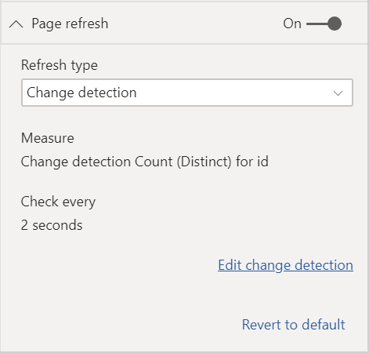
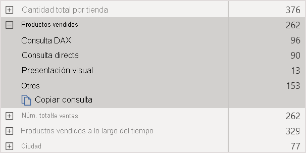
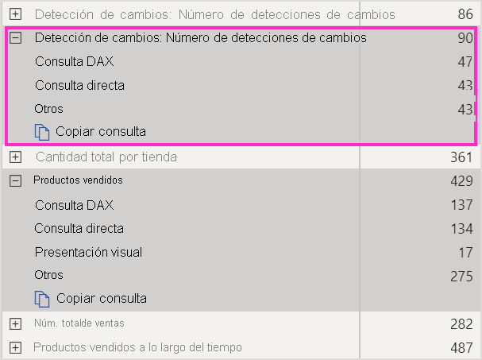
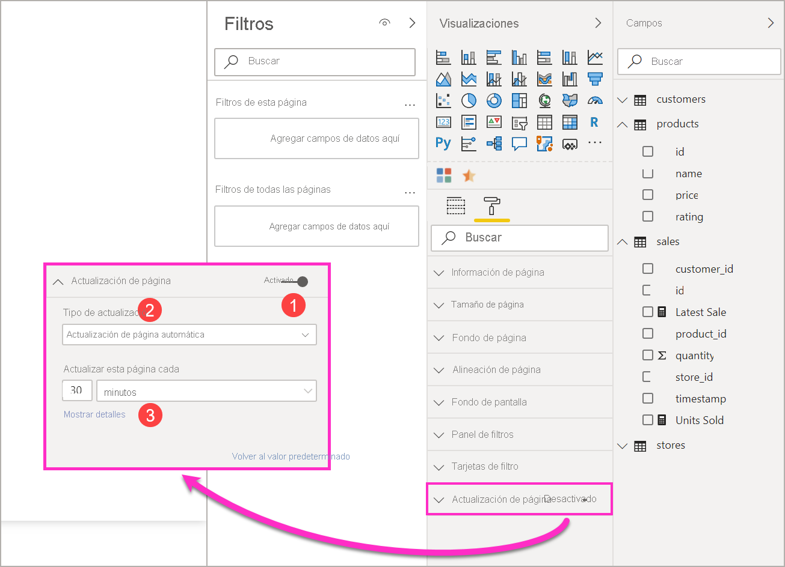
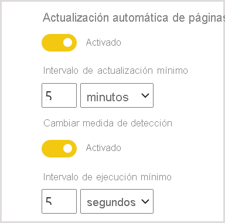

# Actualización automática de páginas en Power BI

Al supervisar eventos críticos, es importante que los datos se actualicen en cuanto lo hagan los datos de origen. Por ejemplo, en el sector de fabricación, es fundamental saber cuándo una máquina funciona mal o está a punto de hacerlo. Si supervisa señales como las opiniones en los medios sociales, querrá conocer los cambios repentinos en cuanto se produzcan.

La actualización automática de páginas de Power BI permite que la página de informe activa consulte, con una cadencia predefinida, si hay datos nuevos en [orígenes de DirectQuery](../connect-data/desktop-directquery-about.md).

## Tipos de actualización

Al usar la actualización automática de páginas, hay dos tipos de actualización disponibles: de intervalo fijo y de detección de cambios.

### Intervalo fijo

Este tipo de actualización permite actualizar todos los objetos visuales de una página de informe en función de un intervalo constante, como un segundo o cinco minutos. Cuando se alcanza ese intervalo concreto, todos los objetos visuales de esa página envían una consulta de actualización al origen de datos y se actualizan según corresponda.

### Detección de cambios

Este tipo de actualización permite actualizar los objetos visuales de una página en función de la detección de cambios en los datos en lugar de un intervalo de actualización específico. En concreto, esta medida sondea los cambios en el [origen de DirectQuery](../connect-data/desktop-directquery-about.md). Además de definir la medida, también tiene que seleccionar la frecuencia con la que Power BI Desktop comprobará los cambios. Al publicar en el servicio, este tipo de actualización solo se admite en áreas de trabajo que forman parte de una capacidad Premium. No se admiten orígenes de LiveConnect como conjuntos de datos de Power BI y Analysis Services.

## Creación de informes con actualización automática de páginas en Power BI Desktop

La actualización automática de páginas está disponible para [orígenes de DirectQuery](../connect-data/desktop-directquery-about.md) y algunos escenarios de LiveConnect, por lo que solo estará disponible cuando esté conectado a un origen de datos compatible. Esta restricción se aplica a los dos tipos de actualización automática de páginas.

Para usar la actualización automática de páginas en Power BI Desktop, seleccione la página del informe para la que quiera habilitarla. En el panel **Visualizaciones**, seleccione el botón **Formato** (un rodillo de pintura) y busque la sección **Actualización de página** cerca de la parte inferior del panel.

1. Activa o desactiva la actualización de la página.
2. Tipo de actualización
3. Entradas e información (según el tipo de actualización)

La tarjeta **Actualización de página** solo estará disponible si está conectado a un [origen de DirectQuery](../connect-data/desktop-directquery-about.md). Para habilitar la actualización automática de páginas, el control de alternancia debe estar en la posición Activado. Las entradas necesarias y la información proporcionada dependerán del tipo de actualización seleccionado.

### Configuración del intervalo fijo

Al seleccionar **Actualización automática de las páginas** como el tipo de actualización, debe proporcionar el intervalo de actualización que quiere. El valor predeterminado es de 30 minutos. (El intervalo de actualización mínimo es de un segundo). El informe comenzará a actualizarse en el intervalo establecido.

Al hacer clic en Mostrar detalles, Power BI proporcionará más información sobre:

- Si la característica está habilitada por el administrador (solo cuando ha iniciado sesión en la cuenta propia de Power BI)
- El intervalo mínimo permitido por el administrador (solo cuando ha iniciado sesión en la cuenta propia de Power BI)
- La velocidad de actualización real (normalmente más larga que el intervalo seleccionado)
- La hora de última actualización

### Configuración de detección de cambios

Al seleccionar **Detección de cambios** como el tipo de actualización, aparecerá un vínculo a **Agregar detección de cambios**. También puede acceder a la ventana **Detección de cambios** desde la pestaña Modelado de la cinta. Después, haga clic en el icono **Detección de cambios** de la sección **Actualización de página**. Por último, puede hacer clic con el botón derecho o seleccionar la flecha desplegable situada junto a cualquier valor del área Valores y seleccionar **Detección de cambios** en el menú.

Una vez que se ha abierto la ventana, se ve la opción **Tipo de medida**, donde puede seleccionar una medida existente o crear una desde cero. Si selecciona una existente, solo tiene que seleccionar la medida deseada en la lista de campos, o bien arrastrarla y colocarla en la sección **Elegir medida existente**. Al crear una medida, puede **Elegir un cálculo** para la medida entre count, count distinct, minimum, maximum y sum. Por ejemplo, puede usar count distinct para contar los Id. de cliente y solo actualizar cuando se agrega un cliente nuevo a la lista. Una vez que haya seleccionado una medida, tendrá que definir la frecuencia con la que Power BI **comprobará los cambios**. Es el intervalo de la frecuencia con la que Power BI calculará la medida y sondeará los cambios. Una vez que haga clic en aplicar, aparecerá una nueva medida con el icono de detección de cambios en la lista de campos.

Después, de nuevo en la sección Actualización de página, verá como referencia información de la medida que se usa para la detección de cambios y el intervalo definido.

> [!NOTE]
> Solo se permite una medida de detección de cambios por modelo.

## Determinación del intervalo de actualización

Cuando la actualización automática de páginas se habilita, Power BI Desktop envía consultas al origen de DirectQuery ininterrumpidamente. Habrá un retraso entre el envío de la consulta y la obtención de datos. Por ello, si el intervalo de actualización establecido es breve, deberá confirmar que las consultas devuelven correctamente los datos consultados en el intervalo configurado. Si los datos no se devuelven dentro del intervalo, los objetos visuales se actualizarán con menos frecuencia de la configurada.

Estas consideraciones se aplican a los dos tipos de actualización: intervalo fijo y detección de cambios. La principal diferencia es que, para la detección de cambios, solo hay una consulta que vuelve al origen en un intervalo fijo y la actualización de los objetos visuales solo se desencadena cuando cambia el valor de la medida de detección de cambios.

Como procedimiento recomendado, el intervalo de actualización debe coincidir al menos con la frecuencia de llegada de datos nuevos que se prevé:

* Si llegan datos nuevos al origen cada 20 minutos, el intervalo de actualización no puede ser inferior a 20 minutos.
* Si los nuevos datos llegan cada segundo, establezca el intervalo en un segundo.

En el caso de intervalos de actualización bajos, como de un segundo, tenga en cuenta factores como los siguientes:

- El tipo del origen de datos de DirectQuery.
- La carga de las consultas creadas en él.
- La distancia de los visores del informe desde el centro de datos de la capacidad.

Puede calcular los tiempos de retorno mediante el [Analizador de rendimiento](desktop-performance-analyzer.md) de Power BI Desktop y el menú Mostrar detalles de la sección Actualización de página para el tipo de actualización de intervalo fijo. El Analizador de rendimiento le permite comprobar si cada consulta visual tiene tiempo suficiente para volver a los resultados del origen. También permite determinar dónde se emplea el tiempo. En función de los resultados del Analizador de rendimiento, puede ajustar el origen de datos, o puede experimentar con otros objetos visuales y medidas en el informe.

En esta imagen se muestran los resultados de un origen de DirectQuery en el Analizador de rendimiento:

Ahora se van a considerar otras características sobre este origen de datos:

- Los datos llegan con una frecuencia de dos segundos
- El Analizador de rendimiento muestra un tiempo máximo de consulta y representación de aproximadamente 4,9 segundos (4688 milisegundos).
- El origen de datos está configurado para controlar aproximadamente 1000 consultas simultáneas por segundo.
- Se espera que unos 10 usuarios vean el informe al mismo tiempo.

Todo esto da como resultado la siguiente ecuación:

- **5 objetos visuales x 10 usuarios = aproximadamente 50 consultas**

El resultado de este cálculo muestra mucha más carga de la que el origen de datos puede admitir. Llegan datos con una frecuencia de dos segundos, así que esa debe ser la frecuencia de actualización. Pero como la consulta tarda unos cinco segundos en completarse, debemos establecerla en más de cinco segundos.

Tenga en cuenta también que este resultado puede diferir al publicar el informe en el servicio. Esta diferencia se debe a que el informe usará la instancia de Azure Analysis Services que se hospeda en la nube. Posiblemente convenga ajustar las frecuencias de actualización en consecuencia.

Para tener en cuenta las consultas y el tiempo de actualización, Power BI ejecutará la siguiente consulta de actualización únicamente cuando se hayan completado todas las consultas de actualización restantes. Por lo tanto, aun cuando el intervalo de actualización sea menor que el tiempo que las consultas tardan en procesarse, Power BI volverá a actualizarse solamente cuando las consultas restantes se completen.

En el caso del tipo de actualización Detección de cambios, se aplican estas consideraciones. Además, en el [Analizador de rendimiento](desktop-performance-analyzer.md) se mostrarán los resultados de la consulta de medida de detección de cambios, aunque no coincida con ningún objeto visual del informe. Se ha proporcionado esta función para poder solucionar este tipo de medida concreto mediante las mismas instrucciones que se han mencionado antes. La principal diferencia de este tipo de actualización es que solo se envía una consulta al origen de datos, en lugar de todas las consultas de todos los objetos visuales. Este es el caso si hay varios usuarios que ven el informe.

En el mismo escenario descrito antes:

- **Una consulta de medida de detección de cambios para cinco objetos visuales solo genera una consulta para cualquier número de usuarios**.

- **En el mismo escenario anterior con 5 objetos visuales x 10 usuarios, cuando la medida de detección de cambios desencadena una actualización, se generan aproximadamente 50 consultas**.

En resumen, cuando se usa la detección de cambios, solo se envía una consulta al origen de datos hasta que se detecta un cambio. Cuando esto sucede, la misma lógica que se usa para el tipo de actualización de intervalo fijo se aplica a la actualización de todos los objetos visuales para todos los usuarios mediante la generación del mismo número de consultas. Este enfoque debe ser más eficaz a largo plazo.

Veamos ahora cómo un administrador de la capacidad puede detectar y diagnosticar problemas de rendimiento. Puede consultar también la sección [preguntas más frecuentes](#frequently-asked-questions), más adelante en este artículo, para obtener más preguntas y respuestas sobre el rendimiento y la solución de problemas.

## Actualización automática de páginas en el servicio Power BI

También puede establecer la actualización automática de páginas para los informes publicados en el servicio Power BI siempre que el origen de datos sea [DirectQuery](../connect-data/desktop-directquery-about.md).

Para configurar la actualización automática de páginas de informes en el servicio Power BI, se siguen los mismos pasos que en Power BI Desktop. Al configurarla en el servicio Power BI, la actualización automática de páginas también admite [contenido insertado de Power BI](../developer/embedded/embedding.md). En esta imagen se muestra la configuración de **Actualización de página** del servicio Power BI:

1. Activa o desactiva la actualización de la página.
2. Tipo de actualización
3. Entradas e información (según el tipo de actualización)

> [!NOTE]
> Al publicar el informe con la actualización automática de páginas habilitada desde Power BI Desktop al servicio, tendrá que proporcionar las credenciales del origen de datos de DirectQuery en el menú de configuración del conjunto de datos. Puede configurar las credenciales para que los usuarios del informe accedan a este origen de datos con sus propias identidades, respetando la configuración de seguridad del origen. En el caso de la medida de detección de cambios, siempre se evaluará con las credenciales del autor.

### Intervalos de actualización de página

Los tipos e intervalos de actualización de páginas permitidos en el servicio Power BI dependen del tipo de área de trabajo del informe. Esto se aplica a estos escenarios:

* Al publicar un informe en un área de trabajo que tiene habilitada la actualización automática de páginas
* Al editar un intervalo de actualización de página que ya existe en un área de trabajo
* Al crear un informe directamente en el servicio

Power BI Desktop no tiene ninguna restricción para los intervalos de actualización (pueden tener una frecuente de hasta un segundo). Pero cuando se publican informes en el servicio Power BI, se aplican ciertas restricciones que se describen en las secciones siguientes.

### Restricciones de intervalos de actualización

En el servicio Power BI, se imponen restricciones a la actualización automática de páginas en función del área de trabajo en la que se publique el informe, si se usan servicios Premium, la configuración de administración de la capacidad Premium y el tipo de origen de datos.

Para aclarar cómo funcionan estas restricciones, comencemos con algunos conceptos previos sobre capacidades y áreas de trabajo.

*Las capacidades* son un concepto importante de Power BI. Representan un conjunto de recursos (almacenamiento, procesador y memoria) que se usan para hospedar y facilitar contenido de Power BI. Las capacidades son compartidas o dedicadas. Una *capacidad compartida* se comparte con otros clientes de Microsoft. Una *capacidad dedicada* está totalmente comprometida con un solo cliente. Para ver una introducción a las capacidades dedicadas, consulte [Administración de las capacidades Premium](../admin/service-premium-capacity-manage.md).

En la capacidad compartida, las cargas de trabajo se ejecutan en recursos informáticos compartidos con otros clientes. Como la capacidad debe compartir recursos, se imponen ciertas limitaciones para garantizar un *juego limpio*, como establecer un tamaño de modelo máximo (1 GB) y una frecuencia de actualización diaria máxima (ocho veces al día).

Las *áreas de trabajo* de Power BI residen dentro de las capacidades. Representan contenedores de seguridad, colaboración e implementación. Cada usuario de Power BI tiene un área de trabajo personal que se conoce como **Mi área de trabajo**. Pueden crearse áreas de trabajo adicionales para posibilitar la colaboración y la implementación. Se conocen como *áreas de trabajo*. Las áreas de trabajo, incluidas las personales, se crean de forma predeterminada en la capacidad compartida.

Estos son algunos detalles de estos dos escenarios de área de trabajo:

**Áreas de trabajo compartidas**. En las áreas de trabajo normales (aquellas que no forman parte de una capacidad Premium), la actualización automática de páginas tiene un intervalo mínimo de 30 minutos (que es el mínimo permitido). El tipo de actualización Detección de cambios no está disponible en capacidades compartidas.

**Áreas de trabajo Premium**. La disponibilidad de la actualización automática de páginas en áreas de trabajo Premium (para los tipos de intervalo fijo y detección de cambios) depende de la configuración de la carga de trabajo que el administrador de Premium haya configurado para la capacidad Premium de Power BI. Hay dos variables que pueden afectar a la posibilidad de configurar la actualización automática de páginas:

 - **Activación/desactivación de la característica**. Si el administrador de la capacidad ha deshabilitado la característica, no se podrá configurar ningún tipo de actualización de página en el informe publicado. El intervalo fijo y la detección de cambios se pueden activar y desactivar de forma independiente.

 - **Intervalo de actualización mínimo**. Al habilitar la actualización automática de páginas para un intervalo fijo, el administrador de capacidad debe configurar un intervalo de actualización mínimo (el valor predeterminado es de cinco minutos). Si su intervalo es inferior al mínimo, el servicio Power BI lo invalida para respetar el intervalo mínimo establecido por el administrador de la capacidad.

 - **Intervalo de ejecución mínimo**. Al habilitar la detección de cambios, el administrador de capacidad debe configurar un intervalo de actualización mínimo (el valor predeterminado es de cinco segundos). Si su intervalo es inferior al mínimo, el servicio Power BI lo invalida para respetar el intervalo mínimo establecido por el administrador de la capacidad.

> [!WARNING]
> Cuando se habilita en el conjunto de datos, la medida de detección de cambios abrirá una conexión con el origen de datos de DirectQuery para calcular la medida y sondear los cambios. Esta conexión es diferente de las conexiones de actualización de prioridad baja que ya realiza Power BI.

En la tabla siguiente se describe con más detalle dónde está disponible esta característica, así como los límites de cada tipo de capacidad y el [modo de almacenamiento](../connect-data/service-dataset-modes-understand.md):

| Modo de almacenamiento                                  | Capacidad dedicada                                                                                     | Capacidad compartida                                                                                       |
|-----------------------------------------------|--------------------------------------------------------------------------------------------------------|-------------------------------------------------------------------------------------------------------|
| DirectQuery                                   | **Admite IF**: Sí  **Admite DC**: Sí  **Mínimo**: 1 segundo  **Invalidación del administrador**: Sí  | **Admite IF**: Sí  **Admite DC**: No  **Mínimo**: 30 minutos  **Invalidación del administrador**: No |
| Importar                                        | **Admite IF**: No  **Admite DC**: No  **Mínimo**: N/D  **Invalidación del administrador**: N/D         | **Admite IF**: No  **Admite DC**: No  **Mínimo**: N/D  **Invalidación del administrador**: N/D        |
| Modo mixto (DirectQuery y otros orígenes de datos) | **Admite IF**: Sí  **Admite DC**: Sí  **Mínimo**: 1 segundo  **Invalidación del administrador**: Sí  | **Admite IF**: Sí  **Admite DC**: No  **Mínimo**: 30 minutos  **Invalidación del administrador**: No |
| Analysis Services (Azure y en el entorno local)     | **Admite IF**: Sí  **Admite DC**: No  **Mínimo**: 30 minutos  **Invalidación del administrador**: Sí | **Admite IF**: Sí  **Admite DC**: No  **Mínimo**: 30 minutos  **Invalidación del administrador**: No |
| Conjuntos de datos de Power BI (con origen de DirectQuery)   | **Admite IF**: Sí  **Admite DC**: No  **Mínimo**: 1 segundo  **Invalidación del administrador**: Sí  | **Admite IF**: Sí  **Admite DC**: No  **Mínimo**: 30 minutos  **Invalidación del administrador**: No |
| Conjuntos de datos de inserción de Power BI                        | **Admite IF**: Sí  **Admite DC**: No  **Mínimo**: 30 minutos  **Invalidación del administrador**: Sí | **Admite IF**: Sí  **Admite DC**: No  **Mínimo**: 30 minutos  **Invalidación del administrador**: No        |

*Leyenda de la tabla:*
1. *IF: Intervalo fijo*
2. *DC: Detección de cambios*

> [!WARNING]
> Hay un problema conocido cuando se conecta desde Power BI Desktop a conjuntos de datos de Power BI o Analysis Services y el intervalo de actualización es de 30 minutos o más. Los objetos visuales de una página de informe pueden mostrar un error después de 30 minutos.

## Consideraciones y limitaciones

Hay algunos aspectos que se deben tener en cuenta al usar la actualización automática de páginas, ya sea en Power BI Desktop o en el servicio Power BI:

* El modo de almacenamiento de importación no se admite para la actualización automática de páginas.  
* Se admiten modelos compuestos que tengan al menos un origen de datos de DirectQuery.
* Solo puede tener una medida de detección de cambios por cada conjunto de datos.
* Solo puede haber un máximo de 10 modelos con una medida de detección de cambios en un inquilino de Power BI.

### Diagnóstico de rendimiento

La actualización automática de páginas es útil en escenarios de supervisión y para explorar los datos que cambian rápidamente. Sin embargo, hay veces en que esto puede suponer una carga innecesaria en la capacidad o el origen de datos.

Para evitar una carga innecesaria en los orígenes de datos, Power BI cuenta con las siguientes medidas de seguridad:

- Todas las consultas de actualización automática de páginas se ejecutan con una prioridad más baja para garantizar que las consultas interactivas (como la carga de páginas y el filtrado cruzado de objetos visuales) tengan prioridad.
- Si la consulta no ha finalizado antes del siguiente ciclo de actualización, Power BI no emitirá consultas de actualización nuevas hasta que la consulta anterior se complete. Por ejemplo, si el intervalo de actualización es de un segundo y las consultas tardan de media cuatro segundos, Power BI solo emitie una consulta cada cuatro segundos.

Hay dos áreas en las que todavía podrían producirse cuellos de botella de rendimiento:

1. **La capacidad**. La consulta llega en primer lugar a la capacidad Premium, que evaluará la consulta DAX generada a partir de las visualizaciones de informes en las consultas de origen.
2. **Origen de datos de DirectQuery**. las consultas convertidas en el paso anterior se ejecutan en el origen, El origen serían las instancias de SQL Server, los orígenes de SAP Hana, etc.

El uso de la [aplicación Premium Capacity Metrics](../admin/service-admin-premium-monitor-capacity.md), disponible para los administradores, permite visualizar cuánta capacidad usan las consultas con una prioridad baja.

Las consultas con una prioridad baja se componen de consultas de actualización automática de páginas y de consultas de actualización de modelos. Actualmente, no existe forma alguna de distinguir la carga de las consultas de actualización automática de páginas de la de las consultas de actualización de modelos.

Si observa que la capacidad se está sobrecargando con consultas de prioridad baja, existen algunas medidas que puede tomar:

- Solicitar una SKU Premium más grande
- Pedir al propietario del informe que reduzca el intervalo de actualización.
- En el portal de administración de la capacidad, se puede:
   - Desactivar la actualización automática de páginas en esa capacidad.
   - Aumentar el intervalo de actualización mínimo, que afectará a todos los informes de esa capacidad

### Preguntas más frecuentes

**Soy el autor de un informe. He establecido el intervalo de actualización del informe en 1 segundo en Power BI Desktop pero, tras publicarlo, no se actualiza en el servicio.**

* Asegúrese de que la actualización automática de páginas está activada en la página. Puesto que esta configuración se aplica por página, debe asegurarse de que está activada en cada página del informe que le gustaría actualizar.
* Compruebe si la carga la ha hecho en un área de trabajo con una capacidad Premium asociada. Si no lo ha hecho, el intervalo de actualización se bloqueará a los 30 minutos para el tipo de intervalo fijo y no estará disponible para la detección de cambios.
* Si el informe se encuentra en un área de trabajo Premium, pregunte al administrador si esta característica está habilitada para la capacidad asociada. Asegúrese además de que el intervalo de actualización mínimo de la capacidad es menor o igual que el del informe. Esto se aplica por separado para el intervalo fijo y la detección de cambios.

**Soy un administrador de capacidad. He cambiado la configuración del intervalo de actualización automática de páginas, pero los cambios no se reflejan. En otras palabras, los informes se siguen actualizando a una frecuencia que no deben, o no se actualizan aunque haya activado la actualización automática de páginas.**

* Los cambios en la actualización automática de páginas establecida realizados la interfaz de usuario de administración de la capacidad tardan hasta 5 minutos en propagarse a los informes.
* Aparte de activar la actualización automática de páginas de la capacidad, también hay que activarla en las páginas del informe donde quiera ver reflejada la actualización.
* Los dos tipos de actualización se administran por separado, por lo que debe asegurarse de que el tipo de actualización que va a habilitar esté activado.

**Mi informe funciona en modo mixto (DirectQuery+Importación) (significa que el informe tiene una conexión DirectQuery y un origen de datos de importación). Algunos objetos visuales no se están actualizando.**

- Si los objetos visuales hacen referencia a las tablas de importación, este comportamiento es normal. La actualización automática de páginas no se admite en el modo de importación.
- Vea la primera pregunta de esta sección.

**Mi informe se ha estado actualizando bien en el servicio y, de repente, ya no lo hace.**

* Pruebe a actualizar la página para ver si el problema se resuelve solo.
* Consúltelo con su administrador de capacidad. Es posible que el administrador haya desactivado la característica o haya generado el intervalo de actualización mínimo. (Vea la segunda pregunta de esta sección).

**Soy el autor de un informe. Los objetos visuales no se están actualizando con la cadencia que he establecido, sino a una frecuencia menor.**

* Si las consultas tardan más tiempo en ejecutarse, el intervalo de actualización se retrasará. La actualización automática de páginas espera a que todas las consultas terminen antes de ejecutar otras nuevas.
* Es posible que el administrador de la capacidad haya establecido un intervalo de actualización mínimo superior al que ha establecido en su informe. Pida al administrador de la capacidad que reduzca el intervalo de actualización mínimo.

**¿Las consultas de actualización automática de páginas se sirven desde la memoria caché?**

* No. Todas las consultas de actualización automática de páginas pasan por alto los datos almacenados en caché.

**La medida de detección de cambios no desencadena ninguna actualización**

* Asegúrese de que la detección de cambios está activada en la página. Puesto que esta configuración se aplica por página, debe asegurarse de que está activada en cada página del informe que le gustaría actualizar.
* Compruebe si la carga la ha hecho en un área de trabajo con una capacidad Premium asociada. Si no lo ha hecho, la detección de cambios no funcionará.
* Si el informe se encuentra en un área de trabajo Premium, pregunte al administrador si esta característica está habilitada para la capacidad asociada. Asegúrese además de que el intervalo de ejecución mínimo de la capacidad es menor o igual que el del informe.
* Si lo ha comprobado para todos los elementos mencionados antes, consulte en Power BI Desktop o en el modo de edición si la medida cambia algo o no. Para ello, arrástrela al lienzo y compruebe si cambia el valor. Si no lo hace, es posible que la medida no sea una buena opción para sondear cambios en el origen de datos.

**Al conectarse a Analysis Services, no puedo ver la alternancia de APR**

* Asegúrese de que el modelo de Analysis Services esté en [modo DirectQuery](https://docs.microsoft.com/analysis-services/tabular-models/directquery-mode-ssas-tabular).

## Pasos siguientes

Para más información, consulte estos artículos:

* [Uso de DirectQuery en Power BI](../connect-data/desktop-directquery-about.md)
* [Usar modelos compuestos en Power BI Desktop](../transform-model/desktop-composite-models.md)
* [Usar el Analizador de rendimiento para examinar el rendimiento de los elementos de informe](desktop-performance-analyzer.md)
* [Implementación y administración de las capacidades de Power BI Premium](../guidance/whitepaper-powerbi-premium-deployment.md)
* [Orígenes de datos en Power BI Desktop](../connect-data/desktop-data-sources.md)
* [Combinar datos y darles forma en Power BI Desktop](../connect-data/desktop-shape-and-combine-data.md)
* [Connect to Excel workbooks in Power BI Desktop (Conectarse a libros de Excel en Power BI Desktop)](../connect-data/desktop-connect-excel.md)   
* [Especificar datos directamente en Power BI Desktop](../connect-data/desktop-enter-data-directly-into-desktop.md)   
