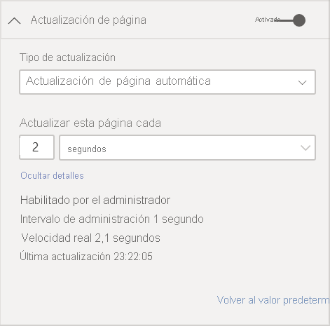

# Actualización automática de la página en Power BI Desktop 

Al supervisar eventos críticos, es importante que los datos se actualicen en cuanto lo hagan los datos de origen. Por ejemplo, en el sector de fabricación, es fundamental saber cuándo una máquina funciona mal o está a punto de hacerlo.

La característica de actualización automática de páginas de Power BI permite que la página de informe que está activa consulte, con una cadencia predefinida, si hay datos nuevos relacionados con los [orígenes de DirectQuery](https://docs.microsoft.com/power-bi/desktop-directquery-about).

## Usar la actualización automática de páginas

La actualización automática de páginas solo está disponible en orígenes de datos de DirectQuery.

Para usar la actualización automática de páginas, seleccione la página del informe donde quiera habilitar la actualización. En el panel **Visualizaciones**, seleccione el botón **Formato** (un rodillo de pintura) y busque **Actualización de página** cerca de la parte inferior del panel. 

En la siguiente imagen se muestra la tarjeta **Actualización de página**. Los elementos numerados se describen después de la imagen.

1.    Activa o desactiva la actualización de página.
2.    Valor numérico para el intervalo de actualización de la página.
3.    Unidad para el intervalo de actualización de página.

En esta tarjeta, puede activar la actualización de página y seleccionar la duración de la actualización. El valor predeterminado es de 30 minutos. (El intervalo de actualización mínimo es de un segundo). El informe comenzará a actualizarse en el intervalo establecido. 

## Determinar el intervalo de actualización de página

Cuando la actualización automática de páginas se habilita, Power BI Desktop envía consultas al origen de DirectQuery ininterrumpidamente. Habrá un retraso entre el envío de la consulta y la obtención de datos. Por ello, si el intervalo de actualización establecido es breve, deberá confirmar que las consultas devuelven correctamente los datos consultados en el intervalo configurado. Si los datos no se devuelven dentro del intervalo, los objetos visuales se actualizarán con menos frecuencia de la configurada.

Como procedimiento recomendado, el intervalo de actualización debe coincidir al menos con la frecuencia de llegada de datos nuevos que se prevé:

* Si llegan datos nuevos al origen cada 20 minutos, el intervalo de actualización no puede ser inferior a 20 minutos. 

* Si los nuevos datos llegan cada segundo, establezca el intervalo en un segundo. 

En el caso de intervalos de actualización bajos, como de un segundo, tenga en cuenta factores como los siguientes:
- El tipo del origen de datos de DirectQuery.
- La carga de las consultas creadas en él.
- La distancia de los visores del informe desde el centro de datos de la capacidad. 

Puede calcular los tiempos de retorno mediante el Analizador de rendimiento en Power BI Desktop. El Analizador de rendimiento le permite comprobar si cada consulta visual tiene tiempo suficiente para volver a los resultados del origen. También permite determinar dónde se emplea el tiempo. En función de los resultados del Analizador de rendimiento, puede ajustar el origen de datos, o puede experimentar con otros objetos visuales y medidas en el informe.

En la siguiente imagen se muestran los resultados de una consulta DirectQuery en el Analizador de rendimiento:

Ahora se van a considerar otras características sobre este origen de datos: 

-    Llegan datos con una frecuencia de dos segundos. 
-    El Analizador de rendimiento muestra un tiempo máximo de consulta+visualización de aproximadamente 4,9 segundos (4,688 milisegundos). 
-    El origen de datos está configurado para asimilar aproximadamente 1000 consultas simultáneas por segundo. 
-    Se espera que unos 10 usuarios vean el informe al mismo tiempo.

Todo esto da como resultado la siguiente ecuación:

**5 objetos visuales x 10 usuarios = aproximadamente 50 consultas**

El resultado de este cálculo muestra mucha más carga de la que el origen de datos puede admitir. Llegan datos con una frecuencia de dos segundos, así que esa debe ser la frecuencia de actualización. Pero como la consulta tarda unos cinco segundos en completarse, debemos establecerla en más de cinco segundos. 

Tenga en cuenta también que este resultado puede diferir al publicar el informe en el servicio. Esta diferencia se debe a que el informe usará la instancia de Azure Analysis Services que se hospeda en la nube. Posiblemente convenga ajustar las frecuencias de actualización en consecuencia. 

Para tener en cuenta las consultas y el tiempo de actualización, Power BI ejecutará la siguiente consulta de actualización únicamente cuando se hayan completado todas las consultas de actualización restantes. Por lo tanto, aun cuando el intervalo de actualización sea menor que el tiempo que las consultas tardan en procesarse, Power BI volverá a actualizarse solamente cuando las consultas restantes se completen. 

Veamos ahora cómo un administrador de la capacidad puede detectar y diagnosticar problemas de rendimiento. Puede consultar también la sección [preguntas más frecuentes](#frequently-asked-questions), más adelante en este artículo, para obtener más preguntas y respuestas sobre el rendimiento y la solución de problemas.

## Actualización automática de páginas en el servicio Power BI

También se pueden establecer intervalos de actualización automática de páginas en los informes creados en Power BI Desktop y publicados en el servicio Power BI. 

Para configurar la actualización automática de páginas de informes en el servicio Power BI, se siguen pasos similares a los empleados en Power BI Desktop. Al configurarla en el servicio Power BI, la actualización automática de páginas también admite [contenido insertado de Power BI](../developer/embedded/embedding.md). En esta imagen se muestra la configuración de **Actualización de página** del servicio Power BI:

Estas descripciones se corresponden con los elementos numerados: 

1.    Activa o desactiva la actualización de la página.
2.    Valor numérico para el intervalo de actualización de la página. Debe ser un número entero.
3.    Unidad para el intervalo de actualización de página.

### Intervalos de actualización de página

Los intervalos de actualización de página permitidos en el servicio Power BI vienen determinados por el tipo de área de trabajo del informe. Esto se aplica a estos informes:

* Al publicar un informe en un área de trabajo que tiene habilitada la actualización automática de páginas
* Al editar un intervalo de actualización de página que ya existe en un área de trabajo
* Al crear un informe directamente en el servicio

Power BI Desktop no tiene restricciones para los intervalos de actualización. El intervalo de actualización puede tener una frecuencia incluso de un segundo. Pero cuando los informes se publican en el servicio Power BI, se aplican ciertas restricciones. que se describen en las secciones siguientes.

### Restricciones de intervalos de actualización

En el servicio Power BI, se imponen restricciones de actualización automática de páginas en función de factores como el área de trabajo y si se usan servicios Premium.

Para aclarar cómo funcionan estas restricciones, comencemos con algunos conceptos previos sobre capacidades y áreas de trabajo.

*Las capacidades* son un concepto importante de Power BI. Representan un conjunto de recursos (almacenamiento, procesador y memoria) que se usan para hospedar y facilitar contenido de Power BI. Las capacidades son compartidas o dedicadas. Una *capacidad compartida* se comparte con otros clientes de Microsoft. Una *capacidad dedicada* está totalmente comprometida con un solo cliente. Para ver una introducción a las capacidades dedicadas, consulte [Administración de las capacidades Premium](../admin/service-premium-capacity-manage.md).

En la capacidad compartida, las cargas de trabajo se ejecutan en recursos informáticos compartidos con otros clientes. Como la capacidad debe compartir recursos, se imponen ciertas limitaciones para garantizar un *juego limpio*, como establecer un tamaño de modelo máximo (1 GB) y una frecuencia de actualización diaria máxima (ocho veces al día).

Las *áreas de trabajo* de Power BI residen dentro de las capacidades. Representan contenedores de seguridad, colaboración e implementación. Cada usuario de Power BI tiene un área de trabajo personal que se conoce como **Mi área de trabajo**. Pueden crearse áreas de trabajo adicionales para posibilitar la colaboración y la implementación. Se conocen como *áreas de trabajo*. Las áreas de trabajo, incluidas las personales, se crean de forma predeterminada en la capacidad compartida.

Estos son algunos detalles de estos dos escenarios de área de trabajo:

**Áreas de trabajo compartidas**. En las áreas de trabajo normales (aquellas que no forman parte de una capacidad Premium), la actualización automática de páginas tiene un intervalo mínimo de 30 minutos (que es el mínimo permitido).

**Áreas de trabajo Premium**. La disponibilidad de la actualización automática de páginas en áreas de trabajo Premium depende de la configuración de la carga de trabajo que el administrador de Premium haya configurado como capacidad de Power BI Premium. Hay dos variables que pueden afectar a la posibilidad de configurar la actualización automática de páginas:

 - **Activación/desactivación de la característica**. Si el administrador de la capacidad ha deshabilitado la característica, no se podrá configurar ningún tipo de actualización de página en el informe publicado.

 - **Intervalo de actualización mínimo**. Al habilitar la característica, el administrador de la capacidad debe configurar un intervalo de actualización mínimo. Si su intervalo es inferior al mínimo, el servicio Power BI lo invalida para respetar el intervalo mínimo establecido por el administrador de la capacidad. Esa invalidación se conoce como "Invalidación de la administración de capacidad" en la tabla siguiente. 

En la tabla siguiente se describe con más detalle dónde está disponible esta característica, así como los límites de cada tipo de capacidad y el [modo de almacenamiento](../connect-data/service-dataset-modes-understand.md):

| Modo de almacenamiento | Capacidad dedicada | Capacidad compartida |
| --- | --- | --- |
| DirectQuery | **Admitido**: Sí  **Intervalo de actualización mínimo**: 1 segundo  **Invalidación de la administración de capacidad**: Sí | **Admitido**: Sí  **Intervalo de actualización mínimo**: 30 minutos  **Invalidación de la administración de capacidad**: No |
| Importación | **Admitido**: No  **Intervalo de actualización mínimo**: N/D  **Invalidación de la administración de capacidad**: N/D | **Admitido**: No  **Intervalo de actualización mínimo**: N/D  **Invalidación de la administración de capacidad**: N/D |
| Modo mixto (DirectQuery y otros orígenes de datos) | **Admitido**: Sí  **Intervalo de actualización mínimo**: 1 segundo  **Invalidación de la administración de capacidad**: Sí | **Admitido**: Sí  **Intervalo de actualización mínimo**: 30 minutos  **Invalidación de la administración de capacidad**: No |
| Live Connect AS | **Admitido**: No  **Intervalo de actualización mínimo**: N/D  **Invalidación de la administración de capacidad**: N/D | **Admitido**: No  **Intervalo de actualización mínimo**: N/D  **Invalidación de la administración de capacidad**: N/D |
| Live Connect PBI | **Admitido**: No  **Intervalo de actualización mínimo**: N/D  **Invalidación de la administración de capacidad**: N/D | **Admitido**: No  **Intervalo de actualización mínimo**: N/D  **Invalidación de la administración de capacidad**: N/D |

> [!NOTE]
> Al publicar el informe con la actualización automática de páginas habilitada desde Power BI Desktop al servicio, tendrá que proporcionar las credenciales del origen de datos de DirectQuery en el menú de configuración del conjunto de datos.

## Consideraciones y limitaciones

Hay algunos aspectos que se deben tener en cuenta al usar la actualización automática de páginas, ya sea en Power BI Desktop o en el servicio Power BI:

* La actualización automática de páginas no admite los modos de almacenamiento de importación, conexión dinámica ni inserción.  
* Se admiten modelos compuestos que tengan al menos un origen de datos de DirectQuery.
* Power BI Desktop no tiene restricciones para los intervalos de actualización. El intervalo puede tener una frecuencia incluso de un segundo. Cuando se publican informes en el servicio Power BI, existen ciertas restricciones, como se ha indicado [anteriormente](#restrictions-on-refresh-intervals) en este artículo.

### Diagnóstico de rendimiento

La actualización automática de páginas es útil en escenarios de supervisión y para explorar los datos que cambian rápidamente. Sin embargo, hay veces en que esto puede suponer una carga innecesaria en la capacidad o el origen de datos.

Para evitar una carga innecesaria en los orígenes de datos, Power BI cuenta con las siguientes medidas de seguridad:

- Todas las consultas de actualización automática de páginas se ejecutan con una prioridad más baja para garantizar que las consultas interactivas (como la carga de páginas y el filtrado cruzado de objetos visuales) tengan prioridad.
- Si la consulta no ha finalizado antes del siguiente ciclo de actualización, Power BI no emitirá consultas de actualización nuevas hasta que la consulta anterior se complete. Por ejemplo, si el intervalo de actualización es de un segundo y las consultas tardan de media cuatro segundos, Power BI solo emitie una consulta cada cuatro segundos.

Hay dos áreas en las que todavía podrían producirse cuellos de botella de rendimiento:

1. **La capacidad**. La consulta llega en primer lugar a la capacidad Premium, que evaluará la consulta DAX generada a partir de las visualizaciones de informes en las consultas de origen.
2. **Origen de datos de DirectQuery**. las consultas convertidas en el paso anterior se ejecutan en el origen, El origen serían las instancias de SQL Server, los orígenes de SAP Hana, etc.

El uso de la [aplicación Premium Capacity Metrics](../admin/service-admin-premium-monitor-capacity.md), disponible para los administradores, permite visualizar cuánta capacidad usan las consultas con una prioridad baja.

Las consultas con una prioridad baja se componen de consultas de actualización automática de páginas y de consultas de actualización de modelos. Actualmente, no existe forma alguna de distinguir la carga de las consultas de actualización automática de páginas de la de las consultas de actualización de modelos.

Si observa que la capacidad se está sobrecargando con consultas de prioridad baja, existen algunas medidas que puede tomar:

- Solicitar una SKU Premium más grande
- Pedir al propietario del informe que reduzca el intervalo de actualización.
- En el portal de administración de la capacidad, se puede:
   - Desactivar la actualización automática de páginas en esa capacidad.
   - Aumentar el intervalo de actualización mínimo, que afectará a todos los informes de esa capacidad

### Preguntas más frecuentes

**Soy el autor de un informe. He establecido el intervalo de actualización del informe en 1 segundo en Power BI Desktop pero, tras publicarlo, no se actualiza en el servicio.**

* Asegúrese de que la actualización automática de páginas está activada en la página. Puesto que esta configuración se aplica por página, debe asegurarse de que está activada en cada página del informe que le gustaría actualizar.
* Compruebe si la carga la ha hecho en un área de trabajo con una capacidad Premium asociada. Si no es así, el intervalo de actualización se bloqueará en 30 minutos.
* Si el informe se encuentra en un área de trabajo Premium, pregunte al administrador si esta característica está habilitada para la capacidad asociada. Asegúrese además de que el intervalo de actualización mínimo de la capacidad es menor o igual que el del informe.

**Soy un administrador de capacidad. He cambiado la configuración del intervalo de actualización automática de páginas, pero los cambios no se reflejan. En otras palabras, los informes se siguen actualizando a una frecuencia que no deben, o no se actualizan aunque haya activado la actualización automática de páginas.**

* Los cambios en la actualización automática de páginas establecida realizados la interfaz de usuario de administración de la capacidad tardan hasta 5 minutos en propagarse a los informes.
* Aparte de activar la actualización automática de páginas de la capacidad, también hay que activarla en las páginas del informe donde quiera ver reflejada la actualización.

**Mi informe funciona en modo mixto (DirectQuery+Importación) (significa que el informe tiene una conexión DirectQuery y un origen de datos de importación). Algunos objetos visuales no se están actualizando.**

- Si los objetos visuales hacen referencia a las tablas de importación, este comportamiento es normal. La actualización automática de páginas no se admite en el modo de importación.
- Vea la primera pregunta de esta sección.

**Mi informe se ha estado actualizando bien en el servicio y, de repente, ya no lo hace.**

* Pruebe a actualizar la página para ver si el problema se resuelve solo.
* Consúltelo con su administrador de capacidad. Es posible que el administrador haya desactivado la característica o haya generado el intervalo de actualización mínimo. (Vea la segunda pregunta de esta sección).

**Soy el autor de un informe. Los objetos visuales no se están actualizando con la cadencia que he establecido, sino a una frecuencia menor.**

* Si las consultas tardan más tiempo en ejecutarse, el intervalo de actualización se retrasará. La actualización automática de páginas espera a que todas las consultas terminen antes de ejecutar otras nuevas.
* Es posible que el administrador de la capacidad haya establecido un intervalo de actualización mínimo superior al que ha establecido en su informe. Pida al administrador de la capacidad que reduzca el intervalo de actualización mínimo.

**¿Las consultas de actualización automática de páginas se sirven desde la memoria caché?**

* No. Todas las consultas de actualización automática de páginas pasan por alto los datos almacenados en caché.

## Pasos siguientes

Para más información, consulte estos artículos:

* [Uso de DirectQuery en Power BI](../connect-data/desktop-directquery-about.md)
* [Usar modelos compuestos en Power BI Desktop](../transform-model/desktop-composite-models.md)
* [Usar el Analizador de rendimiento para examinar el rendimiento de los elementos de informe](desktop-performance-analyzer.md)
* [Implementación y administración de las capacidades de Power BI Premium](../guidance/whitepaper-powerbi-premium-deployment.md)
* [Orígenes de datos en Power BI Desktop](../connect-data/desktop-data-sources.md)
* [Combinar datos y darles forma en Power BI Desktop](../connect-data/desktop-shape-and-combine-data.md)
* [Connect to Excel workbooks in Power BI Desktop (Conectarse a libros de Excel en Power BI Desktop)](../connect-data/desktop-connect-excel.md)   
* [Especificar datos directamente en Power BI Desktop](../connect-data/desktop-enter-data-directly-into-desktop.md)   
