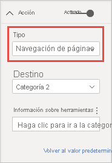
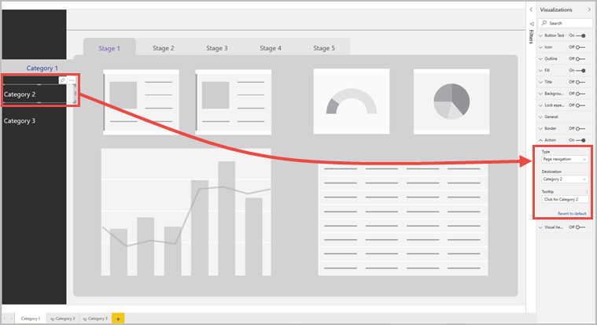

# Uso de botones en Power BI
El uso de **botones** en Power BI le permite crear informes que se comportan como aplicaciones, de modo que pueda preparar un entorno atractivo para que los usuarios mantengan el mouse sobre el contenido de Power BI, hagan clic e interactúen con él. Puede agregar botones a informes en **Power BI Desktop** y en el **servicio Power BI**. Al compartir los informes en el servicio Power BI, proporcionan a los usuarios una experiencia similar a la de una aplicación.

## Creación de botones en informes

### Creación de un botón en Power BI Desktop

Para crear un botón en **Power BI Desktop**, seleccione **Botones** en la cinta **Insertar**; se mostrará un menú desplegable en el que puede seleccionar el botón que quiera entre varias opciones, como se muestra en la imagen siguiente. 

### Creación de un botón en el servicio Power BI

Para crear un botón en el **servicio Power BI**, abra el informe en Vista de edición. Seleccione **Botones** en la barra de menús superior; se mostrará un menú desplegable en el que puede seleccionar el botón que quiera entre varias opciones, como se muestra en la imagen siguiente. 

## Personalización de un botón

Tanto si crea el botón en Power BI Desktop como en el servicio Power BI, el resto del proceso es el mismo. Al seleccionar un botón en el lienzo del informe, en el panel **Visualizaciones** se muestran las distintas formas de personalizar el botón para que se adapte a las necesidades personales. Por ejemplo, puede activar o desactivar **Texto del botón** mediante el control deslizante de esa tarjeta en el panel **Visualizaciones**. También puede cambiar varias propiedades del botón, como el icono, el relleno, el título o la acción que se realiza cuando el usuario selecciona el botón en un informe.

## Establecimiento de las propiedades del botón según si está inactivo o seleccionado, o bien al mantener el puntero sobre él

Los botones de Power BI tienen tres estados: el predeterminado (cómo se muestran cuando no están seleccionados ni se mantiene el puntero sobre ellos), el que se activa al mantener el puntero sobre ellos y el de selección (al *hacer clic* en ellos). Muchas de las tarjetas del panel **Visualizaciones** pueden modificarse individualmente según estos tres estados, lo que aporta una gran flexibilidad para personalizar los botones.

Las tarjetas del panel **Visualizaciones** siguientes le permiten ajustar el formato o el comportamiento de un botón en función de sus tres estados:

* Texto del botón
* Icono
* Esquema
* Rellenar

Para seleccionar cómo se muestra un botón en cada estado, expanda una de las tarjetas y seleccione el desplegable que aparece en la parte superior de esta. En la imagen siguiente se muestra la tarjeta **Icono** expandida, con el menú desplegable seleccionado para mostrar los tres estados.

## Selección de la acción para un botón

Puede seleccionar qué acción debe realizarse cuando un usuario selecciona un botón de Power BI. Las opciones de las acciones de botones están disponibles en la tarjeta **Acción** del panel **Visualizaciones**.

Estas son las opciones para los botones de acción:

- **Atrás** devuelve al usuario a la página anterior del informe. Esto resulta útil para las páginas de obtención de detalles.
- **Marcador** muestra la página del informe que esté asociada a un marcador definido para el informe actual. Obtenga más información sobre los [marcadores en Power BI](desktop-bookmarks.md). 
- **Obtención de detalles** lleva al usuario a una página de obtención de detalles filtrada por su selección, sin usar marcadores. Obtenga más información sobre los [botones de obtención de detalles en los informes](desktop-drill-through-buttons.md).
- **Navegación de páginas** lleva al usuario a otra página del informe, también sin usar marcadores. Vea [Creación de navegación de páginas](#create-page-navigation) en este artículo para obtener más información.
- **Preguntas y respuestas** abre una ventana **Explorador de preguntas y respuestas**. 

Algunos botones tienen una acción predeterminada seleccionada de forma automática. Por ejemplo, el tipo de botón **Preguntas y respuestas** selecciona automáticamente **Preguntas y respuestas** como la acción predeterminada. Puede obtener más información sobre el **Explorador de Preguntas y respuestas** en [esta entrada de blog](https://powerbi.microsoft.com/blog/power-bi-desktop-april-2018-feature-summary/#Q&AExplorer).

Puede probar los botones que cree para el informe mediante la combinación *Ctrl+clic* sobre el botón que quiera usar. 

## Creación de navegación de páginas

Con el tipo de **Acción** **Navegación de páginas**, puede crear una experiencia de navegación completa sin tener que guardar ni administrar ningún marcador.

Para configurar un botón de navegación de páginas, cree un botón con **Navegación de páginas** como tipo de acción y seleccione la página **Destino**.

Puede crear un panel de navegación personalizado y agregarle los botones de navegación. De este modo, se evita tener que editar y administrar los marcadores en el caso de que quiera cambiar las páginas que se van a mostrar en el panel de navegación.

Además, puede aplicar formato condicional a la información sobre herramientas como haría con otros tipos de botones.

## Establecimiento de la condicionalidad del destino de navegación

Puede usar el formato condicional para establecer el destino de navegación en función de la salida de una medida. Por ejemplo, puede que quiera ahorrar espacio en el lienzo del informe si tiene un solo botón para desplazarse a distintas páginas según la selección del usuario.

:::image type="content" source="media/desktop-buttons/button-navigate-go.png" alt-text="Navegar con un botón Ir":::
 
Para crear el ejemplo mostrado anteriormente, empiece por crear una tabla de una sola columna con los nombres de los destinos de navegación:

:::image type="content" source="media/desktop-buttons/button-create-table.png" alt-text="de una tabla":::

Power BI usa la coincidencia exacta de cadenas para establecer el destino de obtención de detalles, por lo que debe comprobar que los valores especificados se alineen exactamente con los nombres de las páginas de obtención de detalles.

Cuando haya creado la tabla, agréguela a la página como segmentación de selección única:

:::image type="content" source="media/desktop-buttons/button-navigate-slicer.png" alt-text="Segmentación de navegación":::

A continuación, cree un botón de navegación de páginas y seleccione la opción de formato condicional para el destino:

:::image type="content" source="media/desktop-buttons/button-set-page-nav-destination.png" alt-text="Botón de navegación de páginas":::
 
Seleccione el nombre de la columna que ha creado; en este caso, **Selección de un destino**:

:::image type="content" source="media/desktop-buttons/button-select-destination.png" alt-text="Selección de un destino":::

Ahora, el botón puede navegar a distintas páginas, en función de la selección del usuario.

:::image type="content" source="media/desktop-buttons/button-navigate-go.png" alt-text="Navegar con un botón Ir":::
 
### Formas e imágenes para la navegación

La acción de navegación de páginas se admite para formas e imágenes, no solo para botones. Este es un ejemplo de cómo usar una de las formas integradas:

:::image type="content" source="media/desktop-buttons/button-navigation-arrow.png" alt-text="Uso de una flecha para la navegación":::
 
Este es un ejemplo del uso de una imagen:

:::image type="content" source="media/desktop-buttons/button-navigation-image.png" alt-text="Uso de una imagen para la navegación":::
 
## Los botones admiten imágenes de relleno

Los botones admiten imágenes de relleno. Puede personalizar la apariencia del botón con imágenes de relleno combinadas con los estados de los botones integrados: predeterminado, al mantener el mouse, presionar y deshabilitado (para obtener detalles).

:::image type="content" source="media/desktop-drill-through-buttons/drill-through-fill-images.png" alt-text="Imágenes de relleno del botón de obtención de detalles":::

Establezca **Relleno** en **Activado** y cree imágenes para los distintos estados.

:::image type="content" source="media/desktop-drill-through-buttons/drill-through-fill-state-settings.png" alt-text="Configuración de imágenes de relleno":::

## Pasos siguientes
Para obtener más información sobre las características que son similares o que interactúan con los botones, vea los siguientes artículos:

* [Uso de la obtención de detalles en informes de Power BI](desktop-drillthrough.md)
* [Uso de marcadores para compartir información detallada y crear historias en Power BI](desktop-bookmarks.md)
* [Creación de un botón de obtención de detalles](desktop-drill-through-buttons.md)

