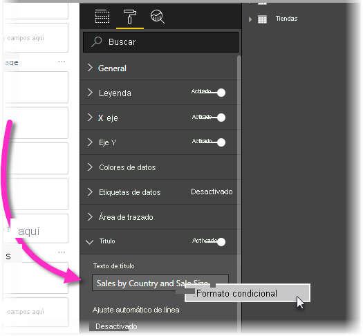
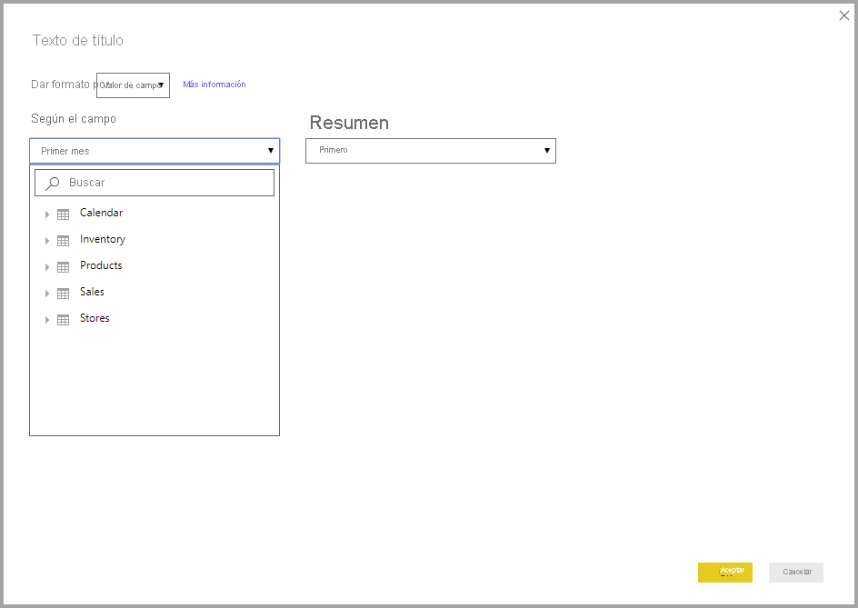

# <a name="expression-based-titles-in-power-bi-desktop"></a>Títulos basados en expresiones en Power BI Desktop

Puede crear títulos dinámicos y personalizados para los objetos visuales de Power BI. Mediante la creación de expresiones de análisis de datos (DAX) basadas en campos, variables u otros elementos de programación, los títulos de los objetos visuales pueden ajustarse automáticamente según sea necesario. Estos cambios se basan en filtros, selecciones u otras interacciones y configuraciones de usuario.



La creación de títulos dinámicos, a veces denominados *títulos basados en expresiones*, resulta sencilla. 

## <a name="create-a-field-for-your-title"></a>Creación de un campo para el título

El primer paso de la creación de un título basado en expresiones consiste en crear un campo en el modelo para usarlo con el título. 

Hay todo tipo de formas creativas de hacer que el título del objeto visual refleje lo que quiere decir o expresar. Veamos un par de ejemplos.

Puede crear una expresión que cambie según el contexto de filtro que el objeto visual reciba para el nombre de la organización del producto. En la imagen siguiente se muestra la fórmula DAX para este tipo de campo.


Otro ejemplo es el uso de un título dinámico que cambie según el idioma o la referencia cultural del usuario. Puede crear títulos específicos del lenguaje en una medida DAX mediante la función `USERCULTURE()`. Esta función devuelve el código de referencia cultural del usuario, en función de la configuración del sistema operativo o del explorador. Puede usar la siguiente instrucción switch de DAX para seleccionar el valor traducido correcto. 

```
SWITCH (
  USERCULTURE(),
  "de-DE", “Umsatz nach Produkt”,
  "fr-FR", “Ventes par produit”,
  “Sales by product”
)
```

También puede recuperar la cadena de una tabla de búsqueda que contenga todas las traducciones. La tabla se coloca en el modelo. 

Se trata tan solo de un par de ejemplos que puede usar para crear títulos dinámicos basados en expresiones para los objetos visuales en Power BI Desktop. Lo que puede hacer con sus títulos solo está limitado por su imaginación y el modelo.


## <a name="select-your-field-for-your-title"></a>Selección del campo para el título

Después de crear la expresión DAX para el campo que se crea en el modelo, debe aplicarla al título del objeto visual.

Para seleccionar el campo y aplicarla, vaya al panel **Visualizaciones**. En el área **Formato**, seleccione **Título** para mostrar las opciones de título para el objeto visual. 

Al hacer clic con el botón derecho en **Texto del título**, aparecerá un menú contextual que le permitirá seleccionar **<em>fx</em>Formato condicional**. Al seleccionar ese elemento de menú, aparece un cuadro de diálogo **Texto del título**. 



En esa ventana, puede seleccionar el campo que ha creado para el título.

## <a name="limitations-and-considerations"></a>Limitaciones y consideraciones

Existen algunas limitaciones en la implementación actual de títulos basados en expresiones para objetos visuales:

* Actualmente no se admite el formato basado en expresiones en objetos visuales de Python, objetos visuales de R o el objeto visual de influenciadores clave.
* El campo que se crea para el título debe ser del tipo de datos String. Actualmente no se admiten medidas que devuelvan tipos de datos numéricos o de fecha y hora (ni ningún otro tipo de datos).
* Los títulos basados en expresiones no se transfieren al anclar un objeto visual a un panel.

## <a name="next-steps"></a>Pasos siguientes

En este artículo se describe cómo crear expresiones DAX que conviertan los títulos de los objetos visuales en campos dinámicos que pueden cambiar a medida que los usuarios interactúan con los informes. También es posible que los siguientes artículos le resulten útiles.

* [Formato condicional en tablas](desktop-conditional-table-formatting.md)
* [Uso de la obtención de detalles de varios informes en Power BI Desktop](desktop-cross-report-drill-through.md)
* [Uso de la obtención de detalles en Power BI Desktop](desktop-drillthrough.md)
