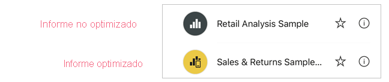
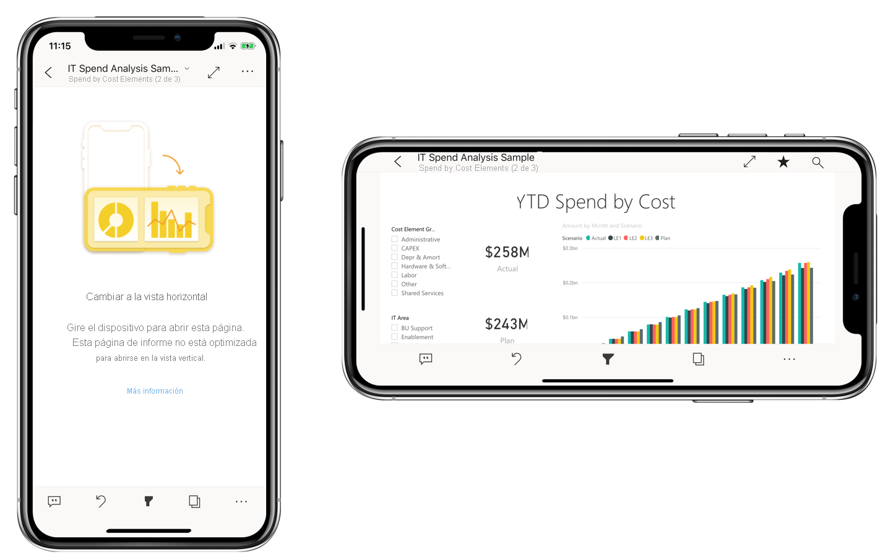

# Optimización de informes de Power BI para las aplicaciones móviles

Los usuarios móviles pueden ver cualquier página de informe de Power BI en orientación horizontal. Sin embargo, los autores de informes pueden crear una vista adicional que esté optimizada para dispositivos móviles y se muestre en orientación vertical. Esta opción de diseño, que está disponible tanto en Power BI Desktop como en el servicio Power BI, permite a los autores seleccionar y reorganizar solo los objetos visuales necesarios para los usuarios móviles de acuerdo con sus características.

Power BI proporciona varias características para ayudarlo a crear versiones optimizadas para dispositivos móviles de los informes:
* Una vista de diseño móvil en la que puede crear el informe optimizado para dispositivos móviles arrastrando y colocando objetos visuales en un lienzo de emulador del teléfono.
* Objetos visuales y segmentaciones que se pueden optimizar para su uso en pequeñas pantallas móviles.

Estas funcionalidades permiten diseñar y crear informes atractivos e interactivos optimizados para dispositivos móviles.

## Creación de una versión vertical optimizada para dispositivos móviles de una página de informe

**Requisito previo**: El primer paso consiste en diseñar y crear el informe en la vista web normal. Después de crear un informe, puede optimizarlo para teléfonos y tabletas.

Para crear la vista optimizada para dispositivos móviles, abra el informe en Power BI Desktop o en el servicio Power BI. Cuando el informe esté abierto, vaya a la vista de diseño para dispositivos móviles:
   * En Power BI Desktop, seleccione la cinta de opciones **Ver** y elija **Diseño para móviles**.
   * En el servicio Power BI, elija  **Editar informe > Diseño para dispositivos móviles**. Si la opción Editar no está visible, mire en **Más opciones (…)** .

   Verá un lienzo en forma de teléfono por el que se puede desplazar y un panel **Visualizaciones** que enumera todos los objetos visuales que se encuentran en la página del informe original.

* Cada uno de los objetos visuales del panel **Visualizaciones** aparece con su nombre para facilitar su identificación.
* Cada objeto visual también tiene un indicador de visibilidad. El indicador de visibilidad de un objeto visual cambia en función del estado de visibilidad del objeto visual en el estado actual de la vista del informe web. El indicador de visibilidad resulta útil cuando se trabaja con marcadores.

   

## Adición de objetos visuales al lienzo de diseño móvil
Para agregar un objeto visual al diseño de móvil, arrástrelo desde el panel **Visualizaciones** al lienzo de teléfono. Al arrastrar el objeto visual al lienzo, se ajusta a la cuadrícula. Como alternativa, puede hacer doble clic en el objeto visual del panel de visualización y el objeto visual se agregará al lienzo.

Puede agregar algunos o todos los objetos visuales de la página de informe web a la página del informe optimizado para dispositivos móviles. Puede agregar cada objeto visual solo una vez, y no tiene que incluirlos todos.

>[!NOTE]
> Puede arrastrar y colocar objetos visuales ocultos en el lienzo. Se colocarán, pero no se mostrarán a menos que su estado de visibilidad cambie en la vista de informe web actual.

Los objetos visuales se pueden colocar uno encima de otro para crear informes interactivos mediante marcadores o para crear informes atractivos mediante la disposición en capas de objetos visuales sobre las imágenes. Puede cambiar el orden de distribución en capas de los objetos visuales en el [panel Selección](#set-the-layering-order-of-visuals-on-the-mobile-layout-canvas).

Una vez que haya colocado un objeto visual en el lienzo, puede cambiar su tamaño arrastrando los controladores que aparecen alrededor del borde del control visual al seleccionarlo. Para mantener la relación de aspecto de los objetos visuales al cambiar su tamaño, presione la tecla **Mayús** mientras arrastra los controladores de tamaño.

En la imagen siguiente se muestra cómo arrastrar y colocar objetos visuales desde el panel **Visualizaciones** en el lienzo, así como cambiar el tamaño y la superposición de algunos de ellos.

   

La cuadrícula del informe de teléfono se escala en los teléfonos de tamaños diferentes, por lo que el informe se ve correctamente tanto en teléfonos con pantallas pequeñas y grandes.

## Establecimiento del orden de distribución en capas de los objetos visuales en el lienzo de diseño para dispositivos móviles

Cada vez que se arrastra un objeto visual al lienzo, se agrega a su propia capa por encima de los demás objetos visuales que ya están en el lienzo. El panel **Selección** permite cambiar el orden de distribución en capas.

Para abrir el panel **Selección**, haga clic en el botón **Selección** de la sección **Mostrar paneles** de la pestaña **Vista**. 

El panel **Selección** muestra todos los objetos visuales que hay en el lienzo. El orden de la lista refleja el orden de las capas en el lienzo: el primer objeto visual de la lista está en la capa de nivel superior, el último objeto visual de la lista está en la capa inferior. Para cambiar el orden, puede arrastrar y colocar un objeto visual en otro lugar de la lista, o bien seleccionar un objeto visual y usar los botones de flecha para subirlo o bajarlo.

El panel **Selección** también tiene una indicación de visibilidad para cada uno de los objetos visuales de la lista, pero no es posible cambiar la visibilidad en la vista de diseño para dispositivos móviles, lo que se debe hacer en la vista de diseño web habitual.

## Retirada de objetos visuales del lienzo de diseño móvil
Para quitar un objeto visual del diseño móvil, haga clic en la **X** en la esquina superior derecha del objeto visual en el lienzo de teléfono o selecciónelo y pulse **Eliminar**.

Puede quitar todas las visualizaciones del lienzo haciendo clic en el borrador del panel **Visualización**.

Al quitar objetos visuales del lienzo de diseño móvil, solo se quitan del lienzo. Los objetos visuales siguen apareciendo en el panel de visualización y el informe original permanece inalterado.

## Configuración de objetos visuales y segmentaciones para su uso en informes optimizados para dispositivos móviles

### Objetos visuales

De forma predeterminada, muchos objetos visuales, especialmente los objetos visuales del tipo de gráfico, tienen capacidad de respuesta.  Esto significa que cambian de forma dinámica para mostrar la máxima cantidad de datos y conclusiones, independientemente del tamaño de la pantalla.

Cuando un objeto visual cambia de tamaño, Power BI da prioridad a los datos. Por ejemplo, puede eliminar el relleno y desplazar la leyenda de la parte superior del objeto visual automáticamente, para que este siga siendo informativo aunque se haga de menor tamaño.

 
Si por algún motivo desea desactivar la capacidad de respuesta, puede hacerlo en la sección **General** de la configuración de formato del objeto visual.

### Segmentaciones

Las segmentaciones ofrecen el filtrado en lienzo de los datos de informes. Al diseñar las segmentaciones en el modo de creación de informes regular, puede modificar la configuración de la segmentación para que sean más útiles en los informes optimizados para dispositivos móviles:
* Puede decidir si desea permitir que los lectores de informes seleccionen solo un elemento o varios elementos.
* Puede hacer que la segmentación sea vertical u horizontal o tenga capacidad de respuesta (las segmentaciones con capacidad de respuesta deben ser horizontales).

Si crea una segmentación con capacidad de respuesta, al cambiar su tamaño y forma muestra más o menos opciones. Puede ser alta, baja, ancha o estrecha. Si la hace suficientemente pequeña, se convierte en un icono de filtro en la página del informe.

 
Obtenga más información sobre la [creación de segmentaciones con capacidad de respuesta](power-bi-slicer-filter-responsive.md).

## Publicación de un informe optimizado para dispositivos móviles
Para publicar una versión optimizada para dispositivos móviles de un informe, [publique el informe principal de Power BI Desktop en el servicio Power BI](desktop-upload-desktop-files.md). De este modo, se publica la versión optimizada para dispositivos móviles al mismo tiempo.

## Visualización de informes tanto optimizados como no optimizados en un teléfono o tableta

En las aplicaciones móviles de Power BI, los informes optimizados para móviles se indican mediante un icono especial.

En los teléfonos, la aplicación detecta automáticamente si el informe está optimizado para dispositivos móviles o no.
* Si existe un informe optimizado para dispositivos móviles, la aplicación abrirá automáticamente el informe en modo optimizado para dispositivos móviles.
* Si no existe ningún informe optimizado para dispositivos móviles, el informe se abre en la vista horizontal no optimizada.

Si se mantiene la orientación del teléfono en horizontal, el informe se abre en la vista no optimizada con el diseño original, independientemente de si el informe está optimizado o no.

Si solo optimiza algunas páginas, cuando los lectores vayan a una página no optimizada, se les pedirá que cambien a la vista horizontal. Al girar el teléfono o la tableta de lado se podrá ver la página en modo horizontal. [Obtenga más información sobre la interacción con informes de Power BI optimizados para el modo vertical](../consumer/mobile/mobile-apps-view-phone-report.md).

## Consideraciones al crear diseños optimizados para dispositivos móviles
* Para los informes con varias páginas, puede optimizar todas las páginas o solo algunas.
* Si se ha definido un color de fondo de una página de informe, el informe optimizado para dispositivos móviles tendrá el mismo color de fondo.
* No se puede modificar la configuración de formato solo para el informe optimizado para dispositivos móviles. La aplicación de formato es coherente entre los diseños maestros y móviles. Por ejemplo, los tamaños de fuente serán los mismos.
* Para cambiar un objeto visual, como cambiar su formato, conjunto de datos, filtros o cualquier otro atributo, vuelva al modo de creación de informes web.

## Pasos siguientes
* [Creación de una vista de teléfono de un panel en Power BI](service-create-dashboard-mobile-phone-view.md).
* [Visualización de informes de Power BI optimizados para el teléfono](../consumer/mobile/mobile-apps-view-phone-report.md).
* [Documentación de Power BI sobre la creación de informes y paneles](./index.yml).
* ¿Tiene más preguntas? [Pruebe a preguntar a la comunidad de Power BI](https://community.powerbi.com/).
