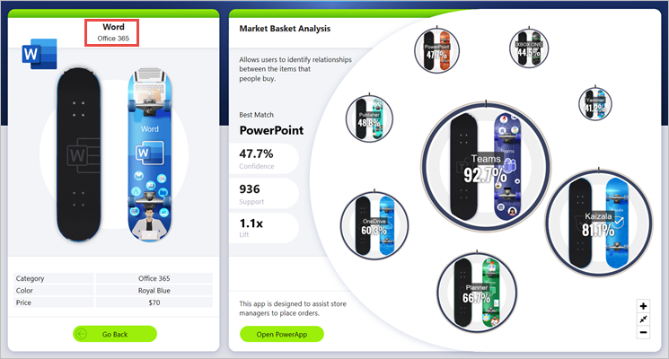
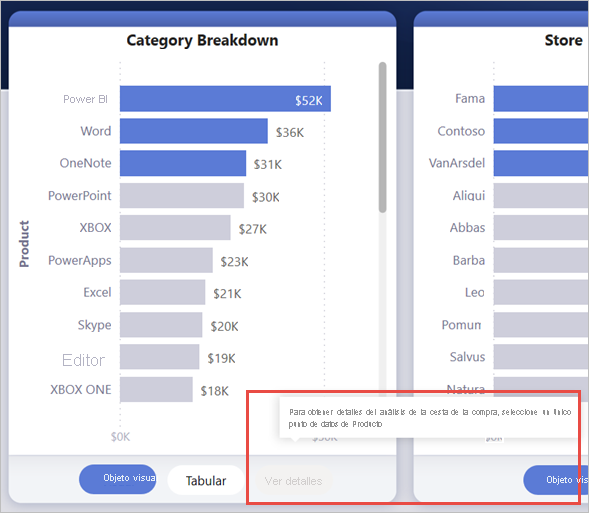
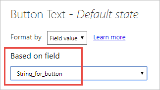
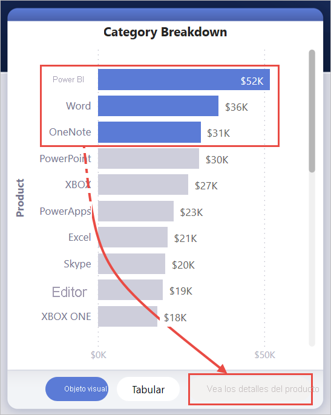
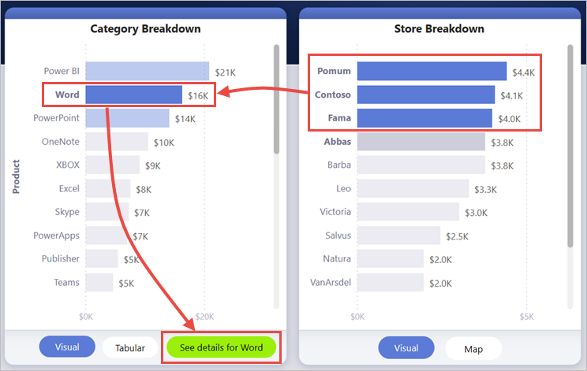
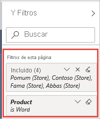
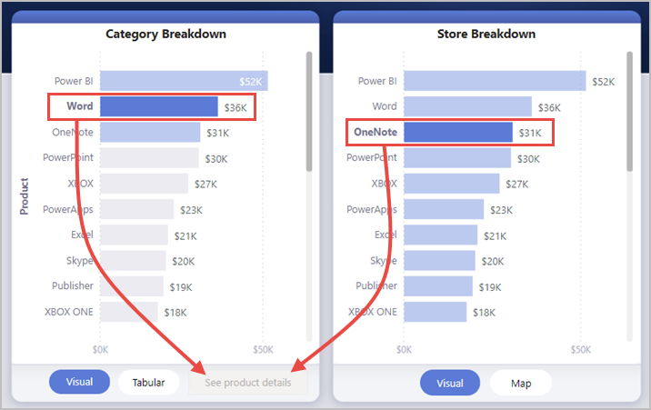

# <a name="create-a-drill-through-button-in-power-bi"></a>Creación de un botón de obtención de detalles en Power BI

Al crear un botón en Power BI, puede seleccionar la acción **Obtener detalles**. Este tipo de acción crea un botón que profundiza en una página enfocada para obtener detalles filtrados por un contexto específico.

Un botón de obtención de detalles puede ser útil si quiere aumentar la capacidad de detección de escenarios importantes de obtención de detalles en los informes.

En este ejemplo, cuando el usuario selecciona la barra de Word en el gráfico, se habilita el botón **Ver detalles**.


Al seleccionar el botón **Ver detalles**, se obtienen detalles de la página de análisis de la cesta de la compra. Como puede ver en el objeto visual de la izquierda, la página de obtención de detalles ahora está filtrada por Word.



## <a name="set-up-a-drill-through-button"></a>Configuración de un botón de obtención de detalles

Para configurar un botón de obtención de detalles, primero debe [configurar una página de obtención de detalles válida](desktop-drillthrough.md) en el informe. Después, debe crear un botón con **Obtener detalles** como el tipo de acción y seleccionar la página de obtención de detalles como **Destino**.

Como el botón de obtención de detalles tiene dos estados (la habilitación y deshabilitación de la obtención de detalles), verá que hay dos opciones de información sobre herramientas.


Si deja en blanco los cuadros de información sobre herramientas, Power BI genera dicha información de forma automática. La información sobre herramientas se basa en los campos de destino y obtención de detalles.

Este es un ejemplo de la información sobre herramientas generada de forma automática cuando el botón está deshabilitado:

"Para obtener detalles del análisis de la cesta de la compra (la página de destino), seleccione un único punto de datos de Producto (el campo de obtención de detalles)".



Y este es un ejemplo de la información sobre herramientas generada de forma automática cuando el botón está habilitado:

"Haga clic para obtener detalles del análisis de la cesta de la compra (la página de destino)".


Pero si quisiera proporcionar información sobre herramientas personalizada, siempre puede especificar una cadena estática. Todavía no se admite el formato condicional para la información sobre herramientas.

Puede usar el formato condicional para cambiar el texto del botón en función del valor seleccionado de un campo. Para ello, debe crear una medida que genere la cadena deseada según la función SELECTEDVALUE de DAX.

Esta es una medida de ejemplo que genera "Ver detalles del producto" si NO se selecciona un valor de producto único; de lo contrario, genera "Ver detalles para [el producto seleccionado]":

```
String_for_button = If(SELECTEDVALUE('Product'[Product], 0) == 0), "See product details", "See details for " & SELECTEDVALUE('Product'[Product]))
```

Una vez que haya creado esta medida, seleccione la opción **Formato condicional** para el texto del botón:


Después, seleccione la medida que ha creado para el texto del botón:



Cuando se selecciona un único producto, el texto del botón muestra:

"Ver detalles de Word"


Si no se selecciona ningún producto o, por el contrario, se selecciona más de uno, el botón está deshabilitado y el texto del botón muestra:

"Vea los detalles del producto"



## <a name="pass-filter-context"></a>Paso del contexto de filtro

El botón funciona como la obtención de detalles normal, por lo que también puede pasar filtros en campos adicionales mediante el filtrado cruzado de los objetos visuales que contienen el campo de obtención de detalles. Por ejemplo, si usa **Ctrl** + **clic** y el filtrado cruzado, puede pasar varios filtros por Tienda a la página de obtención de detalles porque las selecciones realizan el filtrado cruzado del objeto visual que contiene Producto, el campo de obtención de detalles:



Al seleccionar el botón de obtención de detalles, verá que los filtros en Tienda y Producto se pasan a la página de destino:



### <a name="ambiguous-filter-context"></a>Contexto de filtro ambiguo

Como el botón de obtención de detalles no está asociado a un único objeto visual, si la selección es ambigua, el botón se deshabilita.

En este ejemplo, el botón está deshabilitado porque dos objetos visuales contienen una sola selección en Producto. Existe ambigüedad sobre a qué punto de datos de qué objeto visual se va a enlazar la acción de obtención de detalles:



## <a name="limitations"></a>Limitaciones

- Este botón no permite varios destinos con un solo botón.
- Este botón solo admite la obtención de detalles dentro del mismo informe; es decir, no admite la obtención de detalles entre informes.
- El formato de estado deshabilitado del botón está enlazado a las clases de color del tema del informe. Obtenga más información sobre las [clases de color](desktop-report-themes.md#setting-structural-colors).
- La acción de obtención de detalles funciona con todos los objetos visuales integrados y también con *algunos* importados desde AppSource. Sin embargo, no se garantiza que funcione con *todos* los objetos importados desde AppSource.

## <a name="next-steps"></a>Pasos siguientes
Para obtener más información sobre las características que son similares o que interactúan con los botones, vea los siguientes artículos:

* [Creación de botones](desktop-buttons.md)
* [Uso de la obtención de detalles en informes de Power BI](desktop-drillthrough.md)
* [Uso de marcadores para compartir información detallada y crear historias en Power BI](desktop-bookmarks.md)

