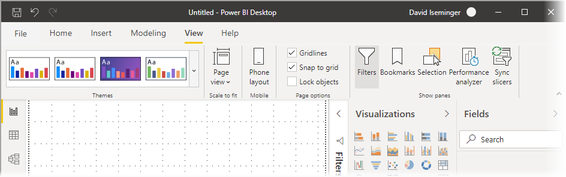

# Uso de la cinta actualizada en Power BI Desktop

Power BI Desktop ha revisado su cinta de opciones para alinear mejor su apariencia y experiencia con otros productos de Microsoft, como Microsoft Office.

## Habilitación de la cinta actualizada

La cinta de opciones actualizada está disponible con carácter general a partir de la versión de mayo de 2020 de Power BI Desktop. A partir de la actualización de marzo de 2020, la cinta actualizada está activada de forma predeterminada. 

## Características de la cinta de opciones actualizada

Las ventajas de actualizar la cinta de opciones están pensadas para que la experiencia de Power BI Desktop, así como otros productos de Microsoft, resulte fácil y familiar. 

Estas ventajas se pueden agrupar en las categorías siguientes:

* **Mejor apariencia y organización**: los iconos y la funcionalidad de la cinta de opciones actualizada de Power BI Desktop están alineados con la apariencia y la organización de los elementos de la cinta de las aplicaciones de Office.

    

* **Una galería intuitiva de temas**: la galería de temas, que se encuentra en la cinta de opciones **Vista**, tiene la apariencia familiar de la galería de temas de PowerPoint. De ese modo, las imágenes de la cinta de opciones muestran cómo se verá el tema si lo aplica al informe, como las fuentes y las combinaciones de colores. 

    

* **Contenido dinámico de la cinta de opciones según su vista**: en la cinta de opciones existente de Power BI Desktop, los iconos o comandos que no estaban disponibles simplemente aparecían atenuados, creando así una experiencia menos que óptima. Con la cinta de opciones actualizada, los iconos se muestran y organizan dinámicamente, por lo que siempre sabrá cuáles son las opciones disponibles según el contexto.

* **Una cinta de opciones de una sola línea que, cuando se contrae, ahorra espacio**: otra ventaja de la cinta de opciones actualizada es la capacidad de contraerse en una sola línea, mostrando de manera dinámica los elementos de la cinta según el contexto. 

    

* **Keytips para navegar y seleccionar botones**: para facilitar la navegación por la cinta, puede presionar **Alt + Tecla Windows** para activar las keytips. Una vez activadas, puede presionar en el teclado las teclas que se muestran para navegar.

    

* **Cadenas de formato personalizado**: además de establecer cadenas de formato personalizado en el panel *Propiedades*, también puede establecerlas en la cinta. Seleccione la medida o la columna que quiera personalizar y, en función de la selección, se mostrará una pestaña contextual **Herramientas de medidas** o **Herramientas de columnas**. En la sección de formato de la pestaña, puede escribir la cadena de formato personalizado directamente en el cuadro desplegable.

    

* **Accesibilidad**: la barra de título, la cinta y el menú Archivo son totalmente accesibles. Presione Ctrl + F6 para ir a la sección de la cinta. Una vez allí, puede presionar **Tab** para desplazarse entre las barras superior e inferior, y usar las teclas de dirección para desplazarse entre los elementos.

Además de esos cambios visibles, una cinta de opciones actualizada también nos permite realizar actualizaciones futuras en Power BI Desktop, y en su cinta de opciones, como se muestra a continuación:

* Crear controles más flexibles e intuitivos en la cinta, como la galería de objetos visuales.
* Agregar los temas *Negro* y *Gris oscuro* de Office a Power BI Desktop.
* Mejorar la accesibilidad.

## Pasos siguientes
Hay todo tipo de datos a los que puede conectarse con Power BI Desktop. Para obtener más información sobre orígenes de datos, consulte los siguientes recursos:

* [¿Qué es Power BI Desktop?](../fundamentals/desktop-what-is-desktop.md)
* [Orígenes de datos en Power BI Desktop](../connect-data/desktop-data-sources.md)
* [Combinar datos y darles forma con Power BI Desktop](../connect-data/desktop-shape-and-combine-data.md)
* [Connect to Excel workbooks in Power BI Desktop (Conectarse a libros de Excel en Power BI Desktop)](../connect-data/desktop-connect-excel.md)   
* [Especificar datos directamente en Power BI Desktop](../connect-data/desktop-enter-data-directly-into-desktop.md)   
