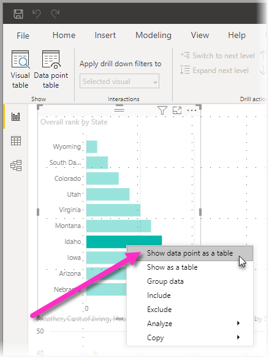

# Uso de tabla de objeto visual y tabla de punto de datos en Power BI Desktop
En **Power BI Desktop**, puede profundizar en los detalles de una visualización y ver representaciones textuales de los datos subyacentes o de los registros de datos individuales del objeto visual seleccionado. Estas características se conocen a veces como *click-through*, o *drill-through* u *obtención de detalles*.

Puede usar la **tabla de objeto visual** para ver los datos en un objeto visual como una tabla, o bien use la **tabla de punto de datos** para ver una tabla de los datos que se usan para calcular un punto de datos único. 

>[!IMPORTANT]
>La **tabla de objeto visual** y la **tabla de punto de datos** solo admiten los tipos de visualización siguientes:
>  - Gráfico de barras
>  - Gráfico de columnas
>  - Gráfico de anillos
>  - Mapa coroplético
>  - Embudo
>  - Mapa
>  - Gráfico circular
>  - Gráfico de rectángulos

## Uso de la tabla de objeto visual en Power BI Desktop

La **tabla de objeto visual** muestra los datos que subyacen a una visualización. La **tabla de objeto visual** aparece en la pestaña **Datos y detalles** de la sección **Mostrar** de la cinta de opciones cuando se selecciona un objeto visual.

También puede ver los datos al hacer clic con el botón derecho en una visualización y seleccionar **Permite mostrar datos** en el menú que aparece, o bien, al seleccionar **Más opciones** (...) en la esquina superior derecha de una visualización y, después, **Mostrar como tabla**.

&nbsp;&nbsp;

> [!NOTE]
> Debe mantener el puntero sobre un punto de datos del objeto visual para que el menú contextual esté disponible.

Al seleccionar **Tabla de objeto visual** o **Tabla de punto de datos**, el lienzo de Power BI Desktop muestra tanto la representación visual como la representación textual de los datos. En la *vista horizontal*, el objeto visual se muestra en la mitad superior del lienzo, mientras que los datos aparecen en la mitad inferior. 

Puede alternar entre la vista horizontal y una *vista vertical* si selecciona el icono en la esquina superior derecha del lienzo.

Para volver al informe, seleccione **< Volver al informe** en la esquina superior izquierda del lienzo.

## Uso de la tabla de punto de datos en Power BI Desktop

También puede centrarse en un registro de datos de una visualización y profundizar en los datos que contiene. Para usar **Tabla de punto de datos**, seleccione una visualización y, a continuación, **Tabla de punto de datos** en la pestaña **Datos y detalles** en la sección **Herramientas visuales** de la cinta. Después, seleccione una fila o punto de datos en la visualización. 

> [!NOTE]
> Si el botón **Tabla de punto de datos** de la cinta de opciones está deshabilitado y atenuado, significa que la visualización seleccionada no admite la **Tabla de punto de datos**.

También puede hacer clic con el botón derecho en un elemento de datos y seleccionar **Tabla de punto de datos** en el menú que aparece.

Al seleccionar **Tabla de punto de datos** para un elemento de datos, el lienzo de Power BI Desktop muestra todos los datos asociados al elemento seleccionado. 

Para volver al informe, seleccione **< Volver al informe** en la esquina superior izquierda del lienzo.

> [!NOTE]
>La **Tabla de punto de datos** tiene estas limitaciones:
> - No puede cambiar los datos de la vista **Tabla de punto de datos** y guardarlos de nuevo en el informe.
> - No se puede usar **Tabla de punto de datos** cuando el objeto visual usa una medida calculada en un grupo de medida (multidimensional).
> - No se puede usar **Tabla de punto de datos** al conectarse a un modelo multidimensional (MD) activo.

## Pasos siguientes
**Power BI Desktop** incluye todo tipo de características de administración de datos y formato de informes. Para ver algunos ejemplos, consulte los siguientes recursos:

* [Usar la agrupación y la discretización en Power BI Desktop](desktop-grouping-and-binning.md)
* [Usar líneas de cuadrícula, ajustar a la cuadrícula, orden Z, alineación y distribución en los informes de Power BI Desktop](desktop-gridlines-snap-to-grid.md)

