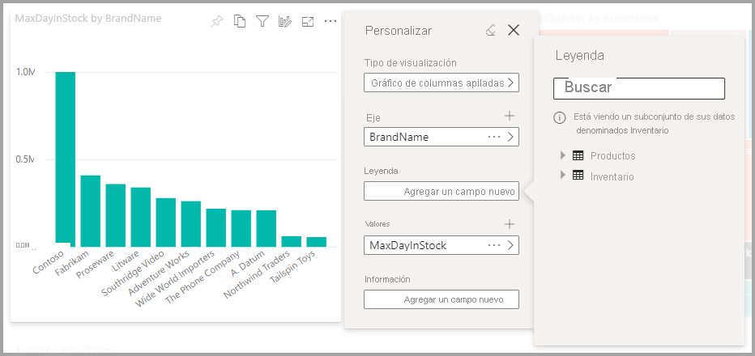

# Permitir a los usuarios personalizar los objetos visuales en un informe

[!INCLUDE [applies-to](../includes/applies-to.md)] [!INCLUDE [yes-desktop](../includes/yes-desktop.md)] [!INCLUDE [yes-service](../includes/yes-service.md)]

Al compartir un informe con un público amplio, es posible que algunos de los usuarios prefieran tener una vista diferente de determinados objetos visuales. Es posible que quieran cambiar lo que hay en el eje, cambiar el tipo de objeto visual o agregar algo a la información sobre herramientas. Es difícil crear un solo objeto visual que satisfaga los requisitos de todos. Con esta nueva capacidad, puede permitir a los consumidores explorar y personalizar objetos visuales, todo ello en la vista de lectura del informe. Pueden ajustar el objeto visual como quieran y guardarlo como un marcador para volver a él. No necesitan tener permiso para editar el informe ni ponerse en contacto con el autor del informe para hacer cambios.

:::image type="content" source="media/power-bi-personalize-visuals/power-bi-personalize-visual.png" alt-text="Personalizar un objeto visual":::
 
## Qué pueden cambiar los consumidores del informe

Esta característica permite a los consumidores obtener información adicional a través de la exploración ad hoc de objetos visuales en un informe de Power BI. Para aprender a usar esta característica como consumidor, consulte [Personalización de objetos visuales en un informe](../consumer/end-user-personalize-visuals.md). La característica es ideal para los creadores de informes que quieran habilitar escenarios de exploración básicos para los lectores de informes. Estas son las modificaciones que pueden realizar los lectores de informes:

- Cambiar el tipo de visualización
- Intercambiar una medida o una dimensión
- Agregar o quitar una leyenda
- Comparar dos o más medidas
- Cambiar agregaciones, etc.

Esta característica no solo incorpora nuevas funcionalidades de exploración, sino que también permite que los consumidores capturen y compartan sus cambios:

- Capturar los cambios
- Compartir los cambios
- Restablecer todos los cambios para un informe
- Restablecer todos los cambios para un objeto visual
- Borrar los cambios recientes

## Uso de perspectivas para obtener una vista más centrada

Para Personalizar objetos visuales, puede usar **Perspectivas** para elegir un subconjunto de un modelo que proporcione una vista más centrada. Elegir un subconjunto puede ser útil cuando se trabaja con un modelo de datos de gran tamaño, y le permite centrarse en un subconjunto de campos fácil de controlar, para no sobrecargar a los lectores del informe con la colección completa de campos de ese modelo grande. 

Tenga en cuenta las consideraciones siguientes cuando trabaje con perspectivas:

* Las perspectivas no están diseñadas para usarse como mecanismo de seguridad; son una herramienta para proporcionar una mejor experiencia para el usuario final. Toda la seguridad de una perspectiva se hereda del modelo subyacente.

* Las perspectivas se admiten en modelos tabulares y multidimensionales. Pero para las perspectivas de modelos multidimensionales, solo puede establecer la perspectiva para que sea igual que el cubo base del informe.

* Antes de eliminar una perspectiva de un modelo, asegúrese de comprobar que no se usa en la experiencia Personalizar objetos visuales. 

Para usar las perspectivas, debe habilitar Personalizar objetos visuales para el informe. También debe crear al menos una perspectiva que incluya las dimensiones y las medidas con las que quiere que interactúen los usuarios finales para la experiencia Personalizar objetos visuales.

Para crear la perspectiva, use [Tabular Editor](https://tabulareditor.com/), que puede descargar de la siguiente ubicación: Descarga de Tabular Editor

Una vez que instale **Tabular Editor**, abra el informe en **Power BI Desktop** e inicie **Tabular Editor** desde la pestaña **Herramientas externas** de la cinta, como se muestra en la imagen siguiente.

En Tabular Editor, haga clic con el botón derecho en la carpeta **Perspectivas** para crear una.

Puede hacer doble clic en el texto para cambiar el nombre de la perspectiva.

A continuación, agregue campos a la perspectiva; para ello, abra la carpeta **Tablas** en Tabular Editor y haga clic con el botón derecho en los campos que quiera mostrar en la perspectiva.

Repita el proceso para cada campo que quiera agregar a la perspectiva. No se pueden agregar campos duplicados a una perspectiva, por lo que tendrá la opción de agregar como deshabilitado cualquier campo que ya se haya agregado a una perspectiva.

Después de agregar todos los campos que quiere, asegúrese de guardar la configuración, tanto en Tabular Editor como en Power BI Desktop.

Una vez que haya guardado la nueva perspectiva en el modelo y el informe de Power BI Desktop, vaya al panel **Formato** de la página, donde verá una nueva sección **Personalizar objeto visual**.

La selección de *Perspectiva del lector de informes* se establece inicialmente en *Campos predeterminados*. Una vez que haya seleccionado la flecha desplegable, verá las otras perspectivas que ha creado.

Después de establecer la perspectiva de la página del informe, la experiencia Personalizar objetos visuales de la página se filtra a la perspectiva seleccionada. La selección de **Aplicar a todas las páginas** le permite aplicar la configuración de la perspectiva a todas las páginas existentes en el informe.

## Habilitar la característica en vista previa

Puesto que esta característica está en vista previa, primero debe activar el cambio de características. Vaya a **Archivo** > **Opciones y configuración** > **Opciones**. En **Configuración global** > **Características en vista previa**, asegúrese de que **Personalizar objetos visuales** está seleccionado.

:::image type="content" source="media/power-bi-personalize-visuals/power-bi-preview-personalize-visual.png" alt-text="Activar la personalización de objetos visuales":::

Es posible que tenga que reiniciar Power BI Desktop para verlo en la configuración del archivo actual.

## Habilitar la personalización en un informe

Después de activar la modificación de vista previa, deberá habilitarla específicamente para los informes para los que quiere que los consumidores puedan personalizar objetos visuales.

Puede habilitar la característica en Power BI Desktop o en el servicio Power BI.

### En Power BI Desktop

Para habilitar la característica en Power BI Desktop, vaya a **Archivo** > **Opciones y configuración** > **Opciones** > **Archivo actual** > **Configuración del informe**. Asegúrese de que **Personalizar objetos visuales (vista previa)** está activada.

:::image type="content" source="media/power-bi-personalize-visuals/power-bi-report-settings-personalize-visual.png" alt-text="Habilitar la personalización en un informe":::

### En el servicio Power BI

Para habilitar la característica en el servicio Power BI en su lugar, vaya a **Configuración** en el informe.

:::image type="content" source="media/power-bi-personalize-visuals/power-bi-report-service-settings-personalize-visual.png" alt-text="Configuración del informe en el servicio Power BI":::

Active **Personalizar objetos visuales (vista previa)**  > **Guardar**.

:::image type="content" source="media/power-bi-personalize-visuals/power-bi-report-service-personalize-visual.png" alt-text="Activar la personalización de objetos visuales en el servicio":::

## Seleccionar objetos visuales que se puedan personalizar

Cuando se habilita esta opción para un informe determinado, todos los objetos visuales del informe se pueden personalizar de forma predeterminada. Si no quiere que se personalicen todos los objetos visuales, puede activar o desactivar la configuración según el objeto visual.

Seleccione el objeto visual, seleccione **Formato** en el panel **Visualizaciones** y expanda **Encabezado de objeto visual**.

:::image type="content" source="media/power-bi-personalize-visuals/power-bi-format-visual-header-personalize.png" alt-text="Seleccionar el encabezado el objeto visual":::
 
Deslice **Personalizar objeto visual** >  **Activar** o **Desactivar**.

:::image type="content" source="media/power-bi-personalize-visuals/power-bi-format-visual-personalize-on-off.png" alt-text="Activar o desactivar personalización del objeto visual":::

## Limitaciones y problemas conocidos

Actualmente, la característica tiene algunas limitaciones que se deben tener en cuenta.

- Esta característica no es compatible con escenarios de inserción, incluido publicar en la web.
- Las exploraciones de los usuarios no se conservan automáticamente. Debe guardar la vista como un marcador personal para capturar los cambios.
- Esta característica se admite en las aplicaciones móviles de Power BI para tabletas iOS y Android, así como en su versión para Windows; no se admite en las aplicaciones móviles de Power BI para teléfonos. Pero cualquier cambio en un objeto visual que guarde en un marcador personal mientras se encuentre en el servicio Power BI se respetará en todas las aplicaciones móviles de Power BI.

También hay algunos problemas conocidos que estamos tratando:

- no se admite la adición de jerarquías; debe agregar los elementos secundarios individuales.
- No se puede cambiar una jerarquía de fecha a una fecha, o viceversa. 
- Con los marcadores personales, podría obtener resultados ligeramente diferentes en función de la secuencia que seleccione. Las discrepancias son posibles porque no capturamos el estado completo del informe, sino solo las modificaciones realizadas. La solución consiste en seleccionar **Restablecer valores predeterminados** y luego seleccionar el marcador que quiere ver. 

## Pasos siguientes

[Personalice objetos visuales en los informes](../consumer/end-user-personalize-visuals.md).     

Pruebe la nueva experiencia de personalización visual. Proporciónenos sus comentarios sobre esta característica y cómo podemos seguir mejorándola en el [sitio Ideas sobre Power BI](https://ideas.powerbi.com/forums/265200-power-bi). 

¿Tiene más preguntas? [Pruebe la comunidad de Power BI](https://community.powerbi.com/)
