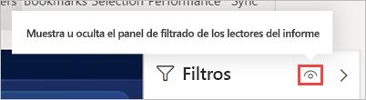
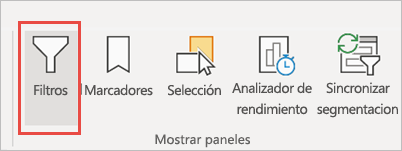
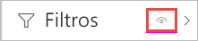
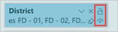
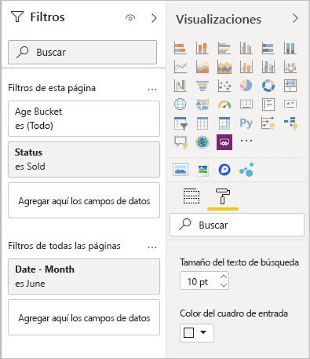
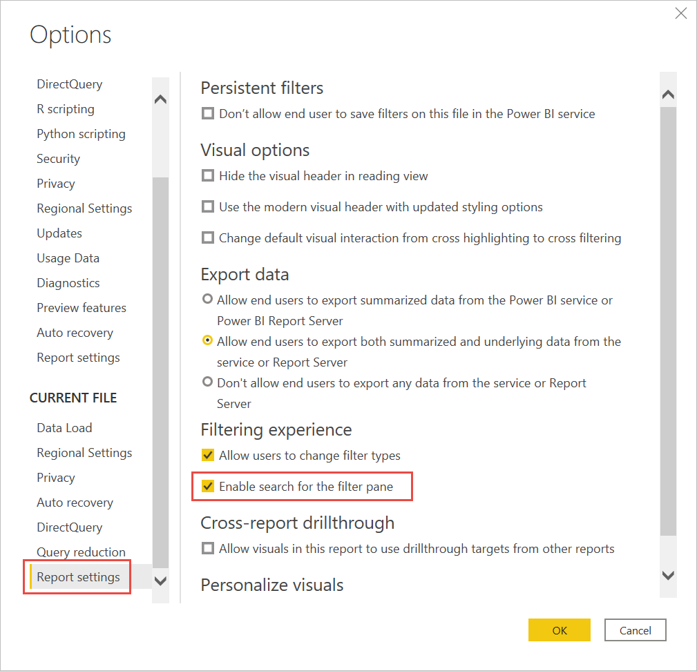
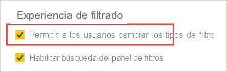

# <a name="design-filters-in-power-bi-reports"></a>Diseño de filtros en informes de Power BI

[!INCLUDE [applies-to](../includes/applies-to.md)] [!INCLUDE [yes-desktop](../includes/yes-desktop.md)] [!INCLUDE [yes-service](../includes/yes-service.md)]

Con la nueva experiencia de filtro, tiene un gran control sobre el diseño y la funcionalidad de los filtros de informe. Puede dar formato al panel Filtros para que se parezca al resto del informe. Puede bloquear e incluso ocultar filtros. Al diseñar su informe, ya no verá en absoluto el panel Filtros antiguo en el panel Visualizaciones. La edición y el formato de filtros se llevan a cabo en un solo panel Filtros. 


Como diseñador de informes, estas son algunas de las tareas que puede realizar en el nuevo panel Filtros:

- Agregar y quitar campos en los que filtrar. 
- Cambiar el estado del filtro.
- Aplicar formato al panel Filtros y personalizarlo para que parezca parte del informe.
- Definir si el panel de filtros está abierto o contraído de forma predeterminada cuando un consumidor abre el informe.
- Ocultar el panel Filtros entero o filtros específicos que no quiera que vean los consumidores del informe.
- Controlar, e incluso guardar como marcador, los estados de visibilidad, abierto y contraído del panel Filtros.
- Bloquear los filtros que no quiere que editen los consumidores.

Al leer un informe, los usuarios pueden mantener el mouse sobre cualquier objeto visual para ver una lista de solo lectura de todos los filtros o segmentaciones que afectan a ese objeto visual.


Lea acerca de [cómo los lectores de informes utilizan filtros](../consumer/end-user-report-filter.md) en el informe.

## <a name="view-filters-for-a-visual-in-reading-mode"></a>Ver los filtros de un objeto visual en modo de lectura

En el modo de lectura, mantenga el mouse sobre un icono de filtro de un objeto visual para ver una lista emergente con todos los filtros, segmentaciones, etc., que afectan a ese objeto visual. El formato de la lista de filtros emergente es el mismo que el del panel Filtros.


Estos son los tipos de filtros que se muestran en esta vista:

- Filtros básicos
- Segmentaciones
- Resaltado cruzado 
- Filtrado cruzado
- Filtros avanzados
- N filtros principales
- Filtros de fecha relativa
- Segmentaciones de sincronización
- Filtros de inclusión o exclusión
- Filtros que se pasan mediante una dirección URL

Obtenga más información sobre [interactuar con los filtros en el modo de lectura](../consumer/end-user-report-filter.md).

## <a name="build-the-filters-pane"></a>Creación del panel Filtros

Después de habilitar el nuevo panel Filtros, lo verá a la derecha de la página del informe, con el formato predeterminado basado en la configuración de informes actual. En el panel Filtros, se configuran los filtros que se van a incluir y se actualizan los filtros existentes. Al publicar el informe, el panel Filtros tendrá el mismo aspecto para los consumidores del informe. 

1. Los consumidores de informes podrán ver el panel Filtros de forma predeterminada. Si desea que lo vean, seleccione el icono de ojo situado junto a **Filtros**.

    

2. Para empezar a compilar el panel Filtros, arrastre los campos de interés a este como filtros de nivel de objeto visual, página o informe.

Cuando se agrega un objeto visual a un lienzo de informe, Power BI agrega de forma automática un filtro al panel Filtros de cada campo del objeto visual. 

## <a name="hide-the-filters-pane-while-editing"></a>Ocultación del panel Filtros durante la edición

Power BI Desktop tiene una nueva cinta en versión preliminar. En la pestaña **Vista**, el botón de alternancia **Filtros** permite mostrar u ocultar el panel Filtros. Esta característica es útil cuando no se usa el panel Filtros y se necesita espacio adicional en la pantalla. Esta adición alinea el panel Filtros con los demás paneles que se pueden abrir y cerrar, como Marcadores y Selección. 



Esta opción solo oculta el panel Filtros de Power BI Desktop. Si quiere ocultar el panel Filtros para los usuarios finales, seleccione el icono de **ojo** situado junto a **Filtros**.

 

## <a name="lock-or-hide-filters"></a>Bloquear u ocultar filtros

Puede bloquear u ocultar tarjetas de filtro individuales. Si bloquea un filtro, los consumidores de informes pueden verlo pero no modificarlo. Si lo oculta, no podrán ni siquiera verlo. Ocultar tarjetas de filtro es normalmente útil si necesita ocultar filtros de limpieza de datos que excluyen los valores nulos o inesperados. 

- En el panel Filtros, active o desactive los iconos **Bloquear filtro** u **Ocultar filtro** de una tarjeta de filtro.

   

A medida que active o desactive esta configuración en el panel Filtros, verá los cambios reflejados en el informe. Los filtros ocultos no se muestran en la lista emergente de filtros de un objeto visual.

También puede configurar el estado del panel Filtros para que fluya con los marcadores de informe. Los estados abierto, cerrado y de visibilidad del panel se pueden guardar como marcadores.
 
## <a name="format-the-filters-pane"></a>Formato del panel Filtros

Una parte importante de la experiencia de filtro es que puede aplicar formato al panel Filtros para que coincida con la apariencia del informe. También puede aplicar formato al panel Filtros de forma diferente para cada página del informe. Estos son los elementos a los que puede aplicar formato: 

- Color de fondo
- Transparencia del fondo
- Borde activado o desactivado
- Color del borde
- Título y tamaño de texto, color y fuente del encabezado

También puede aplicar formato a estos elementos en las tarjetas de filtro, según si se han aplicado (establecido en algún valor) o están disponibles (desactivados): 

- Color de fondo
- Transparencia del fondo
- Borde: activar o desactivar
- Color del borde
- Tamaño de texto, color y fuente
- Color del cuadro de entrada

### <a name="format-the-filters-pane-and-cards"></a>Aplicar formato al panel Filtros y las tarjetas

1. En el informe, haga clic en el informe propiamente dicho o en el fondo (*papel tapiz*) y, en el panel **Visualizaciones**, seleccione **Formato**. 
    Verá las opciones de formato de la página del informe, el papel tapiz y también el panel Filtros y las tarjetas de filtro.

1. Expanda el **panel Filtros** para establecer el color del fondo, el icono y el borde izquierdo, a fin de complementar la página del informe.

    

1. Expanda **Tarjetas de filtro** para establecer el color y el borde **Disponible** y **Aplicado**. Si crea las tarjetas disponibles y aplicadas con diferentes colores, es obvio qué filtros se aplican. 
  
    

## <a name="theming-for-filters-pane"></a>Temas del panel Filtros
Ya puede modificar la configuración predeterminada del panel Filtros con el archivo de tema. Este es un fragmento del tema de ejemplo que puede ayudarle a comenzar:

 
```
"outspacePane": [{ 

"backgroundColor": {"solid": {"color": "#0000ff"}}, 

"foregroundColor": {"solid": {"color": "#00ff00"}}, 

"transparency": 50, 

"titleSize": 35, 

"headerSize": 8, 

"fontFamily": "Georgia", 

"border": true, 

"borderColor": {"solid": {"color": "#ff0000"}} 

}], 

"filterCard": [ 

{ 

"$id": "Applied", 

"transparency": 0, 

"backgroundColor": {"solid": {"color": "#ff0000"}}, 

"foregroundColor": {"solid": {"color": "#45f442"}}, 

"textSize": 30, 

"fontFamily": "Arial", 

"border": true, 

"borderColor": {"solid": {"color": "#ffffff"}}, 

"inputBoxColor": {"solid": {"color": "#C8C8C8"}} 

}, 

{ 

"$id": "Available", 

"transparency": 40, 

"backgroundColor": {"solid": {"color": "#00ff00"}}, 

"foregroundColor": {"solid": {"color": "#ffffff"}}, 

"textSize": 10, 

"fontFamily": "Times New Roman", 

"border": true, 

"borderColor": {"solid": {"color": "#123456"}}, 

"inputBoxColor": {"solid": {"color": "#777777"}} 

}] 
```

## <a name="sort-the-filters-pane"></a>Ordenación del panel Filtros

La funcionalidad de ordenación personalizada está disponible en el panel Filtros. Al crear el informe, puede arrastrar y colocar filtros para reorganizarlos en cualquier orden.


El criterio de ordenación predeterminado es alfabético para los filtros. Para iniciar el modo de ordenación personalizada, solo tiene que arrastrar cualquier filtro a una nueva posición. Solo puede ordenar filtros en el nivel al que se aplican, como, por ejemplo, un filtro de nivel de objeto visual, nivel de página o nivel de informe.

## <a name="improved-filters-pane-accessibility"></a>Accesibilidad al panel Filtros mejorada

Hemos mejorado la navegación mediante el teclado para el panel Filtros. Puede tabular a través de todas las partes del panel Filtros y usar la clave de contexto en su teclado o Mayús+F10 para abrir el menú contextual.


## <a name="rename-filters"></a>Cambiar el nombre de los filtros
Al editar el panel Filtros, puede hacer doble clic en el título para editarlo. El cambio del nombre resulta útil si desea actualizar la tarjeta de filtro para facilitar la comprensión de los usuarios finales. Tenga en cuenta que al cambiarse el nombre de la tarjeta de filtro *no* se cambia el nombre para mostrar del campo en la lista de campos. Solo cambia el nombre para mostrar usado en la tarjeta de filtro.


## <a name="filters-pane-search"></a>Búsqueda en el Panel filtros

La característica de búsqueda del panel Filtros permite realizar una búsqueda por título en las tarjetas de filtro. Esta característica es útil si tiene varias tarjetas de filtro diferentes en el panel Filtros y necesita ayuda para buscar las que le interesan.


También puede dar formato al cuadro de búsqueda, de la misma forma que a los demás elementos del panel Filtros.



Aunque esta característica de búsqueda del panel Filtros está activada de forma predeterminada, también puede optar por activarla o desactivarla seleccionando **Habilitar búsqueda para el panel de filtros** en la configuración de **Informe** del cuadro de diálogo **Opciones**.



## <a name="restrict-changes-to-filter-type"></a>Restringir los cambios al tipo de filtro

En la sección de **Experiencia de filtrado** de la configuración de **Informe**, tiene la opción de controlar si los usuarios pueden cambiar el tipo de filtro.



## <a name="allow-saving-filters"></a>Habilitación del guardado de filtros

De forma predeterminada, los lectores del informe pueden guardar filtros para el informe. Puede optar por no permitirles guardar los filtros.

- También, en la configuración de **Informe** del cuadro de diálogo **Opciones**, en **Filtros persistentes**, seleccione **No permitir que el usuario final guarde filtros en este informe**.

    :::image type="content" source="media/power-bi-report-filter/power-bi-persistent-filters.png" alt-text="Captura de pantalla de la opción &quot;No permitir que el usuario final guarde filtros en este informe&quot;.":::

## <a name="apply-filters-button"></a>Botón Aplicar filtros

Puede agregar un solo botón **Aplicar** al panel filtro, lo que permite que usted y los usuarios finales apliquen todas las modificaciones de filtro a la vez. Este botón puede ser útil si quiere aplazar la aplicación de los cambios de filtro. Solo tiene que esperar una vez, una vez que esté listo para aplicar todos los cambios de filtro en el informe o los objetos visuales.

:::image type="content" source="media/power-bi-report-filter/apply-filter-button.png" alt-text="Botón Aplicar filtro":::

### <a name="turn-on-the-apply-button"></a>Activación del botón Aplicar

Puede establecer esta característica en el nivel de informe. Sin embargo, la característica está desactivada de forma predeterminada.

1. Vaya a **Archivo** > **Opciones y configuración** > **Opciones** > **Reducción de consulta**.

1. Seleccione **Agregar un único botón Aplicar al panel de filtros para aplicar los cambios a la vez**.

    :::image type="content" source="media/power-bi-report-filter/apply-all-filters.png" alt-text="Activación del botón Aplicar filtro":::

### <a name="format-the-apply-button"></a>Formato del botón Aplicar

Actualmente, puede controlar parte del formato del texto **Aplicar** para el botón. En la sección **Panel de filtros** del panel **Formato**, establezca estas opciones:

- **Color de las casillas y el botón Aplicar** controla el color de relleno. 
- **Fuente y color de los iconos** controla el color del texto.
- **Tamaño del texto de encabezado** controla el tamaño del texto.
- **Familia de fuentes** controla la fuente.

    :::image type="content" source="media/power-bi-report-filter/format-apply-filter.gif" alt-text="Formato del texto del botón Aplicar filtro":::

## <a name="considerations-and-limitations"></a>Consideraciones y limitaciones

Publicar en web no muestra el panel Filtros. Si tiene previsto publicar un informe en la web, considere la posibilidad de agregar segmentaciones para filtrar.

## <a name="next-steps"></a>Pasos siguientes

- [Uso de filtros de informe](../consumer/end-user-report-filter.md)
- [Filtrado y resaltado en informes](power-bi-reports-filters-and-highlighting.md)
- [Different kinds of filters in Power BI](power-bi-report-filter-types.md) (Diferentes tipos de filtros en Power BI)

¿Tiene más preguntas? [Pruebe la comunidad de Power BI](https://community.powerbi.com/)
