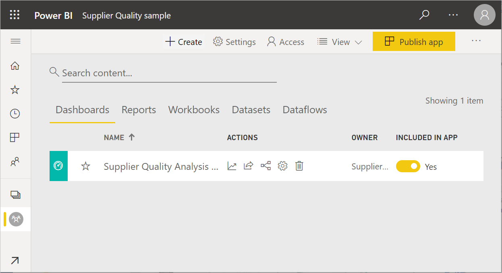
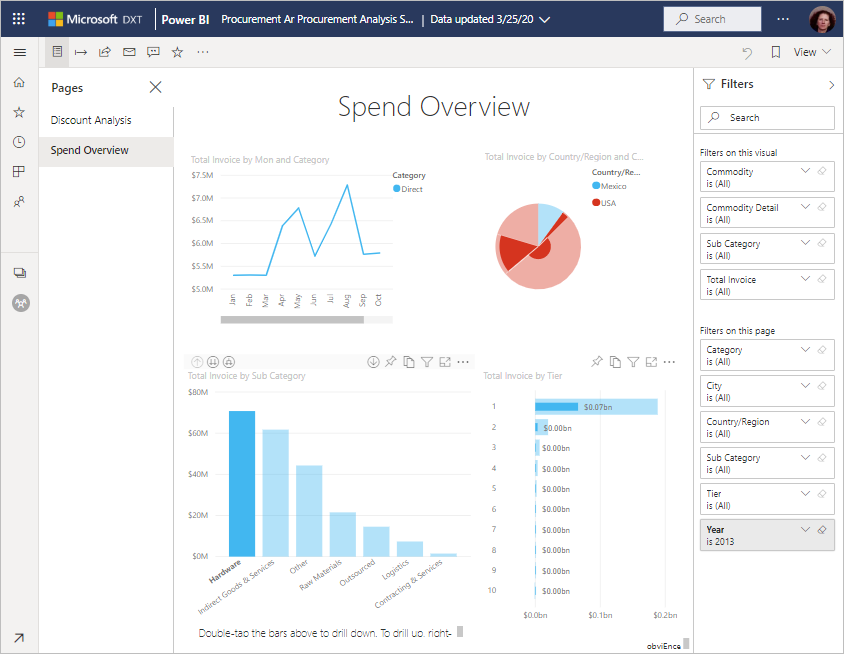

# Obtención de ejemplos para Power BI
Supongamos que nunca antes ha utilizado Power BI y quiere probarlo, pero no tiene datos con los que trabajar.  O quizás quiera ver informes que muestran algunas de las funcionalidades de Power BI. Tenemos lo que necesita.

Power BI ofrece diferentes tipos de ejemplos para distintos propósitos: 
- Un **[informe de Power BI](#sales--returns-sample-pbix-file) (archivo. pbix)** que puede ver en Data Stories Gallery, abrir y explorar en Power BI Desktop o cargar en el servicio Power BI.
- Una **[aplicación de ejemplo](#sample-app-from-appsource)** que descarga de AppSource, también en el servicio Power BI. Las aplicaciones incluyen paneles, informes y conjuntos de datos. Puede modificarlos y distribuirlos a sus compañeros.
- **[Ocho ejemplos integrados originales](#eight-original-samples)** en el servicio Power BI como *paquetes de contenido*, con paneles, informes y conjuntos de datos. Puede instalarlos directamente en el servicio Power BI. Los ejemplos integrados también están disponibles como informes de Power BI (.pbix) y libros de Excel (.xlsx).
- Versiones de **[libro de Excel](#download-sample-excel-files)** de los ejemplos integrados, que contienen el modelo de datos y las hojas de Power View. Puede explorar o editar el modelo de datos en Excel y utilizar el libro de Excel como origen de datos para un informe de Power BI. También puede cargar el libro como un archivo de Excel y mostrar los objetos visuales y las tablas dinámicas de Excel en informes de Power BI. 
- Además, un **[libro de ejemplo de datos financieros](sample-financial-download.md)** , una tabla plana simple en un archivo de Excel disponible para su descarga. Contiene datos anónimos con productos ficticios, con ventas divididas por segmentos y países o regiones. Supone un origen de datos básico útil para un informe de Power BI.

Nuestra documentación en línea usa estos mismos ejemplos en los tutoriales y ejemplos, por lo que puede seguir el tutorial.

## Archivo .pbix de ejemplo de ventas y devoluciones

:::image type="content" source="media/sample-datasets/sales-returns-sample-pbix.png" alt-text="Archivo .pbix de ejemplo de ventas y devoluciones":::

*Informe de ejemplo de ventas y devoluciones*

Los diseñadores de informes de Power BI Miguel Myers y Chris Hamill crearon un archivo. pbix de ventas y devoluciones para mostrar muchas características nuevas en Power BI, incluidos los botones, la obtención de detalles, el formato condicional, los escenarios de hipótesis y la información sobre herramientas personalizada. 

El escenario que se ha creado para este informe es una empresa que vende monopatines de la temática Microsoft. Quieren ver el estado de sus ventas y devoluciones y analizar de qué modo deben modificar sus operaciones. 

Puede explorarlo de estas maneras:

- Véalo e interactúe con él en [Data Stories Gallery](https://community.powerbi.com/t5/Data-Stories-Gallery/Sales-amp-Returns-Sample-Report/m-p/876607) de la Comunidad de Power BI.
- Descargue el archivo. pbix y explórelo en profundidad. Eche un vistazo "tras el telón" para ver cómo lo creó Miguel. Al seleccionar este vínculo se descarga el archivo automáticamente: [Informe de ejemplo de ventas y devoluciones](https://go.microsoft.com/fwlink/?linkid=2113239).
- Lea sobre el informe en la entrada de blog Power BI [Un recorrido por el nuevo informe de ejemplo de ventas y devoluciones](https://powerbi.microsoft.com/blog/take_a_tour_of_the_new_sales_returns_sample_report/).

## Aplicación de ejemplo de AppSource

La *aplicación* de marketing y ventas está disponible en Microsoft AppSource. Una aplicación es un tipo de contenido de Power BI que combina paneles e informes. Una aplicación puede tener uno o más paneles e informes, todos ellos agrupados. Puede descargar la aplicación de marketing y ventas desde **Aplicaciones** en el servicio Power BI o bien visitando AppSource con el explorador.

- En el artículo [Instalación y uso de aplicaciones](../consumer/end-user-app-view.md) se explica cómo descargar una aplicación desde el servicio Power BI.
- Este vínculo le lleva a la aplicación de [ventas y marketing](https://appsource.microsoft.com/product/power-bi/microsoft-retail-analysis-sample.salesandmarketingsample?tab=Overview) en AppSource.

Después de instalarla, la verá en la colección de aplicaciones.

:::image type="content" source="media/sample-datasets/power-bi-sales-marketing-app.png" alt-text="Icono de la aplicación de ventas y marketing":::

Cuando la abra, seleccione **Explorar con datos de ejemplo**. 

:::image type="content" source="media/sample-datasets/power-bi-explore-app.png" alt-text="Exploración de la aplicación":::

Verá la vista de la aplicación, con el panel y las páginas del informe individuales en el panel de navegación. 

:::image type="content" source="media/sample-datasets/power-bi-sales-marketing-app-navigation.png" alt-text="Panel de navegación de la aplicación":::

Como la ha instalado, también puede abrir el *área de trabajo* y editar los elementos de la aplicación. Seleccione la icono de lápiz **Editar** para abrir el área de trabajo.

:::image type="content" source="media/sample-datasets/power-bi-app-edit-pencil.png" alt-text="Edición de la aplicación":::

Ahora verá el panel, el informe y el conjunto de datos de la aplicación en la vista de lista del área de trabajo. Aquí, en el área de trabajo, puede editar cada uno de estos elementos.

:::image type="content" source="media/sample-datasets/power-bi-sales-marketing-workspace.png" alt-text="Área de trabajo de ventas y marketing":::

Si lo desea, puede distribuir esta aplicación a cualquier persona de su organización. Haga clic en **Actualizar aplicación**.

:::image type="content" source="media/sample-datasets/power-bi-update-app.png" alt-text="Botón Actualizar aplicación":::

Complete la pestaña de **configuración**, incluida la elección de un **color de tema de la aplicación**. 

:::image type="content" source="media/sample-datasets/power-bi-app-setup.png" alt-text="Selección de una configuración para la aplicación":::

Complete las pestañas de **navegación** y de **permisos** y, a continuación, seleccione **Actualizar aplicación**.

:::image type="content" source="media/sample-datasets/power-bi-select-update-app.png" alt-text="Selección de Actualizar aplicación para publicarla":::

Obtenga más información sobre la [publicación de aplicaciones en Power BI](../collaborate-share/service-create-distribute-apps.md).

## Ocho ejemplos originales
Hay ocho ejemplos originales que puede utilizar. Cada uno de ellos representa un sector diferente. Puede interactuar con cada uno de ellos en diferentes formatos:

- Instale los [paquetes de contenido integrados](#install-built-in-content-packs) en el servicio Power BI.
- Descargue los [archivos de informe de Power BI](#download-original-sample-power-bi-files) (.pbix).
- Descargue los [archivos de libro de Excel](#download-sample-excel-files) (.xlsx) y, a continuación, cárguelos en el servicio Power BI.
- Explore los [archivos de Excel en la propia aplicación Excel](#explore-excel-samples-inside-excel).

La empresa obviEnce ([www.obvience.com](http://www.obvience.com/)) y Microsoft han colaborado para crear ejemplos que puede usar con Power BI.  Los datos son anónimos e ilustran diferentes sectores: finanzas, recursos humanos, ventas, etc. 

Cada uno de los ejemplos está disponible en diferentes formatos: paquete de contenido, libro de Excel y archivo .pbix de Power BI. Si no sabe qué es todo esto ni cómo se utiliza, no se preocupe: En este artículo se explica todo. Para cada uno de estos ejemplos, hemos creado un *recorrido*. Los recorridos son artículos que detallan el trasfondo del ejemplo y le guían a través de diferentes escenarios. En estos escenarios, por ejemplo, es posible que tenga que responder las preguntas de su jefe, buscar conocimientos que le hagan más competitivo o crear informes y paneles para compartirlos o explicar un cambio del negocio.

Antes de comenzar, estas son las directrices legales sobre el uso de estos ejemplos. Después de eso, se presentarán los ejemplos y se mostrarán cómo utilizarlos.

### Instrucciones de uso para los libros de Excel de ejemplo

&copy;2015 Microsoft Corporation. All rights reserved. Los documentos y libros se proporcionan "tal cual". La información y las opiniones expresadas en los libros, incluidas direcciones URL y otras referencias a sitios web de Internet, pueden cambiar sin previo aviso. El usuario asume el riesgo de su uso. Algunos ejemplos son ficticios y únicamente tienen fines ilustrativos. No se pretende establecer ni inferir ninguna asociación real. Microsoft no otorga ninguna garantía, explícita o implícita, con respecto a la información proporcionada aquí.

Los libros no proporcionan ningún derecho legal sobre la propiedad intelectual de ningún producto de Microsoft. Puede copiar y usar este libro para fines de consulta interna.

Los libros y datos relacionados son proporcionados por obviEnce. [www.obvience.com](http://www.obvience.com)

obviEnce es un ISV y una incubadora de propiedad intelectual (PI) centrada en la inteligencia empresarial de Microsoft. obviEnce trabaja en estrecha colaboración con Microsoft para desarrollar prácticas recomendadas y liderazgo intelectual para impulsar e implementar soluciones de inteligencia empresarial de Microsoft.

Los libros y datos son propiedad de obviEnce, LLC y se comparten únicamente con el propósito de demostrar las funciones de Power BI con datos de ejemplo del sector.

Todos los usos de los libros y datos deben incluir la atribución anterior (que se encuentra también en la hoja de cálculo de información incluida con cada libro). El libro y las visualizaciones se deben ir acompañados del siguiente aviso de copyright: obviEnce &copy;.

Si hace clic en cualquiera de los siguientes vínculos para descargar los archivos de los libros de Excel o los archivos .pbix, estará aceptando las condiciones anteriores.

### Ejemplo de rentabilidad del cliente  
[Realice un recorrido por el ejemplo de rentabilidad del cliente](sample-customer-profitability.md)

En este ejemplo sectorial se analizan las principales métricas que un director financiero usa con los ejecutivos, productos y clientes de la empresa. Puede investigar qué factores afectan a la rentabilidad de la empresa.

### Ejemplo de recursos humanos 
[Realice un recorrido por el ejemplo de recursos humanos](sample-human-resources.md)

En este ejemplo sectorial se analiza la estrategia de contratación de una empresa a través de las nuevas contrataciones, los empleados activos y los empleados que se han marchado.  Al explorar los datos, puede encontrar tendencias de separaciones voluntarias e inclinaciones en la estrategia de contratación.

### Ejemplo Análisis de gastos de TI 
[Realice un recorrido por el ejemplo de análisis de gastos de TI](sample-it-spend.md)

En este ejemplo sectorial se analizan los costos planeados frente a los costos reales del departamento de TI de una empresa. Esta comparación nos ayuda a comprender la calidad del planeamiento anual y de la investigación de las áreas con enormes desviaciones del planeamiento que ha realizado la empresa. La empresa de este ejemplo pasa por un ciclo de planeamiento anual y produce trimestralmente un nuevo último cálculo que ayude a analizar los cambios del gasto en TI durante el año fiscal.

### Ejemplo de análisis de oportunidades 
[Realice un recorrido por el ejemplo de análisis de oportunidades](sample-opportunity-analysis.md)

En este ejemplo sectorial, se analiza el canal de ventas de una empresa de software. Los directores de ventas supervisan sus canales de ventas directas y de los socios mediante el seguimiento de las oportunidades y los ingresos por región, magnitud de la negociación y canal.

### Ejemplo de análisis de adquisiciones  
[Realice un recorrido por el ejemplo de análisis de adquisiciones ](sample-procurement.md)

En este ejemplo sectorial se analizan las principales métricas que un director financiero usa con los ejecutivos, productos y clientes de la empresa. Puede investigar qué factores afectan a la rentabilidad de la empresa.

### Ejemplo de análisis de venta al por menor  
[Realice un recorrido por el ejemplo de análisis de minoristas](sample-retail-analysis.md)

En este ejemplo sectorial, se analizan los datos de venta al por menor de ciertos artículos vendidos en diferentes tiendas y distritos. Las métricas comparan el rendimiento de este año con el del año pasado en estas áreas: ventas, unidades, margen bruto y varianza, así como análisis de nuevas tiendas.

### Ejemplo de ventas y marketing  
[Realice un recorrido por el ejemplo de marketing y ventas](sample-sales-and-marketing.md)

En este ejemplo sectorial, se analiza una empresa manufacturera: VanArsdel Ltd. Permite que el director de marketing inspeccione el sector y la cuota de mercado de VanArsdel.  Al examinar el ejemplo puede encontrar la cuota de mercado, el volumen de productos, las ventas y las ideas de la empresa.

### Ejemplo Calidad de los proveedores  
[Realice un recorrido por el ejemplo de análisis de calidad de proveedores](sample-supplier-quality.md)

Este ejemplo sectorial se centra en uno de los desafíos más comunes de la cadena de suministro: el análisis de calidad de los proveedores. Hay dos métricas principales en juego en este análisis: el número total de defectos y el tiempo de inactividad total que estos defectos han provocado. Este ejemplo tiene dos objetivos principales: comprender cuáles son los mejores y los peores proveedores en lo referente a la calidad e identificar qué fábricas realizan mejor el trabajo de encontrar y eliminar los defectos para reducir el tiempo de inactividad.

### Instalación de paquetes de contenido integrados

Comencemos con los *paquetes de contenido*. Los ejemplos integrados están disponibles en la servicio Power BI; no tiene que salir de Power BI para encontrarlos. Un paquete de contenido es una agrupación de uno o varios paneles, conjuntos de datos e informes que alguien crea y que puede usarse con el servicio Power BI. Todos los paquetes de contenido de ejemplo de Power BI cuentan con un conjunto de datos, un informe y un panel.  Los paquetes de contenido siguen estando disponibles, pero cada vez se usan menos. No están disponibles para Power BI Desktop.

1. Abra el servicio Power BI (app.powerbi.com) e inicie sesión.
2. Vaya a Mi área de trabajo u otra área de trabajo en la que desee instalar el ejemplo. 
2. En la esquina inferior izquierda, seleccione **Obtener datos**.

    
3. En la página Obtener datos, seleccione **Ejemplos**.

   
4. Seleccione uno de los ejemplos para abrir su descripción y elija **Conectar**.  

   
5. Power BI importa el paquete de contenido y agrega un nuevo panel, informe y conjunto de datos en el área de trabajo actual. Utilice los ejemplos para realizar una serie de pruebas en Power BI.  

   

Ahora que tiene los datos, va por buen camino.  Pruebe alguno de los tutoriales con los paquetes de contenido de ejemplo o, sencillamente, abra un servicio Power BI e investigue.

### Descarga de archivos de Power BI de ejemplo originales
Todos los paquetes de contenido de ejemplo también están disponibles como archivos .pbix de Power BI. Los archivos .pbix están diseñados para usarse con Power BI Desktop.  

1. Descargue uno a uno los archivos utilizando los vínculos siguientes. Si selecciona alguno de estos vínculos, el archivo se guardará automáticamente en la carpeta de descargas. 

   - [Archivo PBIX del ejemplo de rentabilidad del cliente](https://download.microsoft.com/download/6/A/9/6A93FD6E-CBA5-40BD-B42E-4DCAE8CDD059/Customer%20Profitability%20Sample%20PBIX.pbix)
   - [Archivo PBIX del ejemplo de recursos humanos](https://download.microsoft.com/download/6/9/5/69503155-05A5-483E-829A-F7B5F3DD5D27/Human%20Resources%20Sample%20PBIX.pbix)
   - [Archivo PBIX del ejemplo de análisis de adquisiciones](https://download.microsoft.com/download/D/5/3/D5390069-F723-413B-8D27-5888500516EB/Procurement%20Analysis%20Sample%20PBIX.pbix)
   - [Archivo PBIX del ejemplo de análisis de venta directa ](https://download.microsoft.com/download/9/6/D/96DDC2FF-2568-491D-AAFA-AFDD6F763AE3/Retail%20Analysis%20Sample%20PBIX.pbix)
   - [Archivo PBIX del ejemplo de marketing y ventas](https://download.microsoft.com/download/9/7/6/9767913A-29DB-40CF-8944-9AC2BC940C53/Sales%20and%20Marketing%20Sample%20PBIX.pbix)
   - [Archivo PBIX del ejemplo de análisis de calidad de proveedores](https://download.microsoft.com/download/8/C/6/8C661638-C102-4C04-992E-9EA56A5D319B/Supplier-Quality-Analysis-Sample-PBIX.pbix)

1. En Power BI Desktop, seleccione **Archivo > Abrir** y acceda a la ubicación en la que guardó el archivo .pbix de ejemplo.

4. Seleccione el archivo .pbix para abrirlo en Power BI Desktop.

### Descarga de archivos de Excel de ejemplo
Todos los paquetes de ejemplo de contenido también están disponibles como libros de Excel. Estos libros se han diseñado para usarse con el servicio Power BI.  

1. Puede descargar los archivos de uno en uno a través de los vínculos siguientes o [descargar un archivo ZIP con todos los archivos de ejemplo](https://go.microsoft.com/fwlink/?LinkId=535020). Si tiene conocimientos avanzados, es posible que prefiera descargar los libros de Excel para explorar o modificar los modelos de datos.

   - [Ejemplo de rentabilidad del cliente](https://go.microsoft.com/fwlink/?LinkId=529781)
   - [Ejemplo de recursos humanos](https://go.microsoft.com/fwlink/?LinkId=529780)
   - [Ejemplo de seguimiento de oportunidad](https://go.microsoft.com/fwlink/?LinkId=529782)
   - [Ejemplo de análisis de adquisiciones](https://go.microsoft.com/fwlink/?LinkId=529784)
   - [Ejemplo de análisis de venta directa](https://go.microsoft.com/fwlink/?LinkId=529778)
   - [Ejemplo de marketing y ventas](https://go.microsoft.com/fwlink/?LinkId=529785)
   - [Ejemplo de análisis de calidad de proveedores](https://go.microsoft.com/fwlink/?LinkId=529779)

2. Guarde el archivo descargado. Elegir una ubicación u otra presenta algunas diferencias.

      **Local**: si guarda el archivo en una unidad local en el equipo o en otra ubicación de la organización, puede importar el archivo a Power BI. El archivo sigue estando en la unidad local, por lo que no se ha importado por completo a Power BI. Lo que sucede es que se crea un nuevo conjunto de datos en el sitio de Power BI y los datos y, en algunos casos el modelo de datos, se cargan en el conjunto de datos. Si el archivo contiene informes, estos aparecerán en el sitio de Power BI en Informes.
    
     **OneDrive - Empresa**: si dispone de OneDrive para la Empresa, la forma más eficaz de mantener sincronizado el trabajo efectuado en Excel, en Power BI o en un archivo .CSV con el conjunto de datos, los informes y los paneles en Power BI es iniciar sesión en OneDrive con la misma cuenta que utiliza para Power BI. Dado que tanto Power BI como OneDrive están en la nube, Power BI se conecta al archivo en OneDrive cada hora aproximadamente. Si se detectan cambios, se actualizarán automáticamente el conjunto de datos, los informes y los paneles en Power BI.
    
    **SharePoint: sitios de grupo**: guardar los archivos de Power BI en SharePoint: sitios de grupo es muy parecido a guardarlos en OneDrive para la Empresa. La diferencia más importante es cómo se conecta al archivo desde Power BI. Puede especificar una dirección URL o conectarse a la carpeta raíz.
1. Abra el servicio Power BI (app.powerbi.com) e inicie sesión.

1. Vaya a Mi área de trabajo o a otra área de trabajo, o cree un área de trabajo solo para el ejemplo.

4. En la esquina inferior izquierda del panel de navegación, seleccione **Obtener datos**.

    
5. En la página**Obtener datos** que aparece, seleccione **Archivos > Obtener**.

    
6. Seleccione a la ubicación en la que descargó y guardó el ejemplo.

    
7. Seleccione el archivo. En función de dónde haya guardado el archivo, seleccione **Conectar** o **Abrir**.

8. Indique si desea importar los datos o prefiere abrir el libro en Power BI para verlo exactamente igual que lo vería en línea con Excel.

    
9. Si selecciona **Importar**, Power BI importa el libro de ejemplo y lo agrega como un nuevo panel, informe y conjunto de datos, en este caso llamado **Ejemplo de análisis de adquisiciones**.

    - Dado que el libro tiene hojas de Power View, Power BI crea un informe con una página para cada hoja de Power BI. 
    - Power BI crea un nuevo panel con un nuevo mosaico en blanco.  Al seleccionar ese icono, se le llevará al informe que acaba de agregar.

10. Abra el informe. Seleccione distintos elementos del informe para explorar sus interacciones. 

    

### Exploración de ejemplos de Excel en Excel

(Opcional) ¿Le gustaría saber cómo se convierten los datos de un libro de Excel en conjuntos de datos e informes de Power BI? Si abre los ejemplos de Excel *en Excel* y analiza las hojas de cálculo, encontrará algunas respuestas.

- La primera vez que abra un libro de ejemplo en Excel, verá dos advertencias. La primera indica que el libro está en Vista protegida. Seleccione **Habilitar edición**. La segunda puede que indique que el libro tiene conexiones de datos externos. Seleccione **Habilitar contenido**.
- Cada libro contiene varias hojas de Power View. Si quiere ver las hojas de Power View en Excel, deberá [habilitar el complemento de Power View](https://support.office.com/article/flash-silverlight-and-shockwave-controls-blocked-in-microsoft-office-55738f12-a01d-420e-a533-7cef1ff6aeb1) mediante la descarga de un paquete de claves del Registro.
- Pero ¿dónde están los datos reales? Están en el modelo de datos de Power Pivot. No se necesitan las hojas de Power View para ver los datos. En la pestaña **Power Pivot**, seleccione **Administrar**.

    ¿No aparece la ficha de **Power Pivot**? [Habilite el complemento de Power Pivot](https://support.office.com/article/Start-Power-Pivot-in-Microsoft-Excel-2013-add-in-A891A66D-36E3-43FC-81E8-FC4798F39EA8).

    En Power Pivot, se pueden ver los datos en todas las tablas subyacentes, además de las fórmulas DAX. 

- La ficha información proporciona información sobre obviEnce, la compañía que creó el ejemplo.

## Pasos siguientes
[Conceptos básicos para los diseñadores en el servicio Power BI](../fundamentals/service-basic-concepts.md)

[Tutorial: Conexión a los ejemplos de Power BI](sample-tutorial-connect-to-the-samples.md)

[Orígenes de datos de Power BI](../connect-data/service-get-data.md)

¿Tiene más preguntas? [Pruebe la comunidad de Power BI](https://community.powerbi.com/)
