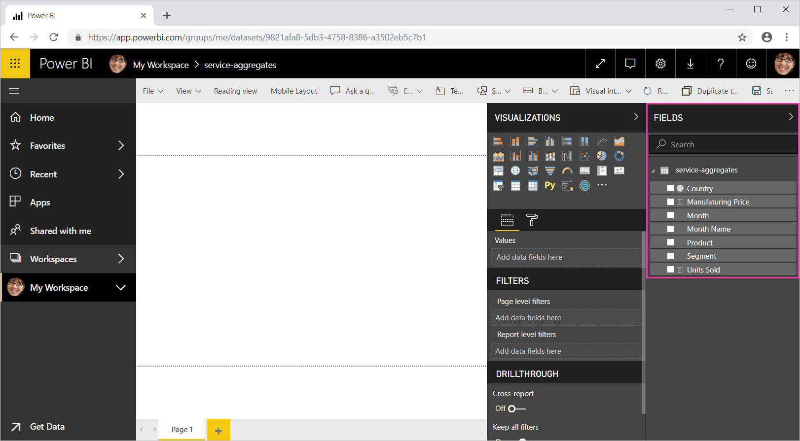
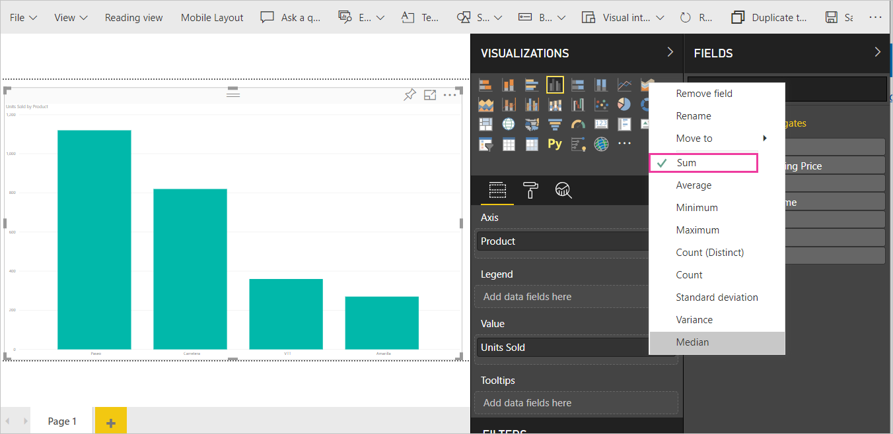
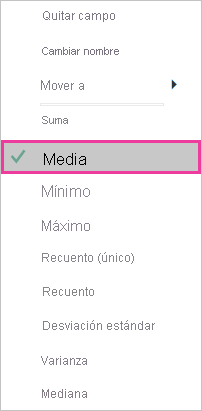
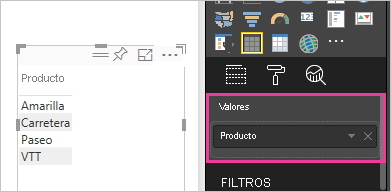
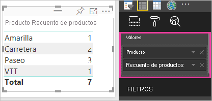

# Trabajo con agregados (suma, promedio, etc.) en el servicio Power BI

## ¿Qué es un agregado?

A veces, querrá combinar matemáticamente los valores de los datos. La operación matemática podría ser suma, promedio, máximo, recuento, etc. A la combinación de los valores de los datos se le llama *agregación*. El resultado de esa operación matemática es un *agregado*.

Cuando el servicio Power BI y Power BI Desktop crean las visualizaciones, pueden agregar los datos. A menudo el agregado es exactamente lo que necesita, pero en otras ocasiones deseará agregar los valores de forma diferente.  Por ejemplo, una suma frente a una media. Hay varias maneras de administrar y cambiar el agregado que usa Power BI en una visualización.

En primer lugar, echemos un vistazo a los *tipos* de datos, ya que el tipo de datos determina si Power BI puede agregarlos y cómo.

## Tipos de datos

La mayoría de los conjuntos de datos tienen más de un tipo de datos. En el nivel más básico, los datos son valores numéricos o no lo son. Power BI puede agregar datos numéricos con una suma, un promedio, un recuento, un mínimo, una varianza y muchas funciones más. El servicio también puede agregar datos de texto, a menudo llamados datos de *categorías*. Si intenta agregar un campo de categorías al colocarlo en un cubo solo numérico como **Valores** o **Información sobre herramientas**, Power BI cuenta las apariciones de cada categoría o las apariciones distintas de cada categoría. Los tipos especiales de datos, como las fechas, tienen algunas opciones de agregado propias: más antiguo, más reciente, primero y último.

En el ejemplo siguiente:

- **Units Sold** y **Manufacturing Price** son columnas que contienen datos numéricos

- **Segment**, **Country**, **Product**, **Month** y **Month Name** contienen datos de categorías

   

Al crear una visualización en Power BI, el servicio agregará campos numéricos (el valor predeterminado es *sum*) según algún campo de categorías.  Por ejemplo, "Unidades vendidas ***por producto** _", "Unidades vendidas _*_por mes_*_" y "Precio de fabricación _*_por segmento_*_". Power BI hace referencia a algunos campos numéricos como _*medidas**. Es fácil identificar las medidas en el editor de informes de Power BI porque en la lista **Campos** se muestran con el símbolo ∑ junto a ellas. Para obtener más información, consulte [Paseo por el editor de informes](service-the-report-editor-take-a-tour.md).

## ¿Por qué los agregados no funcionan como quiero?

Trabajar con agregados en el servicio Power BI puede resultar confuso. Es posible que tenga un campo numérico y que Power BI no le permita cambiar la agregación. O quizá tenga un campo, como un año, y no desea agregarlo sino que desea contar el número de repeticiones.

Normalmente, el problema subyacente es la definición del campo en el conjunto de datos. Es posible que el propietario del conjunto de datos haya definido el campo como texto y eso explica por qué Power BI no puede sumarlo ni calcular su promedio. Por desgracia, [solo el propietario del conjunto de datos puede cambiar la manera en que se clasifica un campo](../transform-model/desktop-measures.md). Por lo tanto, si tiene permisos de propietario para el conjunto de datos, ya sea en Desktop o en el programa que se ha usado para crear el conjunto de datos (por ejemplo, Excel), puede solucionar este problema. En caso contrario, debe ponerse en contacto con el propietario del conjunto de datos para obtener ayuda.  

Hay una sección especial al final de este artículo titulada [**Consideraciones y solución de problemas**](#considerations-and-troubleshooting). Proporciona sugerencias e instrucciones. Si no encuentra la respuesta en esa sección, publique una pregunta en el [foro de la comunidad de Power BI](https://community.powerbi.com). Recibirá una respuesta rápida directamente del equipo de Power BI.

## Cambiar el modo en que un campo numérico se agrega

Supongamos que tiene un gráfico que suma las unidades vendidas de los distintos productos, pero prefiere disponer de la media.

1. Cree un **gráfico de columnas agrupadas** que use una medida y una categoría. En este ejemplo Units Sold by Product.  De forma predeterminada, Power BI crea un gráfico que suma las unidades vendidas (arrastre la medida al área **Valor**) de cada producto (arrastre la categoría al área **Eje**).

   

1. En el panel **Visualizaciones**, haga clic con el botón derecho en la medida y seleccione el tipo de agregado que necesita. En este caso, seleccionamos **Promedio**. Si no ve la agregación que necesita, consulte la sección [**Consideraciones y solución de problemas**](#considerations-and-troubleshooting).

   

   > [!NOTE]
   > Las opciones disponibles en la lista desplegable varían en función de 1) el campo seleccionado y 2) la manera en que el propietario del conjunto de datos ha clasificado ese campo.

1. La visualización ahora está usando una agregación por la media.

   

## Formas de agregar los datos

Algunas de las opciones que pueden estar disponibles para agregar un campo:

- **No resumir**. Si se elige esta opción, Power BI trata cada valor de ese campo por separado y no se resume. Use esta opción si hay una columna de identificador numérico que el servicio no deba sumar.

- **Suma**. Suma todos los valores de ese campo.

- **Media**. Calcula la media aritmética de los valores.

- **Mínimo**. Muestra el valor menor.

- **Máximo**. Muestra el valor mayor.

- **Recuento (no vacíos).** Cuenta el número de valores de ese campo que no están en blanco.

- **Recuento (Distinct).** Cuenta el número de valores diferentes en ese campo.

- **Desviación estándar.**

- **Varianza**.

- **Mediana**.  Muestra el valor de la mediana (intermedio). Este valor tiene el mismo número de elementos por encima que por debajo.  Si hay dos medianas, Power BI calcula su promedio.

Por ejemplo, estos datos:

| País | Cantidad |
|:--- |:--- |
| EE. UU. |100 |
| Reino Unido |150 |
| Canadá |100 |
| Alemania |125 |
| Francia | |
| Japón |125 |
| Australia |150 |

Arrojarían estos resultados:

- **No resumir**: cada valor se muestra por separado

- **Suma**: 750

- **Media**: 125

- **Máximo**:  150

- **Mínimo**: 100

- **Recuento (no vacíos):** 6

- **Recuento (distinto)** 4

- **Desviación estándar:** 20.4124145...

- **Varianza:** 416.666...

- **Mediana:** 125

## Creación de un agregado con un campo de categoría (texto)

También es posible agregar un campo no numérico. Por ejemplo, si tiene un campo Nombre de producto, puede agregarlo como un valor y después establecerlo en **Recuento**, **Recuento distinto**, **Primero** o **Último**.

1. Arrastre el campo **Producto** al área **Valores**. El área **Valores** se suele usar para campos numéricos. Power BI reconoce que este campo es de texto, establece el agregado en **No resumir** y le presenta una tabla de una sola columna.

   

1. Si cambia la agregación de su valor predeterminado **No resumir** a **Recuento (distintivo)** , Power BI contará el número de productos diferentes. En este caso, hay cuatro.
  
   

1. Si modifica la agregación a **Recuento**, Power BI contará el número total. En este caso, hay siete entradas para **Producto**.

   

1. Si arrastra el mismo campo (en este caso, **Producto**) al área **Valores** y deja la agregación predeterminada **No resumir**, Power BI desglosa el recuento por producto.

   

## Consideraciones y solución de problemas

P:  ¿Por qué no dispongo de la opción **No resumir**?

R:  El campo que ha seleccionado es probablemente una medida calculada en un modelo multidimensional, o una medida creada en Excel o [Power BI Desktop](../transform-model/desktop-measures.md). Cada medida tiene su propia fórmula codificada de forma rígida. No puede cambiar la agregación que usa Power BI. Por ejemplo, si es una suma, solo puede ser una suma. En la lista **Campos**, aparecen las *medidas* con el símbolo de la calculadora.

P:  Mi campo **es** numérico; ¿por qué solo tengo las opciones **Recuento** y **Recuento distinto**?

R1:  Lo más probable es que el propietario del conjunto de datos *no* haya clasificado el campo como un número. Por ejemplo, si un conjunto de datos tiene un campo de **año**, el propietario del conjunto de datos puede clasificar el valor como texto. Es más probable que Power BI cuente el campo de **año** (por ejemplo, el número de personas nacidas en 1974). Es menos probable que Power BI lo sume o calcule su promedio. Si es el propietario, puede abrir el conjunto de datos en Power BI Desktop y usar la pestaña **Modelado** para cambiar el tipo de datos.

A2: Si el campo tiene un icono de calculadora, eso significa que es una *medida*. Cada medida tiene su propia fórmula que solo puede cambiar el propietario del conjunto de datos. El cálculo que usa Power BI puede ser una agregación simple como un promedio o una suma, pero también podría ser algo más complicado como un "porcentaje de contribución a la categoría primaria" o "total acumulado desde el inicio del año". Power BI no va a sumar ni calcular el promedio de los resultados. En su lugar, simplemente volverá a calcular (mediante la fórmula codificada de forma rígida) para cada punto de datos.

A3:  Otra posibilidad es que el campo esté en un *depósito* que solo permite valores de categoría.  En ese caso, las únicas opciones que tendrá disponibles serán recuento y recuento distinto.

A4:  Y una cuarta posibilidad es que esté usando el campo para un eje. Por ejemplo, en un eje del gráfico de barras, Power BI muestra una barra para cada valor distinto, y en ningún caso agrega los valores de campo.

>[!NOTE]
>La excepción a esta regla son los gráficos de dispersión, que *requieren* valores agregados para los ejes X e Y.

P:  ¿Por qué no puedo agregar campos de texto de orígenes de datos de SQL Server Analysis Services (SSAS)?

R:  Las conexiones dinámicas a modelos multidimensionales de SSAS no admiten agregaciones del lado cliente, como first, last, avg, min, max y sum.

P:  Tengo un gráfico de dispersión y quiero que mi campo *no* se agregue.  ¿Cómo lo hago?

R:  Agregue el campo al depósito **Detalles** y no a los depósitos de los ejes X o Y.

P:  Cuando agrego un campo numérico a una visualización, el valor predeterminado de la mayoría es la suma, pero el de algunos es la media y el de otros la agregación.  ¿Por qué la agregación predeterminada no es siempre la misma?

R:  Los propietarios de conjuntos de datos pueden establecer el resumen predeterminado para cada campo. Si es el propietario de un conjunto de datos, cambie el resumen predeterminado en la pestaña **Modelado** de Power BI Desktop.

P:  Soy el propietario de un conjunto de datos y quiero asegurarme de que nunca se agrega un campo.

R:  En Power BI Desktop, en la pestaña **Modelado**, establezca **Tipo de datos** en **Texto**.

P:  No veo la opción **No resumir** en la lista desplegable.

R:  Pruebe a quitar el campo y agregarlo de nuevo.

¿Tiene más preguntas? [Pruebe la comunidad de Power BI](https://community.powerbi.com/)
