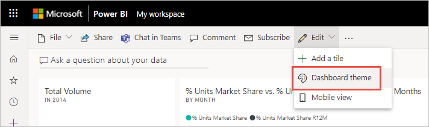
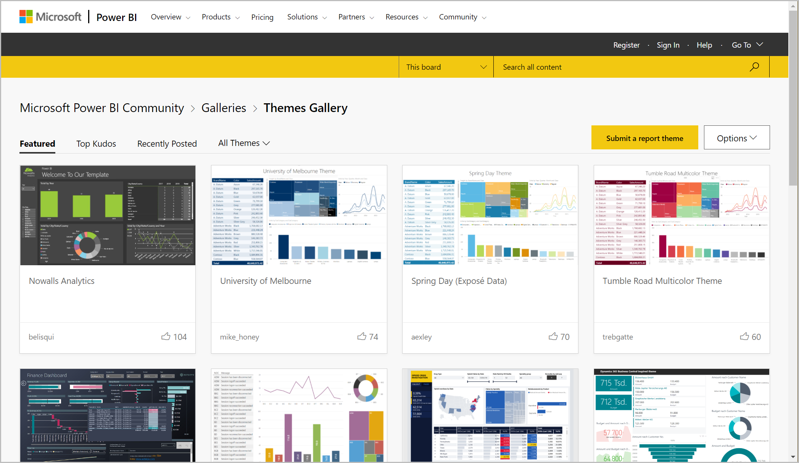
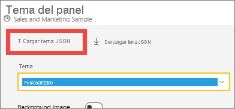
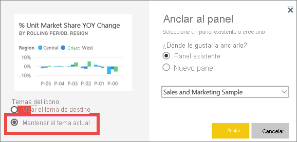
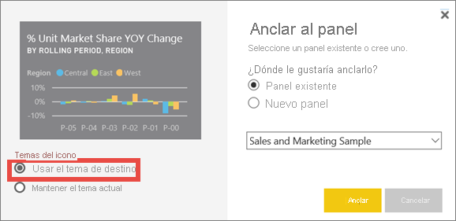

# <a name="use-dashboard-themes-in-the-power-bi-service"></a>Uso de temas de panel en el servicio Power BI
Con los **temas de panel** se puede aplicar un tema de color a todo un panel, como por ejemplo, colores corporativos, colores de temporada o cualquier otro tema de color que quiera aplicar. Al aplicar un tema de panel, todos los objetos visuales del panel usan los colores del tema seleccionado. Existen algunas excepciones, que verá descritas en la sección [Consideraciones y limitaciones](#considerations-and-limitations) de este artículo.


Cambiar los colores de los objetos visuales en el panel no tiene efecto alguno en los objetos visuales del informe asociado. Además, al anclar iconos desde un informe que ya tiene un [tema de panel aplicado](desktop-report-themes.md), puede decidir entre conservar el tema actual o usar el tema de panel.


## <a name="prerequisites"></a>Requisitos previos
* Para continuar, abra el [panel de ejemplo de Ventas y Marketing](sample-datasets.md).


## <a name="how-dashboard-themes-work"></a>Cómo funcionan los temas de panel
Para empezar, abra un panel que haya creado o que pueda editar. Seleccione **Editar** > **Tema del panel**. 



En el panel que aparece, seleccione uno de los temas prediseñados.  En el ejemplo de abajo, hemos seleccionado **Oscuro**.


## <a name="create-a-custom-theme"></a>Crear un tema personalizado

El tema predeterminado para los paneles de Power BI es **Claro**. Si quiere personalizar los colores o crear su propio tema, seleccione **Personalizar** en la lista desplegable. 


Use las opciones personalizadas para crear su propio tema de panel. Si agrega una imagen de fondo, se recomienda que la imagen tenga una resolución mínima de 1920 x 1080. Para usar una imagen como fondo, cargue la imagen en un sitio web público, copie la dirección URL y péguela en el campo **Dirección URL de imagen**. 

## <a name="use-a-json-theme"></a>Uso de un tema JSON
Otra manera de crear un tema personalizado consiste en cargar un archivo JSON que tenga la configuración para todos los colores que le gustaría usar para el panel. En Power BI Desktop, los creadores de informes usan archivos JSON para [crear temas para informes](desktop-report-themes.md). Estos mismos archivos JSON se pueden cargar para paneles, o se pueden buscar y cargar archivos JSON de la [página de la Galería de temas](https://community.powerbi.com/t5/Themes-Gallery/bd-p/ThemesGallery) de la Comunidad de Power BI. 



Puede guardar su tema personalizado como un archivo JSON y, después, compartirlo con otros creadores de paneles. 

### <a name="use-a-theme-from-the-theme-gallery"></a>Usar un tema de la Galería de temas

Al igual que las opciones integradas y personalizadas, cuando el tema se carga, los colores se aplican automáticamente a todos los iconos del panel. 

1. Mantenga el mouse sobre un tema y elija **Ver informe**.

    

2. Desplácese hacia abajo y busque el vínculo al archivo JSON.  Seleccione el icono de descarga y guarde el archivo.

    

3. De vuelta en el servicio Power BI, en la ventana del tema Panel personalizado, seleccione **Cargar tema JSON**.

    

4. Vaya a la ubicación donde guardó el archivo de tema JSON y seleccione **Abrir**.

5. En la página Tema del panel, seleccione **Guardar**. El nuevo tema se aplica a su panel.

    

## <a name="reports-and-dashboards-with-different-themes"></a>Informes y paneles con temas diferentes

Si el informe usa un tema diferente del tema de panel, la mayoría de las veces se puede controlar si el objeto visual va a conservar el tema actual o si va a usar el tema de panel. No obstante, los objetos visuales de tarjeta en los paneles usan la familia de fuentes "DIN", con texto de color negro. Para cambiar el color del texto de todos los iconos en un panel (tarjetas incluidas), cree un tema de panel personalizado.

- Al anclar un icono a un panel, para mantener el tema del informe seleccione **Mantener el tema actual**. El objeto visual, en el panel, conservará el tema del informe, incluida la configuración de transparencia.

    La única vez que aparecen las opciones **Temas del icono** es si crea el informe en Power BI Desktop, [agrega un tema del informe](desktop-report-themes.md) y luego publica el informe en el servicio Power BI.

    

- Intente volver a anclar el icono y seleccione **Use dashboard theme** (Usar tema del panel).

    

## <a name="dashboard-theme-json-file-format"></a>Formato de archivo JSON de tema para paneles

En su nivel más básico, el archivo JSON del tema solo tiene una línea necesaria: el **nombre**.

```json
{
    "name": "Custom Theme"
}
```

Aparte de **esto**, todo lo demás es opcional, lo que significa que solo tiene que agregar al archivo de tema las propiedades a las que quiere aplicar formato específicamente y seguir usando los valores predeterminados de Power BI con el resto.

El archivo JSON para la creación de temas de panel incluye lo siguiente:

- name: nombre del tema (único campo obligatorio).
- foreground y background: colores del panel.
- dataColors: lista de códigos hexadecimales que se van a usar con los datos de los gráficos. Puede incluir aquí cuantos colores quiera (muchos o pocos).
- tiles: configuraciones de fondo y de color de los paneles.
- visualStyles: formato granular de los objetos visuales.

Este es un ejemplo de archivo JSON de tema correspondiente al tema claro predeterminado:

```json
{

"name":"Light",

"foreground":"#000000",

"background":"#EAEAEA",

"dataColors":["#01B8AA","#374649","#FD625E","#F2C80F","#5F6B6D","#8AD4EB","#FE9666","#A66999"],

"tiles":{"background":"#FFFFFF","color":"#000000"},

"visualStyles":{"*":{"*":{"*":[{"color":{"solid":{"color":"#000000"}}}]}}}

}
```

## <a name="considerations-and-limitations"></a>Consideraciones y limitaciones

* Los temas de panel no se pueden aplicar a páginas de informes activos, iconos de iframe, iconos de SSRS, iconos de libro o imágenes cuando están anclados.
* Los temas de panel se pueden ver en dispositivos móviles, pero un tema de panel solo se puede crear en el servicio Power BI.
* Los temas de panel personalizados solo funcionan con iconos que se anclaron desde informes.

## <a name="next-steps"></a>Pasos siguientes

- [Aplicar temas a informes](desktop-report-themes.md)
