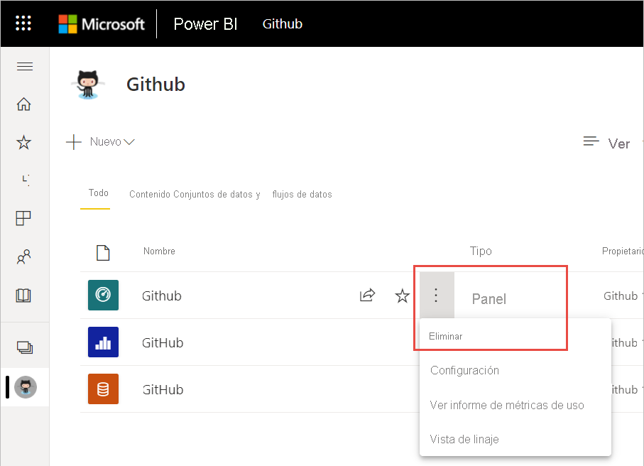
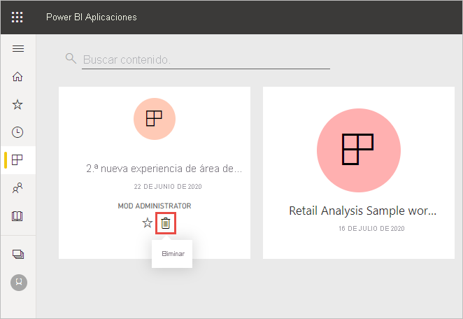
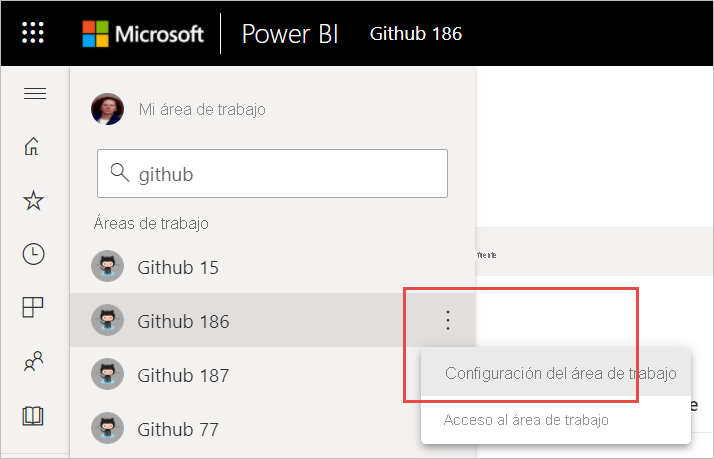
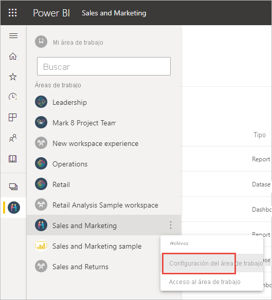

# Eliminación de prácticamente cualquier elemento del servicio Power BI
En este artículo se muestra cómo eliminar un panel, un informe, un libro, un conjunto de datos, una aplicación, una visualización o un área de trabajo del servicio Power BI. En el servicio Power BI puede eliminar prácticamente cualquier elemento, con algunas excepciones. 

## Eliminación de un panel, informe, conjunto de datos o libro

1. En el área de trabajo, seleccione la pestaña **Todos**.
1. Seleccione **Más opciones (...)** junto al recurso que quiera eliminar y seleccione **Eliminar**.

    

1. Seleccione **Eliminar** para confirmar la eliminación.

## Quitar una aplicación de la página con la lista de aplicaciones

Puede quitar fácilmente aplicaciones de la página de lista de aplicaciones. Al quitar una aplicación, no se elimina para otros miembros. Solo un administrador, un miembro o un área de trabajo pueden eliminar permanentemente la aplicación de ese área de trabajo.

1. En el panel de navegación, seleccione **Aplicaciones** para abrir la página con la lista de aplicaciones.
2. Mantenga el puntero sobre la aplicación que desea eliminar y seleccione el icono Eliminar :::image type="icon" source="media/service-delete/power-bi-delete-report2.png" border="false":::.

   

   Si quita una aplicación accidentalmente, tiene varias opciones para recuperarla.  Puede pedir al creador de la aplicación que la vuelva a enviar, encontrar el mensaje original con el vínculo a la aplicación, consultar el [Centro de notificaciones](../consumer/end-user-notification-center.md) para ver si todavía aparece la notificación relativa a esa aplicación, o bien comprobarlo en la instancia de [AppSource de la organización](../consumer/end-user-apps.md).

## Eliminación de un área de trabajo

Power BI tiene dos tipos diferentes de áreas de trabajo: las originales o *clásicas*, y las nuevas. Los procesos para quitarlas o eliminarlas son diferentes. Obtenga más información sobre las [áreas de trabajo nuevas y clásicas](../collaborate-share/service-new-workspaces.md).

### Eliminación de miembros de un área de trabajo nueva

Solo los administradores del área de trabajo pueden quitar usuarios de un área de trabajo nueva. Si es un administrador, puede quitarse a sí mismo o a cualquier otro usuario. Pero si es el único administrador de un área de trabajo, Power BI no le permitirá que se elimine a sí mismo.

1. En la vista de lista del área de trabajo, seleccione **Acceso** en la esquina superior derecha.

    :::image type="content" source="media/service-delete/power-bi-select-access.png" alt-text="Captura de pantalla de la selección de Acceso.":::

1. En el panel **Acceso**, seleccione **Más opciones (...)** junto al nombre del usuario que quiera quitar y **Quitar**.

    :::image type="content" source="media/service-delete/power-bi-access-remove.png" alt-text="Captura de pantalla del panel Acceso, selección de Quitar.":::

### Eliminación de un área de trabajo nueva

Al crear una de las *áreas de trabajo nuevas*, no se crea un grupo de Microsoft 365 asociado. Si es un administrador del área de trabajo, puede eliminar un área de trabajo nueva sin ningún efecto en los grupos de Microsoft 365. Obtenga más información sobre las [áreas de trabajo nuevas y clásicas](../collaborate-share/service-new-workspaces.md).

Como administrador de un área de trabajo, puede eliminarla o quitar a otros usuarios que contenga. Al eliminarla, también se elimina la aplicación asociada para todos los miembros del grupo y se quita de AppSource. 

1. En el panel de navegación, seleccione **Áreas de trabajo**.

2. Seleccione **Más opciones** (...) a la derecha del área de trabajo que se va a eliminar y elija **Configuración del área de trabajo**.

    

3. En el panel **Configuración del área de trabajo**, seleccione **Eliminar área de trabajo** > **Eliminar**.

### Eliminación de un área de trabajo clásica de la lista

Si ya no quiere ser miembro de un área de trabajo clásica, puede **_abandonarla_* _ y se quitará de la lista. Al abandonar un área de trabajo, se deja como estaba para todos los demás miembros del área de trabajo.  

> [!NOTE]
> Si es el único administrador del área de trabajo, Power BI no permitirá que la abandone.
>

1. Empiece en el área de trabajo que desee quitar.

2. En la esquina superior derecha, seleccione _ *Más opciones** (...) y elija **Abandonar área de trabajo** > **Abandonar**.

      :::image type="content" source="media/service-delete/power-bi-leave-workspace.png" alt-text="Captura de pantalla de Más opciones, Abandonar área de trabajo.":::

   > [!NOTE]
   > Las opciones que ve en la lista desplegable dependen de si es administrador o miembro de esa área de trabajo.
   >

### Eliminación de un área de trabajo clásica

> [!WARNING]
> Al crear un área de trabajo *clásica*, se crea un grupo de Microsoft 365. Al eliminar un área de trabajo clásica, se elimina ese grupo de Microsoft 365. El grupo también se elimina de otros productos de Microsoft 365, como SharePoint y Microsoft Teams.
> 

Eliminar un área de trabajo no es igual que abandonar un área de trabajo. Debe ser un administrador del área de trabajo para eliminarla. Al eliminarla, también se elimina la aplicación asociada para todos los miembros del grupo y se quita de AppSource. Pero si es el único administrador de un área de trabajo, Power BI no le permitirá abandonarla.

1. Desde el panel de navegación, seleccione **Áreas de trabajo**.

2. Junto al área de trabajo que se va a eliminar, seleccione **Más opciones (...)**  > **Configuración del área de trabajo**.

    

3. En el panel **Configuración**, seleccione **Eliminar área de trabajo** y, después, **Eliminar** para confirmar la eliminación.

    

## Consideraciones y limitaciones

- Al quitar un *panel*, no se eliminan el conjunto de datos subyacente ni los informes asociados a ese panel.
- Si es el *propietario de un panel o informe*, puede quitarlo. Si lo ha compartido con compañeros, al quitarlo del área de trabajo de Power BI, también se quita de sus áreas de trabajo de Power BI.
- Si *han compartido un panel o informe con usted*, no podrá quitarlo.
- La eliminación de un informe no elimina el conjunto de datos en el que se basa.  Se conservan todas las visualizaciones que ha anclado a un panel desde el informe. Permanecerán en el panel hasta que las elimine de forma individual.
- Puede eliminar un *conjunto de datos*. Sin embargo, si elimina un conjunto de datos, también se eliminarán todos los informes y los iconos de panel que contengan datos de ese conjunto de datos.
- Puede eliminar *libros*. Sin embargo, al quitar un libro, se quitan también todos los informes y los iconos de panel que contengan datos del libro. Si el libro está almacenado en OneDrive para la Empresa, al eliminarlo de Power BI, no se elimina de OneDrive.
- Si un *panel o informe* forma parte de un [paquete de contenido de la organización](../collaborate-share/service-organizational-content-pack-disconnect.md), no se puede eliminar con este método.  Consulte [Quitar la conexión a un paquete de contenido organizativo](../collaborate-share/service-organizational-content-pack-disconnect.md).
- Si un *conjunto de datos* forma parte de uno o varios paquetes de contenido de la organización, la única forma de eliminarlo es quitarlo de los paquetes de contenido donde se usa, esperar a que se procese e intentar eliminarlo de nuevo.

## Pasos siguientes

En este artículo se ha descrito cómo eliminar los principales bloques de creación del servicio Power BI. Estos son otros elementos que también puede eliminar.  

- [Quitar el panel destacado](../consumer/end-user-featured.md)
- [Quitar un panel de Favoritos](../consumer/end-user-favorite.md)
- [Quitar un icono de panel](service-dashboard-edit-tile.md)

¿Tiene más preguntas? [Pruebe la comunidad de Power BI](https://community.powerbi.com/)