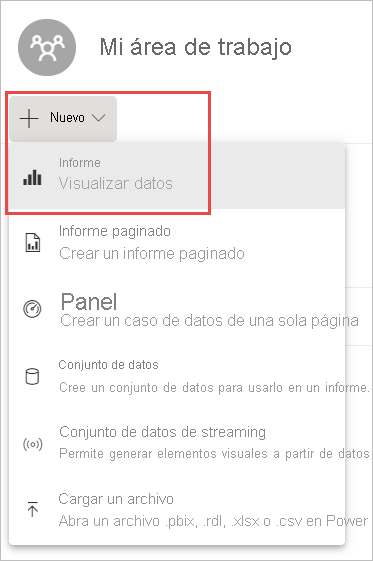
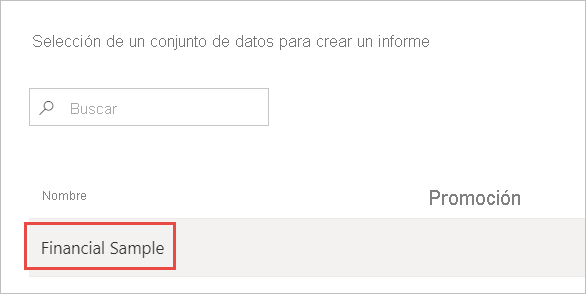
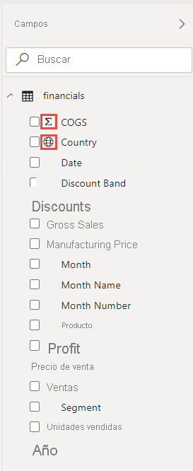
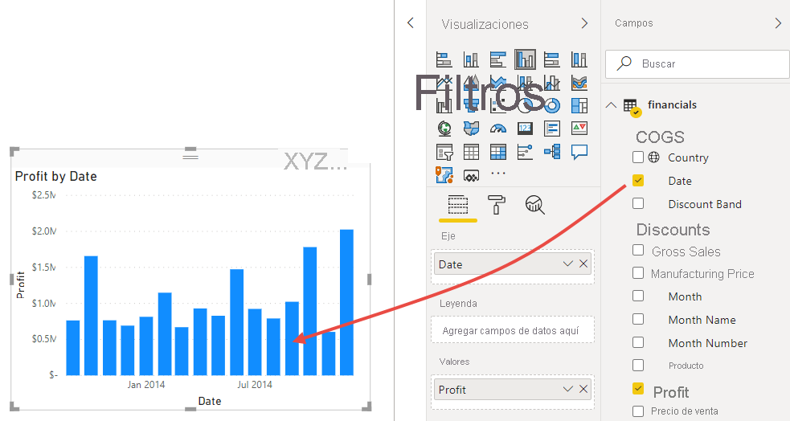
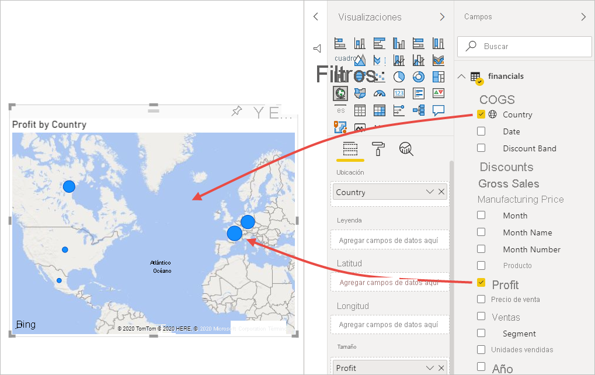
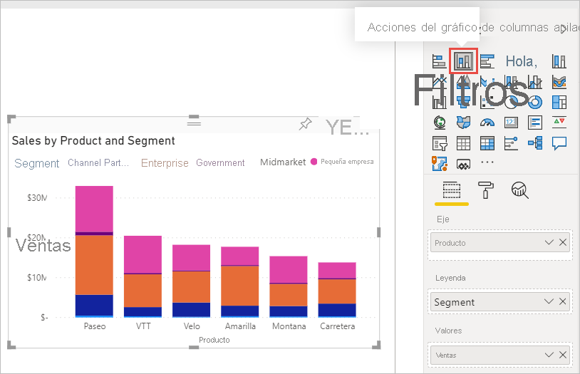
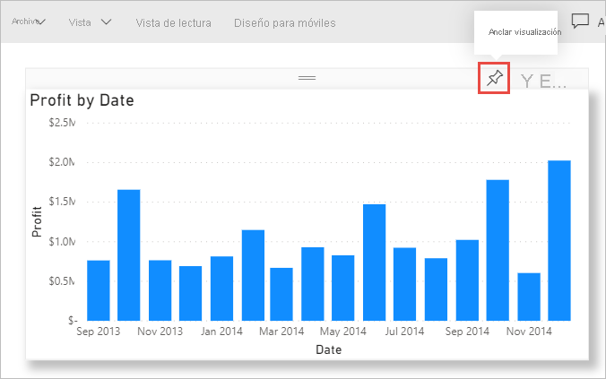
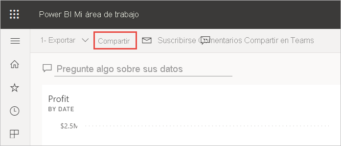
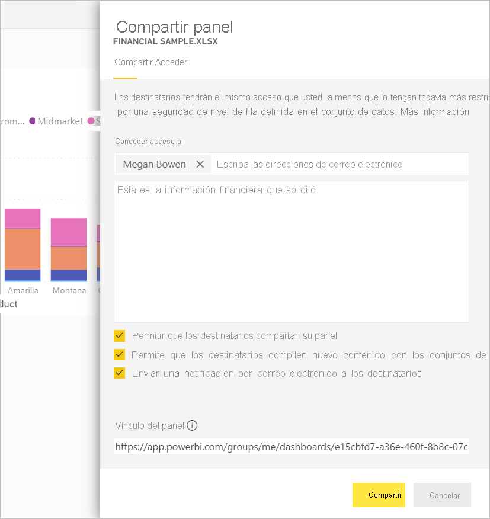
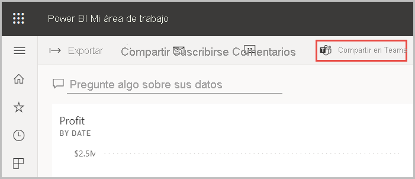

# Tutorial: De libro de Excel a un informe sorprendente en el servicio Power BI a Microsoft Teams
La jefa quiere ver al final del día un informe sobre las cifras de ventas y beneficios más recientes. Pero los datos más recientes se encuentran en varios sistemas de terceros y en archivos del portátil. En el pasado, tardaba horas en crear objetos visuales y dar formato a un informe, y empieza a ponerse nervioso.

No se preocupe. Con Power BI puede crear un informe sorprendente y compartirlo en Microsoft Teams en cuestión de segundos.

:::image type="content" source="media/service-from-excel-to-stunning-report/power-bi-financial-report-service.png" alt-text="Captura de pantalla del informe Ejemplo financiero terminado":::

En este ejemplo, se carga un archivo de Excel, se crea un informe y se comparte con los compañeros de trabajo en Microsoft Teams, todo desde Power BI. Aprenderá a:

> [!div class="checklist"]
> * Preparar los datos en Excel.
> * Descargar datos de ejemplo.
> * Crear un informe en el servicio Power BI.
> * Anclar los objetos visuales del informe a un panel.
> * Compartir un vínculo al panel.
> * Compartir el panel en Microsoft Teams

## Preparación de datos en Excel
Tomemos como ejemplo un simple archivo de Excel. 

1. Antes de poder cargar el archivo de Excel en Power BI, debe organizar los datos en una tabla plana. En una tabla plana, cada columna contiene el mismo tipo de datos; por ejemplo, texto, fecha, número o moneda. La tabla debe tener una fila de encabezado, pero no columnas o filas que muestren totales.

   

2. A continuación, organice sus datos para que tengan formato de tabla. En Excel, en la pestaña **Inicio**, en el grupo **Estilos**, seleccione **Dar formato como tabla**. 

3. Seleccione un estilo de tabla para aplicarlo a la hoja de cálculo. 

   La hoja de cálculo de Excel ya está lista para cargarse en Power BI.

   

## Carga del archivo de Excel al servicio Power BI
El servicio Power BI se conecta a muchos orígenes de datos, incluidos los archivos de Excel que se encuentran en el equipo. 

 > [!NOTE] 
 > Para seguir con el resto de este tutorial, descargue el [libro de ejemplos financieros](https://go.microsoft.com/fwlink/?LinkID=521962).

1. Para comenzar, inicie sesión en el servicio Power BI. Si no ha iniciado sesión, [puede hacerlo de forma gratuita](https://powerbi.com).
1. En **Mi área de trabajo**, seleccione **Nuevo** > **Cargar un archivo**.

    :::image type="content" source="media/service-from-excel-to-stunning-report/power-bi-new-upload.png" alt-text="Captura de pantalla de la opción Cargar un archivo.":::

1. Seleccione **Archivo local**, vaya a la ubicación donde haya guardado el archivo de Excel de ejemplos financieros y seleccione **Abrir**.
7. En la página **Archivo local**, seleccione **Importar**.

    Ahora tiene un conjunto de datos de ejemplos financieros. Power BI también crea un panel en blanco de forma automática. Si no ve el panel, actualice el explorador.

    :::image type="content" source="media/service-from-excel-to-stunning-report/power-bi-financial-dataset.png" alt-text="Captura de pantalla de Mi área de trabajo con un conjunto de datos de ejemplos financieros.":::

2. Quiere crear un informe. En **Mi área de trabajo**, seleccione **Nuevo** > **Informe**.

   

3. En el cuadro de diálogo **Selección de un conjunto de datos para crear un informe**, seleccione el conjunto de datos **Ejemplo financiero** > **Crear**.

   

## Crear el informe
 
El informe se abre en la vista de edición y muestra el lienzo del informe en blanco. En el lado derecho se muestran los paneles **Visualizaciones**, **Filtros** y **Campos**. Los datos de tabla del libro de Excel aparecen en el panel **Campos**. En la parte superior se encuentra el nombre de la tabla, **Financials**. Debajo, Power BI enumera los encabezados de columna como campos individuales.

¿Ve los símbolos Sigma en la lista Campos? Power BI ha detectado que esos campos son numéricos. Power BI también indica un campo geográfico con un símbolo de globo terráqueo.

1. Para tener más espacio para el lienzo del informe, seleccione **Ocultar el panel de navegación** y minimice el panel **Filtros**.

    :::image type="content" source="media/service-from-excel-to-stunning-report/power-bi-hide-nav-pane.png" alt-text="Captura de pantalla de la acción de minimizar el panel de navegación."::: 

1. Ahora puede empezar a crear visualizaciones. Imagine que su jefe quiere ver los beneficios obtenidos a lo largo del tiempo. En el panel **Campos**, arrastre **Beneficios** al lienzo del informe. 

   De forma predeterminada, Power BI muestra un gráfico de columnas con una columna. 

    :::image type="content" source="media/service-from-excel-to-stunning-report/power-bi-profit-column.png" alt-text="Captura de pantalla de un gráfico de columnas con una columna.":::

3. Arrastre **Fecha** al lienzo del informe. 

   Power BI actualiza el gráfico de columnas para mostrar los beneficios por fecha.

   

    Diciembre de 2014 fue el mes con mayores beneficios.
   
    > [!TIP]
    > Si los valores del gráfico no son los que esperaba, compruebe las agregaciones. Por ejemplo, en el área **Valor**, seleccione el campo **Beneficios** que acaba de agregar y asegúrese de que los datos se agregan como le gustaría. En este ejemplo, usamos **Suma**.
    > 

### Creación de un mapa

Su jefa desea saber qué países son los más rentables. Impresiónela con una visualización de mapa. 

1. Seleccione un área en blanco en el lienzo del informe. 

2. Desde el panel **Campos**, arrastre el campo **País** al lienzo del informe y, después, el campo **Beneficios** al mapa.

   Power BI crea un objeto visual de mapa con burbujas que representan el beneficio relativo de cada ubicación.

   

    Parece que los países europeos superan a los de Norteamérica.

### Creación de un objeto visual que muestre las ventas

¿Quiere crear un objeto visual que muestre las ventas por segmento de producto y mercado? Fácil. 

1. Seleccione el lienzo en blanco.

1. En el panel **Campos**, seleccione los campos **Ventas**, **Producto** y **Segmento**. 
   
   Power BI crea un gráfico de columnas agrupadas. 

2. Para cambiar el tipo de gráfico, elija uno de los iconos en el menú **Visualizaciones**. Por ejemplo, cámbielo por un **Gráfico de barras apiladas**. 

   

3. Para ordenar el gráfico, seleccione **Más opciones** (...) > **Ordenar por**.

### Mejora de los objetos visuales

Realice los cambios siguientes en la pestaña **Formato** del panel Visualizaciones.

:::image type="content" source="media/desktop-excel-stunning-report/power-bi-format-tab-visualizations.png" alt-text="Captura de pantalla de la pestaña Formato del panel Visualizaciones.":::

1. Seleccione el gráfico de columnas **Beneficios por fecha**. En la sección **Título**, cambie **Tamaño del texto** a **16 pt**. Establezca **Sombra** en **Activar**. 

1. Seleccione el gráfico de columnas apiladas **Ventas por Producto y Segmento**. En la sección **Título**, cambie el **Tamaño del texto** del título a **16 pt**. Establezca **Sombra** en **Activar**.

1. Seleccione el mapa **Beneficios por País**. En la sección **Estilos de mapa**, cambie **Tema** a **Escala de grises**. En la sección **Título**, cambie el **Tamaño del texto** del título a **16 pt**. Establezca **Sombra** en **Activar**.

## Anclaje a un panel

Ahora puede anclar todos los objetos visuales al panel en blanco que Power BI ha creado de forma predeterminada. 

1. Mantenga el puntero sobre un objeto visual y seleccione **Anclar visualización**.

   

1. Tendrá que guardar el informe para poder anclar un objeto visual al panel. Asigne un nombre al informe y seleccione **Guardar**.
1. Ancle cada objeto visual al panel que ha creado Power BI, **Ejemplo financiero.xlsx**.
1. Cuando ancle el último objeto visual, seleccione **Ir al panel**.
1. Power BI ha agregado automáticamente un icono Ejemplo financiero.xlsx de marcador de posición al panel. Seleccione **Más opciones (...)**  > **Eliminar icono**.

    :::image type="content" source="media/service-from-excel-to-stunning-report/power-bi-tile-more-options.png" alt-text="Captura de pantalla de Más opciones de un icono.":::

1. Reorganice y cambie el tamaño de los iconos como prefiera.

El panel y el informe están listos.

## Uso compartido de un vínculo al panel

Es el momento de compartir el panel con la jefa. Puede compartir su panel y el informe subyacente con compañeros que tengan una cuenta de Power BI. Ellos pueden interactuar con el informe, pero no guardar los cambios. Si lo permite, pueden volver a compartirlo con otros usuarios o crear un informe basado en el conjunto de datos subyacente.

1. Para compartir el informe, en la parte superior del panel, seleccione **Compartir**.

   

2. En la página **Compartir panel**, escriba las direcciones de correo electrónico de los destinatarios en el cuadro **Escriba las direcciones de correo electrónico** y agregue un mensaje en el cuadro situado debajo. 

3. Decida cuál de estas opciones quiere:

    - **Permitir que los destinatarios compartan el panel**. 
    - **Permite que los destinatarios compilen nuevo contenido con los conjuntos de datos subyacentes**.
    - **Enviar una notificación por correo electrónico a los destinatarios.**

   

1. Seleccione **Compartir**.

## Uso compartido en Microsoft Teams

También puede compartir informes y paneles directamente con compañeros de trabajo en Microsoft Teams.

1. Para compartir en Teams, seleccione **Compartir en Teams** en la parte superior del panel.

   

2. Power BI muestra el cuadro de diálogo **Compartir en Teams**. Escriba el nombre de una persona, un grupo o un canal, y seleccione **Compartir**. 
   
    :::image type="content" source="media/service-from-excel-to-stunning-report/power-bi-share-teams-dialog.png" alt-text="Captura de pantalla del cuadro de diálogo Compartir en Teams":::

3. El vínculo aparece en las **publicaciones** para esa persona, grupo o canal.

   

## Pasos siguientes

* Ahora que ha creado un informe básico en el servicio Power BI, ¿qué le parece crear un informe en Power BI Desktop? Pruebe el tutorial [De libro de Excel a un informe sorprendente en Power BI Desktop](desktop-excel-stunning-report.md).

¿Tiene más preguntas? [Pruebe la comunidad de Power BI](https://community.powerbi.com/).
