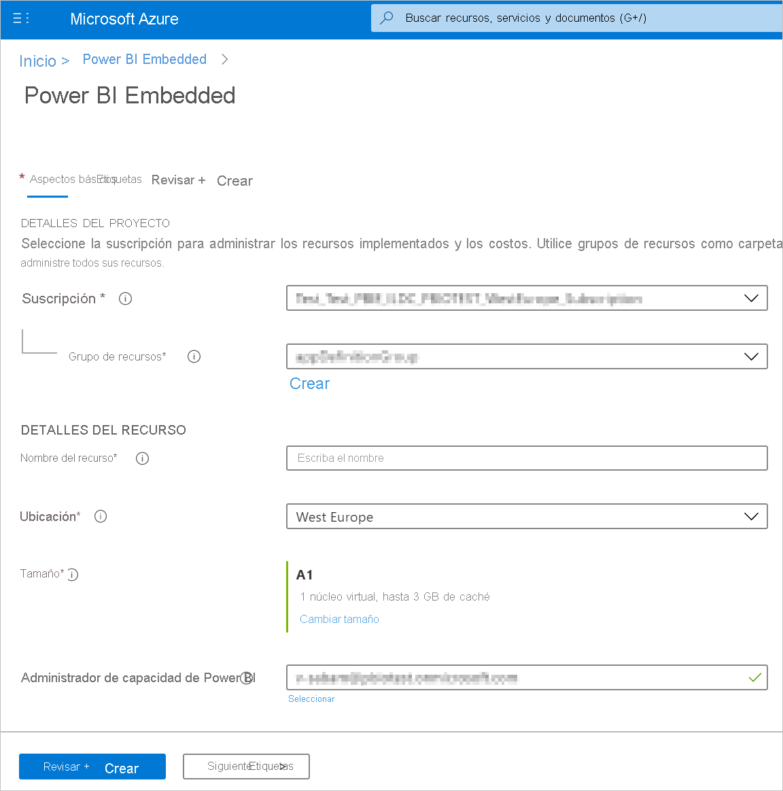
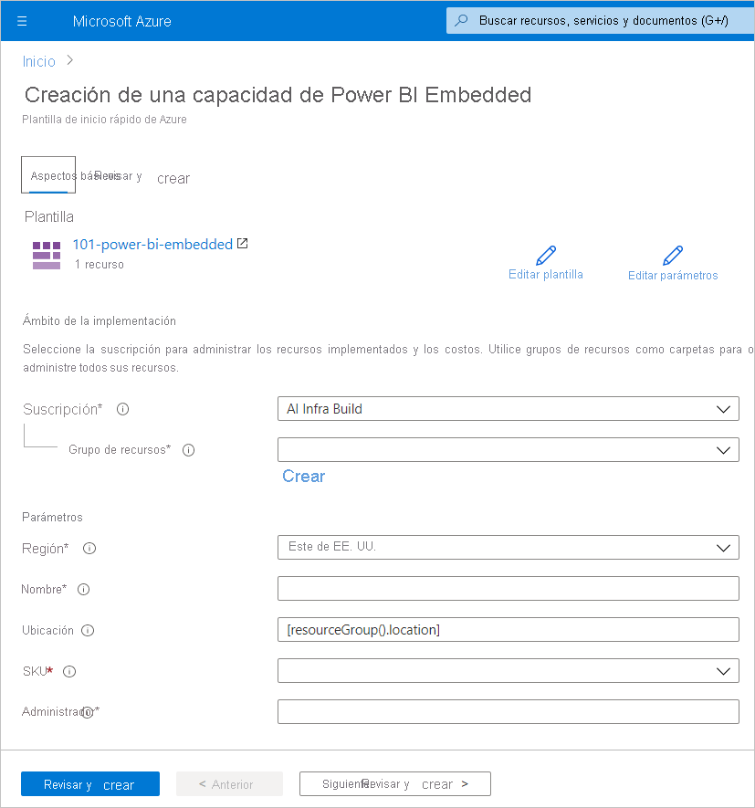
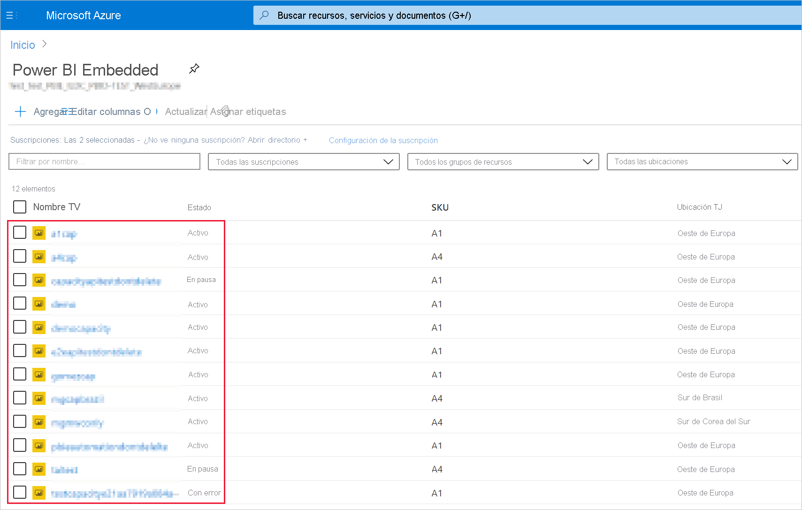
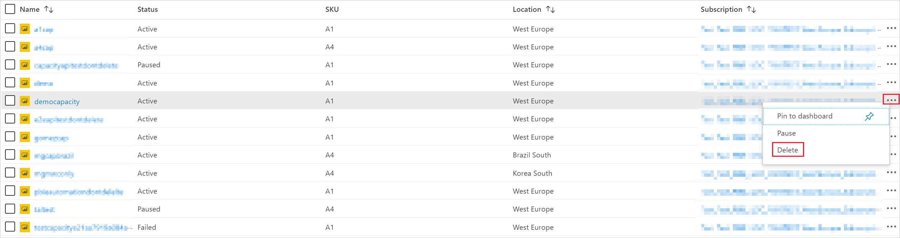
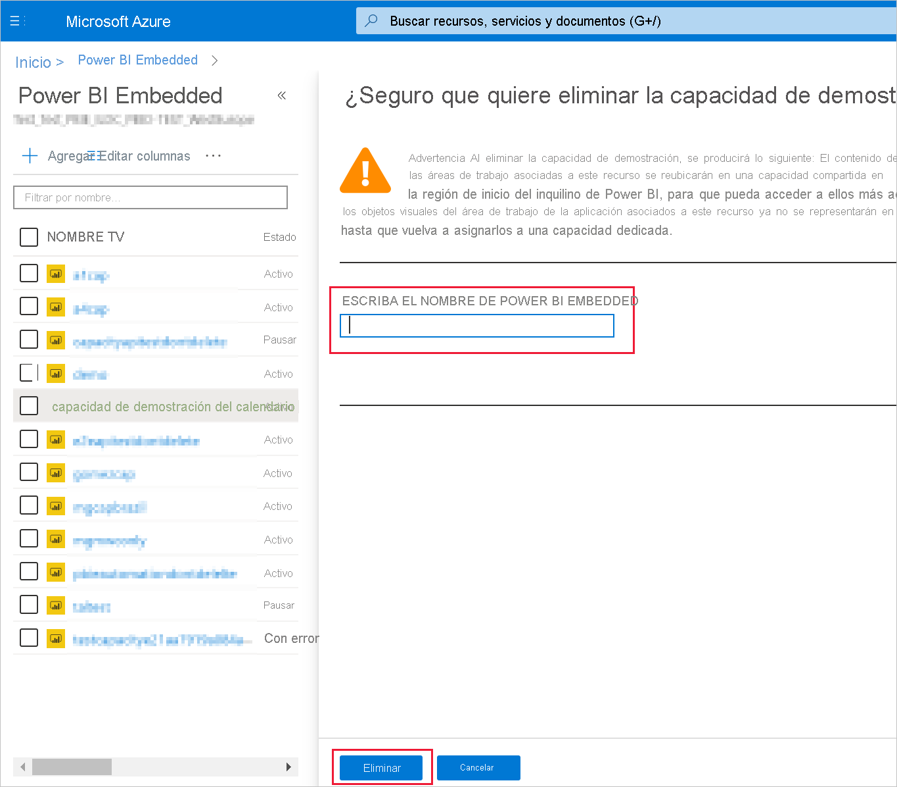

# <a name="create-power-bi-embedded-capacity-in-the-azure-portal"></a>Creación de una capacidad de Power BI Embedded en Azure Portal

En este artículo se explica cómo crear una capacidad de [Power BI Embedded](azure-pbie-what-is-power-bi-embedded.md) en Microsoft Azure. Power BI Embedded simplifica las capacidades de Power BI, al ayudar a agregar rápidamente objetos visuales, informes y paneles impactantes a las aplicaciones.

## <a name="before-you-begin"></a>Antes de empezar

Para completar este inicio rápido, necesita:

* **Una suscripción a Azure:** visite la [evaluación gratuita de Azure](https://azure.microsoft.com/free/) para crear una cuenta.

* **Azure Active Directory:** la suscripción debe estar asociada con un inquilino de Azure Active Directory (Azure AD). Además, **_deberá haber iniciado sesión en Azure con una cuenta de ese inquilino_**. No se admiten las cuentas de Microsoft. Para más información, vea [Autenticación y permisos de usuario](/azure/analysis-services/analysis-services-manage-users).

* **Inquilino de Power BI:** al menos una cuenta del inquilino de Azure AD debe haberse registrado en Power BI.

* **Grupo de recursos:** use un grupo de recursos existente o [cree uno](/azure/azure-resource-manager/resource-group-overview).

## <a name="create-a-capacity"></a>Creación de una capacidad

Antes de crear una capacidad de Power BI Embedded, asegúrese de que ha iniciado sesión en Power BI al menos una vez.

# <a name="portal"></a>[Portal](#tab/portal)

1. Inicie sesión en el [Portal de Azure](https://portal.azure.com/).

2. En el cuadro de búsqueda, busque *Power BI Embedded*.

3. En Power BI Embedded, seleccione **Agregar**.

4. Rellene la información necesaria y, después, haga clic en **Revisar y crear**.
    
    > [!div class="mx-imgBorder"]
    >

    * **Suscripción**: la suscripción en la que le gustaría crear la capacidad.

    * **Grupo de recursos**: el grupo de recursos que contiene esta capacidad nueva. Elija un grupo de recursos existente o cree uno. Para más información, vea [Información general de Azure Resource Manager](/azure/azure-resource-manager/resource-group-overview).

    * **Nombre del recurso**: el nombre del recurso de la capacidad.

    * **Ubicación**: la ubicación donde se hospeda Power BI para el inquilino. La ubicación predeterminada es la región principal, pero puede cambiarlas mediante las [opciones de Multi-Geo](embedded-multi-geo.md).

    * **Tamaño**: el [SKU A](../../admin/service-admin-premium-purchase.md#purchase-a-skus-for-testing-and-other-scenarios) que se necesite. Para obtener más información, vea [Memoria de SKU y potencia de cálculo](./embedded-capacity.md).

    * **Administrador de capacidad de Power BI**: un administrador de la capacidad.
        >[!NOTE]
        >* De forma predeterminada, el administrador de capacidad es el usuario que crea esta capacidad.
        >* Se puede seleccionar otro usuario o entidad de servicio como administrador de la capacidad.
        >* El administrador de capacidad debe pertenecer al inquilino en el que se aprovisiona la capacidad. Los usuarios de colaboración entre negocios (B2B) no pueden ser administradores de capacidad.

    * **Modo de recursos**: seleccione entre estos dos modos de recursos de Power BI Embedded:

        * **Embedded Generation 1**: el recurso de Power BI Embedded clásico.

        * **Embedded Generation 2**: el recurso de Power BI Embedded nuevo, que ofrece una experiencia mejorada. Para más información, vea [Power BI Embedded Prémium Generation 2](power-bi-embedded-generation-2.md).
        
        >[!IMPORTANT]
        >Una vez creado un recurso de capacidad, no se pueden alternar las generaciones. Si desea cambiar la generación de Power BI Embedded, puede crear otro recurso mediante una generación diferente y volver a asignarle sus áreas de trabajo. También puede automatizar este proceso mediante las API de Azure Resource Manager.

# <a name="azure-cli"></a>[CLI de Azure](#tab/CLI)

>[!NOTE]
>La CLI de Azure no es compatible con [Power BI Embedded Generation 2 (versión preliminar)](power-bi-embedded-generation-2.md).

### <a name="use-azure-cloud-shell"></a>Uso de Azure Cloud Shell

En Azure se hospeda Azure Cloud Shell, un entorno de shell interactivo que puede utilizar mediante el explorador. Puede usar Bash o PowerShell con Cloud Shell para trabajar con los servicios de Azure. Puede usar los comandos preinstalados de Cloud Shell para ejecutar el código de este artículo sin tener que instalar nada en su entorno local.

Para iniciar Azure Cloud Shell:

| Opción | Ejemplo o vínculo |
|-----------------------------------------------|---|
| Seleccione **Pruébelo** en la esquina superior derecha de un bloque de código. Solo con seleccionar **Pruébelo** no se copia automáticamente el código en Cloud Shell. |  |
| Vaya a [https://shell.azure.com](https://shell.azure.com) o seleccione el botón **Iniciar Cloud Shell** para abrir Cloud Shell en el explorador. | [](https://shell.azure.com) |
| Seleccione el botón **Cloud Shell** en la barra de menús de la esquina superior derecha de [Azure Portal](https://portal.azure.com). |  |

Para ejecutar el código de este artículo en Azure Cloud Shell:

1. Inicie Cloud Shell.

2. Seleccione el botón **Copiar** de un bloque de código para copiar el código.

3. Pegue el código en la sesión de Cloud Shell. Para ello, seleccione **Ctrl**+**Mayús**+**V** en Windows y Linux, o bien seleccione **Cmd**+**Mayús**+**V** en macOS.

4. Seleccione **Entrar** para ejecutar el código.

## <a name="prepare-your-environment"></a>Preparación del entorno

Los comandos de capacidad de Power BI Embedded requieren la versión 2.3.1 o una posterior de la CLI de Azure. Ejecute `az --version` para buscar cuál es la versión y las bibliotecas dependientes que están instaladas. Para la instalación o la actualización, consulte [Instalación de la CLI de Azure](/cli/azure/install-azure-cli).

1. Inicie sesión.

   Si está usando una instalación local de la CLI, inicie sesión con el comando [az login](/cli/azure/reference-index#az-login).

    ```azurecli
    az login
    ```

    Siga los pasos que se muestran en el terminal para completar el proceso de autenticación.

2. Instale la extensión de la CLI de Azure.

    Para trabajar con referencias de extensión de la CLI de Azure, primero debe instalar la extensión.  Las extensiones de la CLI de Azure le proporcionan acceso a comandos experimentales y en versión preliminar que todavía no se han enviado como parte de la CLI principal.  Para más información acerca de las extensiones, incluida la actualización y la desinstalación, consulte [Uso de extensiones con la CLI de Azure](/cli/azure/azure-cli-extensions-overview).

    Ejecute el comando siguiente para instalar la extensión de capacidad de Power BI Embedded:

    ```azurecli
    az extension add --name powerbidedicated
    ```

### <a name="create-a-capacity-with-azure-cli"></a>Creación de una capacidad con la CLI de Azure

Use el comando [az Power BI embedded-capacity create](/cli/azure/ext/powerbidedicated/powerbi/embedded-capacity#ext-powerbidedicated-az-powerbi-embedded-capacity-create) para crear una capacidad.

```azurecli
az powerbi embedded-capacity create --location westeurope
                                    --name
                                    --resource-group
                                    --sku-name "A1"
                                    --sku-tier "PBIE_Azure"
```

### <a name="delete-a-capacity-with-azure-cli"></a>Eliminación de una capacidad con la CLI de Azure

Para eliminar una capacidad mediante la CLI de Azure, use el comando [embedded-capacity delete de Azure Power BI](/cli/azure/ext/powerbidedicated/powerbi/embedded-capacity#ext-powerbidedicated-az-powerbi-embedded-capacity-delete).

```azurecli
az powerbi embedded-capacity delete --name
                                    --resource-group
```

### <a name="manage-your-capacity-with-azure-cli"></a>Administración de la capacidad con la CLI de Azure

Se pueden ver todos los comandos de la CLI de Azure de Power BI Embedded en [Azure Power BI](/cli/azure/ext/powerbidedicated/powerbi).

# <a name="arm-template"></a>[Plantilla ARM](#tab/ARM-template)

### <a name="use-resource-manager-template"></a>Uso de plantillas de Resource Manager

La [plantilla de Resource Manager](/azure/azure-resource-manager/templates/overview) es un archivo JSON (notación de objetos JavaScript) que contiene la infraestructura y la configuración del proyecto. La plantilla usa sintaxis declarativa, lo que permite establecer lo que pretende implementar sin tener que escribir la secuencia de comandos de programación para crearla. Si desea más información sobre el desarrollo de plantillas de Resource Manager, consulte la [documentación de Resource Manager](/azure/azure-resource-manager/) y la [referencia de la plantilla](/azure/templates/).

Si no tiene una suscripción a Azure, cree una cuenta [gratuita](https://azure.microsoft.com/free/) antes de empezar.

### <a name="review-the-template"></a>Revisión de la plantilla

La plantillas que se usan en este inicio rápido forman parte de las [plantillas de inicio rápido de Azure](https://azure.microsoft.com/resources/templates/101-power-bi-embedded).

Una vez definido el recurso de Azure en la plantilla, [Microsoft.PowerBIDedicated/capacities Az](/azure/templates/microsoft.powerbidedicated/allversions): Creación de una capacidad de Power BI Embedded.

#### <a name="embedded-gen1"></a>Embedded Gen1

Utilice esta plantilla para crear un recurso de Power BI Embedded clásico.

```json
{
    "$schema": "https://schema.management.azure.com/schemas/2019-04-01/deploymentTemplate.json#",
    "contentVersion": "1.0.0.0",
    "parameters": {
        "name": {
            "type": "string",
            "metadata": {
                "description": "The capacity name, which is displayed in the Azure portal and the Power BI admin portal"
            }
        },
        "location": {
            "type": "string",
            "defaultValue": "[resourceGroup().location]",
            "metadata": {
                "description": "The location where Power BI is hosted for your tenant"
            }
        },
        "sku": {
            "type": "string",
            "allowedValues": [
                "A1",
                "A2",
                "A3",
                "A4",
                "A5",
                "A6"
            ],
            "metadata": {
                "description": "The pricing tier, which determines the v-core count and memory size for the capacity"
            }
        },
        "admin": {
            "type": "string",
            "metadata": {
                "description": "A user within your Power BI tenant, who will serve as an admin for this capacity"
            }
        }
    },
    "resources": [
        {
            "type": "Microsoft.PowerBIDedicated/capacities",
            "apiVersion": "2017-10-01",
            "name": "[parameters('name')]",
            "location": "[parameters('location')]",
            "sku": {
                "name": "[parameters('sku')]"
            },
            "properties": {
                "administration": {
                    "members": [
                        "[parameters('admin')]"
                    ]
                }
            }
        }
    ]
}
```

#### <a name="embedded-gen2-preview"></a>Embedded Gen2 (versión preliminar)

Utilice esta plantilla para crear un recurso de [Embedded Gen 2](power-bi-embedded-generation-2.md).

```json
{
    "$schema": "https://schema.management.azure.com/schemas/2019-04-01/deploymentTemplate.json#",
    "contentVersion": "1.0.0.0",
    "parameters": {
        "name": {
            "type": "string",
            "metadata": {
                "description": "The capacity name, which is displayed in the Azure portal and the Power BI admin portal"
            }
        },
        "location": {
            "type": "string",
            "defaultValue": "[resourceGroup().location]",
            "metadata": {
                "description": "The location where Power BI is hosted for your tenant"
            }
        },
        "sku": {
            "type": "string",
            "allowedValues": [
                "A1",
                "A2",
                "A3",
                "A4",
                "A5",
                "A6"
            ],
            "metadata": {
                "description": "The pricing tier, which determines the v-core count and memory size for the capacity"
            }
        },
        "admin": {
            "type": "string",
            "metadata": {
                "description": "A user within your Power BI tenant, who will serve as an admin for this capacity"
            }
        }
    },
    "resources": [
        {
            "type": "Microsoft.PowerBIDedicated/capacities",
            "apiVersion": "2018-09-01-preview",
            "name": "[parameters('name')]",
            "location": "[parameters('location')]",
            "sku": {
                "name": "[parameters('sku')]"
            },
            "properties": {
                "administration": {
                    "members": [
                        "[parameters('admin')]"
                    ]
                },
                "mode": "Gen2"
            }
        }
    ]
}
```

### <a name="deploy-the-template"></a>Implementación de la plantilla

1. Seleccione el vínculo siguiente para iniciar sesión en Azure y abrir una plantilla. La plantilla crea una capacidad de Power BI Embedded.

    [](https://portal.azure.com/#create/Microsoft.Template/uri/https%3a%2f%2fraw.githubusercontent.com%2fAzure%2fazure-quickstart-templates%2fmaster%2f101-power-bi-embedded%2fazuredeploy.json)

2. Rellene la información necesaria y, después, haga clic en **Revisar y crear**.

    

    * **Suscripción**: la suscripción en la que le gustaría crear la capacidad.

    * **Grupo de recursos**: el grupo de recursos que contiene esta capacidad nueva. Elija un grupo de recursos existente o cree uno. Para más información, vea [Información general de Azure Resource Manager](/azure/azure-resource-manager/resource-group-overview).

    * **Región**: la región a la que pertenecerá la capacidad.

    * **Nombre**: el nombre de la capacidad.

    * **Ubicación**: la ubicación donde se hospeda Power BI para el inquilino. La ubicación predeterminada es la región principal, pero puede cambiarlas mediante las [opciones de Multi-Geo](./embedded-multi-geo.md
).

    * **SKU**: el [SKU A](../../admin/service-admin-premium-purchase.md#purchase-a-skus-for-testing-and-other-scenarios) que se necesite. Para obtener más información, vea [Memoria de SKU y potencia de cálculo](./embedded-capacity.md).

    * **Administrador**: el administrador de la capacidad.
        >[!NOTE]
        >* De forma predeterminada, el administrador de capacidad es el usuario que crea esta capacidad.
        >* Se puede seleccionar otro usuario o entidad de servicio como administrador de la capacidad.
        >* El administrador de capacidad debe pertenecer al inquilino en el que se aprovisiona la capacidad. Los usuarios de colaboración entre negocios (B2B) no pueden ser administradores de capacidad.

### <a name="validate-the-deployment"></a>Validación de la implementación

Para validar la implementación, siga estos pasos:

1. Inicie sesión en [Azure Portal](https://portal.azure.com/).

2. En el cuadro de búsqueda, busque *Power BI Embedded*.

3. Revise la lista de capacidades de Power BI Embedded y compruebe que se muestra la capacidad nueva que se ha creado.

    

### <a name="clean-up-resources"></a>Limpieza de recursos

Para eliminar la capacidad que se ha creado, siga estos pasos:

1. Inicie sesión en [Azure Portal](https://portal.azure.com/).

2. En el cuadro de búsqueda, busque *Power BI Embedded*.

3. Abra el menú contextual de la capacidad que se ha creado y haga clic en **Eliminar**.

    

4. En la página de confirmación, escriba el nombre de la capacidad y haga clic en **Eliminar**.

    

---

## <a name="next-steps"></a>Pasos siguientes

>[!div class="nextstepaction"]
>[Administración de capacidades](../../admin/service-admin-premium-manage.md)

>[!div class="nextstepaction"]
>[Pausa e inicio de la capacidad de Power BI Embedded en Azure Portal](azure-pbie-pause-start.md)

>[!div class="nextstepaction"]
>[Inserción del contenido de Power BI en una aplicación para los clientes](embed-sample-for-customers.md)

>[!div class="nextstepaction"]
>[¿Tiene más preguntas? Pruebe a preguntar a la Comunidad de Power BI](https://community.powerbi.com/).
