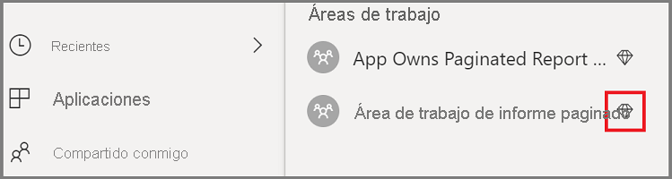

# <a name="tutorial-embed-power-bi-paginated-reports-into-an-application-for-your-organization"></a>Tutorial: Inserción de informes paginados de Power BI en una aplicación para la organización

En **Power BI**, puede insertar informes paginados en una aplicación para la organización mediante el escenario *El usuario posee los datos*.

Los informes paginados son informes diseñados para una impresión de alta calidad. Por lo general, estos informes contienen una gran cantidad de datos, que se representan de forma que se ajusten a las páginas impresas.
Para entender cómo Power BI admite los informes paginados, consulte [¿Qué son los informes paginados en Power BI Premium?](https://docs.microsoft.com/power-bi/paginated-reports-report-builder-power-bi)

**User owns data** permite a la aplicación ampliar el servicio Power BI para usar análisis integrados. En este tutorial se muestra cómo integrar un informe paginado en una aplicación.

Puede usar .NET SDK de Power BI, junto con la API JavaScript de Power BI para insertar Power BI en una aplicación para la organización.


En este tutorial, aprenderá las tareas siguientes:
> [!div class="checklist"]
> * Registrar una aplicación en Azure.
> * Insertar un informe paginado de Power BI en una aplicación mediante el inquilino de Power BI.

## <a name="prerequisites"></a>Requisitos previos
Para empezar, es necesario que tenga:

* Una [cuenta de Power BI Pro](../../admin/service-admin-purchasing-power-bi-pro.md).

* Debe tener configurado un [inquilino de Azure Active Directory](create-an-azure-active-directory-tenant.md) propio.

* Al menos una capacidad P1. Consulte [¿Qué tamaño de capacidad Premium se necesita para los informes paginados?](../../paginated-reports/paginated-reports-faq.md#what-size-premium-capacity-do-i-need-for-paginated-reports)

Si no está registrado en **Power BI Pro**, [regístrese para obtener una evaluación gratuita](https://powerbi.microsoft.com/pricing/) antes de empezar.

## <a name="set-up-your-power-bi-environment"></a>Configuración del entorno de Power BI

Siga las instrucciones que aparecen en esta sección a fin de configurar Power BI para insertar los informes paginados.

### <a name="register-a-server-side-web-application-app"></a>Registro de una aplicación web del lado servidor

Siga las instrucciones que aparecen en [Registro de una aplicación de Azure AD para usarla con Power BI](register-app.md) para registrar una aplicación web de lado servidor.

>[!NOTE]
>Al registrar la aplicación, asegúrese de hacer lo siguiente:
>* Obtenga el secreto de la aplicación.
>* Aplique los permisos **Report.ReadAll** (ámbito) a la aplicación.

### <a name="create-a-dedicated-capacity"></a>Crear una capacidad dedicada

Al crear una capacidad dedicada, puede aprovechar las ventajas de disponer de un recurso dedicado para el contenido del área de trabajo de la aplicación. En el caso de los informes paginados, debe hacer una copia de seguridad del área de trabajo de la aplicación con al menos una capacidad P1. Puede crear una capacidad dedicada mediante [Power BI Premium](../../admin/service-premium-what-is.md).

En la tabla siguiente se enumeran las SKU de Power BI Premium que se pueden usar para crear una capacidad dedicada para los informes paginados en [Microsoft Office 365](../../admin/service-admin-premium-purchase.md):

| Nodo de capacidad | Núcleos virtuales totales<br/>(back-end y front-end) | Núcleos virtuales de back-end | Núcleos virtuales de front-end | Límites de conexiones dinámicas/DirectQuery |
| --- | --- | --- | --- | --- | --- |
| P1 |8 núcleos virtuales |4 núcleos virtuales, 25 GB de RAM |4 núcleos virtuales |30 por segundo |
| P2 |16 núcleos virtuales |8 núcleos virtuales, 50 GB de RAM |8 núcleos virtuales |60 por segundo |
| P3 |32 núcleos virtuales |16 núcleos virtuales, 100 GB de RAM |16 núcleos virtuales |120 por segundo |
| P4 |64 núcleos virtuales |32 núcleos virtuales, 200 GB de RAM |32 núcleos virtuales |240 por segundo |
| P5 |128 núcleos virtuales |64 núcleos virtuales, 400 GB de RAM |64 núcleos virtuales |480 por segundo |
|||||

### <a name="enable-paginated-reports-workload"></a>Habilitación de la carga de trabajo de los informes paginados

Debe habilitar la carga de trabajo de los informe paginado en la capacidad dedicada.

1. Inicie sesión en [Power BI > Portal de administración > Configuración de capacidad](https://app.powerbi.com/admin-portal/capacities).

2. Seleccione la capacidad que tiene el área de trabajo en la que quiere cargar el informe paginado.

    

3. Expanda **Cargas de trabajo**.

    

4. Active la carga de trabajo de los informes paginados.

    

### <a name="assign-an-app-workspace-to-a-dedicated-capacity"></a>Asignación de un área de trabajo de aplicación a la capacidad dedicada

Después de crear una capacidad dedicada, puede asignar el área de trabajo de la aplicación a esa capacidad dedicada. Para completar este proceso, siga estos pasos:

1. En el servicio Power BI, expanda las áreas de trabajo y seleccione **Más**  en el área de trabajo en la que quiera insertar el contenido. A continuación, seleccione **Configuración del área de trabajo**.

    

2. Seleccione **Premium** y habilite la **Capacidad dedicada**. Seleccione la capacidad dedicada que ha creado. Luego seleccione **Guardar**.

    

3. Después de hacer clic en **Guardar**, debería ver un rombo junto al nombre del área de trabajo de la aplicación.

    

### <a name="create-and-publish-your-power-bi-paginated-reports"></a>Creación y publicación de los informes paginados de Power BI

Puede crear los informes paginados con [Power BI Report Builder](../../paginated-reports/paginated-reports-report-builder-power-bi.md#create-reports-in-power-bi-report-builder). Luego, puede [cargar el informe](../../paginated-reports/paginated-reports-quickstart-aw.md#upload-the-report-to-the-service) al área de trabajo de una aplicación asignada al menos a una capacidad P1 y activar la [carga de trabajo de los informes paginados](#enable-paginated-reports-workload). El usuario final que cargue el informe necesita tener una licencia de Power BI Pro para publicar en un área de trabajo de la aplicación.
   
## <a name="embed-your-content-by-using-the-sample-application"></a>Inserción del contenido mediante la aplicación de ejemplo

Este ejemplo se mantiene deliberadamente sencillo para fines de demostración.

Siga estos pasos para empezar a insertar contenido mediante la aplicación de ejemplo.

1. Descargue [Visual Studio](https://www.visualstudio.com/) (versión 2013 o posterior). Asegúrese de descargar el [paquete NuGet](https://www.nuget.org/profiles/powerbi) más reciente.

2. Descargue [PowerBI-Developer-Samples](https://github.com/Microsoft/PowerBI-Developer-Samples) y abra .NET Framework > Inserción para la organización > integrate-web-app > **PBIWebApp**.

    

3. Abra el archivo **Cloud.config** en la aplicación de ejemplo y rellene los campos siguientes para ejecutar la aplicación:
    * [Identificador de la aplicación](#application-id)
    * [Id. del área de trabajo](#workspace-id)
    * [Id. del informe](#report-id)
    * [AADAuthorityUrl](#aadauthorityurl)

    

### <a name="application-id"></a>Id. de aplicación

Rellene la información de **applicationId** con el **identificador de aplicación** de **Azure**. La aplicación usa **applicationId** para identificarse ante los usuarios a los que solicita permisos.

Para obtener **applicationId**, siga estos pasos:

1. Inicie sesión en [Azure Portal](https://portal.azure.com).

2. En el panel de navegación izquierdo, elija **Todos los servicios** y seleccione **Registros de aplicaciones**.

3. Seleccione la aplicación que necesite el valor **applicationId**.

    

4. Hay un **identificador de la aplicación** que se muestra como un GUID. Use este **identificador de aplicación** como **applicationId** de la aplicación.

    

### <a name="workspace-id"></a>Id. del área de trabajo

Rellene la información del valor **workspaceId** con el GUID del área de trabajo de la aplicación (grupo) de Power BI. Puede obtener esta información de la dirección URL cuando inicie sesión en el servicio Power BI o mediante PowerShell.

URL <br>


PowerShell <br>

```powershell
Get-PowerBIworkspace -name "User Owns Embed Test"
```

   

### <a name="report-id"></a>Report ID (Id. de informe)

Rellene la información de **reportId** con el GUID de informe de Power BI. Puede obtener esta información de la dirección URL cuando inicie sesión en el servicio Power BI o mediante PowerShell.


PowerShell <br>

```powershell
Get-PowerBIworkspace -name "User Owns Embed Test" | Get-PowerBIReport -Name "Sales Paginated Report"
```


### <a name="aadauthorityurl"></a>AADAuthorityUrl

Rellene la información **AADAuthorityUrl** con la dirección URL que le permite insertar en el inquilino organizativo o hacerlo con un usuario invitado.

Para insertar con el inquilino organizativo, use la dirección URL: *https://login.microsoftonline.com/common/oauth2/authorize* .

Para insertar con un invitado, use la dirección URL: *https://login.microsoftonline.com/report-owner-tenant-id* , donde se agrega el identificador de inquilino del propietario del informe en sustitución de *report-owner-tenant-id*.

### <a name="run-the-application"></a>Ejecutar la aplicación

1. Seleccione **Ejecutar** en **Visual Studio**.

    

2. Luego seleccione **Insertar informe**. En función del contenido con el que desee realizar las pruebas, es decir, informes, paneles o iconos, seleccione la opción correspondiente en la aplicación.

    

3. Ahora puede ver el informe en la aplicación de ejemplo.

    

## <a name="next-steps"></a>Pasos siguientes

En este tutorial, ha aprendido a insertar informes paginados de Power BI en una aplicación mediante la cuenta de la organización de Power BI. 

> [!div class="nextstepaction"]
> [Insertar desde aplicaciones](embed-from-apps.md)

> [!div class="nextstepaction"]
>[Insertar contenido de Power BI para los clientes](embed-sample-for-customers.md)

> [!div class="nextstepaction"]
>[Insertar informes paginados de Power BI para los clientes](embed-paginated-reports-customers.md)

Si tiene más preguntas, [pruebe a preguntar a la comunidad de Power BI](http://community.powerbi.com/).