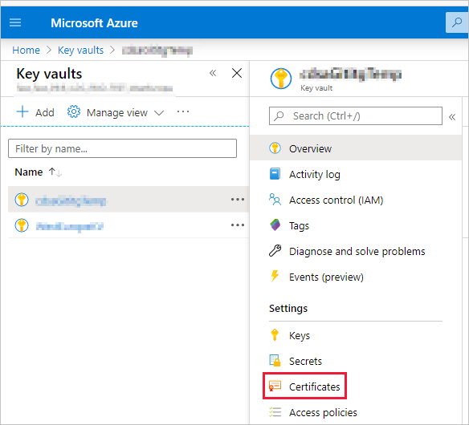
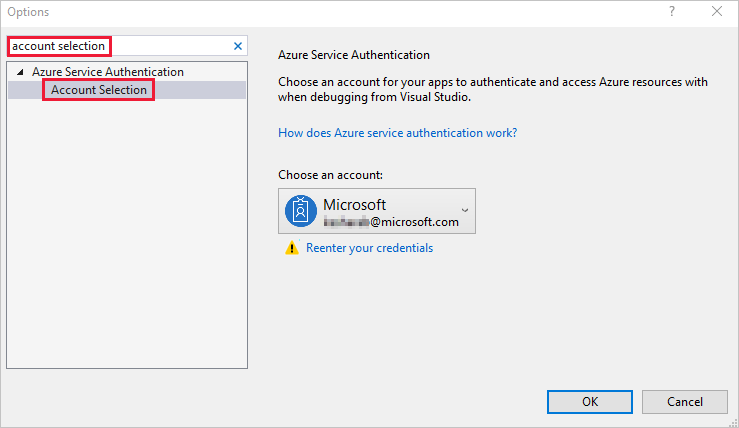

# <a name="embed-power-bi-content-with-service-principal-and-a-certificate"></a>Inserción de contenido de Power BI con entidades de servicio y un certificado

La autenticación basada en certificados le permite autenticarse mediante Azure Active Directory (Azure AD) con un certificado de cliente en un dispositivo Windows, Android o iOS, o bien mantenido en una instancia de [Azure Key Vault](https://docs.microsoft.com/azure/key-vault/basic-concepts).

Este método de autenticación permite administrar certificados desde una ubicación central, mediante la entidad de certificación, para la rotación o la revocación.

Puede obtener más información sobre los certificados en Azure AD en la página [Flujos de credenciales de cliente](https://github.com/AzureAD/microsoft-authentication-library-for-dotnet/wiki/Client-credential-flows) de GitHub.

## <a name="method"></a>Método

1. [Inserción del contenido con la entidad de servicio](embed-service-principal.md).

2. [Creación de un certificado](embed-service-principal-certificate.md#step-2---create-a-certificate).

3. [Configuración de la autenticación de certificado](embed-service-principal-certificate.md#step-3---set-up-certificate-authentication).

4. [Obtención del certificado de Azure Key Vault](embed-service-principal-certificate.md#step-4---get-the-certificate-from-azure-key-vault).

5. [Autenticación mediante la entidad de servicio y el certificado](embed-service-principal-certificate.md#step-5---authenticate-using-service-principal-and-a-certificate).

## <a name="step-1---embed-your-content-with-service-principal"></a>Paso 1: Inserción del contenido con la entidad de servicio

Para insertar el contenido con la entidad de servicio, siga las instrucciones de [Inserción de contenido de Power BI con entidades de servicio y un secreto de aplicación](embed-service-principal.md).

>[!NOTE]
>Si ya tiene contenido insertado mediante una entidad de servicio, omita este paso y continúe con el [paso 2](embed-service-principal-certificate.md#step-2---create-a-certificate).

## <a name="step-2---create-a-certificate"></a>Paso 2: Creación de un certificado

Puede adquirir un certificado de una *entidad de certificación* de confianza, o bien generarlo personalmente.

En esta sección se describe la creación de un certificado mediante [Azure Key Vault](/azure/key-vault/create-certificate) y la descarga del archivo *.cer* que contiene la clave pública.

1. Inicie sesión en [Microsoft Azure](https://ms.portal.azure.com/#allservices).

2. Busque **Almacenes de claves** y haga clic en el vínculo **Almacenes de claves**.

    

3. Haga clic en el almacén de claves al que quiera agregar un certificado.

    

4. Haga clic en **Certificados**.

    

5. Haga clic en **Generar o importar**.

    

6. Configure los campos **Creación de certificado** de esta forma:

    * **Método de creación de certificados**: General

    * **Nombre del certificado**: escriba un nombre para el certificado

    * **Tipo de entidad de certificación (CA)** : certificado autofirmado

    * **Asunto**: un nombre distintivo [X.500](https://wikipedia.org/wiki/X.500)

    * **Nombres DNS**: 0 nombres DNS

    * **Período de validez (en meses)** : escriba la duración de validez del certificado

    * **Tipo de contenido**: PKCS #12

    * **Tipo de acción de duración**: Renovar automáticamente cuando se llegue a un porcentaje determinado de duración

    * **Porcentaje de duración**: 80

    * **Configuración de directiva avanzada**: no configurado

7. Haga clic en **Crear**. El certificado recién creado está deshabilitado de forma predeterminada. Puede tardar hasta cinco minutos en habilitarse.

8. Seleccione el certificado que ha creado.

9. Haga clic en **Descargar en formato CER**. El archivo descargado contiene la clave pública.

    

## <a name="step-3---set-up-certificate-authentication"></a>Paso 3: Configuración de la autenticación de certificado

1. En la aplicación Azure AD, haga clic en la pestaña **Certificados y secretos**.

     

2. Haga clic en **Cargar certificado** y cargue el archivo *.cer* que ha creado y descargado en el [paso 2](#step-2---create-a-certificate) de este tutorial. El archivo *.cer* contiene la clave pública.

## <a name="step-4---get-the-certificate-from-azure-key-vault"></a>Paso 4: Obtención del certificado de Azure Key Vault

Use Managed Service Identity (MSI) para obtener el certificado de Azure Key Vault. Este proceso implica obtener el certificado *.pfx* que contiene las claves pública y privada.

Consulte el ejemplo de código para leer el certificado desde Azure Key Vault. Si quiere usar Visual Studio, consulte [Configuración de Visual Studio para usar MSI](#configure-visual-studio-to-use-msi).

```csharp
private X509Certificate2 ReadCertificateFromVault(string certName)
{
    var serviceTokenProvider = new AzureServiceTokenProvider();
    var keyVaultClient = new KeyVaultClient(new KeyVaultClient.AuthenticationCallback(serviceTokenProvider.KeyVaultTokenCallback));
    CertificateBundle certificate = null;
    SecretBundle secret = null;
    try
    {
        certificate = keyVaultClient.GetCertificateAsync($"https://{KeyVaultName}.vault.azure.net/", certName).Result;
        secret = keyVaultClient.GetSecretAsync(certificate.SecretIdentifier.Identifier).Result;
    }
    catch (Exception)
    {
        return null;
    }

    return new X509Certificate2(Convert.FromBase64String(secret.Value));
}
```

## <a name="step-5---authenticate-using-service-principal-and-a-certificate"></a>Paso 5: Autenticación mediante una entidad de servicio y un certificado

Puede autenticar la aplicación con la entidad de servicio y un certificado almacenado en Azure Key Vault mediante la conexión a Azure Key Vault.

Para conectarse y leer el certificado de Azure Key Vault, consulte el código siguiente.

>[!NOTE]
>Si ya tiene un certificado creado por la organización, cargue el archivo *.pfx* en Azure Key Vault.

```csharp
// Preparing needed variables
var Scope = "https://analysis.windows.net/powerbi/api/.default"
var ApplicationId = "{YourApplicationId}"
var tenantSpecificURL = "https://login.microsoftonline.com/{YourTenantId}/"
X509Certificate2 certificate = ReadCertificateFromVault(CertificateName);

// Authenticating with a SP and a certificate
public async Task<AuthenticationResult> DoAuthentication(){
    IConfidentialClientApplication clientApp = null;
    clientApp = ConfidentialClientApplicationBuilder.Create(ApplicationId)
                                                    .WithCertificate(certificate)
                                                    .WithAuthority(tenantSpecificURL)
                                                    .Build();
    try
    {
        authenticationResult = await clientApp.AcquireTokenForClient(Scope).ExecuteAsync();
    }
    catch (MsalException)
    {
        throw;
    }
    return authenticationResult
}
```

## <a name="configure-visual-studio-to-use-msi"></a>Configuración de Visual Studio para usar MSI

Al crear la solución insertada, puede resultar útil configurar Visual Studio para usar Managed Service Identity (MSI). [MSI](/azure/active-directory/managed-identities-azure-resources/overview) es una característica que le permite administrar la identidad de Azure AD. Una vez que se ha configurado, permitirá que Visual Studio se autentique en la instancia de Azure Key Vault.

1. Abra el proyecto en Visual Studio.

2. Haga clic en **Herramientas** > **Opciones**.

     

3. Busque **Selección de cuentas** y haga clic en **Selección de cuentas**.

    

4. Agregue la cuenta que tenga acceso a la instancia de Azure Key Vault.

## <a name="next-steps"></a>Pasos siguientes

>[!div class="nextstepaction"]
>[Registro de una aplicación](register-app.md)

> [!div class="nextstepaction"]
>[Power BI Embedded para los clientes](embed-sample-for-customers.md)

>[!div class="nextstepaction"]
>[Objetos de aplicación y de entidad de servicio de Azure Active Directory](/azure/active-directory/develop/app-objects-and-service-principals)

>[!div class="nextstepaction"]
>[Seguridad de nivel de fila mediante puerta de enlace de datos local con entidad de servicio](embedded-row-level-security.md#on-premises-data-gateway-with-service-principal)