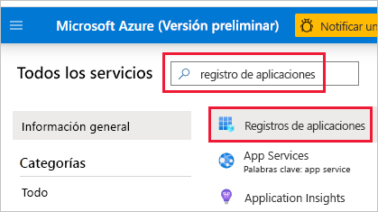
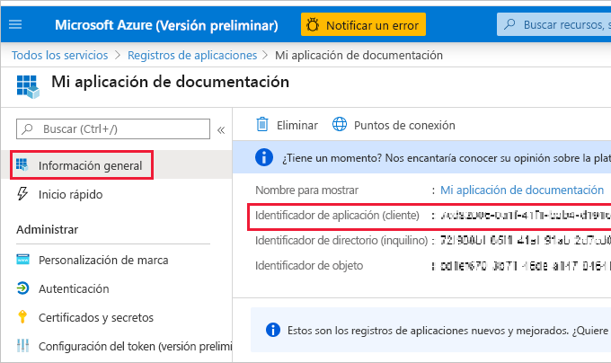
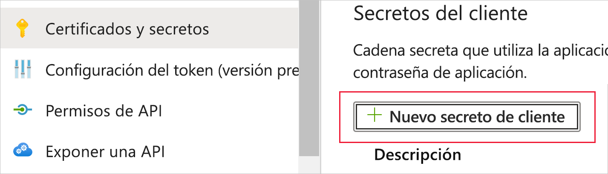
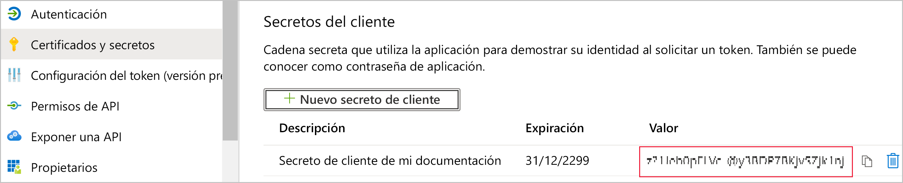
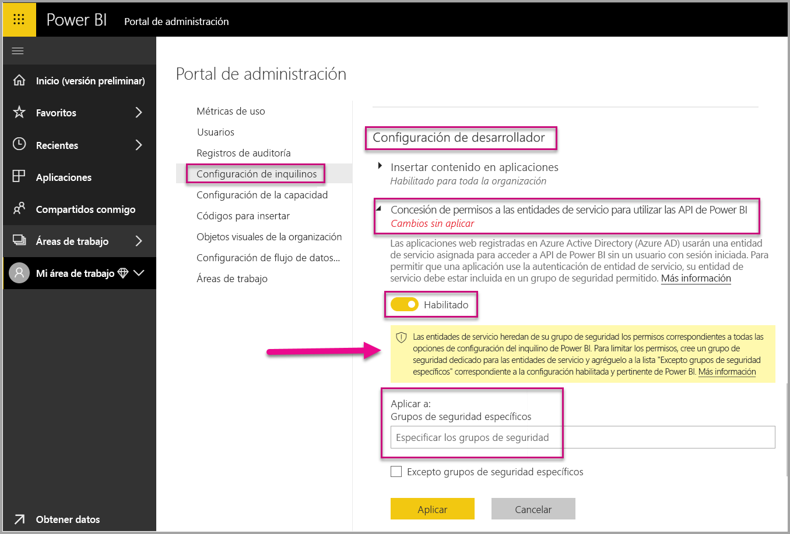
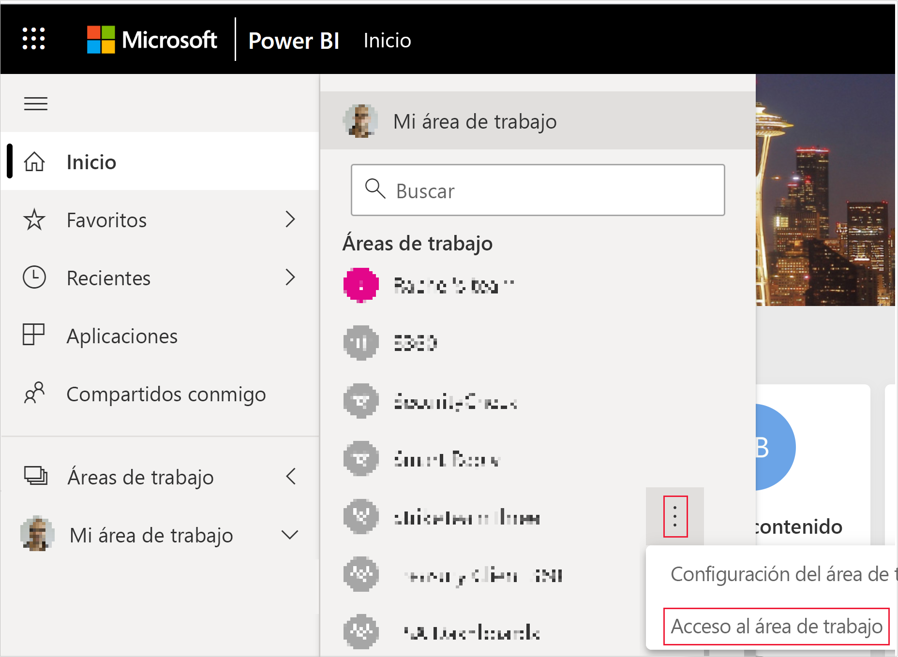
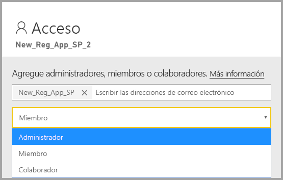

# <a name="embedding-power-bi-content-with-service-principal-and-application-secret"></a>Inserción de contenido de Power BI con entidad de servicio y secreto de aplicación

La entidad de servicio es un método de autenticación que se puede usar para permitir que una aplicación de Azure AD tenga acceso a las API y el contenido del servicio Power BI.

Al crear una aplicación de Azure Active Directory (Azure AD), se crea un [objeto de entidad de servicio](https://docs.microsoft.com/azure/active-directory/develop/app-objects-and-service-principals#service-principal-object). El objeto de entidad de servicio, también conocido como *entidad de servicio*, permite que Azure AD autentique su aplicación. Una vez autenticada, la aplicación puede acceder a los recursos del inquilino de Azure AD.

Para realizar la autenticación, la entidad de servicio usa el *identificador de aplicación* de la aplicación de Azure AD y uno de los siguientes:
* Secreto de aplicación
* Certificado

En este artículo se describe la autenticación de la entidad de servicio mediante el *identificador de aplicación* y el *secreto de aplicación*. Para autenticar mediante una entidad de servicio con un certificado, consulte [Autenticación basada en certificados de Power BI]().

## <a name="method"></a>Método

Para usar la entidad de servicio y un identificador de aplicación con análisis insertados, siga estos pasos:

1. Cree una [aplicación de Azure AD](https://docs.microsoft.com/azure/active-directory/manage-apps/what-is-application-management).

    1. Cree el secreto de la aplicación de Azure AD.
    
    2. Obtenga el *identificador de aplicación* y el *secreto de aplicación* de la aplicación.

    >[!NOTE]
    >Estos pasos se describen en el **paso 1**. Para obtener más información sobre la creación de una aplicación de Azure AD, consulte el artículo [Creación de una aplicación de Azure AD](https://docs.microsoft.com/azure/active-directory/develop/howto-create-service-principal-portal).

2. Cree de un grupo de seguridad de Azure AD.

3. Habilite la configuración de administración del servicio Power BI.

4. Agregue la entidad de servicio a su área de trabajo.

5. Inserte el contenido.

> [!IMPORTANT]
> Después de habilitar la entidad de servicio para usarla con Power BI, los permisos de AD de la aplicación ya no tendrán efecto. Los permisos de la aplicación se administrarán desde el portal de administración de Power BI.

## <a name="step-1---create-an-azure-ad-app"></a>Paso 1: Creación de una aplicación de Azure AD

Cree una aplicación de Azure AD con uno de estos métodos:
* Cree la aplicación en [Microsoft Azure Portal](https://ms.portal.azure.com/#allservices).
* Cree la aplicación mediante [PowerShell](https://docs.microsoft.com/powershell/azure/create-azure-service-principal-azureps?view=azps-3.6.1).

### <a name="creating-an-azure-ad-app-in-the-microsoft-azure-portal"></a>Creación de una aplicación de Azure AD en Microsoft Azure Portal

1. Inicie sesión en [Microsoft Azure](https://ms.portal.azure.com/#allservices).

2. Busque **Registros de aplicaciones** y haga clic en el vínculo **Registros de aplicaciones**.

    

3. Haga clic en **Nuevo registro**.

    

4. Rellene la información necesaria:
    * **Nombre**: escriba un nombre para la aplicación.
    * **Tipos de cuenta admitidos**: seleccione tipos de cuenta admitidos.
    * (Opcional) **URI de redireccionamiento**: escriba un URI si es necesario.

5. Haga clic en **Registrar**.

6. Después del registro, el *identificador de la aplicación* está disponible en la pestaña **Información general**. Copie y guarde el *identificador de aplicación* para su uso posterior.

    

7. Haga clic en la pestaña **Certificados y secretos**.

     

8. Haga clic en **Nuevo secreto de cliente**.

    

9. En la ventana *Agregar un secreto de cliente*, escriba una descripción, especifique cuándo desea que expire el secreto de cliente y haga clic en **Agregar**.

10. Copie y guarde el valor del *secreto de cliente*.

    

    >[!NOTE]
    >Después de salir de esta ventana, se ocultará el valor de secreto de cliente y no podrá verlo ni copiarlo de nuevo.

### <a name="creating-an-azure-ad-app-using-powershell"></a>Creación de una aplicación de Azure AD con PowerShell

En esta sección se incluye un script de ejemplo para crear una nueva aplicación de Azure AD con [PowerShell](https://docs.microsoft.com/powershell/azure/create-azure-service-principal-azureps?view=azps-1.1.0).

```powershell
# The app ID - $app.appid
# The service principal object ID - $sp.objectId
# The app key - $key.value

# Sign in as a user that's allowed to create an app
Connect-AzureAD

# Create a new Azure AD web application
$app = New-AzureADApplication -DisplayName "testApp1" -Homepage "https://localhost:44322" -ReplyUrls "https://localhost:44322"

# Creates a service principal
$sp = New-AzureADServicePrincipal -AppId $app.AppId

# Get the service principal key
$key = New-AzureADServicePrincipalPasswordCredential -ObjectId $sp.ObjectId
```

## <a name="step-2---create-an-azure-ad-security-group"></a>Paso 2: Creación de un grupo de seguridad de Azure AD

La entidad de servicio no tiene acceso al contenido ni a las API de Power BI. Para conceder acceso a la entidad de servicio, cree un grupo de seguridad en Azure AD y agregue la entidad de servicio que creó a ese grupo de seguridad.

Hay dos maneras de crear un grupo de seguridad de Azure AD:
* Manualmente (en Azure)
* Uso de PowerShell

### <a name="create-a-security-group-manually"></a>Creación de un grupo de seguridad manualmente

Para crear un grupo de seguridad de Azure manualmente, siga las instrucciones del artículo [Creación de un grupo básico e incorporación de miembros con Azure Active Directory](https://docs.microsoft.com/azure/active-directory/fundamentals/active-directory-groups-create-azure-portal). 

### <a name="create-a-security-group-using-powershell"></a>Creación de un grupo de seguridad mediante PowerShell

A continuación se muestra un script de ejemplo para crear un nuevo grupo de seguridad y agregar una aplicación a ese grupo de seguridad.

>[!NOTE]
>Si desea habilitar el acceso de la entidad de servicio para toda la organización, omita este paso.

```powershell
# Required to sign in as a tenant admin
Connect-AzureAD

# Create an Azure AD security group
$group = New-AzureADGroup -DisplayName <Group display name> -SecurityEnabled $true -MailEnabled $false -MailNickName notSet

# Add the service principal to the group
Add-AzureADGroupMember -ObjectId $($group.ObjectId) -RefObjectId $($sp.ObjectId)
```

## <a name="step-3---enable-the-power-bi-service-admin-settings"></a>Paso 3: Habilitación de la configuración de administración del servicio Power BI

Para que una aplicación de Azure AD pueda acceder al contenido y las API de Power BI, un administrador de Power BI debe habilitar el acceso de entidad de servicio en el portal de administración de Power BI.

Agregue el grupo de seguridad que ha creado en Azure AD a la sección de grupos de seguridad específicos en la **Configuración del desarrollador**.

>[!IMPORTANT]
>Las entidades de servicio tienen acceso a cualquier configuración de inquilino para la que estén habilitadas. En función de la configuración de administración, esto incluye grupos de seguridad específicos o toda la organización.
>
>Para restringir el acceso de la entidad de servicio a una configuración de inquilino específica, permita el acceso únicamente a grupos de seguridad específicos. También puede crear un grupo de seguridad dedicado para entidades de servicio y excluirlo de la configuración de inquilino que desee.



## <a name="step-4---add-the-service-principal-as-an-admin-to-your-workspace"></a>Paso 4: Adición de la entidad de servicio como administrador al área de trabajo

Para habilitar los artefactos de acceso a la aplicación de Azure AD como informes, paneles y conjuntos de datos en el servicio Power BI, agregue la instancia de la entidad de servicio como miembro o administrador al área de trabajo.

>[!NOTE]
>En esta sección se proporcionan instrucciones para la interfaz de usuario. También puede agregar una entidad de servicio a un área de trabajo mediante la [API Grupos: agregar usuario de grupo](https://docs.microsoft.com/rest/api/power-bi/groups/addgroupuser).

1. Desplácese hasta el área de trabajo para el que desea habilitar el acceso y, en el menú **Más**, seleccione **Acceso al área de trabajo**.

    

2. Agregue la entidad de servicio como **administrador** o **miembro** al área de trabajo.

    

## <a name="step-5---embed-your-content"></a>Paso 5: Inserción del contenido

Puede insertar el contenido en una aplicación de ejemplo o en una aplicación propia.

* [Inserción de contenido mediante la aplicación de ejemplo](embed-sample-for-customers.md#embed-content-using-the-sample-application)
* [Inserción de contenido en una aplicación propia](embed-sample-for-customers.md#embed-content-within-your-application)

Una vez insertado el contenido, está listo para [pasar a producción](embed-sample-for-customers.md#move-to-production).

## <a name="considerations-and-limitations"></a>Consideraciones y limitaciones

* La entidad de servicio solo funciona con [áreas de trabajo nuevas](../../service-create-the-new-workspaces.md).
* Cuando se usa la entidad de servicio, no se admite **Mi área de trabajo**.
* Para pasar a producción, se necesita capacidad dedicada.
* No se puede iniciar sesión en el portal de Power BI con la entidad de servicio.
* Se necesitan derechos de administrador de Power BI para habilitar la entidad de servicio en la configuración de desarrollador en el portal de administración de Power BI.
* No se puede instalar ni administrar una puerta de enlace de datos local con la entidad de servicio.
* Las aplicaciones de [inserción para la organización](embed-sample-for-your-organization.md) no pueden usar la entidad de servicio.
* No se admite la administración de [flujos de datos](../../service-dataflows-overview.md).
* Actualmente la entidad de servicio no admite ninguna API de administración.
* Al usar una entidad de servicio con un origen de datos de [Azure Analysis Services](https://docs.microsoft.com/azure/analysis-services/analysis-services-overview), la propia entidad de servicio debe tener permisos de una instancia de Azure Analysis Services. El uso de un grupo de seguridad que contiene la entidad de servicio para este propósito no funciona.

## <a name="next-steps"></a>Pasos siguientes

* [Power BI Embedded para los clientes](embed-sample-for-customers.md)

* [Seguridad de nivel de fila mediante puerta de enlace de datos local con entidad de servicio](embedded-row-level-security.md#on-premises-data-gateway-with-service-principal)

* [Inserción de contenido de Power BI con entidad de servicio y un certificado]()
