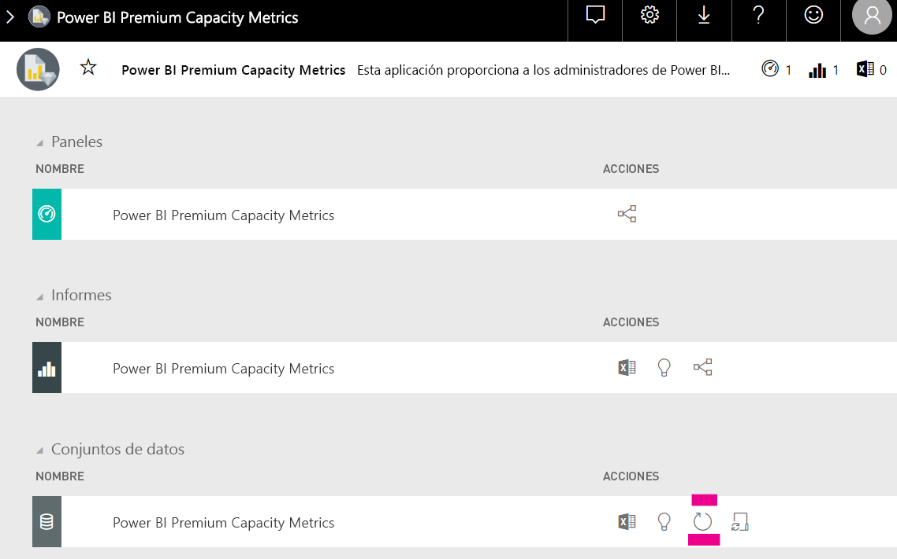

# Planeamiento de la capacidad de análisis insertado de Power BI

Calcular qué tipo de capacidad es necesaria para la implementación de un análisis insertado de Power BI puede ser complicado. El motivo es que este cálculo se basa en varios parámetros, algunos de los cuales son difíciles de predecir.

Algunos de los aspectos que se deben tener en cuenta a la hora de planear la capacidad son:

* Los modelos de datos que use
* El número y la complejidad de las consultas necesarias
* La distribución por hora del uso de la aplicación
* Frecuencias de actualización de datos
* Patrones de uso adicionales que son difíciles de predecir.

Este artículo está diseñado para facilitar el planeamiento de la capacidad para análisis insertados de Power BI con la introducción de la [herramienta de evaluación de la carga de capacidad dedicada de Power BI](https://github.com/microsoft/PowerBI-Tools-For-Capacities/tree/master/LoadTestingPowerShellTool/). Esta herramienta se crea para automatizar las pruebas de carga para las capacidades de análisis insertado de Power BI (*A*, *EM* o *SKU*).

## Herramienta de planeamiento

 La [herramienta de evaluación de la carga de capacidad dedicada de Power BI](https://github.com/microsoft/PowerBI-Tools-For-Capacities/tree/master/LoadTestingPowerShellTool/) puede ayudarle a comprender la cantidad de carga de usuarios que puede administrar la capacidad. Emplea PowerShell para crear pruebas de carga automatizadas para las capacidades, y le permite elegir qué informes probar y cuántos usuarios simultáneos simular.

La herramienta genera carga en una capacidad mediante la representación continua de cada informe con nuevos valores de filtro (para evitar un rendimiento falsamente bueno debido al almacenamiento en caché de informes), hasta que expire el token necesario para autenticar la herramienta en el servicio.

### Uso de la herramienta de planeamiento

Al ejecutar la herramienta, tenga en cuentan la carga existente sobre sus capacidades y asegúrese de no ejecutar pruebas de carga durante los tiempos de uso principales.

Estos son algunos ejemplos de cómo puede usar la herramienta de planeamiento.

* Los administradores de la capacidad pueden comprender mejor cuántos usuarios puede controlar su capacidad en un período de tiempo determinado.
* Los autores de informes pueden entender el efecto de la carga de usuarios, tal y como se mide con el [analizador de rendimiento](https://docs.microsoft.com/power-bi/desktop-performance-analyzer) de escritorio de Power BI.
* Puede ver las representaciones que se producen en tiempo real en el explorador.
* Con SQL Server Profiler, puede [conectarse a los puntos de conexión XMLA](https://powerbi.microsoft.com/blog/power-bi-open-platform-connectivity-with-xmla-endpoints-public-preview/) de las capacidades que se miden para ver las consultas que se ejecutan.
* Los efectos de la prueba de carga están visibles en la página Conjuntos de datos de la aplicación de métricas de la capacidad Premium. Los administradores de la capacidad pueden usar esta herramienta para generar la carga y ver cómo se muestra.

### Revisión de los resultados de las pruebas

Para ver los efectos de la prueba de carga en la aplicación de métricas después de que se ejecute la prueba, siga las instrucciones que se indican a continuación. Puede esperar un retraso de hasta 15 minutos desde el momento en que la prueba comienza a generar la carga, hasta el momento en que la carga es visible en las métricas.

1. Expanda la pestaña **Conjuntos de datos** de la página de inicio de la [aplicación de métricas](../../service-admin-premium-monitor-capacity.md).
2. Inicie una actualización a petición haciendo clic en **Actualizar ahora**. Los administradores deben hacerlo.

    

## Repositorio de GitHub de herramientas de capacidad de Power BI

El [repositorio de GitHub de las herramientas de capacidad de Power BI](https://github.com/microsoft/PowerBI-Tools-For-Capacities) se creó con el objeto de hospedar la herramienta de planeamiento de capacidad y otras herramientas y utilidades futuras.

El repositorio es de código abierto, y se anima a los usuarios a colaborar, agregar herramientas adicionales relacionadas con Power BI Premium y capacidades insertadas, y mejorar las existentes.

## Pasos siguientes

> [!div class="nextstepaction"]
>[Capacidad y SKU de los análisis incrustados de Power BI](embedded-capacity.md)

> [!div class="nextstepaction"]
>[Procedimientos recomendados de rendimiento de Power BI Embedded](embedded-performance-best-practices.md)