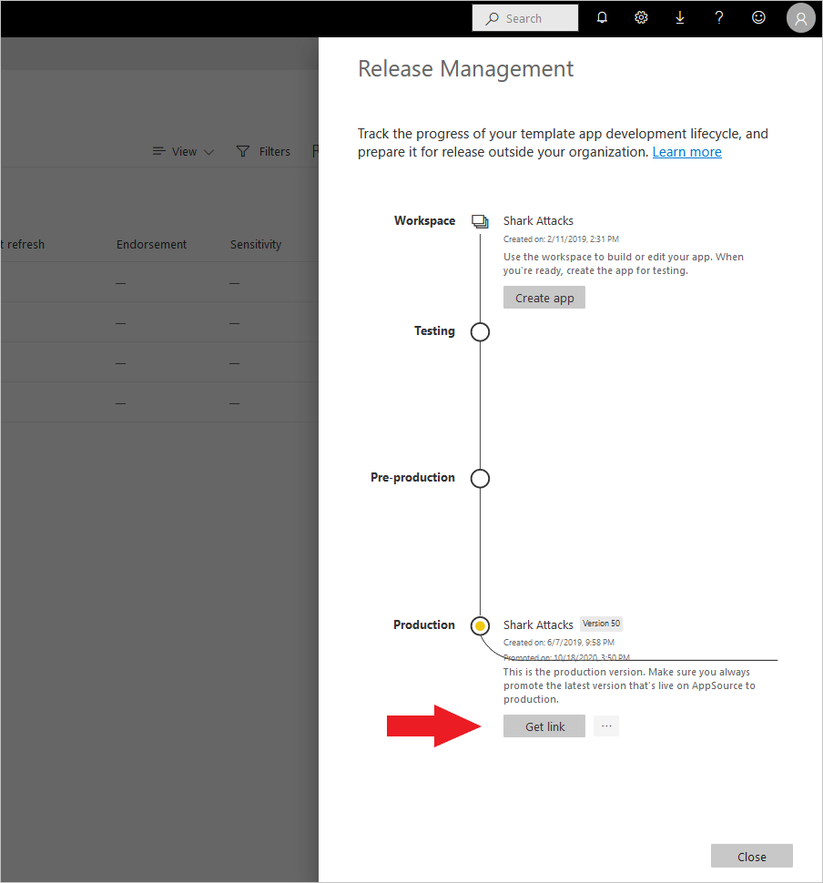
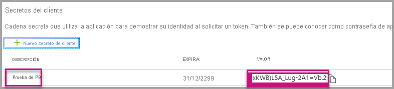

# <a name="tutorial-automate-configuration-of-template-app-installation-using-an-azure-function"></a>Tutorial: Automatización de la configuración de la instalación de aplicaciones de plantilla con una función de Azure

Las aplicaciones de plantilla son una excelente manera de que los clientes empiecen a obtener conclusiones de sus datos. Estas aplicaciones les permiten ponerse en marcha rápidamente, les conectan a sus datos y les proporcionan informes pregenerados que luego pueden personalizar si lo prefieren.

Los clientes no siempre están familiarizados con los detalles de cómo conectarse a sus datos, y tener que proporcionar estos detalles al instalar una aplicación de plantilla puede resultarles muy complicado.

Si es un proveedor de servicios de datos y ha creado una aplicación de plantilla para ayudar a los clientes a empezar a trabajar con sus datos en el servicio, puede facilitarles la instalación de la aplicación de plantilla automatizando la configuración de sus parámetros. Cuando un cliente inicia sesión en el portal, hace clic en un vínculo especial que usted ha preparado. Esto inicia la automatización, que recopila la información que necesita, configura previamente los parámetros de la aplicación de plantilla y redirige al cliente a su cuenta de Power BI, donde puede instalar la aplicación. Solo tiene que hacer clic en Instalar, autenticarse en su origen de datos y listo. 

A continuación se ilustra esta experiencia del cliente.


En este tutorial usará un ejemplo de función de Azure de instalación automática que se ha creado para preconfigurar e instalar la aplicación de plantilla. Este ejemplo se ha mantenido deliberadamente sencillo con fines de demostración. Encapsula la configuración de una función de Azure para aprovechar las API de Power BI para instalar una aplicación de plantilla y configurarla de forma automática para los usuarios.

Para obtener más información sobre el flujo de automatización general y las API que usa, vea [Automatización de la configuración de la instalación de una aplicación de plantilla](template-apps-auto-install.md).

En la aplicación se usa una función de Azure. Para obtener más información sobre Azure Functions, vea la [documentación de Azure Functions](https://docs.microsoft.com/azure/azure-functions/).

## <a name="basic-flow"></a>Flujo básico

A continuación se muestra el flujo básico de lo que hace la aplicación cuando el cliente la inicia al hacer clic en el vínculo del portal.

1. El usuario inicia sesión en el portal del ISV y hace clic en el vínculo proporcionado. Esto inicia el flujo. En esta fase, el portal del ISV prepara la configuración específica del usuario.

2. El ISV adquiere un token **de solo aplicación** basado en una [entidad de servicio (token de solo aplicación)](../embedded/embed-service-principal.md), que está registrada en el inquilino del ISV.

3. Mediante las [API REST de Power BI](https://docs.microsoft.com/rest/api/power-bi/), el ISV crea un **vale de instalación** que contiene la configuración de parámetros específicos del usuario, tal y como la haya preparado el ISV.

4. El ISV redirige al usuario a Power BI mediante un método de redireccionamiento ```POST``` que contiene el vale de instalación.

5. Se redirige al usuario a su cuenta de Power BI con el vale de instalación y se le pide que instale la aplicación de plantilla. Cuando el usuario hace clic en instalar, la aplicación de plantilla se instala de forma automática.

>[!Note]
>Aunque el ISV configura los valores de parámetro al crear el vale de instalación, las credenciales relacionadas con el origen de datos solo las proporciona el usuario en las fases finales de la instalación. Esto evita que se expongan a un tercero, lo que garantiza una conexión segura entre el usuario y los orígenes de datos de la aplicación de plantilla.

## <a name="prerequisites"></a>Prerrequisitos

Antes de empezar, debe tener lo siguiente:

* Una configuración de inquilino de Azure Active Directory propia. Vea [Creación de un inquilino de Azure Active Directory](https://docs.microsoft.com/power-bi/developer/embedded/create-an-azure-active-directory-tenant) para obtener instrucciones sobre cómo configurar uno.

* Una [entidad de servicio (token de solo aplicación)](https://docs.microsoft.com/power-bi/developer/embedded/embed-service-principal) registrada en el inquilino anterior.

* Una [aplicación de plantilla parametrizada](https://docs.microsoft.com/power-bi/connect-data/service-template-apps-overview) lista para la instalación. La aplicación de plantilla se debe crear en el mismo inquilino en el que registre la aplicación en Azure Active Directory (Azure AD). Para obtener más información, vea [Sugerencias de aplicación de plantilla](https://docs.microsoft.com/power-bi/connect-data/service-template-apps-tips.md) o [Creación de una aplicación de plantilla en Power BI](https://docs.microsoft.com/power-bi/connect-data/service-template-apps-create).

* Una **licencia de Power BI Pro.** . Si no está registrado para Power BI Pro, [regístrese para una evaluación gratuita](https://powerbi.microsoft.com/pricing/) antes de comenzar.

## <a name="set-up-your-template-apps-automation-development-environment"></a>Configuración del entorno de desarrollo de automatización de aplicaciones de plantillas

Antes de continuar con la configuración de la aplicación, siga las instrucciones de [Inicio rápido: Creación de una aplicación de Azure Functions con Azure App Configuration](https://docs.microsoft.com/azure/azure-app-configuration/quickstart-azure-functions-csharp) para desarrollar una función de Azure junto con una instancia de Azure App Configuration. Cree la instancia de App Configuration como se describe en el artículo.

### <a name="register-an-application-in-azure-active-directory-azure-ad"></a>Registro de una aplicación en Azure Active Directory (Azure AD)

Cree una entidad de servicio como se describe en [Inserción de contenido de Power BI con entidades de servicio y un secreto de aplicación](https://docs.microsoft.com/power-bi/developer/embedded/embed-service-principal).

Asegúrese de registrar la aplicación como una **aplicación web del lado servidor**. Una aplicación web del lado servidor se registra para crear un secreto de aplicación.

Guarde el *Id. de aplicación* (Id. de cliente) y el *Secreto de aplicación* (Secreto de cliente) para los pasos posteriores.

Puede probar la [herramienta de configuración de inserción](https://aka.ms/embedsetup/AppOwnsData) para empezar rápidamente a crear un registro de aplicación. Si usa la [herramienta de registro de aplicaciones de Power BI](https://app.powerbi.com/embedsetup), seleccione la opción *Embed for your customers* (Inserción para los clientes).

## <a name="template-app-preparation"></a>Preparación de la aplicación de plantilla

Una vez que haya creado la aplicación de plantilla y esté lista para la instalación, guarde la información siguiente para los pasos posteriores:

* *Id. de la aplicación*, *clave del paquete* e *identificador del propietario*, tal y como aparecen en la dirección URL de instalación al final del proceso [Definición de las propiedades de la aplicación de plantilla](../../connect-data/service-template-apps-create.md#define-the-properties-of-the-template-app) cuando se ha creado la aplicación.

    También puede obtener el mismo vínculo si hace clic en **Obtener vínculo** en [Administración de versiones](../../connect-data/service-template-apps-create.md#manage-the-template-app-release) de la aplicación de plantilla.

* Los *nombres de parámetro* como se definen en el conjunto de datos de la aplicación de plantilla. Los nombres de parámetro son cadenas que distinguen mayúsculas de minúsculas y también se pueden recuperar en la pestaña **Configuración de parámetros** cuando se [definen las propiedades de la aplicación de plantilla](../../connect-data/service-template-apps-create.md#define-the-properties-of-the-template-app), o bien desde la configuración del conjunto de datos de Power BI.

>[!NOTE]
>Puede probar la aplicación de instalación preconfigurada en la aplicación de plantilla si está lista para la instalación, incluso si todavía no está disponible de forma pública en AppSource. Pero para que los usuarios ajenos al inquilino puedan utilizar la aplicación de instalación automatizada para instalar la aplicación de plantilla, esta debe estar disponible de forma pública en el [marketplace de aplicaciones de Power BI](https://app.powerbi.com/getdata/services). Por tanto, antes de distribuir la aplicación de plantilla con la aplicación de instalación automatizada que va a crear, asegúrese de publicarla en el [Centro de partners](https://docs.microsoft.com/azure/marketplace/partner-center-portal/create-power-bi-app-offer).


## <a name="install-and-configure-your-template-app-using-our-azure-function-sample"></a>Instalación y configuración de la aplicación de plantilla con el ejemplo de Azure Functions

En esta sección, usará un ejemplo de función de Azure de instalación automática que se ha creado para preconfigurar e instalar la aplicación de plantilla. Este ejemplo se ha mantenido deliberadamente sencillo con fines de demostración. Permite aprovechar una instancia de [Azure Functions](https://docs.microsoft.com/azure/azure-functions/functions-overview) y de [Azure App Configuration](https://docs.microsoft.com/azure/azure-app-configuration/overview) para implementar y usar con facilidad la API de instalación automatizada para las aplicaciones de plantilla.

### <a name="download-visual-studio-version-2017-or-later"></a>Descargue [Visual Studio](https://www.visualstudio.com/) (versión 2017 o posterior).

Descargue [Visual Studio](https://www.visualstudio.com/) (versión 2017 o posterior). Asegúrese de descargar el [paquete NuGet](https://www.nuget.org/profiles/powerbi) más reciente.

### <a name="download-the-automated-install-azure-function-sample"></a>Descarga del ejemplo de Azure Functions de instalación automatizada

Descargue el [ejemplo de Azure Functions de instalación automatizada](https://github.com/microsoft/Template-apps-examples/tree/master/Developer%20Samples/Automated%20Install%20Azure%20Function) desde GitHub para empezar a trabajar.


### <a name="setup-your-azure-app-configuration"></a>Configuración de Azure App Configuration

Para ejecutar este ejemplo, debe configurar Azure App Configuration con los valores y claves que se describen a continuación. Las claves son **Id. de la aplicación** y **Secreto de la aplicación**, además de las propiedades **AppId**, **PackageKey** y **OwnerId** de la aplicación de plantilla. Vea las secciones siguientes para obtener información sobre cómo obtener estos valores. 

Las claves también se definen en el archivo **Constants.cs**.

| Configuration Key | Significado           |
|---------------    |-------------------|
| TemplateAppInstall:Application:AppId | *AppId* de la [dirección URL de instalación](#getting-the-template-app-properties) |
| TemplateAppInstall:Application:PackageKey | *PackageKey* de la [dirección URL de instalación](#getting-the-template-app-properties) |
| TemplateAppInstall:Application:OwnerId | *OwnerId* de la [dirección URL de instalación](#getting-the-template-app-properties) |
| TemplateAppInstall:ServicePrincipal:ClientId | [Identificador de la aplicación](#getting-the-application-id) de la entidad de servicio |
| TemplateAppInstall:ServicePrincipal:ClientSecret | [Secreto de la aplicación](#getting-the-application-secret) de la entidad de servicio |
|||


El archivo **Constants.cs**:


#### <a name="getting-the-template-app-properties"></a>Obtención de las propiedades de la aplicación de plantilla
Rellene todas las propiedades de la aplicación de plantilla relevantes, tal y como se han definido al crear la aplicación. Estas propiedades son **AppId**, **PakcageKey** & **OwnerId** de la aplicación de plantilla.

Para obtener los valores anteriores, siga estos pasos:

1. Inicie sesión en [Power BI](https://app.powerbi.com).

2. Vaya al área de trabajo original de la aplicación.

3. Abra el panel Administración de versiones.

    

4. Seleccione la versión de la aplicación y obtenga su vínculo de instalación.

    

5. Copie el vínculo al Portapapeles.

    

6. Esta dirección URL de instalación contiene los tres parámetros de dirección URL cuyos valores necesita. Use los valores **appId**, **packageKey** & **ownerId** de la aplicación. Una dirección URL de ejemplo será similar a la que se muestra a continuación.

    ```html
    https://app.powerbi.com/Redirect?action=InstallApp&appId=3c386...16bf71c67&packageKey=b2df4b...dLpHIUnum2pr6k&ownerId=72f9...1db47&buildVersion=5
    ```

#### <a name="getting-the-application-id"></a>Obtención del id. de la aplicación

Rellene la información de **applicationId** con el **identificador de aplicación** de **Azure**. La aplicación usa **applicationId** para identificarse ante los usuarios a los que solicita permisos.

Para obtener **applicationId**, siga estos pasos:

1. Inicie sesión en [Azure Portal](https://portal.azure.com).

2. En el panel de navegación izquierdo, seleccione **Todos los servicios** y seleccione **Registros de aplicaciones**.

    

3. Seleccione la aplicación que necesite el valor **applicationId**.

    

4. Hay un **identificador de la aplicación** que se muestra como un GUID. Use este **identificador de aplicación** como **applicationId** de la aplicación.

    

#### <a name="getting-the-application-secret"></a>Obtención del secreto de la aplicación

Rellene la información de **ApplicationSecret** a partir de la sección **Claves** de la sección **Registros de aplicaciones** de **Azure**.  Este atributo funciona cuando se usa la [entidad de servicio](../embedded/embed-service-principal.md).

Para obtener **ApplicationSecret**, siga estos pasos:

 1. Inicie sesión en [Azure Portal](https://portal.azure.com).

 2. En el panel de navegación izquierdo, seleccione **Todos los servicios** y, a continuación, seleccione **Registros de aplicaciones**.

    

3. Seleccione la aplicación que necesite usar **ApplicationSecret**.

    

4. Seleccione **Certificates and secrets** (Certificados y secretos) en **Administrar**.

5. Seleccione **New client secrets** (Nuevos secretos de cliente).

6. Escriba un nombre en el cuadro **Descripción** y seleccione una duración. Después, haga clic en **Guardar** para obtener el **valor** para la aplicación. Cuando se cierra el panel **Claves** después de guardar el valor de clave, el campo de valor solo se muestra como oculto. En ese momento, no puede recuperar el valor de clave. Si pierde el valor de clave, cree uno nuevo en Azure Portal.

    

## <a name="test-your-function-locally"></a>Prueba local de la función

Siga los pasos que se describen en [Ejecución local de la función](https://docs.microsoft.com/azure/azure-functions/functions-create-your-first-function-visual-studio#run-the-function-locally) para ejecutar la función.

Configure el portal para que emita una solicitud ```POST``` a la dirección URL de la función (por ejemplo, ```POST http://localhost:7071/api/install```). El cuerpo de la solicitud debe ser un objeto JSON que describa pares clave-valor, donde las claves son *nombres de parámetro* (definidos en Power BI Desktop) y los valores son los valores deseados que se van a establecer para cada parámetro de la aplicación de plantilla.

>[!Note]
> En producción, los valores de parámetro se deducen para cada usuario según la lógica prevista del portal.

El flujo deseado debe ser el siguiente:

1. El portal prepara la solicitud, por usuario o sesión.
2. Se emite la solicitud ```POST /api/install``` a la función de Azure. El cuerpo de la solicitud consta de pares clave-valor, donde la clave es el nombre del parámetro y el valor es el valor deseado que se va a establecer. 
3. Si todo está configurado correctamente, el explorador se debe redirigir automáticamente a la cuenta de Power BI del cliente y mostrar el flujo de instalación automatizada.
4. Tras la instalación, los valores de parámetro se establecen tal y como están configurados en los pasos 1 y 2.
 
## <a name="next-steps"></a>Pasos siguientes

### <a name="publish-your-project-to-azure"></a>Publicación del proyecto en Azure

Siga la [documentación de Azure Functions](https://docs.microsoft.com/azure/azure-functions/functions-create-your-first-function-visual-studio#publish-the-project-to-azure) para obtener instrucciones sobre cómo publicar el proyecto en Azure para poder integrar las API de instalación automatizada de aplicaciones de plantilla en el producto y comenzar a probarla en entornos de producción.
