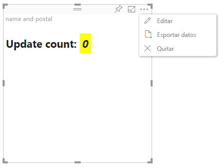

# Modo de edición avanzada en objetos visuales de Power BI

Si necesita controles de interfaz de usuario avanzados en el objeto visual de Power BI, puede aprovechar el modo de edición avanzada. Cuando esté en el modo de edición de informes, seleccione el botón **Editar** para establecer el modo de edición en **Avanzado**. El objeto visual puede usar la marca `EditMode` para determinar si debe mostrar este control de interfaz de usuario.

De forma predeterminada, el objeto visual no admite el modo de edición avanzada. Si se requiere otro comportamiento, puede indicarlo de forma explícita en el archivo *capabilities.json* del objeto visual, al establecer la propiedad `advancedEditModeSupport`.

Los valores posibles son los siguientes:

- `0`: NotSupported

- `1`: SupportedNoAction

- `2`: SupportedInFocus

## Acceso al modo de edición avanzada

Se muestra el botón **Editar** si:

* La propiedad `advancedEditModeSupport` está establecida en el archivo *capabilities.json* en `SupportedNoAction` o `SupportedInFocus`.

* El objeto visual se ve en el modo de edición de informes.

Si falta la propiedad `advancedEditModeSupport` en el archivo *capabilities.json* o está establecida en `NotSupported`, no se muestra el botón **Editar**.

Al seleccionar **Editar**, el objeto visual recibe una llamada de update() con EditMode establecido en `Advanced`. Según el valor que se haya establecido en el archivo *capabilities.json*, se producen las siguientes acciones:

* `SupportedNoAction`: el host no requiere más acciones.
* `SupportedInFocus`: el host muestra el objeto visual en el modo de enfoque.

## Salida del modo de edición avanzada

Se muestra el botón **Volver al informe** si:

* La propiedad `advancedEditModeSupport` está establecida en el archivo *capabilities.json* en `SupportedInFocus`.
