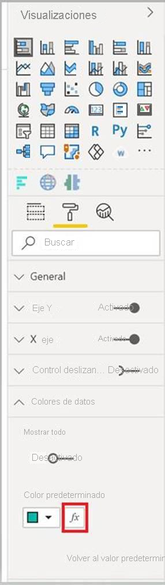

# <a name="add-conditional-formatting"></a>Adición de formato condicional

El [formato condicional](../../visuals/service-tips-and-tricks-for-color-formatting.md#conditional-formatting-for-visualizations) permite que un creador de informes especifique cómo se muestran los colores en un informe, de acuerdo con un valor numérico.

En este artículo se describe cómo agregar la funcionalidad de formato condicional al objeto visual de Power BI.

El formato condicional solo se puede aplicar a los siguientes tipos de propiedades:
* Color
* Texto
* Icono
* URL de web

## <a name="add-conditional-formatting-to-your-project"></a>Incorporación de formato condicional al proyecto

En esta sección se muestra cómo agregar formato condicional a un objeto visual existente de Power BI. El código de ejemplo de este artículo se basa en el objeto visual [SampleBarChart](https://github.com/microsoft/PowerBI-visuals-sampleBarChart). Puede examinar el código fuente en [barChart.ts](https://github.com/microsoft/PowerBI-visuals-sampleBarChart/blob/master/src/barChart.ts).

### <a name="add-a-conditional-color-formatting-entry-in-the-format-pane"></a>Incorporación de una entrada de formato de color condicional en el panel de formato

En esta sección obtendrá información sobre cómo agregar una entrada de formato de color condicional a un punto de datos en el panel formato.

1. Usará la matriz `propertyInstanceKind` de `VisualObjectInstance`, que se expone mediante `powerbi-visuals-api`. El primer paso consiste en comprobar que el archivo incluye esta importación:

    ```typescript
    import powerbiVisualsApi from "powerbi-visuals-api";
    ```

2. Para especificar el tipo adecuado de formato (*Constant*, *ConstantOrRule* o *Rule*), usará la enumeración `VisualEnumerationInstanceKinds`. Agregue la siguiente importación al archivo:

    ```typescript
    import VisualEnumerationInstanceKinds = powerbiVisualsApi.VisualEnumerationInstanceKinds;
    ```

3. En la matriz `propertyInstanceKind`, enumere todas las propiedades que desea que admitan el formato condicional. Defina estas propiedades en el método `enumerateObjectInstances`.

    ```typescript
    public enumerateObjectInstances(options: EnumerateVisualObjectInstancesOptions): VisualObjectInstanceEnumeration {
            …
            case 'colorSelector':
                …
                    objectEnumeration.push({
                        objectName: objectName,
                        displayName: barDataPoint.category,
                        properties: {
                            fill: {
                                solid: {
                                    color: barDataPoint.color
                                }
                            }
                        },
                        selector: dataViewWildcard.createDataViewWildcardSelector(dataViewWildcard.DataViewWildcardMatchingOption.InstancesAndTotals),
                        altConstantValueSelector: barDataPoint.selectionId.getSelector(),

                        // List your conditional formatting properties
                        propertyInstanceKind: {
                            fill: VisualEnumerationInstanceKinds.ConstantOrRule
                        }
                    });
                }
            …
    }

    ```

    `VisualEnumerationInstanceKinds.ConstantOrRule` creará la entrada de la interfaz de usuario de formato condicional junto con el elemento de la interfaz de usuario de formato constante.

    >[!div class="mx-imgBorder"]
    >

### <a name="define-how-conditional-formatting-behaves"></a>Definición del comportamiento del formato condicional

Defina cómo se aplicará el formato a los puntos de datos.

Mediante `createDataViewWildcardSelector` declarado en `powerbi-visuals-utils-dataviewutils`, especifique si el formato condicional se aplicará a las instancias, los totales o ambos. Para más información, consulte [DataViewWildcard](utils-dataview.md#).

En `enumerateObjectInstances`, realice los cambios siguientes en los objetos a los que desea aplicar el formato condicional:

 * Reemplace el valor `selector` por la llamada `dataViewWildcard.createDataViewWildcardSelector(dataViewWildcardMatchingOption)`. `DataViewWildcardMatchingOption` define si el formato condicional se aplica a las instancias, los totales o ambos.

* Agregue la propiedad `altConstantValueSelector` con el valor previamente definido para la propiedad `selector`.

```typescript
case 'colorSelector':
         …
            objectEnumeration.push({
                objectName: objectName,
                displayName: barDataPoint.category,
                properties: {
                    fill: {
                        solid: {
                            color: barDataPoint.color
                        }
                    }
                },

                // Define whether the conditional formatting will apply to instances, totals, or both
                selector: dataViewWildcard.createDataViewWildcardSelector(dataViewWildcard.DataViewWildcardMatchingOption.InstancesAndTotals),

                // Add this property with the value previously defined for the selector property
                altConstantValueSelector: barDataPoint.selectionId.getSelector(),

                propertyInstanceKind: { 
                    fill: VisualEnumerationInstanceKinds.ConstantOrRule
                }
            });
        }

```

## <a name="next-steps"></a>Pasos siguientes

Revise el artículo [DataViewUtils](utils-dataview.md).