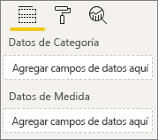
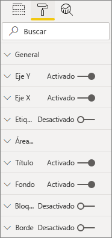
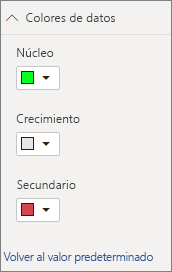

# <a name="build-a-bar-chart"></a>Creación de un gráfico de barras

Este artículo es una guía paso a paso para crear un objeto visual para un gráfico de barras simple de Power BI con código. Puede obtener el ejemplo de código completo en [https://github.com/Microsoft/PowerBI-visuals-sampleBarChart](https://github.com/Microsoft/PowerBI-visuals-sampleBarChart).

## <a name="view-model"></a>Modelo de vista
Es importante definir primero el modelo de vista del gráfico de barras y recorrer en iteración lo que se expone al objeto visual a medida que se crea.

```typescript
/**
 * Interface for BarCharts viewmodel.
 *
 * @interface
 * @property {BarChartDataPoint[]} dataPoints - Set of data points the visual will render.
 * @property {number} dataMax                 - Maximum data value in the set of data points.
 */
interface BarChartViewModel {
    dataPoints: BarChartDataPoint[];
    dataMax: number;
};

/**
 * Interface for BarChart data points.
 *
 * @interface
 * @property {number} value    - Data value for the point.
 * @property {string} category - Corresponding category of the data value.
 */
interface BarChartDataPoint {
    value: number;
    category: string;
};
```

### <a name="use-static-data"></a>Uso de datos estáticos

El uso de datos estáticos es una excelente manera de probar el objeto visual sin enlace de datos. El modelo de vista no cambiará, incluso después de agregar el enlace de datos en un paso posterior.

```typescript
let testData: BarChartDataPoint[] = [
    {
        value: 10,
        category: 'a'
    },
    {
        value: 20,
        category: 'b'
    },
    {
        value: 1,
        category: 'c'
    },
    {
        value: 100,
        category: 'd'
    },
    {
        value: 500,
        category: 'e'
    }];

let viewModel: BarChartViewModel = {
    dataPoints: testData,
    dataMax: d3.max(testData.map((dataPoint) => dataPoint.value))
};
```

## <a name="data-binding"></a>Enlace de datos 
Agregue el enlace de datos mediante la definición de las funcionalidades visuales en *capabilities.json*. El código de ejemplo ya tiene un esquema para su uso.

El enlace de datos actúa en un depósito **Campo** en Power BI.



### <a name="add-data-roles"></a>Incorporación de datos de roles
El código de ejemplo ya tiene roles de datos, pero puede personalizarlos.

- `displayName` es el nombre que se muestra en el depósito **Campo**.
- `name` es el nombre interno que se usa para hacer referencia al rol de datos.
- `kind` es el tipo de campo. Los campos *Agrupación* (0) tiene valores discretos. Los campos *Medida* (1) tienen valores de datos numéricos.

```json
"dataRoles": [
    {
        "displayName": "Category Data",
        "name": "category",
        "kind": 0
    },
    {
        "displayName": "Measure Data",
        "name": "measure",
        "kind": 1
    }
],
```

Para más información, consulte [Roles de datos](./capabilities.md#define-the-data-fields-that-your-visual-expects-dataroles).

### <a name="add-conditions-to-dataviewmapping"></a>Incorporación de condiciones a DataViewMapping
Defina condiciones dentro de su `dataViewMappings` para establecer el número de campos que cada depósito de campo puede enlazar. Use el `name` interno del rol de datos para hacer referencia a cada campo.

```json
    "dataViewMappings": [
        {
            "conditions": [
                {
                    "category": {
                        "max": 1
                    },
                    "measure": {
                        "max": 1
                    }
                }
            ],
        }
    ]
```

Para más información, consulte [Asignación de vistas de datos](./dataview-mappings.md).

### <a name="define-and-use-visualtransform"></a>Definición y uso de visualTransform
`DataView` es la estructura que Power BI proporciona al objeto visual, que contiene los datos consultados que se van a visualizar. Sin embargo, `DataView` puede proporcionar datos en diferentes formularios, como por ejemplo de categoría y tabulares. Para crear un objeto visual de categoría como un gráfico de barras, solo tiene que usar la propiedad de categoría en `DataView`. La definición de `visualTransform` le permite convertir `DataView` en un modelo de vista que el objeto visual utilizará.

Para asignar colores y seleccionarlos al definir puntos de datos individuales, use `IVisualHost`. 

```typescript
/**
 * Function that converts queried data into a view model that will be used by the visual
 *
 * @function
 * @param {VisualUpdateOptions} options - Contains references to the size of the container
 *                                        and the dataView which contains all the data
 *                                        the visual had queried.
 * @param {IVisualHost} host            - Contains references to the host which contains services
 */
function visualTransform(options: VisualUpdateOptions, host: IVisualHost): BarChartViewModel {
    /*Convert dataView to your viewModel*/
}

```

## <a name="color"></a>Color 
El color se expone como uno de los servicios disponibles en `IVisualHost`.

### <a name="add-color-to-data-points"></a>Incorporación de color a los puntos de datos
Cada punto de datos se representa mediante un color diferente. Puede agregar color a la interfaz `BarChartDataPoint`.

```typescript
/**
 * Interface for BarChart data points.
 *
 * @interface
 * @property {number} value    - Data value for the point.
 * @property {string} category - Corresponding category of the data value.
 * @property {string} color    - Color corresponding to the data point.
 */
interface BarChartDataPoint {
    value: number;
    category: string;
    color: string;
};
```

### <a name="the-colorpalette-service"></a>Servicio colorPalette
El servicio `colorPalette` administra los colores usados en el objeto visual. Su instancia está disponible en `IVisualHost`.

### <a name="assign-color-to-data-points"></a>Asignación de color a los puntos de datos
Definió `visualTransform` como una construcción para convertir `dataView` en un modelo de vista que un gráfico de barras puede usar. Dado que recorre en iteración los puntos de datos en `visualTransform`, también es el lugar ideal para asignar colores.

```typescript
let colorPalette: IColorPalette = host.colorPalette; // host: IVisualHost
for (let i = 0, len = Math.max(category.values.length, dataValue.values.length); i < len; i++) {
    barChartDataPoints.push({
        category: category.values[i],
        value: dataValue.values[i],
        color: colorPalette.getColor(category.values[i]).value,
    });
}
```

## <a name="selection-and-interactions"></a>Selección e interacciones
La selección permite al usuario interactuar con el objeto visual y otros objetos visuales. 

### <a name="add-selection-to-each-data-point"></a>Incorporación de una selección a cada punto de datos
Puesto que cada punto de datos es único, agregue la selección a cada punto de datos. Agregue la propiedad de selección en la interfaz `BarChartDataPoint`.

```typescript
/**
 * Interface for BarChart data points.
 *
 * @interface
 * @property {number} value             - Data value for the point.
 * @property {string} category          - Corresponding category of data value.
 * @property {string} color             - Color corresponding to data point.
 * @property {ISelectionId} selectionId - Id assigned to data point for cross filtering
 *                                        and visual interaction.
 */
interface BarChartDataPoint {
    value: number;
    category: string;
    color: string;
    selectionId: ISelectionId;
};
```

### <a name="assign-selection-ids-to-each-data-point"></a>Asignación del identificador de selección a cada punto de datos
Dado que recorre en iteración los puntos de datos en `visualTransform`, también es el lugar ideal para crear identificadores de selección. La variable de host es un `IVisualHost`, que contiene los servicios que el objeto visual puede usar, como el color y el generador de selecciones. 

Use método de fábrica `createSelectionIdBuilder` en `IVisualHost` para crear un nuevo identificador de selección. Cree un nuevo generador de selecciones para cada punto de datos.

Dado que está realizando selecciones basadas solo en la categoría, simplemente necesita definir selecciones `withCategory`.

```typescript
for (let i = 0, len = Math.max(category.values.length, dataValue.values.length); i < len; i++) {
    barChartDataPoints.push({
        category: category.values[i],
        value: dataValue.values[i],
        color: colorPalette.getColor(category.values[i]).value,
        selectionId: host.createSelectionIdBuilder()
            .withCategory(category, i)
            .createSelectionId()
    });
}
```

Para más información, consulte [Creación de una instancia del generador de selección](./selection-api.md#create-an-instance-of-the-selection-builder).

### <a name="interact-with-data-points"></a>Interactuación con puntos de datos
Puede interactuar con cada barra del gráfico de barras una vez que se asigna un identificador de selección al punto de datos. El gráfico de barras escucha los eventos `click`.

Use el método de fábrica `selectionManager` en `IVisualHost` para crear un administrador de selecciones para el filtrado cruzado y el borrado de selecciones.

```typescript
let selectionManager = this.selectionManager;

//This must be an anonymous function instead of a lambda because
//d3 uses 'this' as the reference to the element that was clicked.
bars.on('click', function(d) {
    selectionManager.select(d.selectionId).then((ids: ISelectionId[]) => {
        bars.attr({
            'fill-opacity': ids.length > 0 ? BarChart.Config.transparentOpacity : BarChart.Config.solidOpacity
        });

        d3.select(this).attr({
            'fill-opacity': BarChart.Config.solidOpacity
        });
    });

    (<Event>d3.event).stopPropagation();
});
```

Para información, vea [Uso de SelectionManager](./selection-api.md#how-to-use-selectionmanager-to-select-data-points).

## <a name="static-objects"></a>Objetos estáticos

Puede agregar objetos al panel **Propiedad** para personalizar aún más el objeto visual. Estas personalizaciones pueden ser cambios en la interfaz de usuario o cambios relacionados con los datos que se han consultado. En el ejemplo se usan objetos estáticos para representar el eje X del gráfico de barras.

Puede activar o desactivar los objetos en el panel **Propiedad**.



### <a name="define-objects-in-capabilities"></a>Definición de objetos en funcionalidades
Defina una propiedad `objects` dentro del archivo *capabilities.json* para que los objetos se muestren en el panel **Propiedad**.
- `enableAxis` es el nombre interno al que `dataView` hace referencia. 
- `displayName` es el nombre que se muestra en el panel **Propiedad**.
- `bool` es un valor primitivo que se utiliza normalmente con objetos estáticos, como cuadros de texto o modificadores.
- `show` es una propiedad especial en `properties` que habilita el modificador `show`en el objeto. Como `show` es un modificador, se escribe como `bool`.


```typescript
"objects": {
    "enableAxis": {
        "displayName": "Enable Axis",
        "properties": {
            "show": {
                "displayName": "Enable Axis",
                "type": { "bool": true }
            }
        }
    }
}
```

Para más información, consulte [Objetos](./objects-properties.md).

### <a name="define-property-settings"></a>Definición de configuraciones de propiedades

En las secciones siguientes se describen los principios básicos para definir las configuraciones de propiedades. También puede usar las clases de utilidad definidas en el paquete `powerbi-visuals-utils-dataviewutils` para definir las configuraciones de propiedades. Para más información, consulte la documentación y los ejemplos de la clase [DataViewObjectsParser](https://github.com/Microsoft/powerbi-visuals-utils-dataviewutils/blob/master/docs/api/data-view-objects-parser.md).


Aunque es opcional, es mejor localizar la mayoría de las configuraciones en un único objeto para facilitar la referencia.

```typescript
/**
 * Interface for BarCharts viewmodel.
 *
 * @interface
 * @property {BarChartDataPoint[]} dataPoints - Set of data points the visual will render.
 * @property {number} dataMax                 - Maximum data value in the set of data points.
 * @property {BarChartSettings} settings      - Object property settings
 */
interface BarChartViewModel {
    dataPoints: BarChartDataPoint[];
    dataMax: number;
    settings: BarChartSettings;
};

/**
 * Interface for BarChart settings.
 *
 * @interface
 * @property "show" enableAxis - Object property that allows axis to be enabled.
 */
interface BarChartSettings {
    enableAxis: {
        show: boolean;
    };
}
```

### <a name="define-and-use-objectenumerationutility"></a>Definición y uso de ObjectEnumerationUtility
Los valores de la propiedad Object están disponibles como metadatos en `dataView`, pero no hay ningún servicio que ayude a recuperar estas propiedades. `ObjectEnumerationUtility` es un conjunto de funciones estáticas que puede usar para recuperar valores de objeto de `dataView` y para otros proyectos de objetos visuales. `ObjectEnumerationUtility` es opcional, pero es excelente para recorrer en iteración `dataView` para recuperar las propiedades del objeto.

```typescript
/**
 * Gets property value for a particular object.
 *
 * @function
 * @param {DataViewObjects} objects - Map of defined objects.
 * @param {string} objectName       - Name of desired object.
 * @param {string} propertyName     - Name of desired property.
 * @param {T} defaultValue          - Default value of desired property.
 */
export function getValue<T>(objects: DataViewObjects, objectName: string, propertyName: string, defaultValue: T ): T {
    if(objects) {
        let object = objects[objectName];
        if(object) {
            let property: T = object[propertyName];
            if(property !== undefined) {
                return property;
            }
        }
    }
    return defaultValue;
}
```

Consulte [objectEnumerationUtility.ts](https://github.com/Microsoft/PowerBI-visuals-sampleBarChart/blob/master/src/objectEnumerationUtility.ts) para ver el código fuente.

### <a name="retrieve-property-values-from-dataview"></a>Recuperación de los valores de propiedad de dataView
`visualTransform` es el lugar ideal para manipular el modelo de vista del objeto visual. Para continuar este patrón, recupere las propiedades del objeto de `dataView`.

Defina el estado predeterminado de la propiedad y use `getValue` para recuperar la propiedad de `dataView`.

```typescript
let defaultSettings: BarChartSettings = {
    enableAxis: {
        show: false,
    }
};

let barChartSettings: BarChartSettings = {
    enableAxis: {
        show: getValue<boolean>(objects, 'enableAxis', 'show', defaultSettings.enableAxis.show),
    }
}
```

### <a name="populate-property-pane-with-enumerateobjectinstances"></a>Rellene el panel Propiedad con enumerateObjectInstances
El método opcional `enumerateObjectInstances` en `IVisual` enumera todos los objetos y los coloca dentro del panel **Propiedad**. Cada objeto se llama con `enumerateObjectInstances`. El nombre del objeto está disponible en `EnumerateVisualObjectInstancesOptions`.

Para cada objeto, defina la propiedad con su estado actual.

```typescript
/**
 * Enumerates through the objects defined in the capabilities and adds the properties to the format pane
 *
 * @function
 * @param {EnumerateVisualObjectInstancesOptions} options - Map of defined objects
 */
public enumerateObjectInstances(options: EnumerateVisualObjectInstancesOptions): VisualObjectInstanceEnumeration {
    let objectName = options.objectName;
    let objectEnumeration: VisualObjectInstance[] = [];

    switch(objectName) {
        case 'enableAxis':
            objectEnumeration.push({
                objectName: objectName,
                properties: {
                    show: this.barChartSettings.enableAxis.show,
                },
                selector: null
            });
    };

    return objectEnumeration;
}
```

### <a name="control-property-update-logic"></a>Lógica de actualización de propiedades de control
Una vez que se agrega un objeto al panel **Propiedad**, cada alternancia desencadena una actualización. Agregue la lógica de objeto específica en bloques `if`:

```typescript
if(settings.enableAxis.show) {
    let margins = BarChart.Config.margins;
    height -= margins.bottom;
}
```

## <a name="databound-objects"></a>Objetos enlazados a datos
Los objetos enlazados a datos son similares a los objetos estáticos, pero normalmente se tratan con la selección de datos. Por ejemplo, puede cambiar el color asociado al punto de datos.



### <a name="define-object-in-capabilities"></a>Definición de objetos en las funcionalidades
Al igual que los objetos estáticos, defina otro objeto en *capabilities.json*. 
- `colorSelector` es el nombre interno al que `dataView` hace referencia.
- `displayName` es el nombre que se muestra en el panel **Propiedad**.
- `fill` es un valor de objeto estructural que no está asociado a un tipo primitivo.

```typescript
"colorSelector": {
    "displayName": "Data Colors",
    "properties": {
        "fill": {
            "displayName": "Color",
            "type": {
                "fill": {
                    "solid": {
                        "color": true
                    }
                }
            }
        }
    }
}
```

Para más información, consulte [Objetos](./objects-properties.md).

### <a name="use-objectenumerationutility"></a>Uso de ObjectEnumerationUtility
Al igual que con los objetos estáticos, debe recuperar los detalles de objeto de `dataView`. Sin embargo, en lugar de los valores de objeto que se encuentran en los metadatos, los valores de objeto se asocian a cada categoría.

```typescript
/**
 * Gets property value for a particular object in a category.
 *
 * @function
 * @param {DataViewCategoryColumn} category - List of category objects.
 * @param {number} index                    - Index of category object.
 * @param {string} objectName               - Name of desired object.
 * @param {string} propertyName             - Name of desired property.
 * @param {T} defaultValue                  - Default value of desired property.
 */
export function getCategoricalObjectValue<T>(category: DataViewCategoryColumn, index: number, objectName: string, propertyName: string, defaultValue: T): T {
    let categoryObjects = category.objects;

    if(categoryObjects) {
        let categoryObject: DataViewObject = categoryObjects[index];
        if(categoryObject) {
            let object = categoryObject[objectName];
            if(object) {
                let property: T = object[propertyName];
                if(property !== undefined) {
                    return property;
                }
            }
        }
    }
    return defaultValue;
}
```

Consulte [objectEnumerationUtility.ts](https://github.com/Microsoft/PowerBI-visuals-sampleBarChart/blob/master/src/objectEnumerationUtility.ts) para ver el código fuente.

### <a name="define-default-color-and-retrieve-categorical-object-from-dataview"></a>Definición del color predeterminado y recuperación del objeto de categoría de dataView
Cada color ahora se asocia con cada categoría dentro de `dataView`. Puede establecer cada punto de datos en su color correspondiente.

```typescript
for (let i = 0, len = Math.max(category.values.length, dataValue.values.length); i < len; i++) {
    let defaultColor: Fill = {
        solid: {
            color: colorPalette.getColor(category.values[i]).value
        }
    }

    barChartDataPoints.push({
        category: category.values[i],
        value: dataValue.values[i],
        color: getCategoricalObjectValue<Fill>(category, i, 'colorSelector', 'fill', defaultColor).solid.color,
        selectionId: host.createSelectionIdBuilder()
            .withCategory(category, i)
            .createSelectionId()
    });
}
```

### <a name="populate-property-pane-with-enumerateobjectinstances"></a>Rellene el panel Propiedad con enumerateObjectInstances
Use `enumerateObjectInstances` para rellenar el panel **Propiedad** con objetos. 

Para esta instancia, agregue un selector de colores para representar cada categoría en el panel **Propiedad**. Para ello, agregue un caso adicional a la instrucción `switch` para `colorSelector` y recorra en iteración cada punto de datos con el color asociado. 

La selección es necesaria para asociar el color al punto de datos.

```typescript
/**
 * Enumerates through the objects defined in the capabilities and adds the properties to the format pane
 *
 * @function
 * @param {EnumerateVisualObjectInstancesOptions} options - Map of defined objects
 */
public enumerateObjectInstances(options: EnumerateVisualObjectInstancesOptions): VisualObjectInstanceEnumeration {
    let objectName = options.objectName;
    let objectEnumeration: VisualObjectInstance[] = [];

    switch(objectName) {
        case 'enableAxis':
            objectEnumeration.push({
                objectName: objectName,
                properties: {
                    show: this.barChartSettings.enableAxis.show,
                },
                selector: null
            });
            break;
        case 'colorSelector':
            for(let barDataPoint of this.barDataPoints) {
                objectEnumeration.push({
                    objectName: objectName,
                    displayName: barDataPoint.category,
                    properties: {
                        fill: {
                            solid: {
                                color: barDataPoint.color
                            }
                        }
                    },
                    selector: barDataPoint.selectionId.getSelector()
                });
            }
            break;
    };

    return objectEnumeration;
}
```

Después de proporcionar un selector para cada propiedad, obtendrá la siguiente matriz de objetos `dataView`:


Cada elemento de la matriz `dataViews[0].categorical.categories[0].objects` corresponde a la categoría concreta del conjunto de datos.

La función `getCategoricalObjectValue` simplemente proporciona una forma cómoda de acceder a las propiedades por su índice de categoría. Debe proporcionar un `objectName` y `propertyName` que coincidan con el objeto y la propiedad en *capabilities.json*.

## <a name="other-features"></a>Otras características 
Puede agregar un control deslizante o informaciones sobre herramientas al gráfico de barras. Para el código que se va a agregar, vea el control deslizante en [Incorporación de un control deslizante del panel de propiedades para controlar la opacidad](https://github.com/Microsoft/PowerBI-visuals-sampleBarChart/commit/e2e0bc5888d9a3ca305a7a7af5046068645c8b30) e [Incorporación de compatibilidad para las informaciones sobre herramientas](https://github.com/Microsoft/PowerBI-visuals-sampleBarChart/commit/981b021612d7b333adffe9f723ab27783c76fb14). Para más información sobre las informaciones sobre herramientas, consulte [Información sobre herramientas en objetos visuales de Power BI](./add-tooltips.md).

## <a name="packaging"></a>Embalaje

Para poder cargar el objeto visual en [Power BI Desktop](https://powerbi.microsoft.com/desktop/) o compartirlo con la comunidad en la [galería de objetos visuales de Power BI](https://visuals.powerbi.com/), debe empaquetarlo. Vaya a la carpeta raíz del proyecto del objeto visual, que contiene el archivo *pbiviz.json* y use el siguiente comando para generar un archivo *pbiviz*:

```bash
pbiviz package
```
Este comando crea un archivo *pbiviz* en el directorio *dist/* del proyecto del objeto visual y sobrescribe cualquier archivo *pbiviz* de las operaciones de paquete anteriores.

## <a name="next-steps"></a>Pasos siguientes
Puede agregar las siguientes funciones al objeto visual:
* [Incorporar un menú contextual a un objeto visual de Power BI](./context-menu.md)
* [Página de aterrizaje](./landing-page.md)
* [Dirección URL de inicio](./launch-url.md)
* [Compatibilidad con la configuración regional](./localization.md)