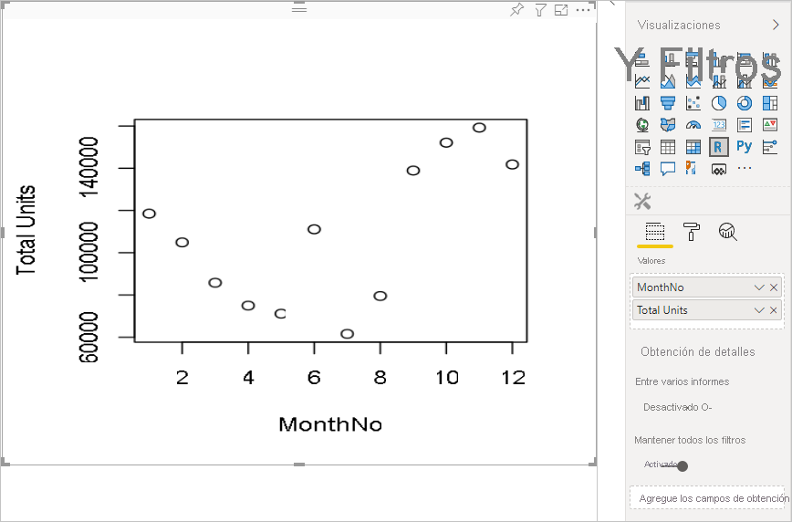
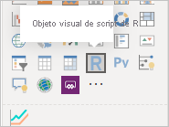
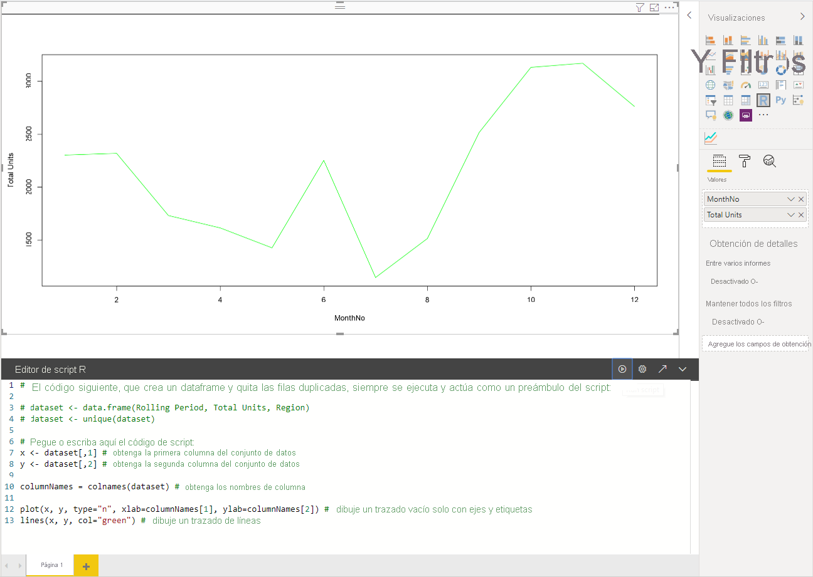
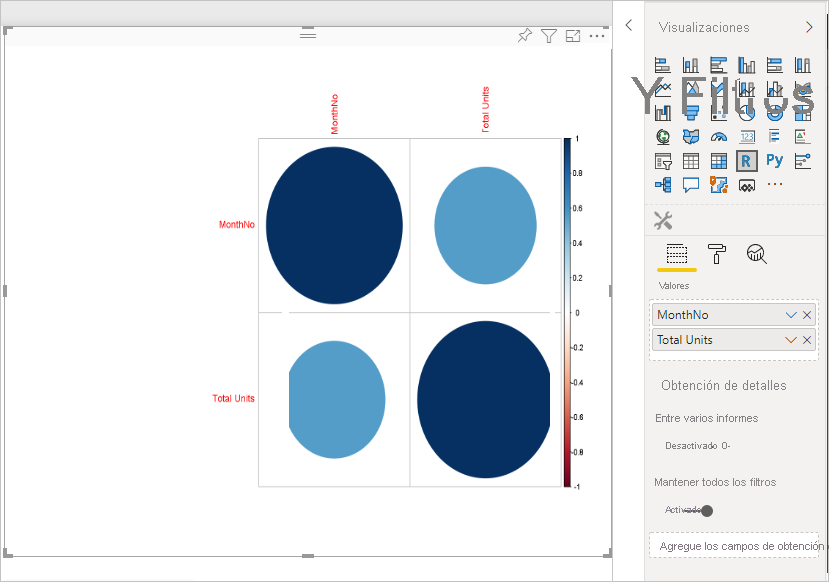
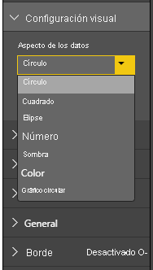
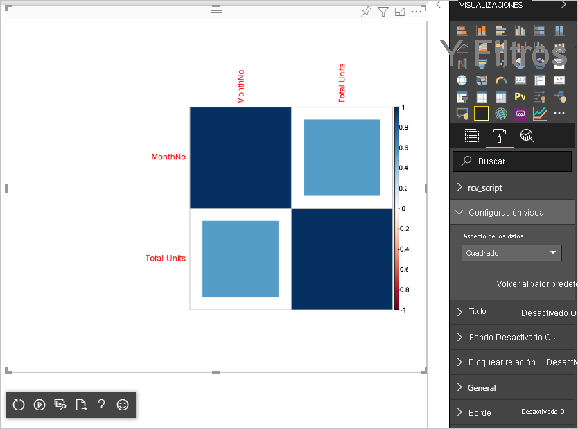

# <a name="tutorial-create-an-r-powered-power-bi-visual"></a>Tutorial: Crear un objeto visual de Power BI con tecnología de R

En este tutorial se describe cómo crear un objeto visual con tecnología R para Power BI.

En este tutorial, obtendrá información sobre cómo:

> [!div class="checklist"]
>
> * Crear un objeto visual con tecnología de R
> * Editar el script de R en Power BI Desktop
> * Agregar bibliotecas al objeto visual
> * Agregar una propiedad estática

## <a name="prerequisites"></a>Requisitos previos

* Una cuenta de **Power BI Pro**. [Iniciar sesión para una evaluación gratuita](https://powerbi.microsoft.com/pricing/) antes de empezar.
* El motor de R. Puede descargarlo de forma gratuita desde varias ubicaciones, incluida la [página de descarga de Revolution Open](https://mran.revolutionanalytics.com/download/) y el [repositorio de CRAN](https://cran.r-project.org/bin/windows/base/). Para más información, consulte [Crear objetos visuales de Power BI con R](../../desktop-r-visuals.md).
* [Power BI Desktop](../../fundamentals/desktop-get-the-desktop.md).
* La versión 4 de [Windows PowerShell](https://docs.microsoft.com/powershell/scripting/install/installing-windows-powershell?view=powershell-6) o una posterior para los usuarios de Windows O [Terminal](https://macpaw.com/how-to/use-terminal-on-mac) para los usuarios de OSX.

## <a name="getting-started"></a>Introducción

1. Prepare datos de ejemplo para el objeto visual. Puede guardar estos valores en una base de datos de Excel o en un archivo *.csv* e importarlo a Power BI Desktop.

    | Nº.Mes | Total de unidades |
    |-----|-----|
    | 1 | 2303 |
    | 2 | 2319 |
    | 3 | 1732 |
    | 4 | 1615 |
    | 5 | 1427 |
    | 6 | 2253 |
    | 7 | 1147 |
    | 8 | 1515 |
    | 9 | 2516 |
    | 10 | 3131 |
    | 11 | 3170 |
    | 12 | 2762 |

1. Para crear un objeto visual, abra PowerShell o Terminal y ejecute el comando siguiente:

   ```cmd
   pbiviz new rVisualSample -t rvisual
   ```

   Este comando crea una nueva estructura de carpetas basada en la plantilla `rvisual`. Esta plantilla incluye un objeto visual con tecnología de R básico y listo para ejecutarse que ejecuta el script de R siguiente:

   ```r
   plot(Values)
   ```

   La trama de datos `Values` contendrá columnas en el rol de datos `Values`.

1. Para asignar datos al objeto visual de desarrollador, agregue **NroMes** y **Unidades totales** a **Valores** para el objeto visual.

   

## <a name="editing-the-r-script"></a>Edición del script de R

Cuando se usa `pbiviz` para crear el objeto visual con tecnología de R basado en la plantilla `rvisual`, se crea un archivo denominado *script.r* en la carpeta raíz del objeto visual. Este archivo contiene el script de R que se ejecuta para generar la imagen de un usuario. Puede crear el script de R en Power BI Desktop.

1. En Power BI Desktop, seleccione **Objeto visual de script de R**:

   

1. Pegue este código de R en el **Editor de scripts de R**:

    ```r
    x <- dataset[,1] # get the first column from dataset
    y <- dataset[,2] # get the second column from dataset

    columnNames = colnames(dataset) # get column names

    plot(x, y, type="n", xlab=columnNames[1], ylab=columnNames[2]) # draw empty plot with axis and labels only
    lines(x, y, col="green") # draw line plot
    ```

1. Seleccione el icono **Ejecutar script** para ver el resultado.

    

1. Cuando el script de R esté listo, cópielo en el archivo `script.r` del proyecto de objeto visual creado en uno de los pasos anteriores.

1. Cambie el valor `name` de `dataRoles` en *capabilities.json* a `dataRoles`. Power BI pasa los datos como el objeto de la trama de datos `dataset` para el objeto visual de script de R, pero el objeto visual de R obtiene el nombre de la trama de datos de acuerdo con los nombres de `dataRoles`.

    ```json
    {
      "dataRoles": [
        {
          "displayName": "Values",
          "kind": "GroupingOrMeasure",
          "name": "dataRoles"
        }
      ],
      "dataViewMappings": [
        {
          "scriptResult": {
            "dataInput": {
              "table": {
                "rows": {
                  "select": [
                    {
                      "for": {
                        "in": "dataset"
                      }
                    }
                  ],
                  "dataReductionAlgorithm": {
                    "top": {}
                  }
                }
              }
            },
            ...
          }
        }
      ],
    }
    ```

1. Agregue el código siguiente para permitir el cambio de tamaño de la imagen en el archivo *src/visual.ts*.

    ```typescript
      public onResizing(finalViewport: IViewport): void {
          this.imageDiv.style.height = finalViewport.height + "px";
          this.imageDiv.style.width = finalViewport.width + "px";
          this.imageElement.style.height = finalViewport.height + "px";
          this.imageElement.style.width = finalViewport.width + "px";
      }
    ```

## <a name="add-libraries-to-visual-package"></a>Incorporación de bibliotecas a un paquete de objetos visuales

Este procedimiento permite que el objeto visual usa el paquete `corrplot`.

1. Agregue la dependencia de biblioteca del objeto visual a `dependencies.json`. Este es un ejemplo del contenido de archivo:

    ```json
    {
      "cranPackages": [
        {
          "name": "corrplot",
          "displayName": "corrplot",
          "url": "https://cran.r-project.org/web/packages/corrplot/"
        }
      ]
    }
    ```

    El paquete `corrplot` es una visualización gráfica de una matriz de correlación. Para más información sobre `corrplot`, consulte [una introducción al paquete corrplot](https://cran.r-project.org/web/packages/corrplot/vignettes/corrplot-intro.html).

1. Después de hacer estos cambios, empiece a usar el paquete en el archivo `script.r`.

    ```r
    library(corrplot)
    corr <- cor(dataset)
    corrplot(corr, method="circle", order = "hclust")
    ```

El resultado de usar el paquete `corrplot` es similar a este ejemplo:



## <a name="adding-a-static-property-to-the-property-pane"></a>Incorporación de una propiedad estática al panel de propiedades

Permita que los usuarios cambien la configuración de UI. Para ello, agregue propiedades al panel de propiedades que cambien el comportamiento basado en la entrada de usuario del script de R.

Puede configurar `corrplot` con el argumento `method` para la función `corrplot`. El script predeterminado usa un círculo. Modifique el objeto visual para permitir que el usuario elija entre varias opciones.

1. Defina el objeto y la propiedad en el archivo *capabilities.json*. Luego use este nombre de objeto en el método de enumeración para obtener esos valores del panel de propiedades.

    ```json
    {
      "settings": {
      "displayName": "Visual Settings",
      "description": "Settings to control the look and feel of the visual",
      "properties": {
        "method": {
          "displayName": "Data Look",
          "description": "Control the look and feel of the data points in the visual",
          "type": {
            "enumeration": [
              {
                "displayName": "Circle",
                "value": "circle"
              },
              {
                "displayName": "Square",
                "value": "square"
              },
              {
                "displayName": "Ellipse",
                "value": "ellipse"
              },
              {
                "displayName": "Number",
                "value": "number"
              },
              {
                "displayName": "Shade",
                "value": "shade"
              },
              {
                "displayName": "Color",
                "value": "color"
              },
              {
                "displayName": "Pie",
                "value": "pie"
              }
            ]
          }
        }
      }
    }
    ```

1. Abra el archivo *src/settings.ts*. Cree una clase `CorrPlotSettings` con la propiedad pública `method`. El tipo es `string` y el valor predeterminado es `circle`. Agregue la propiedad `settings` a la clase `VisualSettings` con el valor predeterminado:

    ```typescript
    "use strict";

    import { dataViewObjectsParser } from "powerbi-visuals-utils-dataviewutils";
    import DataViewObjectsParser = dataViewObjectsParser.DataViewObjectsParser;

    export class VisualSettings extends DataViewObjectsParser {
      public rcv_script: rcv_scriptSettings = new rcv_scriptSettings();
      public settings: CorrPlotSettings = new CorrPlotSettings();
    }

    export class CorrPlotSettings {
      public method: string = "circle";
    }

    export class rcv_scriptSettings {
      public provider;
      public source;
    }
    ```

    Después de estos pasos, puede cambiar la propiedad del objeto visual.

   

    Por último el script de R debe empezar con una propiedad. Si el usuario no cambia la propiedad, el objeto visual no obtiene ningún valor para esta propiedad.

    En el caso de las variables en tiempo de ejecución de R para las propiedades, la convención de nomenclatura es `<objectname>_<propertyname>`, en este caso, `settings_method`.

1. Cambie el script de R en el objeto visual para coincidir con el código siguiente:

    ```r
    library(corrplot)
    corr <- cor(dataset)

    if (!exists("settings_method"))
    {
        settings_method = "circle";
    }

    corrplot(corr, method=settings_method, order = "hclust")
    ```

El objeto visual final es similar al ejemplo siguiente:



## <a name="next-steps"></a>Pasos siguientes

Para más información sobre los objetos visuales con tecnología de R, consulte [Uso de objetos visuales de Power BI con tecnología de R en Power BI](../../desktop-r-powered-custom-visuals.md).

Para más información sobre los objetos visuales con tecnología de R en Power BI Desktop, consulte [Crear objetos visuales de Power BI con R](../../desktop-r-visuals.md).
