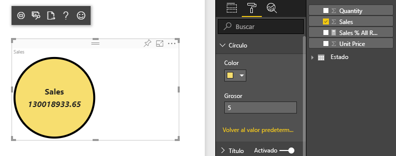
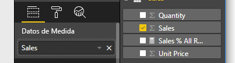

# <a name="tutorial-create-a-react-based-visual"></a>Tutorial: Creación de un objeto visual basado en React

En este tutorial se explica cómo crear un objeto visual de Power BI mediante [React](https://reactjs.org/). El objeto visual muestra un valor en un círculo. El objeto visual tiene un tamaño y una configuración adaptables para personalizarlo. Con la información de este artículo, puede crear sus propios objetos visuales de Power BI con React.



En este tutorial, obtendrá información sobre cómo:

> [!div class="checklist"]
>
> * Configurado su entorno de desarrollo
> * Crear un objeto visual de React
> * Configurar funcionalidades para el objeto visual
> * Representar datos de Power BI
> * Cambiar el tamaño del objeto visual
> * Hacer que el objeto visual sea personalizable

## <a name="prerequisites"></a>Requisitos previos

* Una cuenta de **Power BI Pro**. [Iniciar sesión para una evaluación gratuita](https://powerbi.microsoft.com/pricing/) antes de empezar.
* [Visual Studio Code](https://www.visualstudio.com/).
* La versión 4 de [Windows PowerShell](/powershell/scripting/install/installing-windows-powershell) o una posterior para los usuarios de Windows O [Terminal](https://macpaw.com/how-to/use-terminal-on-mac) para los usuarios de OSX.
* Un entorno como se describe en [Configuración del entorno para el desarrollo de un objeto visual de Power BI](environment-setup.md).

## <a name="getting-started"></a>Introducción

Para empezar, cree un objeto visual mínimo de Power BI mediante `pbiviz`. Para más información sobre los proyectos y la estructura de los mismos, vea [Estructura del proyecto del objeto visual de Power BI](visual-project-structure.md). Para el código fuente completo de este objeto visual, vea [Objeto visual de React Tarjeta circular](https://github.com/Microsoft/powerbi-visuals-circlecard-react).

Puede clonar o descargar el código fuente completo del objeto visual desde [GitHub](https://github.com/Microsoft/powerbi-visuals-circlecard-react).

1. Abra PowerShell y ejecute el comando siguiente:

   ```powershell
   pbiviz new ReactCircleCard
   ```

   El comando crea una carpeta llamada *ReactCircleCard*.

1. Cambie los directorios a esa carpeta y abra Visual Studio Code.

   ```powershell
   cd ./ReactCircleCard
   code .
   ```

1. Inicie el servidor para desarrolladores para el objeto visual.

   ```powershell
   pbiviz start
   ```

   

Este objeto visual básico representa el recuento de actualizaciones. Vamos a transformarlo en una tarjeta circular en el paso siguiente.

## <a name="change-the-visual-to-a-circle-card"></a>Conversión del objeto visual en una tarjeta circular

Este objeto visual básico representa un recuento de actualizaciones. A continuación, transfórmelo en una tarjeta circular, que representa una medida y su título.

1. Ejecute el siguiente comando para instalar las dependencias requeridas:

   ```powershell
   npm i react react-dom
   ```

1. Ejecute el siguiente comando para instalar React 16 y las versiones correspondientes de `react-dom` y escrituras:

   ```powershell
   npm i @types/react @types/react-dom
   ```

1. Cree una clase de componente de React. En Visual Studio Code, seleccione **Archivo** > **Nuevo archivo**. Copie el siguiente código en el archivo.

    ```typescript
    import * as React from "react";

    export class ReactCircleCard extends React.Component<{}>{
        render(){
            return (
                <div className="circleCard">
                    Hello, React!
                </div>
            )
        }
    }

    export default ReactCircleCard;
    ```

1. Seleccione **Guardar como**. Vaya al directorio *src*. Escriba el nombre *componente*. En **Guardar como tipo**, seleccione **TypeScript React**.

1. Abra *src/visual.ts*. Reemplace el código existente por el código siguiente:

    ```typescript
    "use strict";
    import powerbi from "powerbi-visuals-api";

    import DataView = powerbi.DataView;
    import VisualConstructorOptions = powerbi.extensibility.visual.VisualConstructorOptions;
    import VisualUpdateOptions = powerbi.extensibility.visual.VisualUpdateOptions;
    import IVisual = powerbi.extensibility.visual.IVisual;

    import "./../style/visual.less";

    export class Visual implements IVisual {

        constructor(options: VisualConstructorOptions) {

        }

        public update(options: VisualUpdateOptions) {

        }
    }
    ```

1. Importe las dependencias de React y el componente que acaba de agregar.

    ```typescript
    import * as React from "react";
    import * as ReactDOM from "react-dom";
    ...
    import ReactCircleCard from "./component";
    ```

   La configuración predeterminada de TypeScript de Power BI no toma los archivos *tsx* de React. Visual Studio Code resalta `component` como un error.

1. Abra el archivo *tsconfig.json* y agregue dos líneas al principio del elemento `compilerOptions`.

    ```json
    {
      "compilerOptions": {
        "jsx": "react",
        "types": ["react", "react-dom"],
        //...
      }
    }
    ```

   El error en `component` debería desaparecer.

   Para representar el componente, agregue el elemento HTML de destino. Este elemento es `HTMLElement` en `VisualConstructorOptions`, que se pasa en el constructor.

1. Modifique la clase `Visual`, como en el código siguiente:

    ```typescript
      private target: HTMLElement;
      private reactRoot: React.ComponentElement<any, any>;

      constructor(options: VisualConstructorOptions) {
          this.reactRoot = React.createElement(ReactCircleCard, {});
          this.target = options.element;

          ReactDOM.render(this.reactRoot, this.target);
      }
    ```

1. Guarde los cambios y ejecute el código existente mediante comando:

    ```bash
    pbiviz start
    ```

   > [!NOTE]
   > Si previamente ejecutó `pbiviz`, debe reiniciarlo para aplicar los cambios en *tsconfig.json*.

  

## <a name="configure-capabilities"></a>Configuración de capacidades

Puede configurar las funcionalidades del objeto visual.

1. Abra `capabilities.json`. Quite el objeto `Category Data` de `dataRoles`. `ReactCircleCard` muestra un valor único, por lo que solo necesitamos `Measure Data`. La clave `dataRoles` tiene el aspecto siguiente:

    ```json
    "dataRoles": [
        {
            "displayName": "Measure Data",
            "name": "measure",
            "kind": "Measure"
        }
    ],
    ```

1. Quite todo el contenido de la clave `objects`. Lo rellenará más adelante.

    ```json
        "objects": {},
    ```

1. Copie el siguiente código de la propiedad `dataViewMappings`. El valor de `max: 1` significa que solo se puede enviar una columna de medida.

    ```json
        "dataViewMappings": [
            {
                "conditions": [
                    {
                        "measure": {
                            "max": 1
                        }
                    }
                ],
                "single": {
                    "role": "measure"
                }
            }
        ]
    ```

Ahora puede traer los datos del panel `Fields` a la configuración del objeto visual.



## <a name="receive-properties-from-power-bi"></a>Recepción de propiedades de Power BI

Puede representar datos mediante React. El componente puede mostrar los datos de su propio estado.

1. Modifique *src/component.tsx*.

    ```javascript
    export interface State {
        textLabel: string,
        textValue: string
    }

    export const initialState: State = {
        textLabel: "",
        textValue: ""
    }

    export class ReactCircleCard extends React.Component<{}, State>{
        constructor(props: any){
            super(props);
            this.state = initialState;
        }

        render(){
            const { textLabel, textValue } = this.state;

            return (
                <div className="circleCard">
                    <p>
                        {textLabel}
                        <br/>
                        <em>{textValue}</em>
                    </p>
                </div>
            )
        }
    }
    ```

1. Agregue estilos para el nuevo marcado editando *styles/visual.less*.

    ```css
    .circleCard {
        position: relative;
        box-sizing: border-box;
        border: 1px solid #000;
        border-radius: 50%;
        width: 200px;
        height: 200px;
    }

    p {
        text-align: center;
        line-height: 30px;
        font-size: 20px;
        font-weight: bold;

        position: relative;
        top: -30px;
        margin: 50% 0 0 0;
    }
    ```

1. Los objetos visuales reciben los datos actuales como argumento del método `update`. Abra *src/visual.ts* y agregue código a `ReactCircleCard.update`.

    ```typescript
    //...
    import { ReactCircleCard, initialState } from "./component";
    //...

    export class Visual implements IVisual {
        //...
        public update(options: VisualUpdateOptions) {

            if(options.dataViews && options.dataViews[0]){
                const dataView: DataView = options.dataViews[0];

                ReactCircleCard.update({
                    textLabel: dataView.metadata.columns[0].displayName,
                    textValue: dataView.single.value.toString()
                });
            } else {
                this.clear();
            }
        }

        private clear() {
            ReactCircleCard.update(initialState);
        }
    }
    ```

    El código selecciona `textLabel` y `textValue` de `DataView` y, si los datos existen, actualiza el estado del componente.

1. Para enviar las actualizaciones a la instancia del componente, inserte el siguiente código en la clase `ReactCircleCard`:

    ```typescript
        private static updateCallback: (data: object) => void = null;

        public static update(newState: State) {
            if(typeof ReactCircleCard.updateCallback === 'function'){
                ReactCircleCard.updateCallback(newState);
            }
        }

        public state: State = initialState;

        public componentWillMount() {
            ReactCircleCard.updateCallback = (newState: State): void => { this.setState(newState); };
        }

        public componentWillUnmount() {
            ReactCircleCard.updateCallback = null;
        }
    ```

1. Pruebe el objeto visual. Asegúrese de que `pbiviz start` se ha ejecutado y guarde todos los archivos. Actualice el objeto visual.

   

## <a name="make-component-resizable"></a>Hacer que el tamaño del componente se pueda cambiar

En esta sección, hará que el tamaño del componente se pueda cambiar. Actualmente, el componente tiene un ancho y un alto fijos.

Obtenga el tamaño actual de la ventanilla del objeto visual a partir del objeto `options`.

1. Abra *src/visual.ts*. Importe la interfaz `IViewport` y agregue la propiedad `viewport` a la clase `visual`.

    ```typescript
    import IViewport = powerbi.IViewport;

    //...

    export class Visual implements IVisual {
        private viewport: IViewport;
        //...
    }
    ```

1. Agregue el siguiente código al método `update` de `visual`.

    ```typescript
      if (options.dataViews && options.dataViews[0]) {
          const dataView: DataView = options.dataViews[0];

          this.viewport = options.viewport;
          const { width, height } = this.viewport;
          const size = Math.min(width, height);

          ReactCircleCard.update({
              size,
              //...
          });
      }
    ```

1. Agregue propiedades a la interfaz `State` en *src/component.tsx*.

    ```typescript
    export interface State {
        //...
        size: number
    }

    const initialState: State = {
        //...
        size: 200
    }
    ```

1. Realice los cambios siguientes en el método `render` en *src/component.tsx*:

    ```typescript
        render() {
            const { textLabel, textValue, size } = this.state;

            const style: React.CSSProperties = { width: size, height: size };

            return (
                <div className="circleCard" style={style}>
                    {/* ... */}
                </div>
            )
        }
    ```

1. Reemplace las reglas `width` y `height` en *style/visual.less* con `min-width` y `min-height`.

    ```css
        min-width: 200px;
        min-height: 200px;
    ```

Ahora puede cambiar el tamaño de la ventanilla. El diámetro del círculo se corresponde con el tamaño mínimo como ancho o alto.

## <a name="make-your-power-bi-visual-customizable"></a>Hacer que el objeto visual de Power BI sea personalizable

En esta sección, hará que el objeto visual sea personalizable.

1. Abra *capabilities.json*. Agregue las siguientes configuraciones a la propiedad `objects`.

    ```json
    //...
        "objects": {
            "circle": {
                "displayName": "Circle",
                "properties": {
                    "circleColor": {
                        "displayName": "Color",
                        "description": "The fill color of the circle.",
                        "type": {
                            "fill": {
                                "solid": {
                                    "color": true
                                }
                            }
                        }
                    },
                    "circleThickness": {
                        "displayName": "Thickness",
                        "description": "The circle thickness.",
                        "type": {
                            "numeric": true
                        }
                    }
                }
            }
        },
    //...
    ```

1. Reemplace el código existente de *src/settings.ts* con este código:

    ```typescript
    "use strict";

    import { dataViewObjectsParser } from "powerbi-visuals-utils-dataviewutils";
    import DataViewObjectsParser = dataViewObjectsParser.DataViewObjectsParser;

    export class CircleSettings {
        public circleColor: string = "white";
        public circleThickness: number = 2;
    }

    export class VisualSettings extends DataViewObjectsParser {
        public circle: CircleSettings = new CircleSettings();
    }
    ```

1. Agregue estas instrucciones `import` en la parte superior de *src/visual.ts*:

    ```typescript
    import VisualObjectInstance = powerbi.VisualObjectInstance;
    import EnumerateVisualObjectInstancesOptions = powerbi.EnumerateVisualObjectInstancesOptions;
    import VisualObjectInstanceEnumerationObject = powerbi.VisualObjectInstanceEnumerationObject;

    import { VisualSettings } from "./settings";

    ```

1. Agregue el método `enumerateObjectInstances` a *src/visual.ts*. Este método se usa para aplicar la configuración del objeto visual.

    ```typescript
    export class Visual implements IVisual {
        private settings: VisualSettings;

        //...

        public enumerateObjectInstances(
            options: EnumerateVisualObjectInstancesOptions
        ): VisualObjectInstance[] | VisualObjectInstanceEnumerationObject {

            return VisualSettings.enumerateObjectInstances(this.settings || VisualSettings.getDefault(), options);
        }
    }
    ```

1. Agregue código para que el objeto `dataView` ahora pueda recibir configuraciones.

    ```typescript
        public update(options: VisualUpdateOptions) {

            if(options.dataViews && options.dataViews[0]){
                //...
                this.settings = VisualSettings.parse(dataView) as VisualSettings;
                const object = this.settings.circle;

                ReactCircleCard.update({
                    borderWidth: object && object.circleThickness ? object.circleThickness : undefined,
                    background: object && object.circleColor ? object.circleColor : undefined,
                    //...
                });
            }
        }
    }
    ```

1. Aplique los cambios correspondientes a *src/component.tsx*, primero agregando estos valores a `State`:

    ```typescript
    export interface State {
        //...
        background?: string,
        borderWidth?: number
    }
    ```

1. Luego, agregue el siguiente código al método `render`:

    ```typescript
        const { /*...*/ background, borderWidth } = this.state;

        const style: React.CSSProperties = { /*...*/ background, borderWidth };
    ```

    

## <a name="next-steps"></a>Pasos siguientes

Para más información sobre el desarrollo de Power BI, vea [Instrucciones para objetos visuales de Power BI](guidelines-powerbi-visuals.md) y [Objetos visuales en Power BI](power-bi-visuals-concept.md).