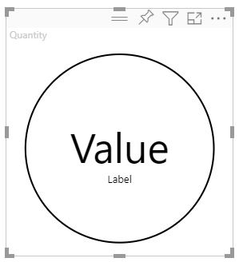

# <a name="tutorial-develop-a-power-bi-circle-card-visual"></a>Tutorial: Desarrollo de un objeto visual Circle Card de Power BI

Como desarrollador, puede crear sus propios objetos visuales de Power BI. Estos objetos visuales los puede utilizar usted, su organización o terceros.

En este tutorial, desarrollará un objeto visual de Power BI llamado Circle Card que muestra un valor de medida con formato dentro de un círculo. El objeto visual Circle Card admite la personalización del color de relleno y el grosor de su contorno.

En este tutorial, obtendrá información sobre cómo:
> [!div class="checklist"]
> * Crear un proyecto de desarrollo para el objeto visual.
> * Desarrollar el objeto visual con elementos visuales de D3.
> * Configurar el objeto visual para procesar los datos.

## <a name="prerequisites"></a>Requisitos previos

Antes de empezar a desarrollar el objeto visual de Power BI, compruebe que tiene todo lo que se indica en esta sección.

* Necesita una cuenta **Power BI Pro**. Si no la tiene, [regístrese para obtener una versión de prueba gratuita](https://powerbi.microsoft.com/pricing/).

* [Visual Studio Code (VS Code)](https://www.visualstudio.com/). VS Code es un entorno de desarrollo integrado (IDE) ideal para desarrollar aplicaciones JavaScript y TypeScript.

* [Windows PowerShell](/powershell/scripting/install/installing-windows-powershell), versión 4 o posterior (para Windows). O [Terminal](https://macpaw.com/how-to/use-terminal-on-mac) (para OSX).

* Un entorno listo para el desarrollo de un objeto visual de Power BI. [Configure el entorno para el desarrollo de un objeto visual de Power BI](environment-setup.md).

* En este tutorial se usa el informe **US Sales Analysis**. Puede [descargar](https://microsoft.github.io/PowerBI-visuals/docs/step-by-step-lab/images/US_Sales_Analysis.pbix) este informe y cargarlo en servicio Power BI, o bien usar su propio informe. Si necesita más información sobre el servicio Power BI y la carga de archivos, consulte el tutorial [Introducción a la creación en el servicio Power BI](../../fundamentals/service-get-started.md).

## <a name="create-a-development-project"></a>Creación de un proyecto de desarrollo

En esta sección, creará un proyecto para el objeto visual Circle Card.

1. Abra PowerShell y navegue hasta la carpeta en la que desea crear el proyecto.

2. Escriba el comando siguiente:

    ```PowerShell
    pbiviz new CircleCard
    ```

3. Vaya a la carpeta del proyecto.

    ```powershell
    cd CircleCard
    ```

4. Inicie el objeto visual Circle Card. Su objeto visual ahora se ejecuta mientras está hospedado en el equipo.

    ```powershell
    pbiviz start
    ```
    >[!IMPORTANT]
    >No cierre la ventana de PowerShell hasta el final del tutorial. Para evitar que se ejecute el visual, escriba Ctrl+C y, si se le pide que finalice el trabajo por lotes, escriba Y y presione *Entrar*.

## <a name="view-the-circle-card-in-power-bi-service"></a>Visualización del objeto visual Circle Card en el servicio Power BI

Para probar el objeto visual Circle Card en el servicio Power BI, usaremos el informe **US Sales Analysis**. Puede [descargar](https://microsoft.github.io/PowerBI-visuals/docs/step-by-step-lab/images/US_Sales_Analysis.pbix) este informe y cargarlo en servicio Power BI.

También puede usar su propio informe para probar los objetos visuales Circle Card.

>[!NOTE]
>Antes de continuar, compruebe que ha [habilitado la configuración del desarrollador de objetos visuales](environment-setup.md#set-up-power-bi-service-for-developing-a-visual).

1. Inicie sesión en [PowerBI.com](https://powerbi.microsoft.com/) y abra el informe **US Sales Analysis**.

2. Seleccione **Más opciones** > **Editar**.

    >[!div class="mx-imgBorder"]
    >

3. Cree una nueva página para realizar pruebas; para ello, haga clic en el botón **Nueva página** situado en la parte inferior de la interfaz del servicio Power BI.

    >[!div class="mx-imgBorder"]
    >

4. Seleccione el **Objeto visual de desarrollador** en el panel **Visualizaciones**.

    >[!div class="mx-imgBorder"]
    >

    Este objeto visual representa el objeto visual personalizado que se está ejecutando en el equipo. Solo está disponible cuando está habilitada la opción de [depuración de objetos visuales personalizados](environment-setup.md#set-up-power-bi-service-for-developing-a-visual).

5. Compruebe que se ha agregado un objeto visual al lienzo del informe.

    >[!div class="mx-imgBorder"]
    >

    Este es un objeto visual simple que muestra el número de veces que se ha llamado al método update. En esta fase, el objeto visual todavía no recupera los datos.

    >[!NOTE]
    >Si el objeto visual muestra un mensaje de error de conexión, abra una nueva pestaña en el explorador, vaya a `https://localhost:8080/assets/status` y autorice al explorador para que use esta dirección.
    >
    >

6. Mientras está seleccionado el nuevo objeto visual, vaya al panel **Campos**, expanda **Sales** y seleccione **Quantity**.

    >[!div class="mx-imgBorder"]
    >

7. Para probar cómo responde el objeto visual, cambie su tamaño y observe que el valor *Recuento de actualizaciones:* se incrementa cada vez que lo hace.

    >[!div class="mx-imgBorder"]
    >

## <a name="add-visual-elements-and-text"></a>Adición de texto y elementos visuales

En esta sección aprenderá a convertir el objeto visual en un círculo y a mostrar texto.

>[!NOTE]
>En este tutorial, se utiliza [Visual Studio Code](https://code.visualstudio.com/) (VS Code) para desarrollar el objeto visual de Power BI.

### <a name="modify-the-visuals-file"></a>Modificación del archivo de objetos visuales

Configure el archivo **visual.ts** eliminando y agregando algunas líneas de código.

1. Abra el proyecto en VS Code (**Archivo** > **Abrir carpeta**).

2. En el **panel Explorador**, expanda la carpeta **src** y, después, seleccione el archivo **visual.ts**.

    >[!div class="mx-imgBorder"]
    >

    > [!IMPORTANT]
    > Tenga en cuenta los comentarios de la parte superior del archivo **visual.ts**. El permiso para utilizar los paquetes de objetos visuales de Power BI se concede sin cargo en virtud de los términos de la licencia de Massachusetts Institute of Technology (MIT). Como parte del contrato, debe dejar los comentarios en la parte superior del archivo.

3. Quite las siguientes líneas de código del archivo *visual.ts*.

    * Con *VisualSettings* se importa lo siguiente:
        ```typescript
        import { VisualSettings } from "./settings";
        ```

    * Las cuatro declaraciones privadas de variables a nivel de clase.

    * Todas las líneas de código dentro del *constructor*.

    * Todas las líneas de código dentro del método *update*.

    * Todas las líneas de código restantes debajo del método *update*, incluidos los métodos *parseSettings* y *enumerateObjectInstances*.

4. Agregue las siguientes líneas de código al final de la sección de importación:

    * *IVisualHost*: una colección de propiedades y servicios usada para interactuar con el host del objeto visual (Power BI).

         ```typescript
        import IVisualHost = powerbi.extensibility.IVisualHost;
        ```

    * *Biblioteca D3*

        ```typescript
        import * as d3 from "d3";
        type Selection<T extends d3.BaseType> = d3.Selection<T, any,any, any>;
        ```
    
        >[!NOTE]
        >Si no lo hizo durante la instalación, [instale la biblioteca D3 de JavaScript](environment-setup.md#d3-javascript-library).

5. Debajo de la declaración de clase *Visual*, inserte las siguientes propiedades de nivel de clase. Solo tiene que agregar las líneas de código que empiecen por `private`.

    ```typescript
    export class Visual implements IVisual {
        // ...
        private host: IVisualHost;
        private svg: Selection<SVGElement>;
        private container: Selection<SVGElement>;
        private circle: Selection<SVGElement>;
        private textValue: Selection<SVGElement>;
        private textLabel: Selection<SVGElement>;
        // ...
    }
    ```

6. Guarde el archivo **visual.ts**.

### <a name="add-a-circle-and-text-elements"></a>Adición de un círculo y elementos de texto

Agregue el componente Scalable Vector Graphics (SVG) de D3. Esto permite crear tres formas: un círculo y dos elementos de texto.

1. Abra **visual.ts** en VS Code.

2. Agregue el código siguiente al *constructor*.

    ```typescript
    this.svg = d3.select(options.element)
        .append('svg')
        .classed('circleCard', true);
    this.container = this.svg.append("g")
        .classed('container', true);
    this.circle = this.container.append("circle")
        .classed('circle', true);
    this.textValue = this.container.append("text")
        .classed("textValue", true);
    this.textLabel = this.container.append("text")
        .classed("textLabel", true);
    ```

    >[!TIP]
    >Para mejorar la legibilidad, se recomienda dar formato al documento cada vez que copie fragmentos de código en el proyecto. Haga clic con el botón derecho en cualquier parte de VS Code y seleccione *Dar formato al documento* (Alt+Mayús+F).

3. Guarde el archivo **visual.ts**.

### <a name="set-the-width-and-height"></a>Establecimiento del ancho y la altura

Establezca el ancho y la altura del objeto visual e inicialice los atributos y estilos de los elementos del objeto visual.

1. Abra **visual.ts** en VS Code.

2. Agregue el código siguiente al método *update*.

    ```typescript
    let width: number = options.viewport.width;
    let height: number = options.viewport.height;
    this.svg.attr("width", width);
    this.svg.attr("height", height);
    let radius: number = Math.min(width, height) / 2.2;
    this.circle
        .style("fill", "white")
        .style("fill-opacity", 0.5)
        .style("stroke", "black")
        .style("stroke-width", 2)
        .attr("r", radius)
        .attr("cx", width / 2)
        .attr("cy", height / 2);
    let fontSizeValue: number = Math.min(width, height) / 5;
    this.textValue
        .text("Value")
        .attr("x", "50%")
        .attr("y", "50%")
        .attr("dy", "0.35em")
        .attr("text-anchor", "middle")
        .style("font-size", fontSizeValue + "px");
    let fontSizeLabel: number = fontSizeValue / 4;
    this.textLabel
        .text("Label")
        .attr("x", "50%")
        .attr("y", height / 2)
        .attr("dy", fontSizeValue / 1.2)
        .attr("text-anchor", "middle")
        .style("font-size", fontSizeLabel + "px");
    ```

3. Guarde el archivo **visual.ts**.

### <a name="optional-review-the-code-in-the-visuals-file"></a>(Opcional) Revisión del código en el archivo de objetos visuales

Compruebe que el código del archivo *visuals.ts* tiene el siguiente aspecto:

```typescript
/*
*  Power BI Visual CLI
*
*  Copyright (c) Microsoft Corporation
*  All rights reserved.
*  MIT License
*
*  Permission is hereby granted, free of charge, to any person obtaining a copy
*  of this software and associated documentation files (the ""Software""), to deal
*  in the Software without restriction, including without limitation the rights
*  to use, copy, modify, merge, publish, distribute, sublicense, and/or sell
*  copies of the Software, and to permit persons to whom the Software is
*  furnished to do so, subject to the following conditions:
*
*  The above copyright notice and this permission notice shall be included in
*  all copies or substantial portions of the Software.
*
*  THE SOFTWARE IS PROVIDED *AS IS*, WITHOUT WARRANTY OF ANY KIND, EXPRESS OR
*  IMPLIED, INCLUDING BUT NOT LIMITED TO THE WARRANTIES OF MERCHANTABILITY,
*  FITNESS FOR A PARTICULAR PURPOSE AND NONINFRINGEMENT. IN NO EVENT SHALL THE
*  AUTHORS OR COPYRIGHT HOLDERS BE LIABLE FOR ANY CLAIM, DAMAGES OR OTHER
*  LIABILITY, WHETHER IN AN ACTION OF CONTRACT, TORT OR OTHERWISE, ARISING FROM,
*  OUT OF OR IN CONNECTION WITH THE SOFTWARE OR THE USE OR OTHER DEALINGS IN
*  THE SOFTWARE.
*/
"use strict";

import "core-js/stable";
import "./../style/visual.less";
import powerbi from "powerbi-visuals-api";
import VisualConstructorOptions = powerbi.extensibility.visual.VisualConstructorOptions;
import VisualUpdateOptions = powerbi.extensibility.visual.VisualUpdateOptions;
import IVisual = powerbi.extensibility.visual.IVisual;
import EnumerateVisualObjectInstancesOptions = powerbi.EnumerateVisualObjectInstancesOptions;
import VisualObjectInstance = powerbi.VisualObjectInstance;
import DataView = powerbi.DataView;
import VisualObjectInstanceEnumerationObject = powerbi.VisualObjectInstanceEnumerationObject;
import IVisualHost = powerbi.extensibility.IVisualHost;
import * as d3 from "d3";
type Selection<T extends d3.BaseType> = d3.Selection<T, any, any, any>;

export class Visual implements IVisual {
    private host: IVisualHost;
    private svg: Selection<SVGElement>;
    private container: Selection<SVGElement>;
    private circle: Selection<SVGElement>;
    private textValue: Selection<SVGElement>;
    private textLabel: Selection<SVGElement>;

    constructor(options: VisualConstructorOptions) {
        this.svg = d3.select(options.element)
            .append('svg')
            .classed('circleCard', true);
        this.container = this.svg.append("g")
            .classed('container', true);
        this.circle = this.container.append("circle")
            .classed('circle', true);
        this.textValue = this.container.append("text")
            .classed("textValue", true);
        this.textLabel = this.container.append("text")
            .classed("textLabel", true);
    }

    public update(options: VisualUpdateOptions) {
        let width: number = options.viewport.width;
        let height: number = options.viewport.height;
        this.svg.attr("width", width);
        this.svg.attr("height", height);
        let radius: number = Math.min(width, height) / 2.2;
        this.circle
            .style("fill", "white")
            .style("fill-opacity", 0.5)
            .style("stroke", "black")
            .style("stroke-width", 2)
            .attr("r", radius)
            .attr("cx", width / 2)
            .attr("cy", height / 2);
        let fontSizeValue: number = Math.min(width, height) / 5;
        this.textValue
            .text("Value")
            .attr("x", "50%")
            .attr("y", "50%")
            .attr("dy", "0.35em")
            .attr("text-anchor", "middle")
            .style("font-size", fontSizeValue + "px");
        let fontSizeLabel: number = fontSizeValue / 4;
        this.textLabel
            .text("Label")
            .attr("x", "50%")
            .attr("y", height / 2)
            .attr("dy", fontSizeValue / 1.2)
            .attr("text-anchor", "middle")
            .style("font-size", fontSizeLabel + "px");
    }
}
```

### <a name="modify-the-capabilities-file"></a>Modificación del archivo de capacidades

Elimine las líneas de código innecesarias del archivo de capacidades.

1. Abra el proyecto en VS Code (**Archivo** > **Abrir carpeta**).

2. Seleccione el archivo **capabilities.json**.

    >[!div class="mx-imgBorder"]
    >

3. Quite todos los elementos de los objetos (líneas 14-60).

4. Guarde el archivo **capabilities.json**.

### <a name="restart-the-circle-card-visual"></a>Reinicio del objeto visual Circle Card

Detenga la ejecución del objeto visual y reinícielo.

1. En la ventana de PowerShell que ejecuta el objeto visual, escriba Ctrl+C y, si se le pide que finalice el trabajo por lotes, escriba Y y presione *Entrar*.

2. En PowerShell, inicie el objeto visual.

    ```powershell
    pbiviz start
    ```

### <a name="test-the-visual-with-the-added-elements"></a>Prueba del elemento visual con los elementos agregados

Compruebe que el objeto visual muestra los elementos que se acaban de agregar.

1. En el servicio Power BI, abra el informe *Power BI US Sales Analysis*. Si está utilizando un informe diferente para desarrollar el objeto visual Circle Card, vaya a ese informe.

2. Asegúrese de que el objeto visual se forma como un círculo.

    >[!div class="mx-imgBorder"]
    >

    >[!NOTE]
    >Si el elemento visual no muestra nada, en el panel **Campos**, arrastre el campo **Quantity** al elemento visual del desarrollador.

3. Cambie el tamaño del objeto visual.

    Observe que el círculo y la escala de texto se ajustan a las dimensiones del objeto visual. Cuando se cambia el tamaño del elemento objeto visual, se llama al método update. Como resultado, los elementos visuales se redimensionan.

### <a name="enable-auto-reload"></a>Habilitación de la recarga automática

Use este ajuste para que el objeto visual se recargue automáticamente cada vez que guarde los cambios en el proyecto.

1. Vaya al informe *Power BI US Sales Analysis* (o al proyecto que tenga el objeto visual Circle Card).

2. Seleccione el objeto visual Circle Card.

3. En la barra de herramientas flotante, seleccione **Activar recarga automática**.

    >[!div class="mx-imgBorder"]
    >

## <a name="get-the-visual-to-process-data"></a>Obtención del objeto visual para procesar datos

En esta sección, definirá los roles de datos y las asignaciones de vistas de datos. También modificará el objeto visual para mostrar el nombre del valor que aparece.

### <a name="configure-the-capabilities-file"></a>Configuración del archivo de capacidades

Modifique el archivo **capabilities.json** para definir el rol de datos y las asignaciones de vistas de datos.

* **Definición del rol de datos**

    Defina la matriz *dataRoles* con un solo rol de datos del tipo *measure*. Este rol de datos se denomina *measure* y se muestra como *Measure*. Permite pasar un campo de medida o un campo que se suma.

    1. Abra el archivo **capabilities.json** en VS Code.

    2. Quite todo el contenido dentro de la matriz **dataRoles** (líneas 3-12).

    3. Inserte el código siguiente en la matriz **dataRoles**.

        ```json
        {
            "displayName": "Measure",
            "name": "measure",
            "kind": "Measure"
        }
        ```

    4. Guarde el archivo **capabilities.json**.

* **Definición de la asignación de vista de datos**

    Defina un archivado llamado *measure* en la matriz *dataViewMappings*. Este campo se puede pasar al rol de datos.

    1. Abra el archivo **capabilities.json** en VS Code.

    2. Quite todo el contenido de la matriz **dataViewMappings** (líneas 10-30).

    3. Inserte el código siguiente en la matriz **dataViewMappings**.

        ```json
        {
            "conditions": [
                { "measure": { "max": 1 } }
            ],
            "single": {
                "role": "measure"
            }
        }
        ```

    4. Guarde el archivo **capabilities.json**.

### <a name="optional-review-the-capabilities-file-code-changes"></a>(Opcional) Revisión de los cambios en el código del archivo de capacidades

Compruebe que el objeto visual Circle Card muestra el campo *measure* y revise los cambios realizados mediante la opción *Mostrar vista de datos*. 

1. En el servicio Power BI, abra el informe *Power BI US Sales Analysis*. Si está utilizando un informe diferente para desarrollar el objeto visual Circle Card, vaya a ese informe.

2. Observe que ahora se puede configurar el objeto visual Circle Card con un campo denominado *Measure*. Puede arrastrar y colocar los elementos del panel **Campos** en el campo *Measure*.

    >[!div class="mx-imgBorder"]
    >

    > [!Note]
    > El proyecto de objeto visual todavía no incluye la lógica de enlace de datos.

3. En la barra de herramientas flotante, seleccione **Mostrar vista de datos**. 

    >[!div class="mx-imgBorder"]
    >

4. Seleccione los tres puntos para expandir la pantalla y seleccione **único** para ver el valor.

    >[!div class="mx-imgBorder"]
    >

5. Expanda **Metadatos**, luego la matriz de **columnas** y revise los valores **format** y **displayName**.

    >[!div class="mx-imgBorder"]
    >

6. Para volver al objeto visual, en la barra de herramientas flotante sobre el objeto visual, seleccione **Mostrar vista de datos**.

### <a name="configure-the-visual-to-consume-data"></a>Configuración del objeto visual para consumir datos

Realice cambios en el archivo **visual.ts** para que el objeto visual Circle Card pueda consumir datos.

1. Abra el archivo **visual.ts** en VS Code.

2. Agregue la siguiente línea para importar la interfaz `DataView` desde el módulo `powerbi`.

    ```typescript
    import DataView = powerbi.DataView;
    ```

3. En el método *update*, haga lo siguiente:

    * Agregue la siguiente instrucción como primera instrucción. Esta instrucción asigna *dataView* a una variable para facilitar el acceso y declara la variable para hacer referencia a dicho objeto *dataView*.

        ```typescript
        let dataView: DataView = options.dataViews[0];
        ```

    * Reemplace **.text("Value")** por esta línea de código:

        ```typescript
        .text(<string>dataView.single.value)
        ```

    * Reemplace **.text("Label")** por esta línea de código:

        ```typescript
        .text(dataView.metadata.columns[0].displayName)
        ```

4. Guarde el archivo **visual.ts**.

5. Revise el objeto visual en el servicio Power BI. El objeto visual muestra ahora el valor y el nombre para mostrar.

## <a name="next-steps"></a>Pasos siguientes

> [!div class="nextstepaction"]
> [Adición de opciones de formato al objeto visual Circle Card](custom-visual-develop-tutorial-format-options.md)

> [!div class="nextstepaction"]
> [Creación de un objeto visual de gráfico de barras en Power BI](create-bar-chart.md)

> [!div class="nextstepaction"]
> [Depuración de un objeto visual de Power BI de creación propia](visuals-how-to-debug.md)

> [!div class="nextstepaction"]
> [Estructura de proyectos de objetos visuales de Power BI](visual-project-structure.md)
