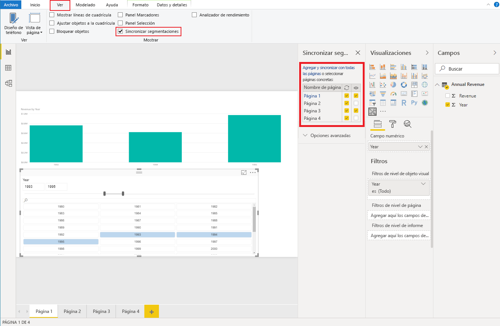

# <a name="sync-slicers-in-power-bi-visuals"></a>Segmentaciones de sincronización en objetos visuales de Power BI

Para admitir la característica [Segmentaciones de sincronización](../../visuals/power-bi-visualization-slicers.md), el objeto visual de segmentación personalizado debe usar la versión de API 1.13.0 o posterior.

Además, debe habilitar la opción en el archivo *capabilities.json*, tal y como se muestra en el código siguiente:

```json
{
    ...
    "supportsHighlight": true,
    "suppressDefaultTitle": true,
    "supportsSynchronizingFilterState": true,
    "sorting": {
        "default": {}
    }
}
```

Después de actualizar el archivo *capabilities.json*, puede ver el panel de opciones **Segmentaciones de sincronización** al seleccionar el objeto visual de segmentación personalizado.

> [!NOTE]
> La característica Segmentaciones de sincronización no admite más de un campo. Si su segmentación tiene más de un campo (**Categoría** o **Medida**), la característica se deshabilita.



En el panel **Segmentaciones de sincronización**, puede ver que la visibilidad de la segmentación y su filtración se pueden aplicar en varias páginas del informe.