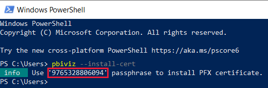
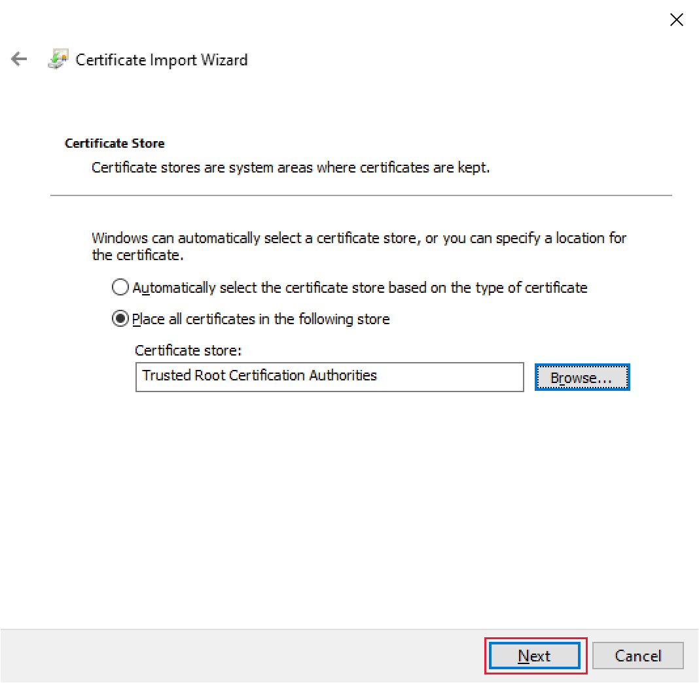
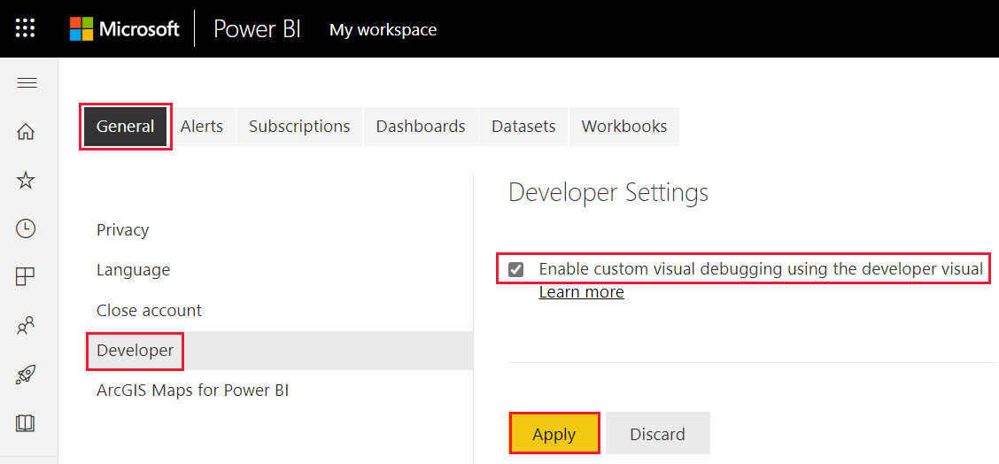

# <a name="set-up-your-environment-for-developing-a-power-bi-visual"></a>Configuración del entorno para el desarrollo de un objeto visual de Power BI

En este artículo, aprenderá a configurar el entorno para desarrollar un objeto visual de Power BI.

Antes de empezar a desarrollar, deberá instalar **node.js** y el paquete **pbiviz**. También necesitará crear e instalar un certificado. Una vez configurado el entorno local, deberá configurar el servicio Power BI para desarrollar un objeto visual de Power BI.

En este artículo, aprenderá a:
> [!div class="checklist"]
> * Instalar *nodes.js*.
> * Instalar *pbiviz*.
> * Crear e instalar un certificado.
> * Configurar el servicio Power BI para desarrollar un objeto visual.
> * Instalar bibliotecas adicionales (necesario para desarrollar un objeto visual).

## <a name="install-nodejs"></a>Instalación de node.js

*Node.js* es un entorno de ejecución de JavaScript basado en la versión 8 del motor de JavaScript de Chrome. Permite a los desarrolladores ejecutar cualquier aplicación creada en JavaScript.

1. Para instalar *node.js* en un explorador web, vaya a [node.js](https://nodejs.org).

2. Descargue el instalador MSI más reciente.

3. Ejecute al instalador y, después, siga los pasos de instalación. Acepte los términos del contrato de licencia y todos los valores predeterminados.

4. Reinicie el equipo.

## <a name="install-pbiviz"></a>Instalación de pbiviz

La herramienta *pbiviz*, que se escribe con JavaScript, compila el código de origen del objeto visual del paquete *pbiviz*.

El paquete *pbiviz* es un proyecto de objeto visual de Power BI comprimido, con todos los scripts y recursos necesarios.

1. Abra Windows  PowerShell y escriba el comando siguiente.

    ```powershell
    npm i -g powerbi-visuals-tools
    ```

## <a name="create-and-install-a-certificate"></a>Creación e instalación de un certificado

Para que un cliente (su equipo) y un servidor (el servicio Power BI) interactúen de forma segura, se requiere un [certificado de Capa de sockets seguros (SSL)](create-ssl-certificate.md). Sin un certificado para garantizar la seguridad de las interacciones, el explorador las bloqueará.

# <a name="windows"></a>[Windows](#tab/windows)

Este proceso describe la ejecución de un comando de PowerShell que inicia el **Asistente para la importación de certificados**. Siga los pasos que se indican a continuación para configurar el certificado en el asistente.

>[!IMPORTANT]
>No cierre la ventana de PowerShell durante este procedimiento.

1. Abra Windows  PowerShell y escriba el comando siguiente.

    ```powershell
    pbiviz --install-cert
    ```

    Este comando hace dos cosas:
    * Devuelve una *frase de contraseña*. En este caso, la *frase de contraseña* es 9765328806094.
    * También inicia el Asistente para importar certificados.
    
    >[!div class="mx-imgBorder"]
    >

2. En el Asistente para importar certificados, compruebe que la ubicación del almacén se establece en el *usuario actual* y seleccione **Siguiente**.

    >[!div class="mx-imgBorder"]
    >

3. En la ventana **Archivo para importar**, seleccione **Siguiente**.

4. En la ventana **Protección de clave privada**, en el cuadro de texto *Contraseña*, pegue la frase de contraseña que recibió al ejecutar el comando de PowerShell (paso 1) y seleccione **Siguiente**. En este ejemplo, la frase de contraseña es 9765328806094.

    >[!div class="mx-imgBorder"]
    >

5. En la ventana **Almacén de certificados**, seleccione la opción **Colocar todos los certificados en el siguiente almacén** y seleccione **Examinar**.

    >[!div class="mx-imgBorder"]
    >

6. En la ventana **Seleccionar almacén de certificados**, seleccione **Entidades de certificación raíz de confianza** y luego seleccione **Aceptar**.

    >[!div class="mx-imgBorder"]
    >

7. Seleccione *Siguiente* en la ventana **Almacén de certificados**.

    >[!div class="mx-imgBorder"]
    >

8. En la ventana **Finalización del Asistente para importación de certificados**, compruebe la configuración y seleccione **Finalizar**.

    >[!NOTE]
    >Si recibe una advertencia de seguridad, seleccione **Sí**.


# <a name="osx"></a>[OSX](#tab/sdk2osx)

1. Si el candado de la parte superior izquierda está bloqueado, selecciónelo para desbloquearlo. Busque *localhost* y haga doble clic en el certificado.

    

2. Seleccione **Confiar siempre** y cierre la ventana.

    

3. Escriba el nombre de usuario y la contraseña y seleccione **Actualizar configuración**.

    

4. Cierre los exploradores que tenga abiertos.

> [!NOTE]
> Si no se reconoce el certificado, reinicie el equipo.

---

## <a name="optional-verify-that-your-environment-is-set-up"></a>(Opcional) Comprobación de que el entorno está configurado

Confirme que el paquete de herramientas de objetos visuales de Power BI está instalado. En PowerShell, ejecute el comando `pbiviz` y revise la salida, incluida la lista de comandos admitidos.

>[!div class="mx-imgBorder"]
>

## <a name="set-up-power-bi-service-for-developing-a-visual"></a>Configuración del servicio Power BI para desarrollar un objeto visual

Para desarrollar un objeto visual de Power BI, deberá habilitar la depuración de objetos visuales personalizados en el servicio Power BI. Siga las instrucciones de esta sección para habilitar esta opción.

1. Inicie sesión en [PowerBI.com](https://powerbi.microsoft.com/).

2. Vaya a **Configuración** > **Configuración** > **Configuración**.

    >[!div class="mx-imgBorder"]
    >

3. En la pestaña **General**, seleccione **Desarrollador**. En **Configuración del desarrollador**, active la casilla **Habilitar la depuración de objetos visuales personalizados con el objeto visual de desarrollador** y seleccione **Aplicar**.

    >[!div class="mx-imgBorder"]
    >

## <a name="install-development-libraries"></a>Instalación de bibliotecas de desarrollo

Para desarrollar su propio objeto visual de Power BI, deberá instalar bibliotecas adicionales. En esta sección se describe cómo instalar estas bibliotecas y comprobar que la instalación se ha realizado correctamente.

Para instalar las bibliotecas enumeradas en este artículo, abra PowerShell y escriba el comando de instalación de cada componente.

>[!NOTE]
>Una vez que estas bibliotecas estén instaladas en el equipo, podrá usarlas para cualquier proyecto de objetos visuales de Power BI. Se trata de un procedimiento de instalación que se lleva a cabo una sola vez por máquina.


### <a name="d3-javascript-library"></a>Biblioteca de JavaScript D3

[D3](https://d3js.org/) es una biblioteca de JavaScript para producir visualizaciones de datos dinámicos e interactivos en exploradores web. Se basa los estándares ampliamente implementados Scalable Vector Graphics (SVG), HTML5 y CSS.

```powershell
npm i d3@^5.0.0 --save
```

### <a name="typescript-definitions"></a>Definiciones de TypeScript

Instale las definiciones de TypeScript para poder desarrollar el objeto visual de Power BI en [TypeScript](https://www.typescriptlang.org/), un superconjunto de JavaScript.

```powershell
npm i @types/d3@^5.0.0 --save
```

### <a name="core-js"></a>core-js

[core-js](https://www.npmjs.com/package/core-js) es una biblioteca estándar modular para JavaScript que incluye polyfill para ECMAScript.

```powershell
npm i core-js@3.2.1 --save
```

### <a name="powerbi-visual-api"></a>powerbi-visual-api

Instale las definiciones de la API de objetos visuales de Power BI.

```powershell
npm i powerbi-visuals-api --save-dev
```

### <a name="optional-verify-that-the-d3-library-is-installed"></a>(Opcional) Comprobación de que la biblioteca D3 está instalada

[Visual Studio Code](https://code.visualstudio.com/) (VS Code) es un entorno de desarrollo integrado (IDE) ideal para desarrollar aplicaciones TypeScript. En esta sección, usaremos VS Code para comprobar que la biblioteca D3 que necesita para desarrollar el objeto visual de Power BI está correctamente instalada.

>[!NOTE]
>En el proceso de comprobación descrito en esta sección se supone que ya tiene un proyecto de objetos visuales de Power BI. Si no tiene un proyecto de objetos visuales de Power BI, puede crear uno siguiendo las instrucciones de [creación de proyectos de Circle Card](develop-circle-card.md#create-a-development-project).

1. Abra VS Code.

    >[!TIP]
    >Para abrir VS Code desde PowerShell, ejecute el comando siguiente:
    >
    >```powershell
    >code .
    >```
2. En VS Code, abra el menú **Archivo** y seleccione **Abrir carpeta**.

    >[!div class="mx-imgBorder"]
    >

3. En la ventana **Abrir carpeta**, seleccione la carpeta que contiene el proyecto de objetos visuales de Power BI y, a continuación, seleccione **Seleccionar carpeta**.

    >[!div class="mx-imgBorder"]
    >

4. En el panel **Explorador**, expanda la carpeta **node_modules** para comprobar que la biblioteca **D3** se ha instalado.

    >[!div class="mx-imgBorder"]
    >

5. En el panel **Explorador**, expanda **node_modules > @types  > d3** y compruebe que el archivo **index.t.ds** se ha instalado.

    >[!div class="mx-imgBorder"]
    >

## <a name="next-steps"></a>Pasos siguientes

> [!div class="nextstepaction"]
> [Desarrollo de un objeto visual Circle Card de Power BI](develop-circle-card.md)

> [!div class="nextstepaction"]
> [Creación de un objeto visual de gráfico de barras en Power BI](create-bar-chart.md)
